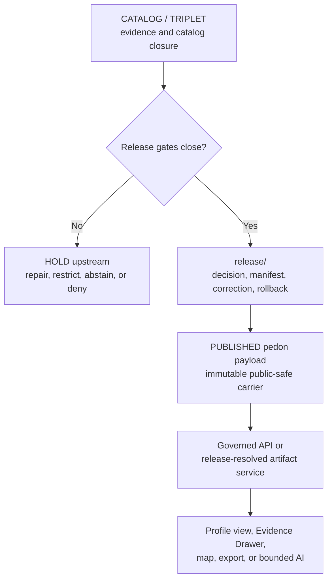

<!-- [KFM_META_BLOCK_V2]
doc_id: kfm://data/published/api-payloads/soil/pedons/readme
title: Soil Pedon Published API Payload Boundary
type: directory-readme
version: v0.2.0
status: repository-grounded draft; release-gated; payload and runtime implementation not established by bounded evidence
owners:
  - "NEEDS VERIFICATION — data and publication steward"
  - "NEEDS VERIFICATION — Soil domain, pedon/profile, evidence, API, and validation stewards"
  - "NEEDS VERIFICATION — source, rights, sensitivity, location, land/privacy, and policy reviewers"
  - "NEEDS VERIFICATION — release, correction, withdrawal, rollback, security, accessibility, and docs stewards"
created: 2026-06-25
updated: 2026-07-26
policy_label: public-review; public-carrier; soil; pedon; profile-evidence; sensitive-join-review; cite-or-abstain; release-gated
path: data/published/api_payloads/soil/pedons/README.md
truth_posture: >
  CONFIRMED exact target path and prior bytes, adopted Directory Rules v2 within
  accepted ADR-0029's bounded scope, parent published and Soil API-payload
  boundaries, draft Pedon / SoilProfileView semantic contract, missing paired
  pedon schema, permissive Soil EvidenceBundle schema, greenfield Soil policy
  and fixture stubs, placeholder Soil validator bodies, candidate-lane
  documentation, and explicit validation, proof, and release workflow holds /
  PROPOSED payload-family routing, production payload profile, validator
  requirements, support-type vocabulary resolution, and governed delivery
  realization / UNKNOWN payload instances outside bounded indexed repository
  evidence, external or LFS storage, accepted owners, runtime routes, active
  writers and consumers, hosting, caches, public effects, correction
  propagation, and rollback execution / NEEDS VERIFICATION accepted pedon
  contracts and schemas, pedon-specific evidence closure, source rights, public
  location posture, policy enforcement, production validation, review
  authority, release manifests, deployment, and publication
evidence_snapshot:
  repository: bartytime4life/Kansas-Frontier-Matrix
  base_ref: main
  base_commit: 5882c2c73488c36942b3e40a061d99a465ce97e0
  prior_blob: 0da786d06ba7518fe0b7b8e3f68c872d69d38f5e
  method: complete target read plus bounded parent, doctrine, ADR, contract, schema, policy, proof, candidate, workflow, API-doc, test, fixture, validator, branch, pull-request, and repository-search inspection
related:
  - ../README.md
  - ../../README.md
  - ../../../README.md
  - ../../../soil/README.md
  - ../../../../raw/soil/README.md
  - ../../../../work/soil/README.md
  - ../../../../quarantine/soil/README.md
  - ../../../../processed/soil/README.md
  - ../../../../catalog/domain/soil/README.md
  - ../../../../proofs/soil/README.md
  - ../../../../registry/sources/soil/README.md
  - ../../../../receipts/soil/README.md
  - ../../../../../release/candidates/soil/README.md
  - ../../../../../release/README.md
  - ../../../../../contracts/domains/soil/pedon_soil_profile_view.md
  - ../../../../../schemas/contracts/v1/domains/soil/README.md
  - ../../../../../schemas/contracts/v1/domains/soil/evidence_bundle.schema.json
  - ../../../../../policy/domains/soil/README.md
  - ../../../../../docs/domains/soil/API_CONTRACTS.md
  - ../../../../../docs/domains/soil/DATA_LIFECYCLE.md
  - ../../../../../docs/domains/soil/ARCHITECTURE.md
  - ../../../../../docs/runbooks/soil/PROMOTION_RUNBOOK.md
  - ../../../../../docs/runbooks/soil/ROLLBACK_RUNBOOK.md
  - ../../../../../tools/validators/domains/soil/README.md
  - ../../../../../tests/domains/soil/README.md
  - ../../../../../fixtures/domains/soil/README.md
  - ../../../../../apps/governed-api/README.md
  - ../../../../../.github/workflows/domain-soil.yml
  - ../../../../../docs/doctrine/directory-rules.md
  - ../../../../../docs/adr/ADR-0029-adopt-directory-governance-standard-v2.md
notes:
  - "Same-path Markdown modernization only; no payload, source, contract, schema, policy, validator, fixture, workflow, candidate, release, route, deployment, cache, or publication state changed."
  - "ADR-0029 is accepted at the evidence snapshot and adopts the exact pinned Directory Rules v2 bytes; this README inherits that bounded placement authority but does not expand it or authorize publication."
  - "The contract uses pedon_evidence while the Soil schema index uses profile_soil_evidence; this README surfaces the conflict and does not select a canonical serialized value."
  - "Static badges project the documented boundary and current evidence state only; no CI or release badge is used."
  - "Legacy numbered heading fragments remain available through explicit anchors."
[/KFM_META_BLOCK_V2] -->

<a id="top"></a>

# `data/published/api_payloads/soil/pedons/` — Release-gated Soil pedon API payload carriers

> **One-line purpose.** Define the Soil lane for immutable, release-linked, public-safe `Pedon` / `SoilProfileView` payload carriers while keeping soil truth, profile evidence, source records, policy, review, release, correction, and rollback in their owning authority surfaces.

[](#status)
[](#authority-level)
[](#purpose)
[](#status)
[](#status)
[](#validation)

> [!IMPORTANT]
> This directory is a **carrier boundary, not release authority**. A profile-shaped file, path placement, schema check, workflow result, commit, pull request, merge, deployment, or reachable URL does not make Soil content evidence-supported, public-safe, released, or KFM-published.

> [!CAUTION]
> Exact or reconstructively precise profile locations, private-field or sensor details, and owner-, farm-, parcel-, operation-, well-, or infrastructure-identifying joins require source-rights, sensitivity, policy, audience, review, and release resolution. Generalize, aggregate, redact, restrict, hold, abstain, or deny when those controls do not close.

**Quick navigation:** [Purpose](#purpose) · [Authority](#authority-level) · [Status](#status) · [Belongs](#what-belongs-here) · [Exclusions](#what-does-not-belong-here) · [Inputs](#inputs) · [Outputs](#outputs) · [Validation](#validation) · [Review](#review-burden) · [Related](#related-folders) · [ADRs](#adrs) · [Last reviewed](#last-reviewed) · [Routing](#payload-family-routing) · [Payload contract](#pedon-public-payload-contract) · [Lifecycle](#lifecycle-relationship) · [Done](#definition-of-done) · [No-loss](#no-loss-ledger)

---

<a id="1-scope"></a>

## Purpose

`data/published/api_payloads/soil/pedons/` is the `Pedon` / `SoilProfileView` object-family lane within the published Soil API-payload carrier family.

Its bounded responsibility is to:

- retain immutable, release-linked **public-safe payload bytes** and immediate integrity or discovery sidecars;
- support governed API, Evidence Drawer, map-selection, export, and bounded AI consumers without exposing internal stores;
- preserve payload references to profile identity, horizons, depth, properties, source role, support type, method, units, time, uncertainty, location posture, evidence, policy, review, release, correction, and rollback; and
- keep delivery carriers separate from semantic contracts, schemas, canonical records, source registries, proofs, receipts, policy rules, release decisions, runtime code, and restricted material.

This lane is downstream of the complete trust path:

```text
RAW -> WORK / QUARANTINE -> PROCESSED -> CATALOG / TRIPLET -> RELEASE -> PUBLISHED
```

Promotion is a governed state transition. Moving or copying bytes into this directory cannot perform it.

[Back to top](#top)

---

<a id="2-repo-fit"></a>

## Authority level

**PUBLISHED artifact-family responsibility; carrier-only authority.**

| Question | Bounded answer |
|---|---|
| Owning responsibility root | `data/` |
| Lifecycle plane | `published/` |
| Artifact family | `api_payloads/` |
| Domain and object segment | `soil/pedons/` |
| What this lane may carry | Immutable, release-approved, public-safe pedon/profile API payload bytes and immediate delivery sidecars. |
| What this lane does not own | Pedological truth, source admission, profile or horizon meaning, machine shape, evidence, policy, location decisions, review, release, correction, rollback, API routing, or publication authority. |
| Normal consumer path | Governed API or an approved release-resolved artifact service. |
| Direct client access to RAW, WORK, QUARANTINE, unreleased PROCESSED, proof, catalog, vector-index, graph, or model stores | Denied. |
| Current operational authority | None established beyond documentation of the lane boundary. |
| Default when support is incomplete | Hold upstream, abstain, deny, error safely, or do not deliver according to the governing surface. |

The existing path is retained unchanged. The parent [`data/published/`](../../../README.md), [`api_payloads/`](../../README.md), and [Soil API-payload](../README.md) documents identify the responsibility relationship. [ADR-0029](../../../../../docs/adr/ADR-0029-adopt-directory-governance-standard-v2.md) now accepts the exact pinned Directory Rules v2 bytes, whose `data/published/` contract assigns released public-safe carrier ownership here while keeping release decisions under `release/`.

[Back to top](#top)

---

## Status

| Item | Current bounded result |
|---|---|
| Target | `data/published/api_payloads/soil/pedons/README.md` |
| Document version | `v0.2.0` |
| Evidence base | `main@5882c2c73488c36942b3e40a061d99a465ce97e0` |
| Prior blob | `0da786d06ba7518fe0b7b8e3f68c872d69d38f5e` |
| Parent Soil API-payload lane | **CONFIRMED** at [`../README.md`](../README.md); still a draft placement contract. |
| Bounded target-path search | Only this README was verified at the exact target path; external, LFS, unindexed, differently named, or runtime-only payloads remain **UNKNOWN**. |
| `Pedon` / `SoilProfileView` semantic contract | **CONFIRMED draft / PROPOSED** at [`contracts/domains/soil/pedon_soil_profile_view.md`](../../../../../contracts/domains/soil/pedon_soil_profile_view.md). |
| Paired pedon machine schema | **NOT FOUND** at the contract-declared path `schemas/contracts/v1/domains/soil/pedon_soil_profile_view.schema.json`. |
| Support-type serialized value | **CONFLICTED / NEEDS VERIFICATION:** the contract uses `pedon_evidence`; the Soil schema index uses `profile_soil_evidence`. |
| Soil `EvidenceBundle` schema | **CONFIRMED permissive placeholder:** only `id` is required and additional properties are allowed. |
| Soil policy | **CONFIRMED greenfield stubs:** the domain README is `PROPOSED`; the inspected Rego files contain no active rules. |
| Pedon fixtures and tests | **NOT FOUND** at the contract-declared fixture path and the checked pedon test path; the reusable Soil fixture root remains a greenfield stub. |
| Soil validators | **CONFIRMED placeholder posture:** the domain workflow recognizes four exact greenfield validator placeholders; the inspected EvidenceBundle validator raises `NotImplementedError`. |
| Soil proof and release candidate | **DOCUMENTATION CONFIRMED; emitted pedon proof, candidate, or release packet not established by bounded search.** |
| Soil validation, proof, and release dry-run automation | **EXPLICIT HOLD** in [`.github/workflows/domain-soil.yml`](../../../../../.github/workflows/domain-soil.yml). |
| Governed Soil route, serving layer, cache behavior, and public effect | **UNKNOWN**; current Soil API documentation labels route names and implementation `PROPOSED` or `UNKNOWN`. |
| Directory Rules v2 adoption | **ACCEPTED** through ADR-0029 at the pinned base; the standard's internal `PROPOSED_FOR_ADOPTION` label is retained as part of the exact adopted bytes. |
| Effect of this revision | Markdown only; no payload or operational state changes. |

> [!NOTE]
> Bounded repository search and selected-path reads are not a permanent recursive inventory. Before any payload is admitted, verify the resulting branch tree, external storage, LFS objects, release manifests, active writers, and runtime consumers directly.

[Back to top](#top)

---

<a id="3-accepted-payloads"></a>

## What belongs here

Only immutable, release-approved, public-safe Soil profile payload carriers that conform to an accepted payload profile belong here. The families below are **eligibility categories, not a current inventory**.

| Eligible family | Bounded role | Required support |
|---|---|---|
| Public pedon or profile-detail projection | Released derivative for a bounded source-backed pedon or profile context. | Accepted contract and schema; resolved profile identity, evidence, source role, location posture, policy, review, release, correction, and rollback. |
| Horizon-sequence projection | Ordered, public-safe horizon context with depth intervals and designations where source-supported. | Horizon refs, depth units, order and overlap validation, method/source context, evidence, caveats, and release. |
| Property-profile projection | Public-safe profile or horizon property context. | Value, unit, depth/profile scope, method, uncertainty, source/evidence, validation, and release. |
| Evidence Drawer payload | Public-safe profile summary, citations, source role, time and scope, uncertainty, withheld/generalized explanation, and correction state. | Governed `EvidenceBundle` projection; citation validation; policy and release references. |
| Map-selection or popup projection | Minimal public-safe selection context that directs a client to governed resolution. | Public-safe identity, source/support posture, released artifact reference, location review, and no restricted detail. |
| Focus Mode response package | Released profile evidence context and finite response projection for bounded interpretation. | Released evidence; finite outcome; citation validation; policy; review; release; `AIReceipt` reference where applicable. |
| Audience-approved summary or export | Bounded, caveated profile, horizon, property, or soil-interpretation context. | Declared audience and public grain; support-type preservation; evidence; method; uncertainty; caveats; release packet. |
| Correction, stale, withdrawal, or supersession projection | Public-visible state explaining why an earlier payload is no longer current or available. | Governing correction, withdrawal, supersession, invalidation, or rollback record. |
| Immutable payload index or integrity sidecar | Release-resolved discovery, media type, byte size, digest, and version information. | Derived from release state; stable identifiers and content hashes; no independent authority. |

Payloads may reference proofs, receipts, policy decisions, reviews, and release records. The trust-bearing originals stay in their owning families.

[Back to top](#top)

---

<a id="4-exclusions"></a>

## What does NOT belong here

| Do not place here | Correct home or action |
|---|---|
| Source pedon extracts, survey tables, lab files, scans, images, rasters, sensor dumps, or provider payloads | [`data/raw/soil/`](../../../../raw/soil/README.md) or source-specific intake |
| Working normalization, horizon reconciliation, generated drafts, unresolved joins, or transform candidates | [`data/work/soil/`](../../../../work/soil/README.md) |
| Rights-, sensitivity-, identity-, evidence-, source-role-, or policy-held material | [`data/quarantine/soil/`](../../../../quarantine/soil/README.md) |
| Canonical normalized Soil objects that are not released | [`data/processed/soil/`](../../../../processed/soil/README.md) |
| Catalog records or canonical evidence state | [`data/catalog/domain/soil/`](../../../../catalog/domain/soil/README.md) and Soil proof lanes |
| `EvidenceBundle`, proof pack, validation proof, or review proof | [`data/proofs/soil/`](../../../../proofs/soil/README.md) |
| Run, transform, redaction, validation, AI, release, or publication receipts | [`data/receipts/soil/`](../../../../receipts/soil/README.md) or the owning receipt family |
| Release manifests, promotion decisions, corrections, withdrawals, signatures, or rollback decisions | [`release/`](../../../../../release/README.md) |
| Contracts, schemas, source descriptors, policy rules, validators, tests, fixtures, or runtime code | Their owning roots under `contracts/`, `schemas/`, `data/registry/`, `policy/`, `tools/`, `tests/`, `fixtures/`, `apps/`, `packages/`, and `runtime/` |
| Exact, aliased, encoded, obscured, or reconstructively precise profile locations without resolved public posture | Restricted governed storage; generalize, aggregate, redact, stage access, or deny upstream |
| Owner-, farm-, parcel-, operation-, private-sensor-, well-, or infrastructure-identifying detail | Restricted governed storage; exclude unless an accepted policy and release profile explicitly permits the audience |
| Suppressed originals, reversible offsets, masks, thresholds, secret transform parameters, or private source locators | Protected transform and receipt systems; never public payloads |
| Profile evidence silently presented as whole map-unit, continuous-surface, farm, property, or regional truth | Deny the upcast; use the owning object and explicit evidence-backed derivation |
| Suitability, erosion, hydrologic, engineering, conservation-compliance, valuation, insurance, legal, or agronomic determinations presented without separate authority | A separately governed authority surface, if one exists; otherwise abstain or deny |
| Unreviewed model output or fluent AI text | Governed AI/review path; release only as evidence-bounded finite output |
| Mutable `current` or `latest` alias authored by hand | Hold until an accepted alias profile, atomic update, invalidation, receipt, correction, and rollback path exists |
| Placeholder release IDs, fabricated digests, sample coordinates, live destinations, or realistic private records | Do not create them; use explicitly synthetic, non-locating fixtures in fixture/test lanes |

[Back to top](#top)

---

<a id="5-publication-gates"></a>

## Inputs

Every payload admitted here needs a release-specific support packet appropriate to its significance.

| Support dimension | Minimum expectation |
|---|---|
| Identity and integrity | Immutable payload ID, version, release ID, content digest, media type, byte size, schema/contract version, and reproducible locator. |
| Semantic contract | An accepted contract defines profile meaning, object-family responsibilities, public derivative status, and finite outcomes. The current contract is draft. |
| Machine schema | A reviewed, non-permissive schema defines required fields, enums, bounds, and forbidden extras. The paired pedon schema is currently missing. |
| Source and evidence | Source descriptors, source-native identifiers, source roles, support type, `EvidenceRef` values, and resolvable `EvidenceBundle` support for consequential claims. |
| Profile and horizon identity | Profile subject, horizon sequence, depth intervals and units, properties, method, uncertainty, and linkage to map unit or component remain explicit without upcasting profile evidence. |
| Rights, sensitivity, and location | Source terms, audience, public location grain, private/property join risk, sensitivity, and permitted use resolve. |
| Public-safe transformation | Required generalization, aggregation, suppression, redaction, delay, or withholding completes upstream and binds to a protected receipt and review record. |
| Spatial and temporal support | Profile support, coordinate uncertainty, observed/source/valid/retrieval/release/correction times, and stale or superseded state remain distinguishable where material. |
| Policy and review | Policy decision and accountable Soil, source, rights, sensitivity, privacy/land, and release review permit the intended audience. |
| Validation and proof | Schema, domain, horizon-depth, unit/method, support-type, source-role, sensitive-field, evidence, citation, catalog, integrity, correction, and rollback checks close with finite results. |
| Release | `ReleaseManifest`, promotion decision, public scope, and required signatures or attestations bind the exact payload bytes. |
| Reversal | Correction, withdrawal, supersession, cache invalidation, downstream derivative handling, and rollback targets are defined and testable. |

If any required dimension is missing, conflicted, stale, or inaccessible, keep the payload upstream.

[Back to top](#top)

---

## Outputs

This lane may retain immutable public-safe carrier bytes and immediate sidecars for:

- governed Soil pedon/profile detail resolution;
- horizon-sequence and property-profile views;
- Evidence Drawer rendering;
- map-selection and popup context;
- bounded Focus Mode interpretation;
- audience-approved exports and summaries;
- correction, stale, withdrawal, and supersession messaging; and
- release-resolved artifact discovery.

Public delivery should use the finite outcome vocabulary defined by the applicable runtime contract:

| Outcome | Delivery meaning |
|---|---|
| `ANSWER` | Evidence resolves, policy permits, release state is valid, and citations or support close. |
| `ABSTAIN` | Evidence, scope, freshness, profile identity, method, citation, or release support is insufficient or conflicted. |
| `DENY` | Rights, sensitivity, location, private/property joins, audience, review, or release policy blocks exposure. |
| `ERROR` | Request, schema, validator, resolver, or system processing failed safely without leaking restricted state. |

The exact envelope and route realization remains **PROPOSED / NEEDS VERIFICATION**. Payload files here do not create a runtime API, and runtime output does not create release authority.

[Back to top](#top)

---

<a id="8-maintenance-checklist"></a>

## Validation

### Current accepted scope

Current repository evidence establishes documentation and readiness boundaries, not production pedon payload validation:

- the `Pedon` / `SoilProfileView` contract is draft and proposed;
- the paired schema declared by that contract is absent;
- the Soil `EvidenceBundle` schema is a permissive placeholder requiring only `id`;
- the Soil policy README and inspected Rego modules are greenfield stubs with no active rules;
- the reusable Soil fixture root is a greenfield stub, and the checked pedon fixture and test paths were not found;
- the Soil validator lane documents responsibilities while the inspected EvidenceBundle validator raises `NotImplementedError`;
- the Soil candidate lane is documentation-backed, and bounded search established no pedon release packet; and
- the Soil workflow deliberately records holds for validation, proof production, and release dry-run.

Therefore, **no payload is eligible for this lane solely on the strength of the currently inspected Soil contract, schema, validator, policy, workflow, or documentation**.

### Required production payload checks

- [ ] Validate against an accepted semantic contract and non-permissive machine schema.
- [ ] Reject undeclared, restricted, aliased, encoded, or reconstructively identifying fields.
- [ ] Resolve profile subject identity, source-native identity, source role, support type, rights, evidence, spatial support, and temporal scope.
- [ ] Resolve the `pedon_evidence` versus `profile_soil_evidence` vocabulary conflict through accepted contract/schema authority.
- [ ] Verify horizon order, depth bounds, units, gaps/overlaps, method, designation, truncation, and source lineage where material.
- [ ] Verify property values retain unit, depth/profile scope, method, uncertainty, quality, and evidence.
- [ ] Prove pedon/profile evidence is not silently upcast to map-unit, continuous-surface, farm, property, regional, or regulatory truth.
- [ ] Prove exact or harmful-precision location and owner/farm/parcel/operation/private-sensor joins cannot appear without an accepted public profile.
- [ ] Verify observed, source, valid, retrieval, release, stale, correction, and supersession times do not collapse.
- [ ] Verify finite outcome semantics and required reason, caveat, method, uncertainty, and citation fields.
- [ ] Verify `EvidenceRef` to `EvidenceBundle` closure and citation validity.
- [ ] Verify policy decision, review record, release manifest, public scope, payload digest, and immutable identity.
- [ ] Verify correction, withdrawal, supersession, invalidation, cache behavior, and rollback.
- [ ] Verify public clients use governed resolution rather than direct internal-store reads.
- [ ] Verify malformed, oversized, cyclic, deeply nested, or otherwise abusive payloads fail safely under an accepted production profile.
- [ ] Verify no direct model output, secret, credential, private endpoint, tracking token, or unsafe external reference is introduced.
- [ ] Run deterministic no-network valid, invalid, denied, abstained, stale, correction, supersession, and rollback fixtures before any live-source or public-serving test.

### README checks

- [ ] Keep one H1 and a logical heading hierarchy.
- [ ] Preserve the explicit legacy anchors retained by this revision.
- [ ] Validate every relative link and heading fragment at the resulting commit.
- [ ] Validate each badge against its textual source of truth.
- [ ] Validate Mermaid syntax and preserve the accompanying textual explanation.
- [ ] Re-run secret, private-data, rights, location, and sensitive-join review before commit.

A passing Markdown, schema, fixture, workflow, or CI check proves only its declared scope. It does not establish soil truth, source currency, method fitness, rights clearance, safe production location handling, release approval, hosted delivery, agronomic or engineering fitness, or KFM publication.

[Back to top](#top)

---

## Review burden

Accountable ownership and final release authority remain **NEEDS VERIFICATION**.

| Change class | Minimum review concern |
|---|---|
| README-only boundary clarification | Docs, data publication, Soil domain, pedon/profile, governed API, and sensitivity/location review. |
| Payload shape or field allowlist | Contract, schema, Soil, API, evidence, profile/horizon, source-role, support-type, privacy/location, validation, and compatibility review. |
| Source, profile identity, rights, public grain, or transform rule | Source, pedological/domain, rights-holder, land/privacy, policy, validation, and independent review as applicable. |
| Horizon, property, method, unit, depth, or interpretation behavior | Soil contract, source, schema, validation, domain specialist, evidence, and consumer review. |
| Route, authentication, resolver, caching, or client behavior | Governed API, security/privacy, runtime, accessibility, observability, and domain review. |
| Release, correction, withdrawal, alias, or rollback | Release, correction, rollback, invalidation/cache, evidence, policy, and separation-of-duties review. |
| Public AI or Focus Mode projection | Governed AI, evidence/citation, policy, privacy, Soil, accessibility, and release review. |

CODEOWNERS routing, a pull request, a green readiness workflow, or a successful schema check does not by itself establish stewardship approval, source permission, independent review, release approval, or publication.

[Back to top](#top)

---

## Related folders

### Lifecycle and publication

- Parent Soil API-payload lane: [`data/published/api_payloads/soil/`](../README.md)
- Parent API-payload family: [`data/published/api_payloads/`](../../README.md)
- Parent published-data lane: [`data/published/`](../../../README.md)
- Broader Soil published-carrier lane: [`data/published/soil/`](../../../soil/README.md)
- RAW: [`data/raw/soil/`](../../../../raw/soil/README.md)
- WORK: [`data/work/soil/`](../../../../work/soil/README.md)
- QUARANTINE: [`data/quarantine/soil/`](../../../../quarantine/soil/README.md)
- PROCESSED: [`data/processed/soil/`](../../../../processed/soil/README.md)
- CATALOG: [`data/catalog/domain/soil/`](../../../../catalog/domain/soil/README.md)
- PROOFS: [`data/proofs/soil/`](../../../../proofs/soil/README.md)
- RECEIPTS: [`data/receipts/soil/`](../../../../receipts/soil/README.md)
- Source registry: [`data/registry/sources/soil/`](../../../../registry/sources/soil/README.md)
- Soil release candidates: [`release/candidates/soil/`](../../../../../release/candidates/soil/README.md)
- Release authority root: [`release/`](../../../../../release/README.md)

### Soil contracts, API, policy, and validation

- `Pedon` / `SoilProfileView` semantic contract: [`contracts/domains/soil/pedon_soil_profile_view.md`](../../../../../contracts/domains/soil/pedon_soil_profile_view.md)
- Soil schema index: [`schemas/contracts/v1/domains/soil/`](../../../../../schemas/contracts/v1/domains/soil/README.md)
- Soil `EvidenceBundle` schema scaffold: [`evidence_bundle.schema.json`](../../../../../schemas/contracts/v1/domains/soil/evidence_bundle.schema.json)
- Soil API contracts: [`docs/domains/soil/API_CONTRACTS.md`](../../../../../docs/domains/soil/API_CONTRACTS.md)
- Soil lifecycle: [`docs/domains/soil/DATA_LIFECYCLE.md`](../../../../../docs/domains/soil/DATA_LIFECYCLE.md)
- Soil architecture: [`docs/domains/soil/ARCHITECTURE.md`](../../../../../docs/domains/soil/ARCHITECTURE.md)
- Soil promotion runbook: [`docs/runbooks/soil/PROMOTION_RUNBOOK.md`](../../../../../docs/runbooks/soil/PROMOTION_RUNBOOK.md)
- Soil rollback runbook: [`docs/runbooks/soil/ROLLBACK_RUNBOOK.md`](../../../../../docs/runbooks/soil/ROLLBACK_RUNBOOK.md)
- Soil policy scaffold: [`policy/domains/soil/`](../../../../../policy/domains/soil/README.md)
- Soil validator index: [`tools/validators/domains/soil/`](../../../../../tools/validators/domains/soil/README.md)
- Soil tests: [`tests/domains/soil/`](../../../../../tests/domains/soil/README.md)
- Soil fixtures: [`fixtures/domains/soil/`](../../../../../fixtures/domains/soil/README.md)
- Governed API app boundary: [`apps/governed-api/`](../../../../../apps/governed-api/README.md)
- Soil readiness workflow: [`.github/workflows/domain-soil.yml`](../../../../../.github/workflows/domain-soil.yml)
- Directory Rules v2 (adopted within ADR-0029's bounded scope): [`docs/doctrine/directory-rules.md`](../../../../../docs/doctrine/directory-rules.md)

[Back to top](#top)

---

## ADRs

[`docs/adr/INDEX.md`](../../../../../docs/adr/INDEX.md) is the status index. This README does not accept or implement an ADR.

Relevant records at the pinned base include:

- [`ADR-0011`](../../../../../docs/adr/ADR-0011-receipts-vs-proofs-vs-manifests-vs-catalog-separation.md) — trust-object family separation;
- [`ADR-0015`](../../../../../docs/adr/ADR-0015-data-published-_domain_-current-alias-is-governed-by-rollback_card.md) — governed published aliases and rollback;
- [`ADR-0018`](../../../../../docs/adr/ADR-0018-promotion-gate-sequence.md) — promotion-gate sequence;
- [`ADR-0024`](../../../../../docs/adr/ADR-0024-steward-separation-of-duties-for-release.md) — release separation of duties;
- [`ADR-0025`](../../../../../docs/adr/ADR-0025-public-client-never-reads-canonical-internal-stores.md) — governed public-client boundary; and
- [`ADR-0029`](../../../../../docs/adr/ADR-0029-adopt-directory-governance-standard-v2.md) — **accepted** exact Directory Rules v2 adoption and controlled compatibility migration.

ADR-0011, ADR-0015, ADR-0018, ADR-0024, and ADR-0025 remain proposed. ADR-0029 settles the bounded directory-placement question only; implementation, validation, release, correction, and rollback evidence remains required before this README is used to create a mutable alias, claim production route behavior, or assert publication.

[Back to top](#top)

---

## Last reviewed

- **Date:** 2026-07-26
- **Evidence boundary:** `main@5882c2c73488c36942b3e40a061d99a465ce97e0`
- **Method:** complete target read; parent published/API-payload boundaries; adopted Directory Rules v2 and accepted ADR-0029; Soil pedon contract and schema check; EvidenceBundle schema; policy, proof, candidate, API/lifecycle, runbook, test, fixture, validator, and workflow evidence; bounded branch, PR, and repository-path search
- **Bounded target-path result:** only the README was verified at the exact target path
- **Payload bytes, external stores, LFS objects, deployed routes, runtime logs, release instances, hosts, and cache state:** not inspected
- **Owners, accepted contracts/ADRs, production schemas/validators, source activation, policy enforcement, independent review, public serving, invalidation, and rollback drills:** need verification

Re-review after any payload, schema, contract, source, policy, location/sensitivity, validator, route, release, alias, correction, withdrawal, serving, cache, or rollback change.

[Back to top](#top)

---

<a id="7-suggested-layout"></a>

## Payload-family routing

Use object meaning and an accepted release profile to select a payload family. Do not create directories merely to match this table.

| Payload family | Intended use | Current posture |
|---|---|---|
| `profile_detail` | Public-safe pedon or SoilProfileView derivative. | Semantic contract is draft; paired schema is missing; payload instances not established. |
| `horizon_sequence` | Ordered public-safe horizon and depth context. | PROPOSED; horizon shape, depth validator, fixtures, and release profile need verification. |
| `property_profile` | Profile or horizon property context with unit, method, depth, and uncertainty. | PROPOSED; accepted envelope and validator not established. |
| `evidence_drawer` | Public-safe evidence, citation, uncertainty, source-role, method, policy, and correction projection. | PROPOSED; must remain a projection, not a second evidence store. |
| `map_selection` | Minimal map/popup context that resolves through the governed API. | PROPOSED; no unsupported exact location, private join, or whole-map-unit upcast. |
| `focus_mode` | Released evidence context and finite AI response projection. | PROPOSED; requires citation validation, policy, release state, and AI receipt where applicable. |
| `exports` or `public_summaries` | Audience-bounded public-safe profile aggregates and summaries. | PROPOSED; audience, public grain, method, and support type must be release-bound. |
| `state_updates` | Correction, stale, withdrawal, supersession, or rollback-visible status. | PROPOSED; derived from release-governance records. |
| `indexes` or `integrity` | Immutable discovery and digest sidecars. | PROPOSED; derived only, never release authority. |

### Schematic release-local profile

```text
data/published/api_payloads/soil/pedons/
├── README.md
└── <payload_family>/                 # PROPOSED; add only through an accepted profile
    └── <release_id>/                 # immutable release identity
        ├── <payload_id>.<digest>.json
        └── <payload_id>.<digest>.integrity.json
```

Suggested filename grammar retained from the prior README:

```text
soil.published.api_payload.pedons.<payload_family>.<scope>.<release_id>.<short_hash>.json
```

Both the child topology and filename grammar remain **PROPOSED** until contracts, schemas, release tooling, validators, fixtures, and consumers agree. A current directory map must be regenerated from the resulting tree rather than copied from this schematic.

[Back to top](#top)

---

<a id="6-pedon-payload-rules"></a>

## Pedon public payload contract

Every released Soil pedon/profile payload should preserve these boundaries.

| Invariant | Required public behavior |
|---|---|
| Profile evidence, not universal truth | A pedon or profile is local/source-scoped evidence; it is not silently promoted to whole map-unit, continuous-surface, farm, property, county, or regional truth. |
| Stable profile identity | Canonical and source-native profile identifiers, version, digest, source role, and correction lineage remain distinguishable. |
| Horizon and depth integrity | Horizon order, designations, top/bottom depths, units, gaps, overlaps, truncation, and source linkage remain explicit where material. |
| Property and method clarity | Property value, unit, method, depth/profile scope, uncertainty, quality flags, and source context travel together. |
| Source-role anti-collapse | Survey, profile, gridded derivative, station, satellite, interpretation, candidate, and synthetic roles are not silently promoted into one another. |
| Support-type vocabulary is governed | `pedon_evidence` and `profile_soil_evidence` remain an exposed conflict until an accepted contract/schema resolves the serialized value. |
| Location and join safety | Public location grain and uncertainty are explicit; exact/reconstructive location and private/property/operation joins are reviewed, generalized, restricted, or denied. |
| Spatial and temporal clarity | Profile support, coordinate uncertainty, observed/source/valid/retrieval/release/stale/correction times remain distinguishable where material. |
| Evidence closure | Consequential claims carry resolvable evidence support or the interaction abstains or denies. |
| Interpretation restraint | Suitability, erosion, hydrologic, engineering, agronomic, compliance, valuation, insurance, and legal meanings require their own accepted authority and caveats. |
| Finite outcomes | `ABSTAIN`, `DENY`, and `ERROR` are explicit trust states, not empty payloads or silent omissions. |
| Governed client boundary | Public clients use governed resolution and released artifacts, never internal lifecycle, proof, graph, vector-index, or model stores. |
| AI boundary | Generated language is interpretive and evidence-subordinate; direct model output is not a released Soil payload. |
| Correction and reversal | Source correction, profile misidentification, horizon/depth error, method/unit change, rights or sensitivity change, stale evidence, release withdrawal, or geometry error can trigger correction, invalidation, supersession, withdrawal, and rollback. |
| No operational authority | Payloads do not become farm prescriptions, engineering designs, conservation-compliance decisions, valuations, insurance determinations, legal opinions, or emergency instructions without a separately accepted authority surface. |

> [!WARNING]
> A public-safe label alone does not prove safe release. Public posture must be established across the complete payload, linked sidecars, indexes, joins, URLs, identifiers, spatial and timing detail, caveats, and downstream resolvers.

[Back to top](#top)

---

## Lifecycle relationship



The diagram shows responsibility order, not current implementation. No inspected evidence establishes a live pedon payload, approved Soil release manifest, governed pedon route, deployment, or hosted public effect.

[Back to top](#top)

---

<a id="9-definition-of-done"></a>

## Definition of done

This lane is operationally mature only when release-specific evidence establishes every applicable item below.

| Capability | Current state | Graduation evidence |
|---|---|---|
| Lane boundary documentation | **CONFIRMED / improved by this revision** | Parent and child README contracts agree on role, exclusions, and authority-family separation. |
| Bounded payload inventory | **NONE ESTABLISHED** | Pinned tree/external-store inventory with immutable identities, digests, media types, owners, rights, sensitivity, and release references. |
| Accepted semantic payload contract | **PROPOSED** | Reviewed profile meaning, finite outcomes, public-derivative responsibilities, compatibility, correction, and deprecation rules. |
| Non-permissive paired machine schema | **MISSING** | Required fields, enums, bounds, forbidden extras, valid/invalid fixtures, and compatibility tests. |
| Support-type vocabulary | **CONFLICTED** | Accepted contract/schema crosswalk resolves `pedon_evidence` versus `profile_soil_evidence` without silent normalization. |
| Production payload validator | **NOT ESTABLISHED** | Deterministic no-network tests for identity, horizon depth, units/method, support roles, aliases, joins, harmful precision, evidence, policy, release, correction, and rollback. |
| Pedon-specific evidence closure | **NOT ESTABLISHED** | Emitted and resolvable `EvidenceBundle`, citation, proof, catalog, and source instances agreeing on identity and release scope. |
| Rights, sensitivity, location, and join enforcement | **NOT ESTABLISHED** | Accepted policy, public-safe transform, protected receipt, negative fixtures, runtime enforcement, and accountable review. |
| Candidate and release packet | **NONE ESTABLISHED** | Candidate dossier, validation reports, review records, promotion decision, immutable manifest, public scope, and rollback target. |
| Governed API/runtime delivery | **UNKNOWN** | Tested resolver behavior, finite outcomes, authorization where applicable, observability, and proof of no direct internal-store path. |
| Correction, withdrawal, invalidation, and rollback | **UNKNOWN / HELD** | Executed synthetic drills proving public state changes are bounded, visible, auditable, and reversible. |
| Accessibility and trust-visible UI | **NEEDS VERIFICATION** | Text-labelled finite outcomes, keyboard-accessible evidence/correction surfaces, and non-color-only trust cues. |
| Hosted publication | **NOT ESTABLISHED** | Release-specific deployment and serving evidence; repository state alone is insufficient. |

Unknowns and holds narrow claims and block higher-risk transitions. They do not invite plausible defaults.

[Back to top](#top)

---

## No-loss ledger

| Prior element | Disposition |
|---|---|
| Stable path, `doc_id`, type, created date, and pedon API-payload lane identity | **KEEP** |
| Release-gated, carrier-only, cite-or-abstain posture | **KEEP / CLARIFY** |
| Public-safe audience, profile identity, source-role, support-type, horizon/depth, unit/method, temporal, caveat, correction, and rollback requirements | **KEEP / STRENGTHEN** |
| Accepted payload-family examples | **CONSOLIDATE / NARROW** into eligibility categories rather than asserted current directories |
| Exclusions and authority-root separation | **KEEP / ENRICH** with pedon-specific exact-location, private/property join, profile-upcast, method, interpretation, and transform controls |
| Publication-gate checklist | **KEEP / ENRICH** with the missing paired schema, permissive EvidenceBundle schema, policy/fixture/validator stubs, and explicit workflow holds |
| Suggested child tree and deterministic filename | **REPAIR** by retaining a clearly schematic release-local profile without implying current child directories |
| Existing numbered heading fragments | **KEEP** through explicit compatibility anchors |
| Broken proof-pack and validation-report child links | **REMOVE WITH EVIDENCE** because the checked Soil child paths do not exist at the pinned base |
| Unverified owners | **PRESERVE UNCERTAINTY** as `NEEDS VERIFICATION`; no owner or reviewer invented |
| Payload, route, schema enforcement, validator, manifest, release, deployment, and publication claims | **NARROW** to `NOT ESTABLISHED`, `UNKNOWN`, `PROPOSED`, `CONFLICTED`, or `NEEDS VERIFICATION` |
| File move, payload creation, source access, contract/schema/policy/workflow change, release, deployment, or publication | **NONE** |

### Change history

#### v0.2.0 — 2026-07-26

- grounded the complete README against current repository bytes and the current Soil readiness boundary;
- preserved the stable path, document identity, created date, substantive controls, and legacy heading fragments;
- made adopted Directory Rules v2's bounded carrier placement, the draft semantic contract, missing paired schema, support-type naming conflict, permissive EvidenceBundle schema, greenfield policy/fixture/validator posture, explicit workflow holds, bounded candidate result, and unknown runtime route visible;
- strengthened profile identity, horizon/depth, property/unit/method, exact-location, private/property join, support-type, source-role, finite-outcome, interpretation, correction, and rollback controls;
- removed two broken Soil proof-child links and replaced implied current child topology with an explicitly schematic release-local profile;
- added evidence-backed navigation, badges, tables, alerts, and a lifecycle diagram; and
- changed Markdown only.

[Back to top](#top)
