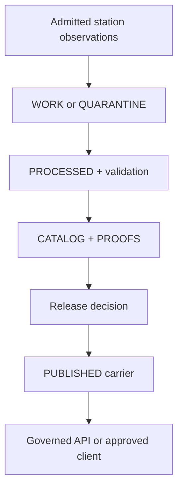

<!-- [KFM_META_BLOCK_V2]
doc_id: kfm://data/published/api-payloads/soil/station-series/readme
title: data/published/api_payloads/soil/station_series README
type: directory-readme
version: v0.1
status: draft
owners:
  - TODO(owner): data steward
  - TODO(owner): soil domain steward
  - TODO(owner): API steward
  - TODO(owner): publication steward
  - TODO(owner): release steward
created: 2026-06-25
updated: 2026-07-26
policy_label: public-review
path: data/published/api_payloads/soil/station_series/README.md
related:
  - ../README.md
  - ../../README.md
  - ../../../README.md
  - ../../../../catalog/domain/soil/README.md
  - ../../../../processed/soil/README.md
  - ../../../../proofs/soil/README.md
  - ../../../../receipts/README.md
  - ../../../../../contracts/domains/soil/soil_moisture_observation.md
  - ../../../../../docs/adr/ADR-0029-adopt-directory-governance-standard-v2.md
  - ../../../../../docs/doctrine/directory-rules.md
  - ../../../../../docs/domains/soil/API_CONTRACTS.md
  - ../../../../../docs/domains/soil/ARCHITECTURE.md
  - ../../../../../docs/domains/soil/CANONICAL_PATHS.md
  - ../../../../../policy/domains/soil/soil_moisture_validator.rego
  - ../../../../../release/README.md
  - ../../../../../schemas/contracts/v1/domains/soil/soil_moisture_reading.schema.json
  - ../../../../../tools/validators/domains/soil/moisture/README.md
notes:
  - "Boundary README for released Soil station-series API payload carriers."
  - "This lane owns release-linked public-safe carrier bytes, not source data, semantic meaning, schema, policy, proof, release decisions, or runtime routes."
  - "Repository files establish draft contracts and scaffolds; they do not establish emitted station-series payloads, field-complete schemas, executable validation, or governed API routes."
[/KFM_META_BLOCK_V2] -->

<a id="top"></a>

# `data/published/api_payloads/soil/station_series/`

> Release-gated carrier lane for public-safe Soil station-series payloads whose station identity, support type, depth, units, time axes, quality state, evidence, and correction lineage remain inspectable.

[](#status-and-authority)
[](../../../README.md#authority-level)
[](../../../../../contracts/domains/soil/soil_moisture_observation.md#source-role-and-support-rules)
[](../../../../../docs/doctrine/evidence-first.md)

> [!IMPORTANT]
> This directory does not approve publication; it is a delivery-carrier boundary. A file path, commit, pull request, merge, successful workflow, or `PUBLISHED` label cannot replace evidence closure, policy permission, review, an accountable release decision, correction support, or a rollback target.

<a id="quick-jumps"></a>

## Navigate

[Purpose](#purpose-and-scope) ·
[Status](#status-and-authority) ·
[Boundaries](#responsibility-boundaries) ·
[Carriers](#admissible-carrier-families) ·
[Contract](#station-series-carrier-contract) ·
[Lifecycle](#lifecycle-and-publication-gates) ·
[Safeguards](#station-series-safeguards) ·
[Safety](#public-safety-and-negative-states) ·
[Layout](#proposed-direct-child-map) ·
[Validation](#validation-and-maintenance) ·
[Workflow](#maintainer-workflow) ·
[Done](#definition-of-done) ·
[Backlog](#open-verification-register) ·
[Evidence](#related-evidence)

<a id="1-scope"></a>

## Purpose and scope

`data/published/api_payloads/soil/station_series/` is the bounded `data/published/` sublane for immutable, versioned, release-approved station-series payload carriers.

Its intended audience is maintainers preparing or reviewing public-safe payload snapshots for governed APIs, Evidence Drawer projections, map popups, Focus Mode, exports, and other approved delivery surfaces.

This lane may carry released station time-series projections. It must not become:

- a source capture, sensor dump, logger archive, or live endpoint cache;
- the canonical Soil observation store;
- the semantic contract or machine-shape authority;
- a validator, policy engine, proof store, receipt store, or release ledger;
- a direct internal-store bypass for public clients; or
- evidence that any route, payload family, schema, validator, or release is operational.

## Status and authority

| Question | Bounded answer |
| --- | --- |
| Does the lane exist? | **CONFIRMED.** This README and its parent navigation exist in current repository evidence. |
| Why is the path here? | **CONFIRMED repository placement.** Soil canonical-path guidance maps station readings to this published API-payload lane; `data/published/` owns released public-safe carrier bytes. |
| What authority does it own? | Released station-series carrier bytes and local delivery sidecars only. |
| What does `PUBLISHED` mean here? | A lifecycle carrier class requiring separate release authority; directory placement does not confer release or publication state. |
| Are station-series payload instances verified? | **NEEDS VERIFICATION.** Bounded repository search confirmed the README but did not establish a complete payload inventory, external byte store, writers, consumers, or active aliases. |
| Is a station-series schema enforced? | **No enforcement is confirmed.** Related Soil moisture schema files exist as permissive `PROPOSED` scaffolds with empty `properties`. |
| Is Soil moisture validation executable? | **NEEDS VERIFICATION.** Validator and pipeline READMEs describe proposed behavior; current Soil workflow evidence records an explicit readiness hold. |
| Are governed Soil API routes established? | **UNKNOWN / PROPOSED.** Soil API documentation says exact route names and implementation remain unverified. |
| Which directory profile applies? | **CONFIRMED.** Accepted ADR-0029 makes Directory Rules v2 effective; this nested lifecycle boundary follows its `BOUNDARY_COMPACT` profile without amending that doctrine. |

### Evidence boundary

The current repository confirms:

- this path and its parent [`soil/`](../README.md), [`api_payloads/`](../../README.md), and [`data/published/`](../../../README.md) contracts;
- Soil canonical-path guidance for a `station_soil_moisture` series payload;
- a draft [`SoilMoistureObservation` semantic contract](../../../../../contracts/domains/soil/soil_moisture_observation.md);
- three related JSON Schema files for a reading, dedupe key, and units/time posture;
- proposed validator, policy, pipeline, proof, API-contract, and release-review surfaces.

The same evidence does **not** prove live station-series payloads, a field-complete series schema, accepted field names, executable validation, catalog/proof/release closure, API routing, public serving, cache invalidation, correction propagation, or rollback rehearsal.

<a id="2-repo-fit"></a>

## Responsibility boundaries

| Owning surface | Responsibility | This lane's relationship |
| --- | --- | --- |
| [`contracts/domains/soil/`](../../../../../contracts/domains/soil/README.md) | Semantic meaning and invariants. | Payloads conform; they do not redefine Soil observations. |
| [`schemas/contracts/v1/domains/soil/`](../../../../../schemas/contracts/v1/domains/soil/README.md) | Machine-checkable shape. | Payloads validate against an accepted field-complete schema when one exists. |
| [`policy/domains/soil/`](../../../../../policy/domains/soil/README.md) | Admissibility, rights, sensitivity, and access decisions. | Payloads carry resolved outcomes; they do not encode policy authority. |
| [`data/processed/soil/`](../../../../processed/soil/README.md) | Validated canonical candidates. | Upstream; never an ordinary public read path. |
| [`data/catalog/domain/soil/`](../../../../catalog/domain/soil/README.md) | Discovery and lineage projections. | Catalog closure supports release but does not approve it. |
| [`data/proofs/soil/`](../../../../proofs/soil/README.md) | Evidence, validation, citation, review, and integrity support. | Proofs support a decision; they do not publish. |
| [`data/receipts/`](../../../../receipts/README.md) | Durable process memory. | Receipts explain production and validation; they are not proof or approval alone. |
| [`release/`](../../../../../release/README.md) | Release, correction, withdrawal, and rollback decisions. | Must authorize and bind every carrier version placed here. |
| Governed API and approved clients | Policy-aware delivery. | May consume released carriers; must not infer truth from their location. |

### What belongs here

- immutable, versioned, public-safe station-series payload snapshots;
- released station-detail or endpoint-response snapshots when explicitly bound to a release;
- released Evidence Drawer, map-popup, Focus Mode, or export projections derived from the same approved series;
- a release-resolved index of approved carrier versions;
- public-safe correction, supersession, stale-state, or withdrawal sidecars that reference their owning release records.

<a id="4-exclusions"></a>

### What does not belong here

| Excluded material | Owning home or required action |
| --- | --- |
| Source exports, sensor dumps, logger files, calibration material, or live-response caches | Admitted source and RAW handling under the appropriate source/lifecycle boundary |
| Mutable normalization candidates or held records | `data/work/soil/` or `data/quarantine/soil/` |
| Validated canonical observations | `data/processed/soil/` |
| Catalog records, proofs, or receipts | `data/catalog/`, `data/proofs/`, or `data/receipts/` |
| Semantic contracts, schemas, or policy source | `contracts/`, `schemas/`, or `policy/` |
| Release manifests, decisions, signatures, corrections, withdrawals, or rollback cards | `release/` |
| Private operational sensors, owner/farm/parcel joins, or unresolved precise locations | Restrict, generalize, quarantine, hold, abstain, or deny under the applicable policy |
| Unreviewed generated summaries or AI output | Governed review and release path; AI is never root truth |

<a id="3-accepted-payloads"></a>

## Admissible carrier families

The placements below are **PROPOSED** conventions, not proof that the children or payloads exist.

| Carrier family | Proposed direct child | Minimum release support |
| --- | --- | --- |
| Station-series response snapshot | `series/` | Station/source identity, support type, variable, depth/unit, time window, QC, evidence, release, and rollback refs |
| Governed endpoint snapshot | `endpoints/` | Accepted response contract, finite-outcome handling, evidence, policy, release, and integrity refs |
| Evidence Drawer projection | `evidence_drawer/` | Resolvable EvidenceBundle, citations, public-safe geometry, policy/review/release state |
| Map-popup projection | `map_popups/` | Station scope, unit/depth, freshness/cadence, limitations, evidence and release refs |
| Focus Mode projection | `focus_mode/` | Released evidence, cite-or-abstain outcome, AI receipt where required |
| Export package | `exports/` | Audience/access class, rights, sensitivity, proof, release, correction, and rollback refs |
| Released-carrier index | `indexes/` | Release-approved versions only; no mutable alias without an accountable resolver |
| Superseded or withdrawn carrier | `retired/` | Supersession, correction, withdrawal, cache-invalidation, and rollback lineage |

## Station-series carrier contract

The exact serialized field names remain **NEEDS VERIFICATION** until an accepted, field-complete schema and corresponding tests exist. A released carrier must nevertheless preserve these concepts.

| Concept | Required meaning |
| --- | --- |
| Carrier identity | Stable payload ID, version, media type, digest, and release binding |
| Station identity | Station or network reference plus provider-native identity without unapproved owner/parcel disclosure |
| Source and support | Source reference, source role, and explicit `station_soil_moisture` or accepted equivalent |
| Variable and method | Observed variable, measurement basis, method, and source-defined limitations |
| Depth and units | Depth value/context, depth unit, observation unit, and any declared conversion |
| Series scope | Requested or released time window, ordering, sampling/cadence posture, aggregation method, and reading references |
| Time axes | Observed, source, valid, retrieval, release, correction, and supersession times kept distinct where applicable |
| Quality state | Source QC, missing-value behavior, stale-state, station health, exclusions, and quality flags |
| Spatial posture | Station support, released geometry/generalization, and policy-approved precision |
| Evidence | EvidenceRef that resolves to EvidenceBundle plus relevant catalog, validation, proof, and citation references |
| Governance | Policy decision, review state, release manifest/decision, correction lineage, and rollback target |
| Interpretation limits | Explicitly not a gridded surface, countywide truth, forecast, agronomic prescription, regulatory determination, or legal/engineering conclusion |

### Identity and immutability

- A released carrier version is immutable.
- Corrections and supersessions create a new accountable version; they do not silently rewrite relied-on bytes.
- A mutable `current` alias, if introduced, must resolve through release state and preserve the immutable target and rollback path.
- Hashes and identifiers must be produced by an accepted contract or tool; this README does not standardize a field name or algorithm.
- Station readings from different variables, depths, units, methods, or support types must not share an identity merely because their timestamps match.

### Series semantics

A station series is an ordered projection of supported readings. It is not evidence that:

- missing intervals were measured;
- one depth substitutes for another;
- a unit conversion is valid;
- a station represents a polygon, field, county, watershed, or gridded cell;
- interpolation, anomaly detection, forecasting, or imputation occurred; or
- a derived summary is suitable for irrigation, drought, flood, crop, engineering, conservation, valuation, or regulatory decisions.

Any aggregation, interpolation, resampling, imputation, anomaly, trend, or forecast must identify its method, inputs, support, time window, validation, evidence, policy, and release lineage as a distinct derived claim.

<a id="5-publication-gates"></a>

## Lifecycle and publication gates

The required flow below is a governance boundary, not an implementation-maturity claim.



Before any station-series carrier lands here:

- [ ] source identity, source role, rights, attribution, access, and sensitivity are resolved;
- [ ] station identity, variable, depth, unit, method, support type, cadence, QC, and relevant time axes are preserved;
- [ ] a field-complete schema and applicable domain validation pass, or the candidate remains held upstream;
- [ ] evidence references resolve and catalog/proof closure is recorded;
- [ ] public geometry and station detail are approved for the intended audience;
- [ ] policy and required review permit the exact projection;
- [ ] an accountable release decision binds the carrier identity and digest;
- [ ] correction, withdrawal, supersession, cache-invalidation, and rollback targets are traceable;
- [ ] public consumers use a governed interface or explicitly approved released-artifact route.

If a required gate is unresolved, do not place the candidate here.

<a id="6-station-series-payload-rules"></a>

## Station-series safeguards

### Support-type separation

| Must remain distinct | Why |
| --- | --- |
| Station reading vs. static survey | An observed point time series is not SSURGO-style survey truth. |
| Station reading vs. gridded derivative | A station does not become a surface without a separately governed method and release. |
| Station reading vs. satellite grid | Grid-cell retrievals and in-situ measurements have different support, resolution, method, and QC. |
| Station reading vs. pedon/profile evidence | A time series does not replace horizon/profile description. |
| Observation vs. interpretation | Moisture readings do not by themselves establish suitability, drought, flood, crop, engineering, or legal conclusions. |

### Depth, unit, quality, and cadence

- Preserve each source-supported depth and depth unit; do not substitute or collapse depths.
- Preserve observation unit and measurement basis; do not compare or aggregate incompatible units without a governed conversion.
- Preserve source QC, missing-value, station-health, stale-state, and revision signals through the released projection.
- State cadence and coverage without implying that every expected interval contains an observation.
- Preserve the distinction between raw observations and aggregated or derived statistics.

### Temporal discipline

Observed time, source time, valid time, retrieval time, release time, correction time, and supersession time answer different questions. Do not collapse them into one generic timestamp.

A payload should make stale or incomplete series visible. When freshness cannot support the requested use, the applicable governed surface should return its contract-defined negative outcome instead of presenting an unsupported current-state claim.

### Cross-lane use

Soil station-series carriers may provide evidence-bounded context to Agriculture, Hydrology, Hazards, Habitat, Flora, Fauna, Geology, and Settlement surfaces. Those consumers retain their own object, policy, evidence, and release authority.

Cross-lane use must preserve:

- the Soil source and support type;
- unit, depth, time, quality, cadence, and spatial limitations;
- the receiving domain's identity and decision boundary;
- EvidenceBundle and release lineage; and
- sensitivity protections, especially for owner/farm/parcel joins and ecological location inference.

## Public safety and negative states

> [!CAUTION]
> This is a public repository path. Do not commit private operational sensor data, owner- or parcel-linked observations, restricted station details, credentials, private endpoints, or reconstructive metadata merely because a future payload is intended for a governed API.

| Condition | Required posture |
| --- | --- |
| Evidence, schema, validation, catalog, review, or release closure is incomplete | Keep the candidate upstream; do not manufacture a public carrier. |
| Rights, consent, station health, or sensitivity is unresolved | Restrict, quarantine, hold, generalize, abstain, or deny according to the applicable contract and policy. |
| Private operational sensor or owner/parcel linkage is present | Deny public-by-default handling; require explicit rights, sensitivity, review, release, and public-geometry decisions. |
| A series is stale, incomplete, or unavailable | Preserve the last valid released version only if policy and the release contract allow it, with visible stale-state; otherwise return the applicable negative outcome. |
| Support types, depths, units, or time axes are collapsed | Reject or quarantine; do not repair by inference. |
| A released carrier is wrong or unsafe | Issue a governed correction, withdrawal, or supersession; preserve lineage and execute the release-owned rollback/cache response. |

This directory does not define a universal outcome enum. Validators, policy, governed APIs, and release processes use the finite outcomes defined by their own accepted contracts.

<a id="7-suggested-layout"></a>

## Proposed direct-child map

No current child inventory is asserted here. If admitted through contracts, schemas, tests, release tooling, and review, a direct-child layout could be:

```text
data/published/api_payloads/soil/station_series/
├── README.md              # Boundary contract; not payload or release authority
├── endpoints/             # PROPOSED governed response snapshots
├── series/                # PROPOSED station-series carriers
├── evidence_drawer/       # PROPOSED evidence projections
├── map_popups/            # PROPOSED map-popup projections
├── focus_mode/            # PROPOSED governed-AI projections
├── exports/               # PROPOSED audience-bounded exports
├── indexes/               # PROPOSED released-version index
└── retired/               # PROPOSED superseded/withdrawn carriers
```

Proposed deterministic filename pattern:

```text
soil.published.api_payload.station_series.<family>.<scope>.<release_id>.<short_hash>.json
```

The tree and filename are design guidance only. Do not create empty symmetry scaffolding or adopt the naming pattern without a verified consumer, accepted identity contract, schema, validator, and rollback plan.

<a id="8-maintenance-checklist"></a>

## Validation and maintenance

### Carrier preflight

- [ ] Target file is a released carrier or local sidecar, not a source, candidate, proof, receipt, schema, policy, or release decision.
- [ ] Carrier bytes are immutable, versioned, digest-bound, and referenced by an accountable release record.
- [ ] Accepted contract and field-complete schema versions are recorded.
- [ ] Station/source identity and `station_soil_moisture` support remain explicit.
- [ ] Variable, method, depth, units, cadence, time axes, QC, missingness, and stale-state are preserved.
- [ ] EvidenceRef resolves to EvidenceBundle and required catalog/proof references close.
- [ ] Rights, sensitivity, public geometry, policy, and review permit the intended audience.
- [ ] Correction, withdrawal, supersession, cache-invalidation, and rollback dependencies resolve.
- [ ] No direct public client reads an upstream or internal store.
- [ ] Secrets, private endpoints, private sensors, owner/parcel joins, and unsafe precision are absent.

### Current repository readiness

| Surface | Current bounded evidence | What it does not prove |
| --- | --- | --- |
| [`soil_moisture_observation.md`](../../../../../contracts/domains/soil/soil_moisture_observation.md) | Draft semantic contract exists. | Accepted serialized station-series payload shape or runtime conformance |
| [`soil_moisture_reading.schema.json`](../../../../../schemas/contracts/v1/domains/soil/soil_moisture_reading.schema.json) | `PROPOSED` permissive scaffold with empty `properties`. | Field validation, requiredness, or release safety |
| [`soil_moisture_dedupe_key.schema.json`](../../../../../schemas/contracts/v1/domains/soil/soil_moisture_dedupe_key.schema.json) | `PROPOSED` permissive scaffold with empty `properties`. | Deterministic deduplication |
| [`soil_moisture_units_time.schema.json`](../../../../../schemas/contracts/v1/domains/soil/soil_moisture_units_time.schema.json) | `PROPOSED` permissive scaffold with empty `properties`. | Unit, depth, cadence, or time-axis enforcement |
| [`soil_moisture_validator.rego`](../../../../../policy/domains/soil/soil_moisture_validator.rego) | Proposed package with `default allow := false`. | A complete policy decision surface or tested rules |
| [Moisture validator README](../../../../../tools/validators/domains/soil/moisture/README.md) | Proposed checks and boundaries are documented. | Executable validator, fixtures, reports, receipts, or CI integration |
| [`domain-soil` workflow](../../../../../.github/workflows/domain-soil.yml) | Read-only readiness checks and explicit holds. | Soil truth, payload validation, proof closure, release, or publication |
| [Soil API contracts](../../../../../docs/domains/soil/API_CONTRACTS.md) | Proposed surfaces and finite-outcome posture are documented. | Exact route names, DTO implementation, or deployed behavior |

A green readiness workflow is bounded evidence about that workflow only. It is not a station-series validation report, EvidenceBundle, release decision, or publication authorization.

## Maintainer workflow

1. Resolve the intended audience and the exact released series version.
2. Verify source, station, support type, rights, sensitivity, contract, schema, and validator evidence.
3. Confirm evidence, catalog, proof, policy, review, release, correction, and rollback closure.
4. Generate the carrier deterministically from the released source version; do not hand-edit data values.
5. Validate bytes, digest, links, public precision, negative states, and consumer behavior.
6. Update the release-owned index or alias only through the accountable release/correction workflow.

For documentation-only changes, verify the Markdown structure, anchors, relative links, badge destinations, Mermaid syntax, metadata, and sensitive-content posture. Documentation checks do not substitute for payload validation.

<a id="9-definition-of-done"></a>

## Definition of done

This lane is operationally mature only when:

- [ ] an accepted station-series semantic contract and field-complete machine schema exist;
- [ ] deterministic public-safe fixtures cover valid, invalid, stale, missing, denied, restricted, corrected, superseded, and withdrawn cases;
- [ ] executable validators enforce station identity, support type, depth, units, cadence, time axes, QC, evidence, sensitivity, release, and rollback requirements;
- [ ] negative tests reject station-as-area, station-as-grid, grid-as-station, depth substitution, unit ambiguity, unsafe precision, owner/parcel joins, missing evidence, and direct publication;
- [ ] release tooling binds immutable payload bytes and digests to an accountable decision;
- [ ] catalog, proof, review, correction, withdrawal, cache-invalidation, and rollback links resolve;
- [ ] governed API or approved released-artifact consumers are implemented and tested;
- [ ] payload inventory, writers, consumers, aliases, retention, and physical storage are documented; and
- [ ] maintainers can rehearse correction and rollback without rewriting history or exposing upstream stores.

## Open verification register

| Item | Status | Evidence required to close |
| --- | --- | --- |
| Recursive carrier inventory and physical storage | `NEEDS VERIFICATION` | Pinned tree or external manifest with digests, media types, access, and retention |
| Accepted station-series payload contract | `NEEDS VERIFICATION` | Accepted contract version and compatibility policy |
| Field-complete schema and negative fixtures | `NEEDS VERIFICATION` | Non-permissive schema, valid/invalid fixtures, and observed test results |
| Executable moisture validator and policy | `NEEDS VERIFICATION` | Source, tests, reports, reason codes, and CI evidence |
| Released payload producer | `UNKNOWN` | Deterministic producer, input/output hashes, receipts, and no-network fixtures |
| Catalog, proof, review, and release closure | `UNKNOWN` | Resolvable instances bound to the same carrier identity and digest |
| Governed routes and consumers | `UNKNOWN` | Route implementation, DTO tests, Evidence Drawer fixtures, and client integration |
| Public geometry and private-sensor controls | `NEEDS VERIFICATION` | Rights/sensitivity policy, negative tests, transforms, and review records |
| Correction, cache invalidation, and rollback | `NEEDS VERIFICATION` | Correction/withdrawal records, consumer inventory, and rehearsal evidence |
| Directory-governance machine enforcement | `NEEDS VERIFICATION` | Adopted v2 projection, validator, fixtures, and observed CI evidence; README conformance is not executable enforcement |

## Related evidence

| Reference | Role | Current posture |
| --- | --- | --- |
| [`data/published/`](../../../README.md) | Parent authority contract for released public-safe carrier bytes | Repository-grounded draft |
| [Soil canonical paths](../../../../../docs/domains/soil/CANONICAL_PATHS.md) | Maps station readings to this carrier lane | Current repository documentation |
| [Soil architecture](../../../../../docs/domains/soil/ARCHITECTURE.md) | Soil object families, support separation, lifecycle, and public boundary | Draft architecture; implementation claims remain bounded |
| [Soil API contracts](../../../../../docs/domains/soil/API_CONTRACTS.md) | Proposed governed surfaces and finite outcomes | Routes and implementation remain proposed/unknown |
| [Soil Moisture Observation contract](../../../../../contracts/domains/soil/soil_moisture_observation.md) | Semantic time-series observation boundary | Draft/proposed; paired observation schema not confirmed |
| [Soil proof lane](../../../../proofs/soil/README.md) | Evidence and validation support boundary | Draft; proof inventory and producer remain unverified |
| [Directory Rules v2](../../../../../docs/doctrine/directory-rules.md) | Adopted placement doctrine and `BOUNDARY_COMPACT` README profile | Effective through accepted ADR-0029; version identity remains `2.0.0-draft.1` |
| [ADR-0029](../../../../../docs/adr/ADR-0029-adopt-directory-governance-standard-v2.md) | Directory Rules v2 adoption decision | Accepted in the reviewed base; this README neither amends it nor expands its migration scope |
| [Soil planning report lineage](../../../../../docs/domains/soil/CONTINUITY_INVENTORY.md) | Design continuity and verification backlog | Planning/lineage evidence, not runtime proof |

## Maintainer note

Keep released station-series carriers compact, citable, station-scoped, depth-aware, unit-aware, time-aware, quality-visible, public-safe, immutable, correctable, and reversible. When evidence, rights, sensitivity, schema, validation, review, release, correction, or rollback support is incomplete, keep the candidate upstream and let the applicable governed surface abstain, deny, hold, or error according to its own contract.

[Back to top](#top)
