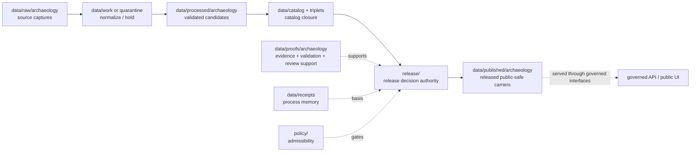

<!-- [KFM_META_BLOCK_V2]
doc_id: kfm://data/published/archaeology/readme
title: data/published/archaeology README
type: directory-readme
version: v0.1
status: draft
owners:
  - TODO(owner): data steward
  - TODO(owner): archaeology domain steward
  - TODO(owner): publication steward
  - TODO(owner): sensitivity reviewer
  - TODO(owner): cultural-review liaison
  - TODO(owner): release steward
created: 2026-06-25
updated: 2026-06-25
policy_label: restricted-review
path: data/published/archaeology/README.md
related:
  - ../README.md
  - ../../README.md
  - ../../raw/archaeology/README.md
  - ../../work/archaeology/README.md
  - ../../quarantine/archaeology/README.md
  - ../../processed/archaeology/README.md
  - ../../catalog/domain/archaeology/README.md
  - ../../triplets/archaeology/README.md
  - ../../proofs/archaeology/README.md
  - ../../proofs/README.md
  - ../../receipts/README.md
  - ../../../release/README.md
  - ../../../docs/domains/archaeology/ARCHITECTURE.md
  - ../../../docs/domains/archaeology/API_CONTRACTS.md
  - ../../../docs/domains/archaeology/PIPELINE.md
  - ../../../docs/architecture/sensitive-domain-fail-closed.md
  - ../../../docs/doctrine/directory-rules.md
  - ../../../docs/doctrine/lifecycle-law.md
  - ../../../docs/doctrine/trust-membrane.md
  - ../../../contracts/README.md
  - ../../../schemas/README.md
  - ../../../policy/README.md
notes:
  - "Directory README for released, public-safe Archaeology carriers. It replaces a greenfield stub."
  - "This path is downstream of release decisions. It does not itself approve release, define policy, prove claims, or replace ReleaseManifest, EvidenceBundle, ProofPack, receipts, catalog records, schemas, or contracts."
  - "Archaeology is a sensitive lane. Public carriers must be generalized, redacted, reviewed, evidence-backed, rights-aware, and rollback-ready before landing here."
[/KFM_META_BLOCK_V2] -->

<a id="top"></a>

# `data/published/archaeology/`

> Published Archaeology lane for **released, public-safe cultural-heritage carriers**: generalized summaries, released public stories, safe educational/context products, public indexes, and approved map/API/report carriers that have passed KFM release gates.


> [!IMPORTANT]
> **Status:** `draft`  
> **Owners:** `TODO(owner): data steward` · `TODO(owner): archaeology domain steward` · `TODO(owner): publication steward` · `TODO(owner): sensitivity reviewer` · `TODO(owner): cultural-review liaison` · `TODO(owner): release steward`  
> **Path:** `data/published/archaeology/README.md`  
> **Truth posture:** CONFIRMED target path and Archaeology domain/API docs from current repo evidence / PROPOSED child layout and instance naming / NEEDS VERIFICATION for emitted published artifacts, release manifests, schemas, validators, CI checks, and governed API routes.

> [!WARNING]
> Nothing is public just because it is in this folder. Published Archaeology artifacts require release authority, evidence closure, policy clearance, cultural/steward review where required, correction path, and rollback target. Keep release decisions in `release/`, proof support in `data/proofs/`, catalog records in `data/catalog/`, and process memory in `data/receipts/`.

---

## Quick jumps

| Section | Use it for |
|---|---|
| [1. Scope](#1-scope) | What this published lane is for. |
| [2. Repo fit](#2-repo-fit) | How this path relates to lifecycle and release authority. |
| [3. Accepted artifacts](#3-accepted-artifacts) | What may live here after release. |
| [4. Exclusions](#4-exclusions) | What must stay out. |
| [5. Publication gates](#5-publication-gates) | Minimum support before an artifact is published. |
| [6. Archaeology public-surface rules](#6-archaeology-public-surface-rules) | Domain-specific safe-publication rules. |
| [7. Suggested layout](#7-suggested-layout) | Proposed child structure and naming. |
| [8. Lifecycle relationship](#8-lifecycle-relationship) | RAW → PUBLISHED placement. |
| [9. Maintenance checklist](#9-maintenance-checklist) | Checks before adding or changing artifacts. |
| [10. Definition of done](#10-definition-of-done) | What remains before maturity. |

---

## 1. Scope

`data/published/archaeology/` is the Archaeology domain's public-safe materialization lane. It should contain only artifacts that have already passed KFM promotion gates and are tied to release authority.

This lane may hold released carriers such as:

- generalized public archaeology or cultural-heritage context summaries;
- public-safe survey coverage summaries;
- released educational or interpretive report carriers;
- public-safe map-layer, tile, API-payload, or story carriers;
- released collection, chronology, or context summaries that are safe for the declared audience;
- public indexes that point only to release-approved artifacts; and
- retired or superseded public artifacts with correction, withdrawal, or rollback references.

This lane is downstream. It should not admit raw source captures, work candidates, quarantine holds, processed candidates, catalog drafts, proof objects, receipts, policy logic, release decisions, restricted material, or unreleased model/AI outputs.

[Back to top](#top)

---

## 2. Repo fit

| Neighbor | Role | Boundary |
|---|---|---|
| [`../../raw/archaeology/`](../../raw/archaeology/) | Source captures. | Never public-readable. |
| [`../../work/archaeology/`](../../work/archaeology/) | Normalization workspace. | Never public-readable. |
| [`../../quarantine/archaeology/`](../../quarantine/archaeology/) | Held or unsafe material. | Never public-readable. |
| [`../../processed/archaeology/`](../../processed/archaeology/) | Validated normalized candidates. | Upstream of catalog and release, not public by itself. |
| [`../../catalog/domain/archaeology/`](../../catalog/domain/archaeology/) | Archaeology catalog records. | Discovery/lineage carrier; not release authority. |
| [`../../triplets/archaeology/`](../../triplets/archaeology/) | Archaeology graph/triplet projection. | Upstream or sibling projection, not public by itself. |
| [`../../proofs/archaeology/`](../../proofs/archaeology/) | Archaeology proof support. | Evidence and proof support; not published carrier. |
| [`../../receipts/`](../../receipts/) | Process memory. | Receipts say what ran; they do not publish. |
| [`../../../release/`](../../../release/) | Release decisions, manifests, correction, withdrawal, rollback, signatures. | Publication authority lives here. |
| [`../../../contracts/`](../../../contracts/) | Semantic meaning. | Published artifacts conform to contracts; they do not define them. |
| [`../../../schemas/`](../../../schemas/) | Machine shape. | Published artifacts validate against schemas; schemas live elsewhere. |
| [`../../../policy/`](../../../policy/) | Admissibility. | Published artifacts carry policy outcome refs; policy rules live elsewhere. |

> [!NOTE]
> `data/published/README.md` is still a greenfield parent stub at time of authoring. This README documents the Archaeology sublane without claiming the parent published-data contract is complete.

[Back to top](#top)

---

## 3. Accepted artifacts

Use this directory only for release-linked, public-safe artifacts.

| Artifact type | Suggested placement | Required support |
|---|---|---|
| Released public map carrier | `layers/<release_id>/<layer_slug>.*` | ReleaseManifest, EvidenceBundle refs, policy decision, validation report, review refs, rollback target. |
| Released API payload snapshot | `api_payloads/<release_id>/<payload_slug>.json` | Schema validation, release refs, proof refs, correction path. |
| Released public report | `reports/<release_id>/<report_slug>.md` or `.json` | Citations, EvidenceBundle refs, release refs, review refs where required. |
| Released public story/context carrier | `stories/<release_id>/<story_slug>.*` | Evidence refs, citation validation, policy outcome, release refs. |
| Released public index | `indexes/published-archaeology-index.json` | Points to release-approved artifacts only. |
| Superseded public artifact | `retired/<release_id>/<artifact_slug>.*` | Supersession, correction, withdrawal, or rollback reference. |

[Back to top](#top)

---

## 4. Exclusions

| Excluded material | Correct home |
|---|---|
| RAW source payloads, scans, notes, survey exports, imagery, rasters, geophysics outputs, logs, or source-system dumps | `data/raw/archaeology/` |
| Working candidates or failed validation material | `data/work/archaeology/` or `data/quarantine/archaeology/` |
| Processed normalized candidates | `data/processed/archaeology/` |
| Catalog records or release-candidate catalog entries | `data/catalog/` |
| Triplets or graph edges | `data/triplets/archaeology/` |
| EvidenceBundle, ValidationReport, ProofPack, citation validation, or review proof | `data/proofs/` child lanes |
| Process receipts, redaction receipts, model-run receipts, or AI receipts | `data/receipts/` or approved proof/receipt homes |
| ReleaseManifest, PromotionDecision, RollbackCard, CorrectionNotice, WithdrawalNotice, signatures | `release/` |
| Policy logic | `policy/` |
| Machine schemas | `schemas/` |
| Semantic contracts | `contracts/` |
| Restricted archaeology source material or steward-only details | Restricted lifecycle stores only; publish public-safe derivatives here after release gates |
| Unreviewed AI summaries or model outputs | Governed AI/review paths; publish only through release gates |

[Back to top](#top)

---

## 5. Publication gates

Before an Archaeology artifact is placed here as current public output, verify:

- release authority exists under `release/`;
- EvidenceBundle refs resolve for every consequential claim;
- validation reports passed or recorded finite non-pass outcomes with reasons;
- catalog closure exists for the released artifact;
- policy decisions allow the public audience class;
- required cultural, steward, rights, and sensitivity reviews are complete;
- public-safe transformation support exists where needed;
- source rights are known and compatible with the public surface;
- correction and rollback paths are recorded; and
- digests or integrity refs bind the released artifact to the release record.

If any gate is unresolved, the artifact should remain upstream or be held; it should not be copied here as a workaround.

[Back to top](#top)

---

## 6. Archaeology public-surface rules

Archaeology public surfaces must preserve the domain's fail-closed posture.

| Rule | Public posture |
|---|---|
| Public carriers are downstream | Published files are visible outputs, not root truth, policy, review, or release authority. |
| Public-safe by design | Use generalized, summarized, or otherwise cleared carriers only. |
| Candidate is not confirmed | Candidate, modeled, inferred, observed, administrative, and confirmed roles must remain distinct. |
| Review state is load-bearing | Cultural, steward, sensitivity, rights, and release review state must not be implied by path placement. |
| Evidence is mandatory | Claims require EvidenceBundle support and citation posture. Missing support means abstain or hold. |
| Cross-lane context stays owned | Roads, people/land, geology, hazards, spatial foundation, settlements, and other lanes keep their own truth. |
| AI is not root truth | AI summaries can consume released evidence but cannot replace EvidenceBundles, validation, release, or review. |
| Corrections are expected | Public artifacts must support correction, supersession, withdrawal, and rollback. |

[Back to top](#top)

---

## 7. Suggested layout

```text
data/published/archaeology/
├── README.md
├── layers/
│   └── <release_id>/
├── api_payloads/
│   └── <release_id>/
├── reports/
│   └── <release_id>/
├── stories/
│   └── <release_id>/
├── indexes/
│   └── published-archaeology-index.json
└── retired/
    └── <release_id>/
```

Suggested deterministic file names:

```text
archaeology.published.<artifact_family>.<scope>.<release_id>.<short_hash>.<ext>
```

Examples:

```text
archaeology.published.report.public-context.release-20260625.0123abcd.md
archaeology.published.api_payload.public-summary.release-20260625.89ab4567.json
archaeology.published.layer.generalized-context.release-20260625.4567cdef.geojson
```

This layout is PROPOSED until validated by contracts, schemas, fixtures, and release tooling.

[Back to top](#top)

---

## 8. Lifecycle relationship



Published files are downstream carriers. Release state is governed by release records, not by path alone.

[Back to top](#top)

---

## 9. Maintenance checklist

Before adding or changing a file under this lane, verify:

- [ ] The artifact is release-approved and public-safe for the intended audience.
- [ ] The release record exists under `release/` and points to this artifact.
- [ ] The artifact has EvidenceBundle, catalog, validation, policy, review, receipt, correction, and rollback refs where required.
- [ ] Source roles and time scopes are preserved.
- [ ] Restricted source material and steward-only details are absent from public carriers.
- [ ] Public-safe transformations are traceable where required.
- [ ] The artifact does not duplicate RAW, WORK, QUARANTINE, PROCESSED, proof, receipt, catalog, schema, contract, or policy authority.
- [ ] The artifact has a digest or integrity reference.
- [ ] Public clients consume it through governed interfaces or approved released artifact paths.

[Back to top](#top)

---

## 10. Definition of done

This lane is operationally mature when:

- [ ] `data/published/README.md` defines the parent published-data contract.
- [ ] Archaeology published artifact contracts and schemas exist under approved homes.
- [ ] Release tooling writes or verifies published Archaeology artifacts only after release authority is present.
- [ ] Validators block unreleased candidates, missing EvidenceBundles, missing release refs, missing rollback, unresolved rights, unsafe public carriers, source-role collapse, and missing review state.
- [ ] Valid and invalid fixtures cover public report, generalized layer, API payload, corrected release, superseded release, and rollback target.
- [ ] Governed API or released-artifact routes are documented and tested.
- [ ] A synthetic no-network Archaeology release demonstrates raw source → processed candidate → catalog/proof closure → release manifest → published artifact → governed API/public UI → correction/rollback traceability.

---

## Maintainer note

Published Archaeology artifacts are high-trust, high-risk public carriers. Keep them boring, citable, generalized, rights-aware, review-backed, audience-aware, and reversible. If evidence, rights, sensitivity, review, validation, release, correction, or rollback support is incomplete, keep the artifact upstream instead of placing it here.
