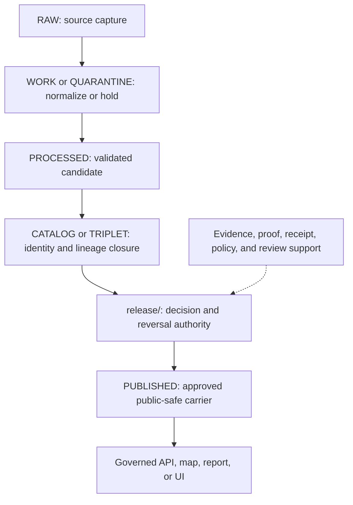

<!-- [KFM_META_BLOCK_V2]
doc_id: kfm://data/published/archaeology/readme
title: data/published/archaeology/ — Archaeology Published-Lane Compatibility and Disposition Index
type: directory-readme; data-lifecycle-sublane; placement-conflict-index; sensitive-domain; release-gated
version: v0.2.0
status: repository-grounded draft; existing placement; canonical disposition unresolved; no published payload or runtime enforcement established
owners: NEEDS VERIFICATION — Archaeology domain, cultural-review, rights-holder, sensitivity, publication, release, policy, evidence, security, correction, rollback, and docs stewards
created: 2026-06-25
updated: 2026-07-26
supersedes: v0.1 README at the same path; no payload, lifecycle, release, policy, public-serving, correction, or rollback state
prepared_under_prompt: KFM Markdown Engineering, Modernization & GitHub Documentation Implementation Agent v4.0.0
policy_label: "restricted-review; archaeology; cultural-heritage; placement-conflicted; deny-by-default; no-direct-public-path; release-gated; cite-or-abstain"
current_path: data/published/archaeology/README.md
review_packet_id: kfm-md-data-published-archaeology-20260726
truth_posture: >
  CONFIRMED exact target path and prior blob; canonical data/published parent contract;
  Directory Rules v1.4 lifecycle, domain-placement, release-separation, and README
  requirements; existing family-first data/published/layers/archaeology lane; Archaeology
  doctrine, contract, schema, policy, fixture, test, validator, proof, release-candidate,
  CODEOWNERS, and workflow boundaries / PROPOSED this direct domain lane remain a
  compatibility, discovery, and disposition index until an accepted ADR and migration
  resolve it / CONFLICTED direct domain-first placement and proposed current-alias language
  versus the family-first Directory Rules path / UNKNOWN recursive payload inventory,
  writers, consumers, hosting, caches, public effects, and external controlled systems /
  NEEDS VERIFICATION accountable owners, accepted disposition, executable enforcement,
  concrete release records, public-safe artifacts, correction propagation, and rollback drills
evidence_snapshot:
  repository: bartytime4life/Kansas-Frontier-Matrix
  base_ref: main
  base_commit: 67f1d7eac9baabd69da997ba569de54c6b7c1d11
  prior_blob: bf07f34317a79b598edcd0c9be33610a19744c6b
  published_parent_blob: 8ecb5d2f9737349fb6569efbde36659f398de151
  canonical_layer_lane_blob: 884baa8b1c12afb037cd46bed7887327c5921c26
  archaeology_proof_blob: d6b953698a26b6e5419afd5d1a3aa42c2b474528
  archaeology_release_candidate_blob: bc5edc7a44ea77a6b8ed25b95569646d8df72754
  archaeology_workflow_blob: 18aabc65e79e1cc70d81be71f8b7ef34c017f51b
  directory_rules_v2_proposal_blob: fd49a0b83e55cef52c1124281f093e263526898d
  base_drift: "ba138f4de38fbaae6529d218d083e5a7e90723b3 -> 67f1d7eac9baabd69da997ba569de54c6b7c1d11; only data/proofs/validation_report/flora/README.md and data/prov/README.md changed"
  method: complete target and governing-neighbor reads plus bounded path, pull-request, branch, workflow, and link inspection; no recursive clone, protected-payload inspection, runtime, deployment, host-render, or external controlled-system inspection
notes:
  - "The first twelve H2 sections follow the Directory Rules required README contract."
  - "This Markdown-only update does not move files, admit payloads, approve release, change policy, create public routes, or resolve the placement conflict."
  - "Directory Rules v2 and ADR-0029 remain proposed and have no supersession effect."
[/KFM_META_BLOCK_V2] -->

<a id="top"></a>

# `data/published/archaeology/` — Archaeology Published-Lane Compatibility and Disposition Index

> **One-line purpose.** Document the existing direct Archaeology published path, preserve its public-safety contract, and hold it as a compatibility/disposition index until reviewed governance resolves its relationship to family-first published lanes.

[](#status)
[](#authority-level)
[](#publication-gates)
[](#validation)

> [!IMPORTANT]
> Path placement, a pull request, a merge, a successful check, a generalized derivative, or a public-looking filename does not create truth, cultural authority, rights clearance, evidence closure, policy permission, release approval, or KFM publication.

> [!WARNING]
> Archaeology is a sensitive lane. Exact or reverse-engineerable locations, human-remains information, sacred or culturally restricted material, collection-security detail, looting-risk information, private-owner details, and control-defeating derivatives must remain outside ordinary public-repository paths unless an authorized, reviewed, audience-bounded release explicitly permits them.

**Quick navigation:** [Purpose](#purpose) · [Authority](#authority-level) · [Status](#status) · [Belongs](#what-belongs-here) · [Exclusions](#what-does-not-belong-here) · [Inputs](#inputs) · [Outputs](#outputs) · [Validation](#validation) · [Review](#review-burden) · [Related](#related-folders) · [ADRs](#adrs) · [Last reviewed](#last-reviewed) · [Placement](#placement-conflict-and-operating-contract) · [Gates](#publication-gates) · [Lifecycle](#lifecycle-relationship) · [Verification](#open-verification-register) · [No-loss](#no-loss-ledger)

## Purpose

<a id="1-scope"></a>

### 1. Scope

`data/published/archaeology/` is a confirmed repository path with a prior public-safe Archaeology boundary. Current governance evidence does not establish it as the canonical byte lane for every published Archaeology artifact family.

Until reviewed disposition closes the placement conflict, this directory should function as:

- a README-level compatibility and discovery surface;
- a bounded inventory or disposition index that points to verified family-first lanes;
- a home for migration, correction-routing, or retirement sidecars that do not duplicate release authority; and
- a deny-by-default boundary for any legacy or externally managed references discovered later.

It is downstream of release decisions. It does not admit raw captures, approve release, define policy, prove claims, assign cultural authority, or create a public API.

## Authority level

**Existing, placement-conflicted compatibility/index lane; non-authoritative for release, policy, truth, schema, cultural review, public serving, or canonical artifact-family placement.**

Directory Rules v1.4 place published artifacts under family-first paths such as `data/published/layers/<domain>/`. The verified Archaeology layer lane is [`data/published/layers/archaeology/`](../layers/archaeology/). The requested direct domain path is therefore preserved without being silently promoted to canonical authority.

Authority remains separated:

```text
contracts/        = semantic meaning
schemas/          = machine-checkable shape
policy/           = admissibility decisions
data/proofs/      = evidence and proof support
release/          = release, correction, withdrawal, and rollback decisions
data/published/   = approved public-safe artifact bytes and delivery sidecars
governed APIs/UI  = bounded public delivery
```

## Status

| Field | Repository-grounded result |
|---|---|
| Path | `data/published/archaeology/README.md` is `CONFIRMED`. |
| Version | `v0.2.0`; documentation-only modernization. |
| Evidence base | `main@67f1d7eac9baabd69da997ba569de54c6b7c1d11`. |
| Prior blob | `bf07f34317a79b598edcd0c9be33610a19744c6b`. |
| Parent contract | [`data/published/README.md`](../README.md), blob `8ecb5d2…`; canonical parent, payload/runtime enforcement unverified. |
| Canonical family-first Archaeology layer lane | [`data/published/layers/archaeology/`](../layers/archaeology/), blob `884baa8…`. |
| Direct-lane placement | `CONFLICTED`; accepted disposition and migration are not established. |
| Recursive payload inventory | `UNKNOWN`; no recursive tree or protected-payload inspection was performed. |
| Concrete released Archaeology artifact | Not established by the bounded evidence. |
| Candidate/release posture | No child Archaeology candidate dossier or reviewed release was established by the current release-candidate boundary. |
| Executable validation | Not established as an accepted suite; the readiness workflow detects maturity changes and holds publication. |
| Public routes, hosting, caches, and consumers | `UNKNOWN`. |
| Public readiness | `DENY BY DEFAULT`. |

Truth labels in this README mean:

| Label | Meaning |
|---|---|
| `CONFIRMED` | Directly supported by the pinned repository evidence. |
| `PROPOSED` | A reviewable design or disposition, not current authority or implementation. |
| `CONFLICTED` | Current surfaces point to incompatible placements or semantics. |
| `UNKNOWN` | Not resolved by the bounded inspection. |
| `NEEDS VERIFICATION` | Checkable, but not verified strongly enough to act as fact. |

## What belongs here

While disposition is unresolved, only documentation and non-authoritative control sidecars should be added:

- this README;
- bounded inventory and disposition records that do not expose protected content;
- migration maps, deprecation notices, and correction or stale-state pointers;
- public-safe references to canonical family-first published lanes; and
- integrity metadata for a verified compatibility artifact, if such an artifact is later discovered and governed.

The v0.1 artifact families are preserved as **proposed release outputs**, not as evidence that instances exist or that this direct path is their accepted home:

| Proposed artifact family | Family-first or governed destination | Minimum support before any release |
|---|---|---|
| Generalized public map carrier | [`data/published/layers/archaeology/`](../layers/archaeology/) | ReleaseManifest, evidence/proof refs, policy outcome, review refs, validation, correction path, rollback target. |
| Public API payload snapshot | Accepted `data/published/api_payloads/<domain>/` successor, if established | Schema and contract binding, release refs, proof refs, safe audience scope, correction path. |
| Public report | Accepted `data/published/reports/<domain>/` successor, if established | Citations, EvidenceBundle refs, release refs, required cultural and rights review. |
| Public story or context carrier | Accepted `data/published/stories/<domain>/` successor, if established | Evidence refs, citation validation, policy outcome, release refs, no-leak review. |
| Public index | Accepted family-first index lane | Release-approved pointers only; no protected location, source, or reconstructive metadata. |
| Superseded or withdrawn artifact | Governed retired/supersession lane plus `release/` decision records | Correction, withdrawal, supersession, cache-invalidation, and rollback references. |

No proposed family should be created under this direct path merely because v0.1 illustrated it.

## What does NOT belong here

| Do not place here | Correct home or action |
|---|---|
| RAW scans, notes, survey exports, imagery, rasters, geophysics outputs, logs, or source-system dumps | [`data/raw/archaeology/`](../../raw/archaeology/) |
| Working candidates or failed/held validation material | [`data/work/archaeology/`](../../work/archaeology/) or [`data/quarantine/archaeology/`](../../quarantine/archaeology/) |
| Normalized but unreleased candidates | [`data/processed/archaeology/`](../../processed/archaeology/) |
| Catalog records | [`data/catalog/domain/archaeology/`](../../catalog/domain/archaeology/) |
| Triplets or graph projections | [`data/triplets/`](../../triplets/); no Archaeology child lane was verified. |
| EvidenceBundle, ValidationReport, ProofPack, citation validation, or review proof | [`data/proofs/`](../../proofs/) and its governed child lanes |
| Process, redaction, model-run, validation, or AI receipts | [`data/receipts/`](../../receipts/) or an accepted specialized receipt home |
| ReleaseManifest, PromotionDecision, CorrectionNotice, WithdrawalNotice, signatures, or RollbackCard | [`release/`](../../../release/) |
| Policy logic or decisions | [`policy/`](../../../policy/) |
| Machine schemas | [`schemas/`](../../../schemas/) |
| Semantic contracts | [`contracts/`](../../../contracts/) |
| Exact or reverse-engineerable protected geometry, cultural restrictions, private-owner detail, or collection-security information | Authorized restricted lifecycle systems; fail closed and seek qualified review |
| Unreviewed AI summaries, reconstructions, predictions, or model outputs | Governed AI and review paths; release only through accepted gates |
| Direct browser, map, AI, or API reads against an internal repository lane | Governed released-artifact and API surfaces only |

## Inputs

No concrete input instance is established for this direct lane.

A future published Archaeology carrier must be derived from an accountable release packet that resolves, as applicable:

- stable artifact, dataset, source, evidence, review, release, and run identities;
- source role and candidate-versus-confirmed status;
- spatial and temporal scope;
- contract and schema versions;
- rights, license, consent, embargo, CARE, sovereignty, cultural-review, and sensitivity state;
- public-safe transform identity and receipt;
- validation report and deterministic command/version;
- EvidenceBundle, ProofPack, catalog, citation, and policy-decision references;
- independent release decision and manifest;
- correction, withdrawal, cache-invalidation, and rollback targets; and
- artifact digest and integrity binding.

Missing or unresolved support results in hold, restrict, deny, quarantine, or abstain—not inferred permission.

## Outputs

The currently established output is this documentation boundary only.

A governed future output may be a released public-safe carrier consumed through an approved static-delivery or API surface. Published bytes remain downstream carriers, not sovereign truth, cultural authority, or release authority.

Public clients and governed AI must not read this compatibility path as an internal data service.

## Validation

### Documentation checks

Validate:

- KFM metadata parsing and one-H1 structure;
- Directory Rules section order;
- Markdown, tables, alerts, fenced blocks, and Mermaid syntax;
- internal fragment targets;
- repository-relative links at the pinned revision;
- badges as linked status summaries rather than proof;
- preservation of v0.1 gates, exclusions, lifecycle, naming examples, maintenance checks, and rollback posture;
- absence of secrets, protected coordinates, private endpoints, unsafe logs, and reverse-engineering aids; and
- exact one-file change scope.

### Artifact checks — required before any payload admission

Validate placement, identity, digest, version, source role, lineage, rights, sensitivity, spatial/temporal support, contract/schema, execution and receipts, evidence/citations/proofs, policy/review, catalog/triplet closure, release/correction/rollback dependencies, public-safe transformation, and no-leak behavior.

No complete lane-wide validator or released-artifact producer is established by the bounded evidence. A pass proves only the declared check scope.

### Current workflow posture

The read-only [`domain-archaeology` workflow](../../../.github/workflows/domain-archaeology.yml) is a readiness detector:

- `validate-archaeology` requires graduation when executable Archaeology test nodes surface;
- `build-proof-archaeology` remains an explicit hold while no accepted proof producer or deterministic proof command exists; and
- `publish-dry-run-archaeology` remains an explicit hold while no accepted release dry-run command or reviewed candidate dossier exists.

Those outcomes do not validate protected data, close evidence, apply policy, confer cultural authority, approve release, write this lane, or publish.

## Review burden

Changes require review appropriate to their effect:

| Change | Minimum review posture |
|---|---|
| README-only clarification | Archaeology domain and docs review; sensitivity check. |
| Placement or migration proposal | Architecture, data, publication, release, domain, and rollback review plus accepted ADR where required. |
| Inventory or legacy-reference discovery | Data, security, sensitivity, rights, cultural-review, and evidence review before exposing details. |
| New public-safe artifact family | Contract, schema, validation, policy, evidence, publication, release, correction, rollback, and domain review. |
| Sensitivity, consent, embargo, cultural, sovereignty, or rights change | Qualified rights-holder/cultural authority and policy review; fail closed until resolved. |
| Public route, cache, alias, or consumer change | Runtime/API, security, release, correction, and rollback review with negative tests. |

[`CODEOWNERS`](../../../.github/CODEOWNERS) routes `/data/published/` to `@bartytime4life`. That is GitHub review routing only—not a StewardshipAssignment, CulturalReview, PolicyDecision, release approval, separation-of-duties proof, or publication authority.

## Related folders

<a id="2-repo-fit"></a>

### 2. Repo fit

- Parent boundaries: [`data/published/`](../README.md) · [`data/`](../../README.md)
- Canonical family-first layer lane: [`data/published/layers/archaeology/`](../layers/archaeology/)
- Lifecycle: [`raw/archaeology/`](../../raw/archaeology/) · [`work/archaeology/`](../../work/archaeology/) · [`quarantine/archaeology/`](../../quarantine/archaeology/) · [`processed/archaeology/`](../../processed/archaeology/) · [`catalog/domain/archaeology/`](../../catalog/domain/archaeology/) · [`triplets/`](../../triplets/)
- Trust support: [`proofs/archaeology/`](../../proofs/archaeology/) · [`proofs/`](../../proofs/) · [`receipts/`](../../receipts/) · [`registry/sources/archaeology/`](../../registry/sources/archaeology/)
- Release: [`release/`](../../../release/) · [`release/candidates/archaeology/`](../../../release/candidates/archaeology/)
- Authority: [`contracts/domains/archaeology/`](../../../contracts/domains/archaeology/) · [`schemas/contracts/v1/domains/archaeology/`](../../../schemas/contracts/v1/domains/archaeology/) · [`policy/domains/archaeology/`](../../../policy/domains/archaeology/)
- Enforceability: [`fixtures/domains/archaeology/`](../../../fixtures/domains/archaeology/) · [`tests/domains/archaeology/`](../../../tests/domains/archaeology/) · [`tools/validators/archaeology/`](../../../tools/validators/archaeology/) · [`tools/validators/domains/archaeology/`](../../../tools/validators/domains/archaeology/)
- Domain control plane: [`ARCHITECTURE.md`](../../../docs/domains/archaeology/ARCHITECTURE.md) · [`API_CONTRACTS.md`](../../../docs/domains/archaeology/API_CONTRACTS.md) · [`PIPELINE.md`](../../../docs/domains/archaeology/PIPELINE.md) · [`PUBLICATION_AND_POLICY.md`](../../../docs/domains/archaeology/PUBLICATION_AND_POLICY.md) · [`SENSITIVITY.md`](../../../docs/domains/archaeology/SENSITIVITY.md) · [`CULTURAL_REVIEW.md`](../../../docs/domains/archaeology/CULTURAL_REVIEW.md) · [`RELEASE_INDEX.md`](../../../docs/domains/archaeology/RELEASE_INDEX.md)
- Doctrine and architecture: [Directory Rules](../../../docs/doctrine/directory-rules.md) · [Lifecycle Law](../../../docs/doctrine/lifecycle-law.md) · [Trust Membrane](../../../docs/doctrine/trust-membrane.md) · [Sensitive-Domain Fail-Closed](../../../docs/architecture/sensitive-domain-fail-closed.md)

## ADRs

Relevant numbered ADRs remain **proposed**; this README accepts none:

- [`ADR-0001`](../../../docs/adr/ADR-0001-schema-home--schemas-contracts-v1-is-canonical.md) — schema home.
- [`ADR-0011`](../../../docs/adr/ADR-0011-receipts-vs-proofs-vs-manifests-vs-catalog-separation.md) — receipt, proof, manifest, and catalog separation.
- [`ADR-0012`](../../../docs/adr/ADR-0012-connector-outputs-to-data-raw-or-data-quarantine-only.md) — connector output boundary.
- [`ADR-0015`](../../../docs/adr/ADR-0015-data-published-_domain_-current-alias-is-governed-by-rollback_card.md) — proposed direct-domain `current` alias and RollbackCard behavior.
- [`ADR-0025`](../../../docs/adr/ADR-0025-public-client-never-reads-canonical-internal-stores.md) — public-client boundary.
- [`ADR-0029`](../../../docs/adr/ADR-0029-adopt-directory-governance-standard-v2.md) — proposed Directory Rules v2 adoption.

An accepted ADR plus a reviewed migration and rollback plan is required before promoting this direct path to canonical, creating aliases, moving artifact families, or retiring a verified lane.

## Last reviewed

- **Date:** 2026-07-26
- **Evidence boundary:** `main@67f1d7eac9baabd69da997ba569de54c6b7c1d11`
- **Review type:** complete target and governing-neighbor reads plus bounded path, PR, branch, workflow, and link inspection
- **Recursive payload/protected-content inspection:** not performed
- **Runtime, deployment, hosting, caches, and external controlled systems:** not inspected
- **Owners, accepted disposition, release instances, public effects, correction propagation, and rollback drill:** needs verification

Re-review on placement, authority, payload, writer, consumer, policy, release, public-route, correction, withdrawal, cache, or rollback change—or within six months.

## Placement conflict and operating contract

| Surface | Confirmed posture | Consequence |
|---|---|---|
| `data/published/archaeology/` | Existing direct domain path; not listed in the current parent’s bounded child-lane index | Preserve and inventory; do not infer canonical status. |
| `data/published/layers/archaeology/` | Existing family-first Archaeology layer lane aligned with Directory Rules domain placement | Use as the verified documentation target for public layer carriers, subject to release gates. |
| `data/published/api_payloads/<domain>/`, `reports/<domain>/`, `stories/<domain>/` | Family-first pattern is documented; Archaeology child paths were not established in the bounded inspection | Treat as proposed until paths, contracts, and migration are reviewed. |
| `ADR-0015` direct-domain `current` alias | Proposed, not accepted | Do not create or treat an alias as current release authority. |
| Directory Rules v2 / ADR-0029 | Proposed, no supersession effect | Continue conservative v1.4 placement and migration discipline. |

Safe operating contract:

1. add no new payload to this direct lane while canonical disposition is unresolved;
2. point verified map-layer work to the family-first Archaeology layer lane;
3. inventory any discovered legacy bytes without opening or exposing protected content;
4. require an ADR for authority/topology change;
5. migrate by copy-verify-switch-observe-retire, not silent move or deletion; and
6. retain correction, withdrawal, and rollback ability throughout.

<a id="3-accepted-artifacts"></a>

## Artifact admission contract

### 3. Accepted artifacts

The following admission contract preserves the v0.1 intent without claiming implementation:

```text
artifact_identity
release_identity
artifact_family
audience_and_surface
source_role
spatial_scope
temporal_scope
contract_and_schema_versions
rights_and_license
sensitivity_and_public_safe_transform
cultural_rights_and_sovereignty_review
evidence_proof_and_catalog_refs
validation_report_and_receipts
policy_decision
release_manifest_and_promotion_decision
correction_withdrawal_and_rollback_targets
digest_and_integrity_binding
```

Every field must resolve or carry an explicit finite non-pass outcome. Empty, missing, stale, unverifiable, or contradictory support cannot be converted into an allow decision by directory placement.

<a id="4-exclusions"></a>

### 4. Exclusions

The exclusions in [What does NOT belong here](#what-does-not-belong-here) are mandatory. In particular, no styling trick, client-side filter, coarse display alone, disabled tooltip, hidden URL, unlisted filename, or AI paraphrase is a sensitivity control.

## Archaeology public-surface rules

<a id="6-archaeology-public-surface-rules"></a>

### 6. Archaeology public-surface rules

| Rule | Required posture |
|---|---|
| Published is downstream | Bytes are released carriers, not root truth, policy, review, evidence, or release authority. |
| Public-safe by design | Use only audience-bounded, reviewed, generalized, summarized, suppressed, or otherwise cleared carriers. |
| Candidate is not confirmed | Candidate, modeled, inferred, observed, administrative, and confirmed roles remain distinct. |
| Review state is load-bearing | Cultural, rights-holder, sovereignty, sensitivity, consent, and release review must not be inferred. |
| Evidence is mandatory | Consequential claims resolve to EvidenceBundle and citation support; otherwise abstain or hold. |
| Cross-lane context stays owned | People/land, geology, hazards, spatial foundation, settlements, and other lanes retain their authority. |
| AI is not root truth | AI may consume bounded released evidence; it cannot replace evidence, review, policy, or release. |
| No reconstructive leakage | Coordinates, tiles, metadata, indexes, identifiers, joins, caches, and narratives must be reviewed together. |
| Corrections are expected | Every public carrier supports correction, supersession, withdrawal, stale state, invalidation, and rollback. |

## Publication gates

<a id="5-publication-gates"></a>

### 5. Publication gates

Before an Archaeology artifact becomes current public output, verify:

- release authority exists under `release/` and binds the exact artifact digest;
- every consequential claim resolves to evidence and citation support;
- validation completed with inspectable finite outcomes and safe diagnostics;
- catalog and identifier closure exists for the released artifact;
- policy permits the named audience and surface;
- required cultural, rights-holder, sovereignty, consent, sensitivity, and independent release reviews are complete;
- the public-safe transform is named, versioned, deterministic where required, and receipt-backed;
- source rights and license permit the exact use;
- public clients use a governed interface or approved released-artifact route;
- correction, stale-state, cache-invalidation, withdrawal, and rollback paths are recorded and testable; and
- integrity refs bind the carrier, support packet, and release record.

If any gate is unresolved, keep the artifact upstream or held. Do not copy it here as a workaround.

## Lifecycle relationship

<a id="8-lifecycle-relationship"></a>

### 8. Lifecycle relationship


```mermaid
flowchart TD
    RAW["RAW: source capture"] --> WORK["WORK or QUARANTINE: normalize or hold"]
    WORK --> PROC["PROCESSED: validated candidate"]
    PROC --> CAT["CATALOG or TRIPLET: identity and lineage closure"]
    CAT --> REL["release/: decision and reversal authority"]
    REL --> PUB["PUBLISHED: approved public-safe carrier"]
    PUB --> API["Governed API, map, report, or UI"]
    PROOF["Evidence, proof, receipt, policy, and review support"] -.-> REL
```

Promotion is a governed state transition, not a file move. The release record governs state; no published path does so by itself.

## Proposed disposition and migration sequence

<a id="7-suggested-layout"></a>

### 7. Suggested layout

The v0.1 direct-domain tree is retained as historical proposal only:

```text
data/published/archaeology/
├── README.md
├── layers/<release_id>/
├── api_payloads/<release_id>/
├── reports/<release_id>/
├── stories/<release_id>/
├── indexes/published-archaeology-index.json
└── retired/<release_id>/
```

Current Directory Rules favor family-first placement, for example:

```text
data/published/layers/archaeology/<release_id>/
data/published/api_payloads/archaeology/<release_id>/   # PROPOSED until established
data/published/reports/archaeology/<release_id>/        # PROPOSED until established
data/published/stories/archaeology/<release_id>/        # PROPOSED until established
```

Preserved proposed deterministic names:

```text
archaeology.published.<artifact_family>.<scope>.<release_id>.<short_hash>.<ext>
archaeology.published.report.public-context.release-20260625.0123abcd.md
archaeology.published.api_payload.public-summary.release-20260625.89ab4567.json
archaeology.published.layer.generalized-context.release-20260625.4567cdef.geojson
```

A reviewed disposition should:

1. pin a complete tree and external-store inventory without disclosing protected content;
2. classify every item as README/control sidecar, canonical carrier, compatibility reference, duplicate, stale, superseded, or unknown;
3. decide the canonical family-first destinations through accepted governance;
4. prepare identity, digest, link, consumer, rights, sensitivity, correction, and rollback mappings;
5. copy and verify before switching writers or consumers;
6. observe governed routes, caches, corrections, and reversal behavior;
7. retain a tombstone or compatibility pointer where safe and required; and
8. retire only after review confirms no authority, consumer, or rollback dependency remains.

## Open verification register

| Item | Status | Required evidence |
|---|---:|---|
| Recursive target subtree and external stores | `UNKNOWN` | Pinned inventory, payload families, LFS/object stores, rights, sensitivity, retention, owners |
| Canonical disposition of direct domain path | `CONFLICTED` | Accepted ADR or explicit non-ADR rationale, parent-index update, migration and rollback plan |
| Published Archaeology artifact instances | `NOT ESTABLISHED` | ReleaseManifest, PromotionDecision, artifact digest, evidence/proof, reviews, policy, catalog, public-safe transform |
| Writers and consumers | `UNKNOWN` | Connector, pipeline, tool, runtime, API/UI, workflow, deployed-consumer inventory |
| Contracts and schemas | `NEEDS VERIFICATION` | Accepted artifact-family contracts, concrete schemas, versions, fixtures, migration policy |
| Policy and cultural review enforcement | `UNKNOWN` | Executable entrypoints, decisions, qualified review records, consent/revocation handling, negative tests |
| Validation and proof | `UNKNOWN` | Accepted deterministic commands, representative fixtures, reports/receipts, CI graduation |
| Public serving and caches | `UNKNOWN` | Governed routes, authentication, hosting, cache keys, invalidation, stale/withdrawn behavior |
| Correction, withdrawal, and rollback | `UNKNOWN` | Bound records, identity agreement, propagation tests, drills |
| Accountable ownership | `NEEDS VERIFICATION` | Accepted stewardship and separation-of-duties assignments |
| Parent child-lane index | `NEEDS VERIFICATION` | Reviewed parent update after disposition; absence from the current list is not retirement |

Unknowns narrow claims and block higher-risk transitions. They do not invite plausible defaults.

## Maintenance checklist

<a id="9-maintenance-checklist"></a>

### 9. Maintenance checklist

Before adding or changing anything under this lane:

- [ ] Confirm whether the change is documentation/disposition work or a canonical payload change.
- [ ] Keep new payload out until placement is resolved.
- [ ] Verify release approval and public safety for the intended audience.
- [ ] Resolve release, evidence, catalog, validation, policy, review, receipt, correction, withdrawal, and rollback refs.
- [ ] Preserve source roles, candidate status, identities, and time scopes.
- [ ] Exclude protected, steward-only, collection-security, and reverse-engineerable details.
- [ ] Bind any public-safe transform to its version and receipt.
- [ ] Confirm no duplication of RAW, WORK, QUARANTINE, PROCESSED, catalog, triplet, proof, receipt, schema, contract, policy, or release authority.
- [ ] Bind artifact bytes to a digest and release record.
- [ ] Validate governed client routing and negative no-direct-read behavior.
- [ ] Run documentation, link, anchor, metadata, sensitive-content, no-loss, and one-file scope checks.
- [ ] Record placement, correction, and rollback consequences in the review packet.

## Definition of done

<a id="10-definition-of-done"></a>

### 10. Definition of done

This lane is operationally mature only when:

- [ ] a reviewed decision resolves direct-domain versus family-first placement;
- [ ] the parent published index reflects the accepted topology;
- [ ] the recursive inventory and every writer/consumer are known;
- [ ] Archaeology published artifact contracts and concrete schemas are accepted;
- [ ] meaningful public-safe and fail-closed fixtures exist;
- [ ] deterministic validators block unreleased candidates, missing evidence, unresolved rights or review, unsafe precision, source-role collapse, missing correction, and missing rollback;
- [ ] policy entrypoints and qualified cultural/rights review are enforced;
- [ ] release tooling writes or verifies artifacts only after independent release authority exists;
- [ ] governed routes, caches, stale state, withdrawal, and correction propagation are tested;
- [ ] a synthetic no-network Archaeology release demonstrates source capture → candidate → catalog/proof closure → release decision → published carrier → governed public surface → correction/rollback; and
- [ ] rollback drills prove that no protected or stale derivative remains reachable.

## No-loss ledger

| v0.1 element | Disposition in v0.2.0 |
|---|---|
| Stable path, `doc_id`, created date, H1, and top anchor | Preserved |
| Draft and restricted-review posture | Preserved and strengthened with repository-grounded uncertainty |
| Released public-safe Archaeology purpose | Preserved; separated from unverified direct-path authority |
| Scope and downstream-only rule | Preserved under [Purpose](#purpose) |
| Repo-fit neighbor table | Preserved as verified related-folder routing; broken Archaeology triplets child removed |
| Six proposed artifact families | Preserved under [What belongs here](#what-belongs-here) |
| Exclusion matrix | Preserved and expanded |
| Publication gates | Preserved and expanded |
| Archaeology public-surface rules | Preserved and expanded |
| Proposed direct-domain layout | Preserved as historical proposal; family-first conflict made explicit |
| Deterministic naming pattern and three examples | Preserved |
| RAW → PUBLISHED lifecycle and support lanes | Preserved without claiming path placement creates state |
| Maintenance checklist | Preserved and expanded |
| Definition of done | Preserved and expanded |
| Maintainer warning to keep carriers citable, generalized, rights-aware, review-backed, audience-aware, and reversible | Preserved throughout and restated below |
| Cite-or-abstain, candidate-not-confirmed, AI-not-root-truth, cross-lane ownership | Preserved |
| Cultural, rights, sensitivity, evidence, review, release, correction, and rollback safeguards | Preserved and strengthened |
| Payload, move, deletion, redirect, policy, release, route, or public-state change | None |

## Maintainer note

Keep Archaeology public carriers boring, citable, generalized, rights-aware, culturally reviewed, audience-bounded, and reversible. If evidence, rights, sensitivity, cultural authority, consent, validation, release, correction, withdrawal, or rollback support is incomplete, keep the artifact upstream or held.

## Rollback

This update changes Markdown only.

- Before merge: close the draft pull request and leave its branch unmerged.
- After merge: use a normal revert or corrective pull request against the actual merge commit; do not rewrite shared history.
- For a future placement migration: restore prior writer/consumer pointers and verified artifact aliases using the reviewed migration rollback plan.
- For a public-impacting artifact: use the accepted correction, withdrawal, cache-invalidation, and rollback authority surfaces; restoring this README alone is not operational rollback.

### Change history

#### v0.2.0 — 2026-07-26

- normalized the README to the Directory Rules required section order;
- grounded status at a pinned repository revision;
- exposed the direct-domain versus family-first placement conflict;
- retained all v0.1 artifact families, gates, exclusions, sensitivity rules, lifecycle, naming examples, maintenance checks, and definition of done;
- replaced a broken domain-triplets link with the verified triplets parent;
- added current workflow, proof, policy, schema, release, review, correction, and rollback boundaries; and
- changed Markdown only.

[Back to top](#top)
