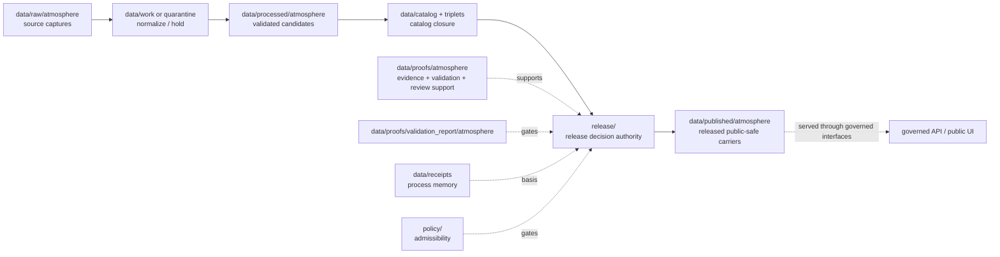

<!-- [KFM_META_BLOCK_V2]
doc_id: kfm://data/published/atmosphere/readme
title: data/published/atmosphere README
type: directory-readme
version: v0.1
status: draft
owners:
  - TODO(owner): data steward
  - TODO(owner): atmosphere domain steward
  - TODO(owner): publication steward
  - TODO(owner): API steward
  - TODO(owner): release steward
created: 2026-06-25
updated: 2026-06-25
policy_label: public-review
path: data/published/atmosphere/README.md
related:
  - ../README.md
  - ../../README.md
  - ../../raw/atmosphere/README.md
  - ../../work/atmosphere/README.md
  - ../../quarantine/atmosphere/README.md
  - ../../processed/atmosphere/README.md
  - ../../catalog/domain/atmosphere/README.md
  - ../../triplets/atmosphere/README.md
  - ../../proofs/atmosphere/README.md
  - ../../proofs/proof_pack/atmosphere/README.md
  - ../../proofs/validation_report/atmosphere/README.md
  - ../../receipts/README.md
  - ../api_payloads/atmosphere/README.md
  - ../../../release/README.md
  - ../../../docs/domains/atmosphere/ARCHITECTURE.md
  - ../../../docs/domains/atmosphere/DATA_LIFECYCLE.md
  - ../../../docs/doctrine/directory-rules.md
  - ../../../docs/doctrine/lifecycle-law.md
  - ../../../docs/doctrine/trust-membrane.md
  - ../../../contracts/README.md
  - ../../../schemas/README.md
  - ../../../policy/README.md
notes:
  - "Directory README for released, public-safe Atmosphere carriers. It replaces a greenfield stub."
  - "This path is downstream of release decisions. It does not itself approve release, define policy, prove claims, or replace ReleaseManifest, EvidenceBundle, ProofPack, receipts, catalog records, schemas, or contracts."
  - "Atmosphere carriers must preserve knowledge-character labels, source roles, freshness/stale state, advisory redirects, caveats, correction path, and rollback support."
[/KFM_META_BLOCK_V2] -->

<a id="top"></a>

# `data/published/atmosphere/`

> Published Atmosphere lane for **released, public-safe air, weather, climate-context, advisory-context, map, report, tile, and API carriers** that have passed KFM release gates and are safe for governed API or public UI consumption.


> [!IMPORTANT]
> **Status:** `draft`  
> **Owners:** `TODO(owner): data steward` · `TODO(owner): atmosphere domain steward` · `TODO(owner): publication steward` · `TODO(owner): API steward` · `TODO(owner): release steward`  
> **Path:** `data/published/atmosphere/README.md`  
> **Truth posture:** CONFIRMED target path and Atmosphere domain/lifecycle docs from current repo evidence / PROPOSED child layout and instance naming / NEEDS VERIFICATION for emitted published artifacts, release manifests, schemas, validators, CI checks, and governed API routes.

> [!WARNING]
> Nothing is public just because it is in this folder. Published Atmosphere artifacts require release authority, EvidenceBundle support, catalog closure, validation, policy state, correction path, and rollback target. Keep release decisions in `release/`, proof support in `data/proofs/`, catalog records in `data/catalog/`, and process memory in `data/receipts/`.

---

## Quick jumps

| Section | Use it for |
|---|---|
| [1. Scope](#1-scope) | What this published lane is for. |
| [2. Repo fit](#2-repo-fit) | How this path relates to lifecycle and release authority. |
| [3. Accepted artifacts](#3-accepted-artifacts) | What may live here after release. |
| [4. Exclusions](#4-exclusions) | What must stay out. |
| [5. Publication gates](#5-publication-gates) | Minimum support before an artifact is published. |
| [6. Atmosphere public-surface rules](#6-atmosphere-public-surface-rules) | Domain-specific safe-publication rules. |
| [7. Suggested layout](#7-suggested-layout) | Proposed child structure and naming. |
| [8. Lifecycle relationship](#8-lifecycle-relationship) | RAW → PUBLISHED placement. |
| [9. Maintenance checklist](#9-maintenance-checklist) | Checks before adding or changing artifacts. |
| [10. Definition of done](#10-definition-of-done) | What remains before maturity. |

---

## 1. Scope

`data/published/atmosphere/` is the Atmosphere domain's public-safe materialization lane. It should contain only artifacts that have already passed KFM promotion gates and are tied to release authority.

This lane may hold released carriers such as:

- public-safe air-observation summaries;
- released AQI or air-quality context carriers with correct knowledge-character labels;
- public-safe smoke, AOD, forecast, climate-normal, climate-anomaly, or weather-context summaries;
- advisory-context carriers that redirect to official issuing authorities and do not replace life-safety guidance;
- released map-layer files, API payload snapshots, report carriers, tile/package carriers, or index manifests;
- public release notes that point back to release, catalog, proof, and rollback records; and
- retired or superseded public artifacts with correction, withdrawal, or rollback references.

This lane is downstream. It should not admit raw source captures, work candidates, quarantine holds, processed candidates, catalog drafts, proof objects, receipts, policy logic, release decisions, or unreleased model/AI outputs.

[Back to top](#top)

---

## 2. Repo fit

| Neighbor | Role | Boundary |
|---|---|---|
| [`../../raw/atmosphere/`](../../raw/atmosphere/) | Source captures. | Never public-readable. |
| [`../../work/atmosphere/`](../../work/atmosphere/) | Normalization workspace. | Never public-readable. |
| [`../../quarantine/atmosphere/`](../../quarantine/atmosphere/) | Held or unsafe material. | Never public-readable. |
| [`../../processed/atmosphere/`](../../processed/atmosphere/) | Validated normalized candidates. | Upstream of catalog and release, not public by itself. |
| [`../../catalog/domain/atmosphere/`](../../catalog/domain/atmosphere/) | Atmosphere catalog records. | Discovery/lineage carrier; not release authority. |
| [`../../triplets/atmosphere/`](../../triplets/atmosphere/) | Atmosphere graph/triplet projection. | Upstream or sibling projection, not public by itself. |
| [`../../proofs/atmosphere/`](../../proofs/atmosphere/) | Atmosphere proof support. | Evidence and proof support; not published carrier. |
| [`../../proofs/validation_report/atmosphere/`](../../proofs/validation_report/atmosphere/) | Atmosphere validation reports. | Gate support, not publication authority. |
| [`../../receipts/`](../../receipts/) | Process memory. | Receipts say what ran; they do not publish. |
| [`../api_payloads/atmosphere/`](../api_payloads/atmosphere/) | Released API-payload carriers. | Child/sibling carrier lane for API-shaped outputs. |
| [`../../../release/`](../../../release/) | Release decisions, manifests, correction, withdrawal, rollback, signatures. | Publication authority lives here. |
| [`../../../contracts/`](../../../contracts/) | Semantic meaning. | Published artifacts conform to contracts; they do not define them. |
| [`../../../schemas/`](../../../schemas/) | Machine shape. | Published artifacts validate against schemas; schemas live elsewhere. |
| [`../../../policy/`](../../../policy/) | Admissibility. | Published artifacts carry policy outcome refs; policy rules live elsewhere. |

> [!NOTE]
> `data/published/README.md` is still a greenfield parent stub at time of authoring. This README documents the Atmosphere sublane without claiming the parent published-data contract is complete.

[Back to top](#top)

---

## 3. Accepted artifacts

Use this directory only for release-linked, public-safe artifacts.

| Artifact type | Suggested placement | Required support |
|---|---|---|
| Released public map carrier | `layers/<release_id>/<layer_slug>.*` | ReleaseManifest, EvidenceBundle refs, policy decision, validation report, rollback target. |
| Released API payload snapshot | `api_payloads/<release_id>/<payload_slug>.json` | Schema validation, release refs, proof refs, correction path. |
| Released report carrier | `reports/<release_id>/<report_slug>.md` or `.json` | Citations, EvidenceBundle refs, release refs, review refs where required. |
| Released tile/package carrier | `tiles/<release_id>/<package_slug>.*` | Digest, layer manifest, release refs, rollback target. |
| Released public summary | `public_summaries/<release_id>/<summary_slug>.json` | Public-safe posture, evidence refs, policy state. |
| Released public index | `indexes/published-atmosphere-index.json` | Points to release-approved artifacts only. |
| Superseded public artifact | `retired/<release_id>/<artifact_slug>.*` | Supersession, correction, withdrawal, or rollback reference. |

[Back to top](#top)

---

## 4. Exclusions

| Excluded material | Correct home |
|---|---|
| RAW source payloads, sensor exports, model files, rasters, advisory text dumps, logs, or source-system dumps | `data/raw/atmosphere/` |
| Working candidates or failed validation material | `data/work/atmosphere/` or `data/quarantine/atmosphere/` |
| Processed normalized data | `data/processed/atmosphere/` |
| Catalog records or release-candidate catalog entries | `data/catalog/` |
| Triplets or graph projection data | `data/triplets/` |
| EvidenceBundle, ValidationReport, ProofPack, citation validation, or review proof | `data/proofs/` child lanes |
| Receipts, transform receipts, model-run receipts, representation receipts, AI receipts | `data/receipts/` or approved proof/receipt homes |
| ReleaseManifest, PromotionDecision, RollbackCard, CorrectionNotice, WithdrawalNotice, signatures | `release/` |
| Policy logic | `policy/` |
| Machine schemas | `schemas/` |
| Semantic contracts | `contracts/` |
| Emergency instructions, evacuation advice, routing advice, or life-safety directives | Official authorities outside this published carrier lane |
| Unreviewed AI summaries or model outputs | Governed AI/review paths; publish only through release gates |

[Back to top](#top)

---

## 5. Publication gates

Before an Atmosphere artifact is placed here as current public output, verify:

- release authority exists under `release/`;
- EvidenceBundle refs resolve for every consequential claim;
- validation reports passed or recorded finite non-pass outcomes with reasons;
- catalog closure exists for the released artifact;
- policy decisions allow the public audience class;
- knowledge-character labels and source roles are preserved;
- freshness, stale-state, issue/expiry, observed/valid/model-run/retrieval/release times are recorded where material;
- low-cost sensor caveats, official-source redirects, model-field labels, and remote-sensing labels are present where required;
- correction and rollback paths are recorded; and
- digests or integrity refs bind the released artifact to the release record.

If any gate is unresolved, the artifact should remain upstream or be held; it should not be copied here as a workaround.

[Back to top](#top)

---

## 6. Atmosphere public-surface rules

Atmosphere public surfaces must preserve the domain's source-role and knowledge-character discipline.

| Rule | Public posture |
|---|---|
| AQI is not concentration | Public carriers must not represent AQI buckets as measured concentration values. |
| AOD is not PM2.5 | Satellite-derived products must retain their actual knowledge character. |
| Model fields are not observations | Forecast/model carriers remain model/context products, not observed truth. |
| Low-cost sensors require caveats | Public surfaces need correction, caveats, confidence, and limitations before release. |
| Advisory context redirects | Published carriers may reference official advisories but must not replace life-safety instructions. |
| Stale state must be visible | Current-context carriers must show freshness or stale-state posture. |
| Cross-lane handoffs preserve ownership | Hazards, Agriculture, Hydrology, Roads, Flora/Fauna/Habitat, and Focus Mode uses keep their owning-lane truth and release state. |
| AI is not root truth | AI summaries can consume released evidence but cannot replace EvidenceBundles, validation, release, or citations. |

[Back to top](#top)

---

## 7. Suggested layout

```text
data/published/atmosphere/
├── README.md
├── layers/
│   └── <release_id>/
├── api_payloads/
│   └── <release_id>/
├── reports/
│   └── <release_id>/
├── tiles/
│   └── <release_id>/
├── public_summaries/
│   └── <release_id>/
├── indexes/
│   └── published-atmosphere-index.json
└── retired/
    └── <release_id>/
```

Suggested deterministic file names:

```text
atmosphere.published.<artifact_family>.<scope>.<release_id>.<short_hash>.<ext>
```

Examples:

```text
atmosphere.published.layer.smoke-context.release-20260625.0123abcd.geojson
atmosphere.published.api_payload.aqi-summary.release-20260625.89ab4567.json
atmosphere.published.report.air-quality-context.release-20260625.4567cdef.md
```

This layout is PROPOSED until validated by contracts, schemas, fixtures, and release tooling.

[Back to top](#top)

---

## 8. Lifecycle relationship



Published files are downstream carriers. Release state is governed by release records, not by path alone.

[Back to top](#top)

---

## 9. Maintenance checklist

Before adding or changing a file under this lane, verify:

- [ ] The artifact is release-approved and public-safe for the intended audience.
- [ ] The release record exists under `release/` and points to this artifact.
- [ ] The artifact has EvidenceBundle, catalog, validation, policy, review, receipt, correction, and rollback refs where required.
- [ ] Source roles, knowledge characters, and time scopes are preserved.
- [ ] Low-cost sensor, model, AOD, AQI, advisory, and derived-fusion products carry correct caveats and labels.
- [ ] The artifact does not duplicate RAW, WORK, QUARANTINE, PROCESSED, proof, receipt, catalog, schema, contract, or policy authority.
- [ ] The artifact has a digest or integrity reference.
- [ ] Public clients consume it through governed interfaces or approved released artifact paths.

[Back to top](#top)

---

## 10. Definition of done

This lane is operationally mature when:

- [ ] `data/published/README.md` defines the parent published-data contract.
- [ ] Atmosphere published artifact contracts and schemas exist under approved homes.
- [ ] Release tooling writes or verifies published Atmosphere artifacts only after release authority is present.
- [ ] Validators block unreleased candidates, missing EvidenceBundles, missing release refs, missing rollback, source-role collapse, AQI/concentration confusion, AOD/PM2.5 confusion, model/observation confusion, missing caveats, stale-state ambiguity, and missing official-source redirect where required.
- [ ] Valid and invalid fixtures cover public layer, API payload, report, tile package, corrected release, superseded release, and rollback target.
- [ ] Governed API or released-artifact routes are documented and tested.
- [ ] A synthetic no-network Atmosphere release demonstrates raw source → processed candidate → catalog/proof closure → release manifest → published artifact → governed API/public UI → correction/rollback traceability.

---

## Maintainer note

Published Atmosphere artifacts are visible public carriers, not emergency systems or root truth. Keep them boring, citable, label-rich, caveat-rich, freshness-aware, official-source-aware, and reversible. If evidence, source role, validation, policy, release, correction, or rollback support is incomplete, keep the artifact upstream instead of placing it here.
