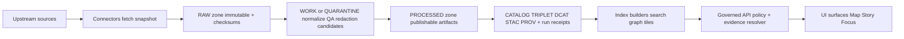

<!-- [KFM_META_BLOCK_V2]
doc_id: kfm://doc/26ea5ea7-f12a-40a8-a31c-87ccc7859395
title: data/published/datasets
type: standard
version: v1
status: draft
owners: TBD
created: 2026-02-24
updated: 2026-02-24
policy_label: public
related: []
tags: [kfm, data, published, datasets]
notes:
  - This README defines the contract for the Published Datasets zone.
  - Update owners/related links once repo paths are confirmed.
[/KFM_META_BLOCK_V2] -->

# data/published/datasets

**Purpose:** The **Published** zone for **promoted DatasetVersions** that are safe to serve via **governed APIs** and reference from **Map / Story / Focus** surfaces.


> **WARNING:** Treat everything under `data/published/` as **immutable**.  
> If something must change, **publish a new DatasetVersion** and promote it through the Promotion Contract.

---

## Quick nav

- [Where this fits](#where-this-fits)
- [What belongs here](#what-belongs-here)
- [What must not go here](#what-must-not-go-here)
- [Recommended on-disk layout](#recommended-on-disk-layout)
- [DatasetVersion bundle contract](#datasetversion-bundle-contract)
- [Promotion Contract summary](#promotion-contract-summary)
- [Verification checklist](#verification-checklist)
- [Deprecation policy](#deprecation-policy)
- [Repo alignment checklist](#repo-alignment-checklist)

---

## Where this fits

KFM’s canonical data flow (conceptual):



**This directory is the end of the promotion path:** it contains only dataset versions that have passed validation, have complete catalogs/lineage, and have an assigned policy label.

---

## What belongs here

### Acceptable inputs

This directory MAY contain **only** promoted, immutable **DatasetVersion bundles**, typically including:

- **Processed artifacts** (publishable formats)
- **Validated catalogs** (DCAT / STAC) and **lineage** (PROV)
- **Run receipts** for producing runs (including environment capture)
- **Checksums / digests** for all artifacts
- **Policy label assignment** and any required redaction/generalization decisions

---

## What must not go here

This directory MUST NOT contain:

- Raw acquisitions, scraped snapshots, or “source dumps”
- Work-in-progress outputs, notebooks, exploratory exports
- Unvalidated catalogs, missing provenance, or missing checksums
- Credentials/secrets of any kind
- Unreviewed sensitive-location content or restricted personal data

If licensing or sensitivity is unclear, the dataset belongs in **QUARANTINE**, not here.

---

## Recommended on-disk layout

> **NOTE:** This is a **recommended contract** for consistent review + reproducibility.
> If your repo already uses a different layout, align this README to the repo’s source-of-truth.

```text
data/published/datasets/
├─ README.md
├─ _index.json                         # (optional) fast lookup index of published dataset versions
├─ <dataset_id>/
│  ├─ README.md                        # (optional) human overview + version history
│  ├─ versions/
│  │  ├─ <dataset_version_id>/
│  │  │  ├─ manifest.json              # enumerates files, digests, sizes (canonical)
│  │  │  ├─ checksums.sha256           # sha256 sums for all shipped artifacts
│  │  │  ├─ run_receipt.json           # run metadata, inputs/outputs, env capture
│  │  │  ├─ validation_report.json     # QA results + thresholds + pass/fail
│  │  │  ├─ policy_decision.json       # policy_label + redaction/generalization notes
│  │  │  ├─ prov_bundle.jsonld         # PROV entities/activities/agents + links
│  │  │  ├─ dcat.dataset.jsonld        # dataset-level metadata (license, publisher, dists)
│  │  │  ├─ stac.collection.json       # spatial asset discovery (collection)
│  │  │  ├─ stac.items/                # (optional) item-level STAC
│  │  │  └─ data/                      # (optional) published payloads (pmtiles/parquet/cog/…)
│  └─ latest.json                      # (optional) pointer to latest promoted version
└─ _guards/
   └─ DO_NOT_EDIT_PUBLISHED.txt        # (optional) human guardrail
```

### Naming rules

- `dataset_id` SHOULD be stable and human-readable (lowercase, kebab/snake ok, no spaces).
- `dataset_version_id` MUST be immutable and SHOULD be derived from a stable `spec_hash` / deterministic versioning policy.
- Every file in a DatasetVersion SHOULD be content-addressable (digest present in `manifest.json` and/or `checksums.sha256`).

---

## DatasetVersion bundle contract

A DatasetVersion directory SHOULD be **self-contained** and **independently verifiable**.

### Minimum files

| Artifact | Why it exists | Expectation |
|---|---|---|
| `manifest.json` | Canonical file inventory (paths + digests + sizes) | MUST |
| `checksums.sha256` | Quick integrity verification | SHOULD |
| `run_receipt.json` | Reproducibility: inputs/outputs + environment capture | MUST |
| `validation_report.json` | QA evidence and thresholds | MUST |
| `policy_decision.json` | Governance decision and policy label | MUST |
| `prov_bundle.jsonld` | Lineage: entities/activities/agents | MUST |
| `dcat.dataset.jsonld` | Dataset-level metadata | SHOULD |
| `stac.collection.json` | Spatiotemporal discovery for assets | SHOULD |

<details>
<summary><strong>Proposed minimal JSON shapes (templates)</strong></summary>

These are intentionally small and MUST be aligned to the repo’s actual schemas.

### `validation_report.json` (template)
```json
{
  "dataset_version_id": "string",
  "run_id": "string",
  "generated_at": "2026-02-24T00:00:00Z",
  "summary": { "passed": true },
  "checks": [
    { "name": "schema", "passed": true, "details": {} },
    { "name": "geometry_validity", "passed": true, "details": {} }
  ],
  "thresholds": {
    "required_fields_present": 0.99,
    "geometry_valid": 0.999,
    "duplicate_rate": 0.001
  }
}
```

### `policy_decision.json` (template)
```json
{
  "dataset_version_id": "string",
  "policy_label": "public",
  "decision_id": "string",
  "decided_at": "2026-02-24T00:00:00Z",
  "obligations": [
    { "type": "attribution", "text": "…" }
  ],
  "sensitivity": {
    "has_sensitive_locations": false,
    "generalization": null
  }
}
```

### `manifest.json` (template)
```json
{
  "dataset_id": "string",
  "dataset_version_id": "string",
  "generated_at": "2026-02-24T00:00:00Z",
  "files": [
    { "path": "data/part-000.parquet", "sha256": "…", "bytes": 12345 }
  ]
}
```
</details>

---

## Promotion Contract summary

A dataset version promotion MUST be blocked unless **all required artifacts exist and validate**.

### Minimum gates (reference)

- **Gate A — Identity & versioning**
  - Dataset ID is stable
  - DatasetVersion ID is immutable and derived from a stable spec hash
- **Gate B — Licensing & rights metadata**
  - License is explicit and compatible
  - Rights holder + attribution requirements captured
  - If license is unclear: **fail closed** (stay quarantined)
- **Gate C — Sensitivity classification & redaction plan**
  - `policy_label` assigned
  - If sensitive: redaction/generalization plan exists and is recorded in lineage
- **Gate D — Catalog triplet validation**
  - DCAT exists + validates
  - STAC exists (if applicable) + validates
  - PROV exists + validates
  - Cross-links are present and resolvable
- **Gate E — Run receipt & checksums**
  - A run receipt exists for each producing run
  - Inputs/outputs enumerated with checksums
  - Environment captured (container image digest, parameters)
- **Gate F — Policy tests & contract tests**
  - OPA policy tests pass (fixtures-driven)
  - Evidence resolver can resolve at least one EvidenceRef for the dataset version in CI
  - API contracts and schemas validate
- **Gate G — Optional but recommended**
  - SBOM + build provenance for pipeline images and API/UI artifacts
  - Performance smoke checks (e.g., tile rendering, evidence resolve latency)
  - Accessibility smoke checks for UI evidence interactions

---

## Verification checklist

Before merging/publishing anything into this directory:

- [ ] `manifest.json` exists and lists **every** shipped artifact
- [ ] `checksums.sha256` validates against disk contents
- [ ] `run_receipt.json` exists and captures **inputs, outputs, and environment**
- [ ] `validation_report.json` exists and shows all gates passed
- [ ] `policy_decision.json` exists and assigns `policy_label`
- [ ] `prov_bundle.jsonld` exists and links transforms to inputs/outputs
- [ ] DCAT/STAC validate (if present) and cross-link to PROV + receipts

### Example integrity checks

> Adjust commands to the repo’s chosen tooling.

```bash
# verify checksums
sha256sum -c checksums.sha256

# spot-check manifest coverage (example)
jq -r '.files[].path' manifest.json | while read -r p; do test -f "$p"; done
```

---

## Deprecation policy

- Do **not** edit or delete published version directories.
- If a published version is later found to be incorrect, mark it **deprecated** via metadata (e.g., `policy_decision.json` or a version-level `deprecation.json`) and publish a **new** corrected DatasetVersion.
- Keep historical versions for traceability unless a governance decision explicitly requires removal.

---

## Repo alignment checklist

These are the smallest checks needed to turn this README from “recommended contract” into “confirmed repo truth”:

1. Confirm the actual on-disk layout under `data/published/datasets/`.
2. Confirm where the canonical schemas live for:
   - DCAT profile
   - STAC profile
   - PROV profile
   - run receipt + manifest + validation report
3. Confirm the CI gate(s) that enforce Promotion Contract requirements.
4. Update:
   - badge links (CI status)
   - owners
   - related links
   - any file naming conventions (if different)

---

_Back to top: [data/published/datasets](#datapublisheddatasets)_
