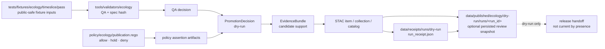

<!-- [KFM_META_BLOCK_V2]
doc_id: kfm://doc/NEEDS_VERIFICATION__data_published_ecology_dry_run_readme
title: data/published/ecology/dry-run
type: standard
version: v1
status: draft
owners: @bartytime4life
created: NEEDS_VERIFICATION__YYYY-MM-DD
updated: 2026-04-30
policy_label: NEEDS_VERIFICATION__public_or_restricted
related: [
  data/README.md,
  data/published/README.md,
  data/published/ecology/README.md,
  data/receipts/README.md,
  data/proofs/README.md,
  data/catalog/README.md,
  policy/ecology/publication.rego,
  schemas/contracts/v1/ecology/,
  tools/validators/ecology/,
  tests/fixtures/ecology/,
  .github/workflows/ecology-timeslice.yml
]
tags: [kfm, data, published, ecology, dry-run, evidence-bundle, promotion, stac, receipts]
notes: [
  "Exact doc_id, created date, policy label, active branch path presence, and leaf ownership still need live-repo verification.",
  "Owner is carried from surfaced broad KFM ownership patterns; verify exact data/published/ecology/dry-run coverage before merge.",
  "This README is written for an ecology time-slice dry-run publication lane; dry-run artifacts are not current public release by directory presence alone.",
  "Recent ecology time-slice workflow evidence shows PromotionDecision, EvidenceBundle, STAC item/collection/catalog, policy assertions, and dry-run receipt expectations; persistence under this exact path remains NEEDS VERIFICATION."
]
[/KFM_META_BLOCK_V2] -->

<a id="top"></a>

# `data/published/ecology/dry-run/`

Review-facing dry-run surface for ecology publication rehearsals that must remain evidence-backed, policy-checked, and non-current until promotion is explicitly completed.

> [!IMPORTANT]
> **Status:** experimental  
> **Document status:** draft  
> **Owners:** `@bartytime4life` *(leaf ownership NEEDS VERIFICATION)*  
> **Path:** `data/published/ecology/dry-run/README.md`  
> **Repo fit:** child README under [`../README.md`](../README.md), downstream of [`../../README.md`](../../README.md), [`../../../README.md`](../../../README.md), and root [`../../../../README.md`](../../../../README.md); coupled to [`../../../../data/receipts/README.md`](../../../../data/receipts/README.md), [`../../../../data/proofs/README.md`](../../../../data/proofs/README.md), [`../../../../data/catalog/README.md`](../../../../data/catalog/README.md), [`../../../../policy/README.md`](../../../../policy/README.md), [`../../../../schemas/contracts/README.md`](../../../../schemas/contracts/README.md), [`../../../../tests/README.md`](../../../../tests/README.md), and [`../../../../tools/validators/README.md`](../../../../tools/validators/README.md).  
> **Quick jumps:** [Scope](#scope) · [Repo fit](#repo-fit) · [Accepted inputs](#accepted-inputs) · [Exclusions](#exclusions) · [Current evidence snapshot](#current-evidence-snapshot) · [Directory tree](#directory-tree) · [Quickstart](#quickstart) · [Usage](#usage) · [Diagram](#diagram) · [Operating tables](#operating-tables) · [Task list](#task-list--definition-of-done) · [FAQ](#faq) · [Appendix](#appendix)

<div align="left">


</div>

---

## Scope

This directory documents and, when the active branch confirms the persistence convention, may hold **ecology publication dry-run snapshots**.

A dry-run snapshot is a release rehearsal. It can prove that a candidate ecology time-slice has a coherent validation trail, policy decision, evidence bundle, and catalog closure. It does **not** make the candidate current public truth just because files live below `data/published/`.

This lane is for reviewable, public-safe ecology publication rehearsals such as:

- ecology time-slice QA decisions;
- publication-policy assertion outputs;
- dry-run `PromotionDecision` artifacts;
- `EvidenceBundle` artifacts for a candidate ecology surface;
- STAC item, collection, and catalog outputs;
- reviewer-readable manifests that point to receipts, proofs, catalog objects, and source fixtures.

Ecology here is a **published-surface family**, not a replacement for the canonical flora, fauna, habitat, landcover, or species-occurrence domains. Domain-specific evidence and source-role boundaries still belong in their own source, processed, proof, policy, and schema lanes.

[Back to top](#top)

---

## Repo fit

| Relationship | Path or surface | Posture |
| --- | --- | --- |
| This README | `data/published/ecology/dry-run/README.md` | **PROPOSED / NEEDS VERIFICATION** in the mounted checkout |
| Parent publication lane | [`../../README.md`](../../README.md) | Expected publication family index |
| Ecology publication parent | [`../README.md`](../README.md) | Expected ecology publication index |
| Process memory | [`../../../../data/receipts/README.md`](../../../../data/receipts/README.md) | Run receipts and dry-run receipts should live there, not be confused with proofs |
| Release proof objects | [`../../../../data/proofs/README.md`](../../../../data/proofs/README.md) | EvidenceBundle, release/proof packs, rollback references |
| Catalog closure | [`../../../../data/catalog/README.md`](../../../../data/catalog/README.md) | STAC/DCAT/PROV-style outward metadata |
| Policy source | `../../../../policy/ecology/publication.rego` | Publication decision logic; path presence NEEDS VERIFICATION |
| Schemas | `../../../../schemas/contracts/v1/ecology/` | Time-slice, promotion, evidence, and STAC schemas; schema-home authority NEEDS VERIFICATION |
| Validators | `../../../../tools/validators/ecology/` | Time-slice validation, spec hash, policy assertion, promotion/evidence/catalog generators |
| Fixtures | `../../../../tests/fixtures/ecology/` | Public-safe time-slice and policy fixtures |
| CI workflow | `../../../../.github/workflows/ecology-timeslice.yml` | Ecology dry-run validation orchestration; active branch wiring NEEDS VERIFICATION |

> [!NOTE]
> This lane should stay **published-adjacent but not release-authoritative**. The release authority comes from validated promotion and proof objects, not from folder placement.

[Back to top](#top)

---

## Accepted inputs

Only place or reference artifacts here when they are **public-safe**, **dry-run labeled**, and connected to the ecology time-slice proof chain.

| Accepted item | Typical name | Required support |
| --- | --- | --- |
| Dry-run manifest | `manifest.json` or `dry_run_manifest.json` | `run_id`, `spec_hash`, candidate ref, artifact digests, dry-run state |
| QA decision | `ecology_timeslice_qa_decision.json` | Output from `tools/validators/ecology/validate_timeslice.py` or repo-equivalent validator |
| Policy assertions | `policy_assertions/*.assertion.json` | Expected `allow`, `hold`, and `deny` cases for `policy/ecology/publication.rego` |
| PromotionDecision dry-run | `promotion_decision.json` | Policy decision, candidate ref, receipt ref, and evidence bundle ref |
| EvidenceBundle | `evidence_bundle.json` | Candidate object ref, artifacts, policy ID, source role, publication state, catalog closure |
| STAC outputs | `stac_item.json`, `stac_collection.json`, `stac_catalog.json` | Valid schema checks and digest/candidate linkage |
| Checksums | `SHA256SUMS.txt` or manifest digests | Stable identity for every persisted artifact |
| Reviewer summary | `SUMMARY.md` | Human-readable dry-run state, gates, unresolved items, and rollback notes |

[Back to top](#top)

---

## Exclusions

| Do not place here | Where it belongs instead | Why |
| --- | --- | --- |
| RAW source files, live connector pulls, or upstream ecology data | `data/raw/`, source registry, or source-specific domain lanes | Raw data are not publication artifacts |
| WORK scratch files or intermediate build products | `data/work/` or CI temporary storage | Work products may be incomplete, invalid, or sensitive |
| Quarantined, denied, or sensitive records | `data/quarantine/` | This lane must not leak rejected or sensitive payloads |
| Canonical flora/fauna/habitat records | Domain-specific `data/processed/`, `data/proofs/`, and schema lanes | Ecology dry-run is a release rehearsal, not canonical truth |
| Exact sensitive species locations or unreviewed biodiversity geometries | Controlled-access domain lanes and redaction/generalization flows | Public-safe ecology outputs must fail closed |
| AI-generated summaries without resolved EvidenceBundle support | Governed API / Focus Mode proof lanes | Generation is interpretive, not authority |
| Receipts as proof substitutes | `data/receipts/` for receipts and `data/proofs/` for proofs | Process memory and release proof are separate trust objects |
| Current public aliases | Promotion-managed release lane | Dry-run snapshots must not silently become current public state |

[Back to top](#top)

---

## Current evidence snapshot

| Claim | Label | Basis |
| --- | --- | --- |
| This local ChatGPT workspace did not expose a mounted KFM checkout or this target README path. | **CONFIRMED** | Direct workspace inspection in this session |
| The recent ecology time-slice dry-run shape includes validators, policy assertions, PromotionDecision, EvidenceBundle, STAC outputs, and a dry-run receipt. | **CONFIRMED source pattern / NEEDS VERIFICATION in active repo** | Surfaced ecology workflow/source packet |
| Persistence under `data/published/ecology/dry-run/` is not directly proven by the available source packet. | **UNKNOWN** | Exact target path was not found as an existing file |
| The correct posture for this README is README-like plus standard doc metadata. | **INFERRED** | Target is a directory README under a trust-bearing data lane |
| The directory should not become a public-current alias by folder placement. | **CONFIRMED doctrine / PROPOSED implementation rule** | KFM lifecycle and promotion law |

[Back to top](#top)

---

## Directory tree

Current mounted tree: **NEEDS VERIFICATION**.

Expected dry-run shape if the active repo persists ecology dry-run outputs here:

```text
data/published/ecology/dry-run/
├── README.md
└── runs/
    └── <run_id>/
        ├── manifest.json
        ├── SUMMARY.md
        ├── SHA256SUMS.txt
        ├── ecology_timeslice_qa_decision.json
        ├── promotion_decision.json
        ├── evidence_bundle.json
        ├── catalog/
        │   ├── stac_item.json
        │   ├── stac_collection.json
        │   └── stac_catalog.json
        └── policy_assertions/
            ├── publication_allow_timeslice_pass.assertion.json
            ├── publication_allow_with_fallback.assertion.json
            ├── publication_hold_timeslice_review.assertion.json
            ├── publication_deny_timeslice_reject.assertion.json
            ├── publication_deny_missing_receipt.assertion.json
            ├── publication_deny_missing_fallback.assertion.json
            └── publication_deny_incomplete_tiles_no_steward.assertion.json
```

> [!WARNING]
> Do not add a `current/` alias under this directory unless the promotion/release convention explicitly allows a dry-run current pointer. A dry-run candidate may be review-complete and still not be public-current.

[Back to top](#top)

---

## Quickstart

### Safe inspection

```bash
# Run from the repository root.
git status --short
git branch --show-current

find data/published/ecology/dry-run -maxdepth 4 -type f | sort || true
find data/receipts/runs/dry-run -maxdepth 3 -type f | sort || true
```

### Ecology dry-run validation chain

The active branch may wire this through `.github/workflows/ecology-timeslice.yml`. Run or adapt these only after confirming that the referenced files exist.

```bash
# 1. Parse the ecology publication policy.
opa parse policy/ecology/publication.rego

# 2. Validate the ecology time-slice fixture.
python tools/validators/ecology/validate_timeslice.py \
  --qa-summary tests/fixtures/ecology/timeslice/pass/qa_summary.json \
  --tileset-metadata tests/fixtures/ecology/timeslice/pass/tileset_metadata.json \
  --out /tmp/ecology_timeslice_qa_decision.json

# 3. Verify deterministic identity inputs.
python tools/validators/ecology/hash_spec.py \
  tests/fixtures/ecology/timeslice/pass/tileset_metadata.json

# 4. Generate a dry-run PromotionDecision.
python tools/validators/ecology/generate_promotion_decision.py \
  --policy-decision allow \
  --candidate kfm://tileset/ecology/example-pass \
  --receipt-ref kfm://receipt/run/ecology/dry-run \
  --evidence-bundle-url kfm://evidence/ecology/example-pass-timeslice \
  --out /tmp/promotion_decision.json

# 5. Build the EvidenceBundle.
python tools/validators/ecology/build_evidence_bundle.py \
  --bundle-id kfm://evidence/ecology/example-pass-timeslice \
  --artifact qa_decision=/tmp/ecology_timeslice_qa_decision.json \
  --artifact promotion_decision=/tmp/promotion_decision.json \
  --object-ref kfm://tileset/ecology/example-pass \
  --policy-id kfm://policy/ecology/publication \
  --surface public \
  --publication-state ready \
  --source-role AUTHORITATIVE_LAYER \
  --claim-status CONFIRMED \
  --catalog-closure \
  --no-exact-geometry-present \
  --public-geometry-policy allow_exact \
  --public-visibility public \
  --out /tmp/evidence_bundle.json
```

### Required artifact check

```bash
required_artifacts=(
  "/tmp/ecology_timeslice_qa_decision.json"
  "/tmp/promotion_decision.json"
  "/tmp/evidence_bundle.json"
  "/tmp/stac_item.json"
  "/tmp/stac_collection.json"
  "/tmp/stac_catalog.json"
)

for artifact in "${required_artifacts[@]}"; do
  if [ ! -s "$artifact" ]; then
    echo "ERROR: required artifact missing or empty: $artifact"
    exit 1
  fi

  python -m json.tool "$artifact" > /dev/null
done
```

[Back to top](#top)

---

## Usage

Use this lane as a **review handoff surface**:

1. Generate the dry-run artifacts through the ecology time-slice workflow or equivalent local validator chain.
2. Confirm policy assertions cover positive, hold, and deny cases.
3. Confirm the `PromotionDecision` and `EvidenceBundle` reference the same candidate.
4. Confirm STAC item, collection, and catalog outputs validate against the ecology schemas.
5. Persist only public-safe dry-run outputs, or keep generated artifacts in CI if persistence convention is not approved.
6. Record the run receipt under `data/receipts/runs/dry-run/`, not as a proof substitute.
7. Keep the dry-run snapshot immutable once reviewed; create a new run folder for a changed candidate.

[Back to top](#top)

---

## Diagram



[Back to top](#top)

---

## Operating tables

### Lifecycle responsibility

| Stage | Belongs in this directory? | Notes |
| --- | --- | --- |
| RAW | No | Raw ecology inputs belong in source/domain-specific RAW lanes. |
| WORK | No | Scratch and candidate computation belong in `data/work/` or CI temp. |
| QUARANTINE | No | Invalid, sensitive, denied, or unresolved material must not be placed here. |
| PROCESSED | No | Normalized ecology/domain artifacts belong in processed/domain lanes. |
| CATALOG | Reference only | STAC/DCAT/PROV outputs may be referenced or copied as public-safe dry-run catalog artifacts if policy permits. |
| PROOFS | Reference only | EvidenceBundle and proof packs belong under `data/proofs/`; a dry-run copy here must not become the proof authority. |
| RECEIPTS | Reference only | Run receipts belong under `data/receipts/`. |
| PUBLISHED dry-run | Yes | Public-safe release rehearsal artifacts may live here after validation. |
| PUBLISHED current | No | Current release state must be controlled by promotion/release policy, not this dry-run folder. |

### Gate matrix

| Gate | Required signal | Fail-closed behavior |
| --- | --- | --- |
| Schema gate | Required JSON validates against `schemas/contracts/v1/ecology/*` | `ERROR` or block dry-run persistence |
| Policy gate | `policy/ecology/publication.rego` returns expected `allow`, `hold`, or `deny` | block or preserve non-promoting result for review |
| Evidence gate | `EvidenceBundle` resolves candidate support and artifact refs | `ABSTAIN` or block release handoff |
| Catalog gate | STAC item, collection, and catalog validate and link to candidate | `DENY` release handoff |
| Rights/sensitivity gate | No exact sensitive geometry or unresolved redistribution burden | `DENY` or quarantine upstream |
| Receipt gate | `run_receipt` records inputs, outputs, policy results, and catalog refs | block review completion |
| Alias gate | No current alias is updated by dry-run persistence | block if dry-run mutates public-current state |

### Artifact map

| Artifact | Expected source | Expected home |
| --- | --- | --- |
| `ecology_timeslice_qa_decision.json` | `validate_timeslice.py` | dry-run snapshot or CI artifact |
| `promotion_decision.json` | `generate_promotion_decision.py` | dry-run snapshot; proof copy if promoted |
| `evidence_bundle.json` | `build_evidence_bundle.py` | `data/proofs/` authority; optional dry-run review copy |
| `stac_item.json` | `generate_stac_item.py` | `data/catalog/` authority; optional dry-run review copy |
| `stac_collection.json` | `generate_stac_collection.py` | `data/catalog/` authority; optional dry-run review copy |
| `stac_catalog.json` | `build_stac_catalog.py` | `data/catalog/` authority; optional dry-run review copy |
| `run_receipt.json` | workflow receipt step | `data/receipts/runs/dry-run/` |
| `*.assertion.json` | `assert_rego_decision.py` | CI artifact or dry-run snapshot policy assertion folder |

[Back to top](#top)

---

## Task list / Definition of done

### README readiness

- [ ] Exact path `data/published/ecology/dry-run/README.md` exists in the active checkout.
- [ ] Meta block placeholders are resolved or intentionally left with review notes.
- [ ] Leaf ownership is verified against `.github/CODEOWNERS`.
- [ ] Relative links resolve from this directory.
- [ ] Parent `data/published/ecology/README.md` either exists or this README records the missing parent as a follow-up.
- [ ] The active branch confirms whether dry-run artifacts are persisted here or only uploaded as CI artifacts.

### Dry-run snapshot readiness

- [ ] Dry-run folder uses an immutable `runs/<run_id>/` subfolder.
- [ ] Candidate has stable `spec_hash` or equivalent deterministic identity.
- [ ] QA decision is present and valid JSON.
- [ ] At least seven policy assertion artifacts exist for allow, hold, and deny cases.
- [ ] PromotionDecision is present and schema-valid.
- [ ] EvidenceBundle is present, schema-valid, and points to the same candidate.
- [ ] STAC item, collection, and catalog are present and schema-valid.
- [ ] Run receipt exists under `data/receipts/runs/dry-run/`.
- [ ] No RAW, WORK, QUARANTINE, exact sensitive geometry, or live connector output is stored here.
- [ ] No current public alias is changed by the dry-run.
- [ ] Reviewer summary states whether the candidate is **dry-run only**, **ready for release handoff**, **held**, or **denied**.

[Back to top](#top)

---

## FAQ

### Is this a public release directory?

No. This is a dry-run publication surface. A candidate may be public-safe and review-ready without being current public truth. Current release state needs a promotion/release object and any repo-specific alias or publication mechanism.

### Can a dry-run PromotionDecision say `PROMOTE`?

Yes, but only as a dry-run signal unless the actual promotion workflow, release manifest, proof pack, and public alias rules complete. In this directory, `PROMOTE` means the rehearsal passed its policy shape; it does not mean the candidate is live.

### Can UI or Focus Mode read from here?

Only through governed release-safe contracts after EvidenceBundle resolution. UI surfaces should not reconstruct evidence from raw artifacts, and Focus Mode must not treat dry-run files as uncited authority.

### Can exact ecology geometry be stored here?

Only if the candidate is explicitly public-safe, rights-cleared, sensitivity-reviewed, and supported by policy. Sensitive species or unresolved biodiversity records must fail closed before this lane.

[Back to top](#top)

---

## Appendix

<details>
<summary>Illustrative dry-run manifest skeleton</summary>

```json
{
  "schema_version": "v1",
  "object_type": "ecology_published_dry_run_manifest",
  "run_id": "kfm://run/ecology/dry-run/<run_id>",
  "dry_run": true,
  "publication_state": "dry_run",
  "candidate_ref": "kfm://tileset/ecology/example-pass",
  "spec_hash": "NEEDS_VERIFICATION",
  "receipt_ref": "data/receipts/runs/dry-run/run_receipt.json",
  "artifacts": {
    "qa_decision": "ecology_timeslice_qa_decision.json",
    "promotion_decision": "promotion_decision.json",
    "evidence_bundle": "evidence_bundle.json",
    "stac_item": "catalog/stac_item.json",
    "stac_collection": "catalog/stac_collection.json",
    "stac_catalog": "catalog/stac_catalog.json",
    "policy_assertions": "policy_assertions/"
  },
  "gates": {
    "schema_valid": "NEEDS_VERIFICATION",
    "policy_decision": "NEEDS_VERIFICATION",
    "evidence_bundle_resolved": "NEEDS_VERIFICATION",
    "catalog_closed": "NEEDS_VERIFICATION",
    "public_safe": "NEEDS_VERIFICATION"
  },
  "notes": [
    "Illustrative only. Replace with the repo-approved schema before treating this as a contract."
  ]
}
```

</details>

<details>
<summary>Review checklist for maintainers</summary>

- Confirm active branch has the ecology validator, policy, schema, fixture, and workflow paths referenced here.
- Confirm whether the workflow persists dry-run outputs under `data/published/ecology/dry-run/` or only emits them as CI artifacts.
- Confirm receipt/proof/catalog homes before duplicating artifacts here.
- Confirm `policy_label` for this README and for dry-run payloads.
- Confirm whether dry-run snapshots can be public in the repository, or whether they require restricted access because they contain candidate ecology payloads.
- Confirm sensitive-location policy for all ecology candidates before adding real biodiversity data.
- Confirm that the dry-run cannot update a release alias, public-current path, or client-facing API route by accident.

</details>

[Back to top](#top)
