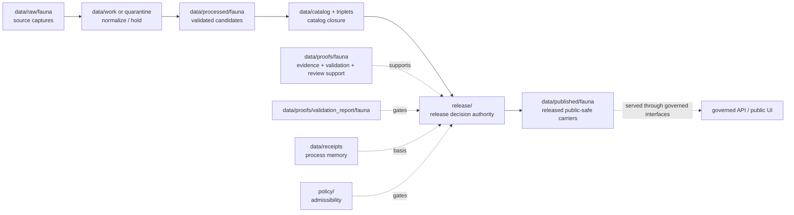

<!-- [KFM_META_BLOCK_V2]
doc_id: kfm://data/published/fauna/readme
title: data/published/fauna README
type: directory-readme
version: v0.1
status: draft
owners:
  - TODO(owner): data steward
  - TODO(owner): fauna domain steward
  - TODO(owner): publication steward
  - TODO(owner): sensitivity reviewer
  - TODO(owner): release steward
created: 2026-06-25
updated: 2026-06-25
policy_label: restricted-review
path: data/published/fauna/README.md
related:
  - ../README.md
  - ../../README.md
  - ../../raw/fauna/README.md
  - ../../work/fauna/README.md
  - ../../quarantine/fauna/README.md
  - ../../processed/fauna/README.md
  - ../../catalog/domain/fauna/README.md
  - ../../triplets/fauna/README.md
  - ../../proofs/fauna/README.md
  - ../../proofs/proof_pack/fauna/README.md
  - ../../proofs/validation_report/fauna/README.md
  - ../../receipts/README.md
  - ../api_payloads/fauna/README.md
  - ../../../release/README.md
  - ../../../docs/domains/fauna/ARCHITECTURE.md
  - ../../../docs/domains/fauna/MAP_UI_CONTRACTS.md
  - ../../../docs/doctrine/directory-rules.md
  - ../../../docs/doctrine/lifecycle-law.md
  - ../../../docs/doctrine/trust-membrane.md
  - ../../../contracts/README.md
  - ../../../schemas/README.md
  - ../../../policy/README.md
notes:
  - "Directory README for released, public-safe Fauna carriers. It replaces a greenfield stub."
  - "This path is downstream of release decisions. It does not itself approve release, define policy, prove claims, or replace ReleaseManifest, EvidenceBundle, ProofPack, receipts, catalog records, schemas, or contracts."
  - "Fauna is a sensitive lane. Public carriers must preserve public-safe posture, evidence support, taxonomic identity, source role, review state, correction path, and rollback support."
[/KFM_META_BLOCK_V2] -->

<a id="top"></a>

# `data/published/fauna/`

> Published Fauna lane for **released, public-safe animal biodiversity carriers**: generalized/public-safe summaries, approved map/API/report/export carriers, range or indicator products, public indexes, and retired artifacts that have passed KFM release gates.


> [!IMPORTANT]
> **Status:** `draft`  
> **Owners:** `TODO(owner): data steward` · `TODO(owner): fauna domain steward` · `TODO(owner): publication steward` · `TODO(owner): sensitivity reviewer` · `TODO(owner): release steward`  
> **Path:** `data/published/fauna/README.md`  
> **Truth posture:** CONFIRMED target path and Fauna domain/UI docs from current repo evidence / PROPOSED child layout and instance naming / NEEDS VERIFICATION for emitted published artifacts, release manifests, schemas, validators, CI checks, and governed API routes.

> [!WARNING]
> Nothing is public just because it is in this folder. Published Fauna artifacts require release authority, EvidenceBundle support, catalog closure, validation, policy state, review state where required, correction path, and rollback target. Keep release decisions in `release/`, proof support in `data/proofs/`, catalog records in `data/catalog/`, and process memory in `data/receipts/`.

---

## Quick jumps

| Section | Use it for |
|---|---|
| [1. Scope](#1-scope) | What this published lane is for. |
| [2. Repo fit](#2-repo-fit) | How this path relates to lifecycle and release authority. |
| [3. Accepted artifacts](#3-accepted-artifacts) | What may live here after release. |
| [4. Exclusions](#4-exclusions) | What must stay out. |
| [5. Publication gates](#5-publication-gates) | Minimum support before an artifact is published. |
| [6. Fauna public-surface rules](#6-fauna-public-surface-rules) | Domain-specific safe-publication rules. |
| [7. Suggested layout](#7-suggested-layout) | Proposed child structure and naming. |
| [8. Lifecycle relationship](#8-lifecycle-relationship) | RAW → PUBLISHED placement. |
| [9. Maintenance checklist](#9-maintenance-checklist) | Checks before adding or changing artifacts. |
| [10. Definition of done](#10-definition-of-done) | What remains before maturity. |

---

## 1. Scope

`data/published/fauna/` is the Fauna domain's public-safe materialization lane. It should contain only artifacts that have already passed KFM promotion gates and are tied to release authority.

This lane may hold released carriers such as:

- public-safe animal biodiversity summaries;
- generalized/public-safe range, seasonal, richness, abundance, monitoring, health, or invasive-context carriers;
- released taxonomic, conservation-status, or source-role summaries safe for the declared audience;
- approved map-layer files, API payload snapshots, report carriers, export packages, tile/package carriers, or index manifests;
- public release notes that point back to release, catalog, proof, review, and rollback records; and
- retired or superseded public artifacts with correction, withdrawal, or rollback references.

This lane is downstream. It should not admit raw source captures, work candidates, quarantine holds, processed candidates, catalog drafts, proof objects, receipts, policy logic, release decisions, restricted source material, steward-only detail, or unreleased model/AI outputs.

[Back to top](#top)

---

## 2. Repo fit

| Neighbor | Role | Boundary |
|---|---|---|
| [`../../raw/fauna/`](../../raw/fauna/) | Source captures. | Never public-readable. |
| [`../../work/fauna/`](../../work/fauna/) | Normalization workspace. | Never public-readable. |
| [`../../quarantine/fauna/`](../../quarantine/fauna/) | Held or unsafe material. | Never public-readable. |
| [`../../processed/fauna/`](../../processed/fauna/) | Validated normalized candidates. | Upstream of catalog and release, not public by itself. |
| [`../../catalog/domain/fauna/`](../../catalog/domain/fauna/) | Fauna catalog records. | Discovery/lineage carrier; not release authority. |
| [`../../triplets/fauna/`](../../triplets/fauna/) | Fauna graph/triplet projection. | Upstream or sibling projection, not public by itself. |
| [`../../proofs/fauna/`](../../proofs/fauna/) | Fauna proof support. | Evidence and proof support; not published carrier. |
| [`../../proofs/validation_report/fauna/`](../../proofs/validation_report/fauna/) | Fauna validation reports. | Gate support, not publication authority. |
| [`../../receipts/`](../../receipts/) | Process memory. | Receipts say what ran; they do not publish. |
| [`../api_payloads/fauna/`](../api_payloads/fauna/) | Released API-payload carriers. | Child/sibling carrier lane for API-shaped outputs. |
| [`../../../release/`](../../../release/) | Release decisions, manifests, correction, withdrawal, rollback, signatures. | Publication authority lives here. |
| [`../../../contracts/`](../../../contracts/) | Semantic meaning. | Published artifacts conform to contracts; they do not define them. |
| [`../../../schemas/`](../../../schemas/) | Machine shape. | Published artifacts validate against schemas; schemas live elsewhere. |
| [`../../../policy/`](../../../policy/) | Admissibility. | Published artifacts carry policy outcome refs; policy rules live elsewhere. |

> [!NOTE]
> `data/published/README.md` is still a greenfield parent stub at time of authoring. This README documents the Fauna sublane without claiming the parent published-data contract is complete.

[Back to top](#top)

---

## 3. Accepted artifacts

Use this directory only for release-linked, public-safe artifacts.

| Artifact type | Suggested placement | Required support |
|---|---|---|
| Released public map carrier | `layers/<release_id>/<layer_slug>.*` | ReleaseManifest, EvidenceBundle refs, policy decision, validation report, review refs, rollback target. |
| Released API payload snapshot | `api_payloads/<release_id>/<payload_slug>.json` | Schema validation, release refs, proof refs, correction path. |
| Released report carrier | `reports/<release_id>/<report_slug>.md` or `.json` | Citations, EvidenceBundle refs, release refs, review refs where required. |
| Released export package | `exports/<release_id>/<export_slug>.*` | Audience class, schema/version, policy state, release refs, rollback target. |
| Released public summary | `public_summaries/<release_id>/<summary_slug>.json` | Public-safe posture, evidence refs, review refs where required. |
| Released public index | `indexes/published-fauna-index.json` | Points to release-approved artifacts only. |
| Superseded public artifact | `retired/<release_id>/<artifact_slug>.*` | Supersession, correction, withdrawal, or rollback reference. |

[Back to top](#top)

---

## 4. Exclusions

| Excluded material | Correct home |
|---|---|
| RAW source payloads, vendor exports, citizen-science exports, monitoring logs, media, telemetry, or source-system dumps | `data/raw/fauna/` |
| Working candidates or failed validation material | `data/work/fauna/` or `data/quarantine/fauna/` |
| Processed normalized data | `data/processed/fauna/` |
| Catalog records or release-candidate catalog entries | `data/catalog/` |
| Triplets or graph projection data | `data/triplets/` |
| EvidenceBundle, ValidationReport, ProofPack, citation validation, or review proof | `data/proofs/` child lanes |
| Receipts, transform receipts, redaction/generalization receipts, model-run receipts, AI receipts | `data/receipts/` or approved proof/receipt homes |
| ReleaseManifest, PromotionDecision, RollbackCard, CorrectionNotice, WithdrawalNotice, signatures | `release/` |
| Policy logic | `policy/` |
| Machine schemas | `schemas/` |
| Semantic contracts | `contracts/` |
| Restricted ecological source material or steward-only details | Restricted lifecycle stores only; publish public-safe derivatives here after release gates |
| Unreviewed AI summaries or model outputs | Governed AI/review paths; publish only through release gates |

[Back to top](#top)

---

## 5. Publication gates

Before a Fauna artifact is placed here as current public output, verify:

- release authority exists under `release/`;
- EvidenceBundle refs resolve for every consequential claim;
- validation reports passed or recorded finite non-pass outcomes with reasons;
- catalog closure exists for the released artifact;
- policy decisions allow the public audience class;
- review records exist where required by sensitivity, rights, source terms, or materiality;
- taxonomic identity, source role, evidence support, time scope, uncertainty, caveats, and public-safe posture are preserved;
- public-safe transform support exists where needed;
- correction and rollback paths are recorded; and
- digests or integrity refs bind the released artifact to the release record.

If any gate is unresolved, the artifact should remain upstream or be held; it should not be copied here as a workaround.

[Back to top](#top)

---

## 6. Fauna public-surface rules

Fauna public surfaces must preserve the domain's fail-closed, evidence-first posture.

| Rule | Public posture |
|---|---|
| Public-safe by design | Published files are visible outputs, not root truth, policy, review, or release authority. |
| Taxonomy is explicit | Public carriers preserve taxon identity, source authority, and unresolved-conflict posture where material. |
| Evidence is mandatory | Claims require EvidenceBundle support and citation posture. Missing support means abstain or hold. |
| Source role is preserved | Candidate, observed, regulatory, modeled, aggregate, administrative, and synthetic roles must not collapse. |
| Public/restricted split is preserved | Public carriers must not include restricted source material or steward-only details. |
| Transform support is auditable | Public-safe transformations must be traceable through proof or receipt references where required. |
| Cross-lane context stays owned | Habitat, Flora, Hydrology, Soil, Agriculture, Hazards, Roads, People/Land, and Settlement context keep their own truth. |
| AI is not root truth | AI summaries can consume released evidence but cannot replace EvidenceBundles, validation, release, or review. |
| Corrections are expected | Public artifacts must support correction, supersession, withdrawal, and rollback. |

[Back to top](#top)

---

## 7. Suggested layout

```text
data/published/fauna/
├── README.md
├── layers/
│   └── <release_id>/
├── api_payloads/
│   └── <release_id>/
├── reports/
│   └── <release_id>/
├── exports/
│   └── <release_id>/
├── public_summaries/
│   └── <release_id>/
├── indexes/
│   └── published-fauna-index.json
└── retired/
    └── <release_id>/
```

Suggested deterministic file names:

```text
fauna.published.<artifact_family>.<scope>.<release_id>.<short_hash>.<ext>
```

Examples:

```text
fauna.published.layer.public-summary.release-20260625.0123abcd.geojson
fauna.published.api_payload.range-summary.release-20260625.89ab4567.json
fauna.published.report.biodiversity-context.release-20260625.4567cdef.md
```

This layout is PROPOSED until validated by contracts, schemas, fixtures, and release tooling.

[Back to top](#top)

---

## 8. Lifecycle relationship



Published files are downstream carriers. Release state is governed by release records, not by path alone.

[Back to top](#top)

---

## 9. Maintenance checklist

Before adding or changing a file under this lane, verify:

- [ ] The artifact is release-approved and public-safe for the intended audience.
- [ ] The release record exists under `release/` and points to this artifact.
- [ ] The artifact has EvidenceBundle, catalog, validation, policy, review, receipt, correction, and rollback refs where required.
- [ ] Taxonomic identity, source role, evidence support, time scope, uncertainty, caveats, and public-safe posture are preserved.
- [ ] Restricted source material and steward-only details are absent from public carriers.
- [ ] Public-safe transforms are traceable where required.
- [ ] The artifact does not duplicate RAW, WORK, QUARANTINE, PROCESSED, proof, receipt, catalog, schema, contract, or policy authority.
- [ ] The artifact has a digest or integrity reference.
- [ ] Public clients consume it through governed interfaces or approved released artifact paths.

[Back to top](#top)

---

## 10. Definition of done

This lane is operationally mature when:

- [ ] `data/published/README.md` defines the parent published-data contract.
- [ ] Fauna published artifact contracts and schemas exist under approved homes.
- [ ] Release tooling writes or verifies published Fauna artifacts only after release authority is present.
- [ ] Validators block unreleased candidates, missing EvidenceBundles, missing release refs, missing rollback, unresolved taxonomic identity, public/restricted collapse, source-role collapse, missing transform references, unsafe public carriers, and missing review state.
- [ ] Valid and invalid fixtures cover public layer, API payload, report, export, public summary, corrected release, superseded release, and rollback target.
- [ ] Governed API or released-artifact routes are documented and tested.
- [ ] A synthetic no-network Fauna release demonstrates raw source → processed candidate → catalog/proof closure → release manifest → published artifact → governed API/public UI → correction/rollback traceability.

---

## Maintainer note

Published Fauna artifacts can expose trust problems quickly because users see them through map clicks, Evidence Drawer, Focus Mode, exports, and reports. Keep them boring, citable, public-safe, transform-aware, audience-aware, and reversible. If evidence, taxonomy, validation, policy, review, release, correction, or rollback support is incomplete, keep the artifact upstream instead of placing it here.
