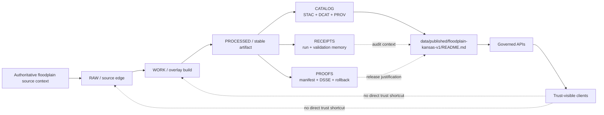

<!-- [KFM_META_BLOCK_V2]
doc_id: kfm://doc/NEEDS-VERIFICATION-floodplain-kansas-v1-readme
title: floodplain-kansas-v1
type: standard
version: v1
status: draft
owners: @bartytime4life
created: YYYY-MM-DD
updated: YYYY-MM-DD
policy_label: public
related: [../README.md, ../../catalog/README.md, ../../proofs/README.md, ../../receipts/README.md, <NEEDS_VERIFICATION: ../../registry/datasets/floodplain-kansas.yaml>, <NEEDS_VERIFICATION: ../../work/overlays/floodplain-kansas/stac-item.json>, <NEEDS_VERIFICATION: ../../catalog/stac/overlays/floodplain-kansas/v1/item.json>, <NEEDS_VERIFICATION: ../../catalog/prov/overlays/floodplain-kansas/v1/prov.json>]
tags: [kfm, data, published, floodplain, kansas]
notes: [Requested target path is data/published/floodplain-kansas-v1/README.md; current-session corpus confirms the floodplain-kansas-v1 overlay identity and release-candidate metadata, but live mounted-branch presence of this dataset-version directory still needs verification.]
[/KFM_META_BLOCK_V2] -->

<a id="top"></a>

# floodplain-kansas-v1

Release-backed README companion for the public-safe Kansas floodplain overlay materialization surface.

> **Status:** `experimental`  
> **Doc state:** `draft`  
> **Owners:** `@bartytime4life`  
> **Path target:** `data/published/floodplain-kansas-v1/README.md`  
> **Repo fit:** child release companion under `data/published/`; downstream of `PROCESSED + CATALOG + proof` closure; upstream of governed APIs and trust-visible clients  
> **Quick jump:** [Scope](#scope) · [Repo fit](#repo-fit) · [Current evidence snapshot](#current-evidence-snapshot) · [Accepted inputs](#accepted-inputs) · [Exclusions](#exclusions) · [Directory tree](#directory-tree) · [Quickstart](#quickstart) · [Usage](#usage) · [Diagram](#diagram) · [Reference tables](#reference-tables) · [Task list](#task-list) · [FAQ](#faq) · [Appendix](#appendix)


> [!IMPORTANT]
> This README documents a **release companion surface**, not the source of truth itself.
>
> In KFM, publication is a **governed state first**. This file should help reviewers and maintainers understand one released overlay version without collapsing receipts, proofs, catalog closure, and upstream processed authority into a single folder.

> [!NOTE]
> The strongest dataset-specific evidence currently surfaced in-session is a fresh promotion-style corpus packet for `overlay:floodplain-kansas` / `floodplain-kansas-v1`. That packet is strong enough to ground identity, extent, policy posture, and likely adjacent artifacts. It is **not** direct mounted-branch proof that this exact directory already exists.

> [!WARNING]
> Do **not** read this README as proof of:
>
> - a checked-in live subtree under `data/published/floodplain-kansas-v1/`
> - a currently mounted `DCAT` JSON file path for this dataset version
> - active workflow enforcement on the target branch
> - a real-time flood alert or inundation product
>
> Those items remain **NEEDS VERIFICATION** unless the branch checkout proves them directly.

---

## Scope

`floodplain-kansas-v1` is the intended dataset-version companion for a **Kansas floodplain overlay release** that has already crossed the KFM trust boundary strongly enough to be described at the `PUBLISHED` edge.

This README is for four jobs:

1. explain what this version is supposed to represent,
2. keep the release-facing surface readable in GitHub,
3. point reviewers toward the adjacent trust objects that actually justify publication,
4. keep current certainty and uncertainty visible.

In KFM terms, this directory is **downstream** of the governing lifecycle:

`Source edge -> RAW -> WORK / QUARANTINE -> PROCESSED -> CATALOG -> PUBLISHED`

It should therefore stay strong on release identity, policy-safe scope, caveats, and lineage pointers, while staying deliberately weak on invented subtree detail.

[Back to top](#top)

---

## Repo fit

### What this directory is for

This folder is the likely place for a **human-readable per-version companion** to a release-backed overlay named `floodplain-kansas-v1`.

It is a good fit here when all of the following are true:

- the overlay already has a stable release identity,
- the scope is public-safe,
- the release is linked to catalog closure,
- proof objects and receipts remain adjacent rather than hidden,
- correction and rollback can stay visible.

### What this directory is not for

This folder should **not** become:

- the canonical home for raw or work-stage source material,
- the place where policy is authored,
- the place where DSSE bundles or proof packs are flattened into prose,
- a substitute for `STAC + DCAT + PROV`,
- or a backdoor public API.

### Path and adjacent surfaces

| Relation | Surface | Status | Why it matters |
|---|---|---:|---|
| Parent | `../README.md` | **CONFIRMED in public-main documentation draft** | The parent published-scope README defines publication as a governed state first. |
| Adjacent | `../../proofs/README.md` | **CONFIRMED in public-main documentation draft** | Proof packs, manifests, attestations, rollback, and correction trace remain separate. |
| Adjacent | `../../receipts/README.md` | **CONFIRMED in public-main documentation draft** | Receipts remain process memory, not release proof. |
| Adjacent | `../../catalog/README.md` | **CONFIRMED in public-main documentation draft** | Catalog closure is a separate trust surface. |
| Likely upstream counterpart | `../../work/overlays/floodplain-kansas/stac-item.json` | **CORPUS-CONFIRMED / branch path NEEDS VERIFICATION** | The promotion packet points to this object as the canonical spec input for `spec_hash`. |
| Likely upstream counterpart | `../../work/overlays/floodplain-kansas/assets/floodplain.geojson` | **CORPUS-CONFIRMED / branch path NEEDS VERIFICATION** | The promotion packet names this as the overlay asset. |
| Likely proof counterpart | `../../proofs/overlays/floodplain-kansas/v1/manifest.json` | **CORPUS-CONFIRMED / branch path NEEDS VERIFICATION** | Release evidence should stay adjacent to the published companion. |
| Likely proof counterpart | `../../proofs/overlays/floodplain-kansas/v1/attestation.dsse.json` | **CORPUS-CONFIRMED / branch path NEEDS VERIFICATION** | Attestation is part of release proof, not README-owned truth. |
| Likely catalog counterpart | `../../catalog/stac/overlays/floodplain-kansas/v1/item.json` | **CORPUS-CONFIRMED / branch path NEEDS VERIFICATION** | STAC is the outward asset description surface named in the packet. |
| Likely catalog counterpart | `../../catalog/prov/overlays/floodplain-kansas/v1/prov.json` | **CORPUS-CONFIRMED / branch path NEEDS VERIFICATION** | PROV remains the lineage surface for the promoted overlay. |
| Registry counterpart | `../../registry/datasets/floodplain-kansas.yaml` | **CORPUS-CONFIRMED / branch path NEEDS VERIFICATION** | Identity and governance should originate upstream in registry material. |

[Back to top](#top)

---

## Current evidence snapshot

### Dataset-version facts surfaced in the corpus

| Topic | Value | Status | Reading rule |
|---|---|---:|---|
| Overlay identity | `overlay:floodplain-kansas` | **CONFIRMED in corpus packet** | Strong candidate/release identity signal. |
| STAC item identity | `floodplain-kansas-v1` | **CONFIRMED in corpus packet** | Good title and folder-alignment anchor for this README. |
| Release identity | `overlay-floodplain-kansas-v1` | **CONFIRMED in corpus packet** | Release-facing object identity is explicit. |
| CRS | `EPSG:4326` | **CONFIRMED in corpus packet** | Safe to describe as the release-candidate CRS. |
| Bounding box | `[-102.05, 36.99, -94.58, 40.0]` | **CONFIRMED in corpus packet** | Appropriate as the current release-candidate spatial extent. |
| Spatial scope | `kansas` | **CONFIRMED in corpus packet** | Safe to describe as Kansas-wide release scope. |
| Temporal scope | `2026-01-01T00:00:00Z` → `2026-12-31T23:59:59Z` | **CONFIRMED in corpus packet** | Current release-candidate temporal window. |
| As-of marker | `2026-04-13T00:00:00Z` | **CONFIRMED in corpus packet** | Important freshness cue for this version. |
| Policy label | `public` | **CONFIRMED in corpus packet** | Supports a public-safe published companion. |
| Rights / license | `public-domain` | **CONFIRMED in corpus packet** | Release-candidate rights posture is explicit. |
| Run receipt | `run-2026-04-13-01` | **CONFIRMED in corpus packet** | Process-memory linkage is explicit. |
| Catalog refs | `STAC + DCAT + PROV` KFM URIs present | **CONFIRMED in corpus packet** | Release expects triplet closure, even if mounted JSON paths still need recheck. |
| Attestation ref | DSSE proof URI present | **CONFIRMED in corpus packet** | Proof-bearing release posture is explicit. |
| Review approval | `approved: true`, steward `steward:bartytime4life` | **CONFIRMED in corpus packet** | Review-bearing release intent is explicit in the packet. |
| Rollback reference | prior `spec_hash` present | **CONFIRMED in corpus packet** | Rollback-capable release logic is built into the design. |
| Live mounted contents of `data/published/floodplain-kansas-v1/` | not surfaced | **UNKNOWN / NEEDS VERIFICATION** | Do not imply checked-in child files beyond this requested README. |

### Interpretation posture

| Claim type | How this README treats it |
|---|---|
| KFM truth-path doctrine | **CONFIRMED** |
| Floodplain release-candidate identity and metadata | **CONFIRMED in fresh corpus packet** |
| This per-version README as a good repo fit | **INFERRED / strongly supported** |
| Exact checked-in subtree under `data/published/floodplain-kansas-v1/` | **UNKNOWN / NEEDS VERIFICATION** |
| Deeper emitted payload inventory under `proofs/`, `catalog/`, and `receipts/` on the target branch | **NEEDS VERIFICATION** |

[Back to top](#top)

---

## Accepted inputs

This README should stay narrow. Appropriate content here includes:

| Accepted input | Why it belongs here |
|---|---|
| Release identity (`overlay_id`, version, title) | Keeps the materialized publication surface understandable. |
| Public-safe spatial and temporal scope | Lets readers quickly understand what version they are looking at. |
| Human-readable caveats and interpretation guardrails | Prevents misuse of floodplain context as something it is not. |
| References to adjacent trust objects | README should point to receipts, proofs, and catalog closure without replacing them. |
| Public-safe rights and policy posture | Release-facing readers should see access expectations clearly. |
| Correction / rollback cues | Supersession and repair should stay visible at the publication edge. |

### Accepted but adjacent

These belong in the overall release story, but usually **not inline as primary authority** inside this README:

- `run_receipt`
- proof manifests
- DSSE bundles
- signed rollback artifacts
- machine-readable catalog triplets
- policy decision records

Those objects should remain linkable, inspectable, and separate.

---

## Exclusions

This README should **not**:

- store raw FEMA or other source payloads,
- flatten proofs into prose,
- duplicate policy-bundle logic,
- pretend to be the authoritative STAC / DCAT / PROV record,
- claim real-time flood extent,
- claim hydraulic-model output,
- silently reinterpret rights or sensitivity,
- imply active workflow enforcement unless the target branch proves it,
- or hide correction / supersession state.

> [!CAUTION]
> Floodplain material is easy to over-read.
>
> A KFM floodplain overlay may be visually persuasive, but this README should not let a reader confuse:
>
> - regulatory context with observed inundation,
> - a released overlay with an emergency alert,
> - or a Kansas-wide public-safe release with full source-native detail.

[Back to top](#top)

---

## Directory tree

### Minimum requested target

```text
data/published/
└── floodplain-kansas-v1/
    └── README.md   # target file requested in this session
```

### Likely adjacent release surfaces from the corpus packet

```text
data/
├── registry/
│   └── datasets/
│       └── floodplain-kansas.yaml                     # corpus-confirmed path pattern; branch recheck needed
├── work/
│   └── overlays/
│       └── floodplain-kansas/
│           ├── stac-item.json                         # corpus-confirmed path pattern; branch recheck needed
│           └── assets/
│               └── floodplain.geojson                # corpus-confirmed path pattern; branch recheck needed
├── receipts/
│   └── runs/
│       ├── preview/
│       ├── promote/
│       └── rollback/                                 # corpus-confirmed pattern; branch recheck needed
├── proofs/
│   └── overlays/
│       └── floodplain-kansas/
│           └── v1/
│               ├── manifest.json                     # corpus-confirmed path pattern; branch recheck needed
│               ├── attestation.dsse.json             # corpus-confirmed path pattern; branch recheck needed
│               └── rollback.dsse.json                # corpus-confirmed path pattern; branch recheck needed
└── catalog/
    ├── stac/
    │   └── overlays/
    │       └── floodplain-kansas/
    │           └── v1/
    │               └── item.json                     # corpus-confirmed path pattern; branch recheck needed
    └── prov/
        └── overlays/
            └── floodplain-kansas/
                └── v1/
                    └── prov.json                     # corpus-confirmed path pattern; branch recheck needed
```

### What is currently safe to claim about `published/`

```text
data/published/
└── README.md        # public-main documentation surface already described in adjacent draft
```

Per-version child folders under `data/published/` remain a **strong fit** for KFM, but this specific subtree still needs checkout verification.

[Back to top](#top)

---

## Quickstart

Use a verification-first loop before merging this README.

### 1) Inspect the target surface

```bash
pwd
find data/published/floodplain-kansas-v1 -maxdepth 3 -print 2>/dev/null | sort
```

### 2) Inspect likely adjacent release objects

```bash
for p in \
  data/work/overlays/floodplain-kansas \
  data/proofs/overlays/floodplain-kansas/v1 \
  data/catalog/stac/overlays/floodplain-kansas/v1 \
  data/catalog/prov/overlays/floodplain-kansas/v1
do
  echo "== $p =="
  find "$p" -maxdepth 2 -print 2>/dev/null | sort
done
```

### 3) Recheck the release-facing metadata if the files exist

```bash
jq '.' data/work/overlays/floodplain-kansas/stac-item.json | sed -n '1,160p'
jq '.' data/proofs/overlays/floodplain-kansas/v1/manifest.json | sed -n '1,160p'
jq '.' data/catalog/stac/overlays/floodplain-kansas/v1/item.json | sed -n '1,160p'
jq '.' data/catalog/prov/overlays/floodplain-kansas/v1/prov.json | sed -n '1,160p'
```

### 4) Verify the release facts this README depends on

Check that the mounted branch still agrees with the corpus-grounded release facts used here:

- `floodplain-kansas-v1`
- `overlay:floodplain-kansas`
- `EPSG:4326`
- bbox `[-102.05, 36.99, -94.58, 40.0]`
- temporal scope for calendar year 2026
- policy label `public`
- rights posture `public-domain`

### 5) Downgrade any claim that the branch cannot prove

If the checkout disagrees with this README:

- keep doctrine claims,
- correct the concrete file/path/value claims,
- and preserve uncertainty visibly rather than smoothing it away.

---

## Usage

### How maintainers should use this file

Use this README as the **human-readable release companion** for:

- quick orientation,
- GitHub navigation,
- review handoff,
- public-safe caveats,
- and correction-aware release context.

### How maintainers should not use this file

Do **not** use this README as the only place where release truth lives.

The machine-checkable authority should stay distributed across adjacent objects such as:

- the canonical spec input,
- release manifest,
- proof bundle / DSSE attestation,
- catalog triplet,
- and audit-facing receipts.

### Reader contract

A reader should be able to answer all three of these questions from this file without being misled:

1. **What version is this?**
2. **What kind of floodplain surface is this?**
3. **Where do I look next if I need stronger proof or correction history?**

[Back to top](#top)

---

## Diagram



> [!TIP]
> The important design move is the split:
>
> - `PUBLISHED` is a release state,
> - this README is a materialized companion,
> - and authority still depends on the adjacent trust objects.

[Back to top](#top)

---

## Reference tables

### Release-facing identity table

| Field | Current value | Status |
|---|---|---:|
| Overlay ID | `overlay:floodplain-kansas` | **CONFIRMED in corpus packet** |
| Version / item ID | `floodplain-kansas-v1` | **CONFIRMED in corpus packet** |
| Release ID | `overlay-floodplain-kansas-v1` | **CONFIRMED in corpus packet** |
| Spatial scope | `kansas` | **CONFIRMED in corpus packet** |
| Temporal scope | `calendar-year-2026` | **CONFIRMED in corpus packet** |
| As-of | `2026-04-13T00:00:00Z` | **CONFIRMED in corpus packet** |
| Policy label | `public` | **CONFIRMED in corpus packet** |
| Rights | `public-domain` | **CONFIRMED in corpus packet** |
| Review steward | `steward:bartytime4life` | **CONFIRMED in corpus packet** |

### Spatial support table

| Item | Value | Why it matters |
|---|---|---|
| CRS | `EPSG:4326` | Public-safe release consumers need a stable map/display CRS cue. |
| BBox west/south/east/north | `-102.05, 36.99, -94.58, 40.0` | Gives a Kansas-wide envelope suitable for outward release description. |
| Geometry validity | `valid: true`, `empty: false` in candidate packet | Indicates the release candidate is expected to be spatially usable. |
| Generalization posture | `deterministic: true` in candidate packet | Supports reproducibility and reviewability. |

### Interpretation guardrails

| Do read it as… | Do not read it as… |
|---|---|
| a release-backed Kansas floodplain overlay | a real-time flood alert |
| a governed publication companion | the only release authority |
| a public-safe outward materialization surface | the source-native regulatory archive |
| a surface that should link to proofs and catalogs | a place where proofs disappear into prose |
| a correction-aware release edge | a silent overwrite zone |

### Trust-surface split

| Surface | Role | Keep separate? |
|---|---|---:|
| README | human-readable release companion | Yes |
| Receipts | process memory and replay/audit context | Yes |
| Proofs | manifests, DSSE, rollback, attestation | Yes |
| STAC | asset description and outward discovery | Yes |
| DCAT | dataset/distribution discovery | Yes |
| PROV | lineage and generation context | Yes |
| Policy decision | finite allow/deny/abstain/error semantics | Yes |

[Back to top](#top)

---

## Task list

### Definition of done for this README

- [ ] The file clearly distinguishes **CONFIRMED doctrine**, **CONFIRMED corpus release facts**, **INFERRED repo fit**, and **UNKNOWN / NEEDS VERIFICATION** branch shape.
- [ ] The title, one-line purpose, and top impact block are present.
- [ ] At least one meaningful Mermaid diagram is included.
- [ ] The README does not collapse receipts, proofs, and catalogs into one thing.
- [ ] Floodplain-specific caveats are visible.
- [ ] Relative path assumptions are either verified or labeled as review targets.
- [ ] The KFM meta block placeholders are replaced with repo-backed values before merge.

### Review checks before merge

- [ ] Confirm whether `data/published/floodplain-kansas-v1/` already exists on the target branch.
- [ ] Recheck whether `../../registry/datasets/floodplain-kansas.yaml` is the actual registry path.
- [ ] Recheck whether the mounted branch contains a `DCAT` JSON file for this version and add its exact path if present.
- [ ] Confirm that `STAC`, `PROV`, proof, and receipt counterparts exist where this README points.
- [ ] Verify that the mounted `stac-item.json` still matches the release facts used here.
- [ ] Verify whether `public-domain` is still the intended outward license string for this version.
- [ ] Add one real correction or supersession pointer once the release lane proves it.
- [ ] Replace placeholder dates and `doc_id`.

### Reviewer gate questions

- [ ] Is the release still public-safe?
- [ ] Does the published companion remain narrower than the upstream proof surfaces?
- [ ] Can a reviewer trace this version to manifest, attestation, and lineage without guesswork?
- [ ] Does the README avoid implying real-time flood semantics or simulation claims?

[Back to top](#top)

---

## FAQ

### Does this README prove that `data/published/floodplain-kansas-v1/` already exists?

No. It is the requested target file and a strong repo fit, but the mounted branch tree for this exact folder was not surfaced in-session.

### Is this the authoritative floodplain source?

No. In KFM terms, this is a **release companion**. Source-native truth, proofs, and catalog closure remain adjacent.

### Is this a real-time flood extent or hydraulic model output?

No. This README should not let a user confuse a released floodplain overlay with emergency warning, observed inundation, or predictive simulation.

### Why keep receipts, proofs, and catalogs separate?

Because KFM’s trust model depends on each surface doing one job well:
discovery, lineage, proof, and process memory should remain inspectable instead of being flattened into one file.

### Why is the policy label set to `public` if branch verification is still pending?

Because the freshest floodplain release packet explicitly carries `policy_label: public`. The label is grounded in corpus evidence, while the mounted branch still needs confirmation.

### What should be added later if the branch proves the release lane exists?

The highest-value next additions would be:

- the exact `DCAT` file path,
- one mounted proof path,
- one mounted correction or rollback pointer,
- and replacement of all placeholders in the meta block.

[Back to top](#top)

---

## Appendix

<details>
<summary><strong>Corpus-grounded release-candidate facts</strong></summary>

```text
candidate_id: overlay:floodplain-kansas
stac.id: floodplain-kansas-v1
release_manifest.release_id: overlay-floodplain-kansas-v1
geometry.crs: EPSG:4326
geometry.bbox: [-102.05, 36.99, -94.58, 40.0]
temporal.start: 2026-01-01T00:00:00Z
temporal.end: 2026-12-31T23:59:59Z
temporal.as_of: 2026-04-13T00:00:00Z
coverage.spatial_scope: kansas
coverage.temporal_scope: calendar-year-2026
policy_label: public
rights.license: public-domain
run_receipt.run_id: run-2026-04-13-01
catalog_refs:
  stac: kfm://catalog/stac/overlay/floodplain-kansas/v1
  dcat: kfm://catalog/dcat/overlay/floodplain-kansas/v1
  prov: kfm://catalog/prov/overlay/floodplain-kansas/v1
review.approved: true
review.steward_id: steward:bartytime4life
rollback.prior_spec_hash: present
```

These are strong release-candidate facts from the April 2026 packet family, but still not a substitute for mounted-branch recheck.

</details>

<details>
<summary><strong>Likely counterpart paths to verify in checkout</strong></summary>

```text
data/registry/datasets/floodplain-kansas.yaml
data/work/overlays/floodplain-kansas/stac-item.json
data/work/overlays/floodplain-kansas/assets/floodplain.geojson
data/proofs/overlays/floodplain-kansas/v1/manifest.json
data/proofs/overlays/floodplain-kansas/v1/attestation.dsse.json
data/proofs/overlays/floodplain-kansas/v1/rollback.dsse.json
data/catalog/stac/overlays/floodplain-kansas/v1/item.json
data/catalog/prov/overlays/floodplain-kansas/v1/prov.json
```

Mounted presence of these paths should be checked before this README is treated as fully branch-native.

</details>

<details>
<summary><strong>Release-companion writing rule</strong></summary>

Use this README to explain **what the version is** and **how to review it**.

Do not use this README to:
- substitute for catalog closure,
- hide missing proofs,
- or quietly widen publication claims beyond what the release objects can support.

</details>

[Back to top](#top)
