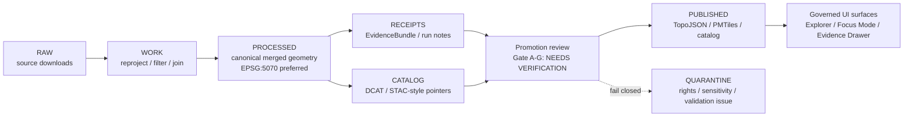

<!-- [KFM_META_BLOCK_V2]
doc_id: kfm.data.published.kansas.habitat_protection.readme
title: Kansas Habitat + Protection Overlay (EPA + PAD-US)
type: dataset_readme
version: 0.1.0
status: draft
owners: @bartytime4life
created: 2026-04-24
updated: 2026-04-24
policy_label: public
related:
  - ../../../processed/README.md
  - ../../../receipts/README.md
  - ../../../catalog/README.md
  - ../../../../tools/validators/promotion_gate/README.md
tags: [kansas, habitat, protected-areas, padus, epa-ecoregions, pmtiles, topojson, provenance]
notes:
  - README-like dataset publication surface for a draft Kansas habitat/protection overlay.
  - Paths, CI enforcement, source field names, rights filters, signatures, and promotion gates remain NEEDS VERIFICATION on the target branch.
[/KFM_META_BLOCK_V2] -->

<a id="top"></a>

# Kansas Habitat + Protection Overlay

Publish a governed, evidence-backed Kansas overlay that combines EPA ecoregion context with PAD-US protected-area records and exposes only release-safe, provenance-linked artifacts.


| Field | Current posture |
| --- | --- |
| **Status** | `experimental` / draft dataset README |
| **Owner** | `@bartytime4life` |
| **Promotion** | `NOT_PROMOTED` |
| **Build state** | Source README says manual draft run; branch artifacts remain **NEEDS VERIFICATION** |
| **Spec hash** | `<spec_hash>` placeholder until `buildspec.json` is confirmed and hashed |
| **Sensitivity model** | `public` / `restricted` / `redacted`; fail closed when unclear |

**Jump:** [Scope](#scope) · [Repo fit](#repo-fit) · [Inputs](#accepted-inputs) · [Exclusions](#exclusions) · [Artifacts](#published-artifacts) · [Lifecycle](#lifecycle) · [Build outline](#build-outline) · [Evidence + catalog](#evidence--catalog) · [Governance](#governance-and-promotion-readiness) · [FAQ](#faq)

> [!IMPORTANT]
> This README is a release-facing orientation file, not proof that publication has occurred. Generated artifacts, signatures, CI enforcement, Promotion Gate A–G status, and validator results must be confirmed from branch evidence before this dataset is treated as promoted.

---

## Scope

This directory describes a draft, release-candidate-style overlay for Kansas habitat and protection context.

It is intended to help maintainers answer four review questions quickly:

1. What source families feed the overlay?
2. Which web-ready artifacts are expected here?
3. Which evidence, rights, sensitivity, and promotion checks must close before publication?
4. Which downstream KFM surfaces may consume the release after promotion?

The overlay should remain a **derived publication artifact**. It must not become the canonical truth source for EPA ecoregions, PAD-US protected areas, KDWP features, rights decisions, or sensitivity policy.

[Back to top](#top)

---

## Repo fit

**Target path:** `data/published/kansas/habitat_protection/README.md`

```text
data/
├── raw/                         # source downloads: EPA, PAD-US, optional KDWP
├── work/                        # reprojection, joins, cleaning, simplification
├── processed/                   # canonical merged geometry, preferably EPSG:5070
├── receipts/                    # EvidenceBundle / run receipt material for this run
├── catalog/                     # DCAT/STAC-style discovery and lineage records
└── published/
    └── kansas/
        └── habitat_protection/
            ├── README.md        # this file
            ├── habprot_lo.topo.json
            ├── habprot_hi.topo.json
            ├── habprot.pmtiles
            ├── evidencebundle.json
            ├── catalog.json
            └── LICENSES/
```

| Direction | Relationship | README-facing expectation |
| --- | --- | --- |
| **Upstream** | `data/raw` → `data/work` → `data/processed` | Source downloads, transformations, joins, and canonical processed geometry must stay outside this published directory. |
| **Control plane** | `data/receipts` + `data/catalog` | Evidence and discovery records must remain inspectable and linkable. |
| **Downstream** | Explorer shell, Focus Mode, Evidence Drawer | Public and normal UI surfaces should consume released artifacts through governed interfaces, not raw/work/canonical stores. |

Related README links from this location:

- [`../../../processed/README.md`](../../../processed/README.md)
- [`../../../receipts/README.md`](../../../receipts/README.md)
- [`../../../catalog/README.md`](../../../catalog/README.md)
- [`../../../../tools/validators/promotion_gate/README.md`](../../../../tools/validators/promotion_gate/README.md)

> [!NOTE]
> The related paths above are preserved from the supplied draft. Their existence and exact relative placement are **NEEDS VERIFICATION** on the target branch.

[Back to top](#top)

---

## Accepted inputs

The overlay should accept only source material with a clear role, license posture, sensitivity posture, and provenance path.

| Input family | Role in this overlay | Release note |
| --- | --- | --- |
| **EPA Level III/IV ecoregions** | Ecoregion context and names/codes for Kansas joins | License and source URL must be captured in the EvidenceBundle. |
| **USGS PAD-US** | Protected-area geometry and designation/status attributes | Filter to records whose rights posture allows publication; exact rights values are **NEEDS VERIFICATION** against the branch source descriptor. |
| **KDWP supplement** | Optional state conservation/protection context | Do not include until redistribution terms, sensitivity rules, and review posture are explicit. |
| **HUC8 / HUC12 joins** | Hydrologic context keys | Join source and derivation method must be recorded. |
| **Sensitivity transforms** | Public-safe geometry handling | Any generalization, buffering, suppression, or redaction must be documented. |

Accepted artifacts for this directory are the promoted or promotion-candidate outputs listed in [Published artifacts](#published-artifacts). Raw source payloads, unpublished work products, and unreviewed sensitivity material do not belong here.

[Back to top](#top)

---

## Exclusions

This directory must not contain or imply any of the following:

- raw EPA, PAD-US, KDWP, WDPA, or other source downloads
- unpublished `WORK` or `QUARANTINE` material
- exact restricted or redacted boundaries
- unsupported rights interpretations
- source-native records whose redistribution status is unresolved
- free-floating claims that cannot resolve to `evidencebundle.json`
- UI-specific truth shortcuts that bypass the Evidence Drawer
- canonical source truth that belongs in `processed`, registry, catalog, or source-descriptor surfaces

> [!CAUTION]
> **WDPA remains excluded** unless its license and redistribution conditions are explicitly satisfied and recorded. The supplied draft excludes WDPA for redistribution-risk reasons; this revision preserves that posture.

[Back to top](#top)

---

## Published artifacts

| Artifact | Purpose | Release posture |
| --- | --- | --- |
| `habprot_lo.topo.json` | Lightweight TopoJSON for small-scale story maps, approximately `≤ z6` | Derived public artifact; depends on simplification receipt. |
| `habprot_hi.topo.json` | Higher-detail TopoJSON for `z6–z12` stories | Derived public artifact; must still respect sensitivity policy. |
| `habprot.pmtiles` | Statewide vector tiles | Derived delivery artifact; not canonical truth. |
| `evidencebundle.json` | Provenance and build receipt pointer for this release | Required before runtime claims. |
| `catalog.json` | DCAT/STAC-style discovery pointers | Discovery layer only; not the publication act by itself. |
| `LICENSES/` | License and attribution material | Must include source-level license notes and any redistribution constraints. |

[Back to top](#top)

---

## Lifecycle



KFM’s governing posture for this release is simple: derived map artifacts can support public interaction only after evidence, rights, sensitivity, catalog, and promotion state are reviewable.

[Back to top](#top)

---

## Source set

| Source | Dataset role | Minimum release requirement | Current README posture |
| --- | --- | --- | --- |
| EPA Level III/IV | Ecoregion context | Source URI, extraction date, CRS, and license note in EvidenceBundle | **NEEDS VERIFICATION** |
| USGS PAD-US | Protected areas | Rights filter, designation/status fields, area calculation, and source license preserved | **NEEDS VERIFICATION** |
| KDWP optional supplement | State features | Redistribution review, sensitivity review, and source descriptor before inclusion | **NOT INCLUDED unless verified** |
| WDPA | Excluded source family | License must be explicitly satisfied before any use | **EXCLUDED** |

Do not flatten source roles. Ecoregion context, protected-area designation, ownership/status, hydrologic context, and state stewardship supplements are different evidence types.

[Back to top](#top)

---

## Coordinate reference systems

| Stage | CRS | Reason |
| --- | --- | --- |
| Analysis | `EPSG:5070` preferred | Equal-area continental analysis and area calculation discipline. |
| Storage | `EPSG:5070` or `EPSG:4326` | Depends on canonical storage convention; verify on branch. |
| Tiling | `EPSG:3857` | Web map delivery and vector-tile compatibility. |

> [!WARNING]
> CRS transformations are consequential. If the source files, build script, or processed output use a different CRS convention, update this table and the EvidenceBundle rather than silently transforming downstream.

[Back to top](#top)

---

## Minimal schema

| Field | Description | Notes |
| --- | --- | --- |
| `id` | Internal deterministic or stable release id | Identity rule must be documented. |
| `source_id` | Original feature id | Preserve source traceability. |
| `source_license` | License or rights string | Must not be guessed. |
| `ecoregion_id` | EPA ecoregion code | Joined context. |
| `ecoregion_name` | EPA ecoregion name | Joined context. |
| `huc8` / `huc12` | Hydrologic join keys | Optional/contextual; source must be recorded. |
| `protection_designation` | Protected-area designation type | Source field names require branch verification. |
| `protection_status` | Protection status | Do not over-read as legal title truth. |
| `owner_type` | Federal/state/local/private/etc. | Classification source must remain visible. |
| `area_ha` | Area in hectares | Calculation CRS and formula must be recorded. |
| `designation_date` | Designation date | May be null or source-dependent. |
| `sensitivity_label` | `public`, `restricted`, or `redacted` | Controls geometry exposure. |
| `provenance_uri` | Pointer to receipt or EvidenceBundle | Required for claims. |
| `spec_hash` | Deterministic build id | Required before promotion. |

[Back to top](#top)

---

## Sensitivity rules

| Label | Public geometry behavior | Required note |
| --- | --- | --- |
| `public` | Full public geometry may be emitted | Source rights and release state must still pass. |
| `restricted` | Only generalized, buffered, or otherwise public-safe geometry may be emitted | Transform method and reason must be recorded. |
| `redacted` | No public geometry | Runtime should deny or abstain from precise geometry requests. |

Fail closed: restricted or redacted geometries must not leak precise boundaries through TopoJSON, PMTiles, popups, labels, catalog extents, screenshots, or derived summaries.

[Back to top](#top)

---

## Build outline

The commands below preserve the supplied draft’s deterministic build shape. Treat them as a **branch-verification checklist**, not as proof that the current repo has these tools, field names, or source files.

<details>
<summary><strong>Build commands to verify on branch</strong></summary>

### 1. Reproject PAD-US to analysis CRS

```bash
ogr2ogr \
  -t_srs EPSG:5070 \
  work/padus.gpkg \
  raw/padus.shp
```

### 2. Filter to publishable protected-area records

```bash
ogr2ogr -sql "
SELECT
  ogc_fid AS source_id,
  desig AS protection_designation,
  own_type AS owner_type,
  gis_acres * 0.40468564224 AS area_ha,
  status AS protection_status,
  desig_date AS designation_date,
  rights AS source_license,
  geometry
FROM padus
WHERE rights IN ('Public Domain', 'Open', 'Permissive')
" work/padus_publish.gpkg work/padus.gpkg
```

> [!WARNING]
> The `rights` values and PAD-US field names above are retained from the supplied draft and are **NEEDS VERIFICATION** against the actual PAD-US source descriptor and branch fixture.

### 3. Join EPA ecoregions

```bash
ogr2ogr -sql "
SELECT
  p.*,
  e.us_l3code AS ecoregion_id,
  e.us_l3name AS ecoregion_name
FROM padus_publish p
LEFT JOIN epa_l3_ks e
ON ST_Intersects(p.geometry, e.geometry)
" work/habprot_joined.gpkg work/padus_publish.gpkg
```

### 4. Clean geometry

```bash
mapshaper \
  work/habprot_joined.gpkg \
  -clean \
  -o work/habprot_clean.geojson
```

### 5. Generate story artifacts

```bash
mapshaper work/habprot_clean.geojson \
  -simplify dp 10% keep-shapes \
  -o format=topojson habprot_lo.topo.json

mapshaper work/habprot_clean.geojson \
  -simplify dp 2.5% keep-shapes \
  -o format=topojson habprot_hi.topo.json
```

### 6. Generate vector tiles

```bash
ogr2ogr \
  -t_srs EPSG:3857 \
  work/habprot_3857.gpkg \
  work/habprot_clean.geojson

tippecanoe \
  -o habprot.pmtiles \
  -zg -Bg \
  --drop-densest-as-needed \
  --coalesce \
  work/habprot_3857.gpkg
```

</details>

[Back to top](#top)

---

## Evidence + catalog

### EvidenceBundle minimum

`evidencebundle.json` should resolve the release back to source URIs, extraction date, build specification, filters, joins, simplification parameters, and signer or review identity.

```json
{
  "spec_hash": "<sha256 of buildspec.json>",
  "source_uris": ["<epa>", "<padus>", "<kdwp?>"],
  "extraction_date": "YYYY-MM-DD",
  "signer": "KFM Gatehouse <keyid>",
  "notes": "filters, joins, simplification parameters"
}
```

Expected receipt home from the supplied draft:

```text
data/receipts/<timestamp>_habprot.json
```

### Catalog stub

`catalog.json` is a discovery pointer. It must not expose unreleased scope, unresolved rights, or hidden sensitivity state.

```json
{
  "id": "kansas-habitat-protection",
  "title": "Kansas Habitat + Protection Overlay",
  "type": "Dataset",
  "assets": [
    {
      "href": "habprot_lo.topo.json",
      "type": "application/topo+json"
    },
    {
      "href": "habprot_hi.topo.json",
      "type": "application/topo+json"
    },
    {
      "href": "habprot.pmtiles",
      "type": "application/vnd.pmtiles"
    }
  ],
  "provenance": "evidencebundle.json",
  "license": "see LICENSES/"
}
```

[Back to top](#top)

---

## Governance and promotion readiness

Promotion remains **NOT PROMOTED** until the release candidate passes the project’s promotion process and the result is inspectable.

### README-facing readiness checks

| Check | Required before promotion | Current posture |
| --- | --- | --- |
| Source descriptors | EPA and PAD-US source URIs, versions, extraction dates, license notes | **NEEDS VERIFICATION** |
| Rights filter | PAD-US publishable subset is documented and testable | **NEEDS VERIFICATION** |
| Optional KDWP supplement | Redistribution and sensitivity posture explicitly reviewed | **NOT INCLUDED unless verified** |
| CRS and area calculation | CRS transform and `area_ha` method documented | **NEEDS VERIFICATION** |
| Sensitivity transform | `public` / `restricted` / `redacted` handling checked against artifacts | **NEEDS VERIFICATION** |
| EvidenceBundle | `spec_hash`, source refs, build notes, and receipt path present | **REQUIRED** |
| Catalog closure | `catalog.json` points only to release-safe assets | **REQUIRED** |
| Promotion Gate A–G | Gate outcome recorded in promotion artifacts | **NEEDS VERIFICATION** |
| Runtime posture | Focus Mode and Evidence Drawer can cite `spec_hash` or abstain | **REQUIRED after release** |

### Definition of done

- [ ] Verify target path and related README links on branch.
- [ ] Confirm EPA and PAD-US source descriptors, versions, and license notes.
- [ ] Confirm PAD-US rights filter values and source field names.
- [ ] Decide whether KDWP material is redistributable; omit if unresolved.
- [ ] Attach `evidencebundle.json` and any required signature or review receipt.
- [ ] Generate `habprot_lo.topo.json`, `habprot_hi.topo.json`, and `habprot.pmtiles` from the recorded `spec_hash` build.
- [ ] Validate public artifacts for restricted/redacted geometry leakage.
- [ ] Register `catalog.json` under release-safe catalog rules.
- [ ] Submit promotion candidate and record Promotion Gate A–G result.

[Back to top](#top)

---

## Runtime expectations

After promotion, runtime clients should treat this directory as a **released artifact surface**, not as a canonical store.

| Surface | Expected behavior |
| --- | --- |
| Explorer shell | Render released TopoJSON/PMTiles only through governed layer configuration. |
| Evidence Drawer | Resolve visible claims to `evidencebundle.json`, source roles, `spec_hash`, and review state. |
| Focus Mode | Cite `spec_hash` and evidence refs, or return `ABSTAIN` / `DENY` / `ERROR` when support is missing or unsafe. |
| Map popups | Avoid unsupported legal, ecological, or ownership claims. Show source role and review status where relevant. |

[Back to top](#top)

---

## FAQ

### Why not WDPA?

The supplied draft excludes WDPA because redistribution and license conditions can complicate publication. Keep WDPA out unless licensing is explicitly satisfied and recorded in the source descriptor, EvidenceBundle, and release notes.

### Why two TopoJSON files?

The low-detail and high-detail TopoJSON outputs serve different story-map zoom regimes. This reduces payload size while preserving topology appropriate to each scale band.

### Is `catalog.json` the authoritative record?

No. `catalog.json` is a discovery pointer. Evidence, rights, sensitivity, promotion, and correction state must remain resolvable through the appropriate KFM evidence, receipt, proof, and catalog surfaces.

### Can Focus Mode summarize this overlay?

Only after the release is promoted and Focus Mode can resolve evidence. If `spec_hash`, EvidenceBundle, source rights, or sensitivity state is missing, the correct runtime outcome is abstain or deny rather than a fluent unsupported summary.

[Back to top](#top)
