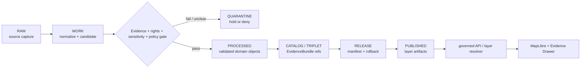

<!-- [KFM_META_BLOCK_V2]
doc_id: kfm://data/published/layers/readme
name: Published Layers README
path: data/published/layers/README.md
type: data-lane-index-readme
version: v0.1.0
status: draft
owners:
  - <data-publication-steward>
  - <map-layer-steward>
  - <release-steward>
  - <policy-steward>
created: 2026-06-27
updated: 2026-06-27
policy_label: restricted-review
truth_posture: cite-or-abstain
lifecycle_phase: published
responsibility_root: data/
artifact_family: released-public-safe-map-layer-lanes
sensitivity_posture: public-safe-derivatives-only; release-required; policy-reviewed; not-canonical-truth
related:
  - ../README.md
  - ../../README.md
  - ../../proofs/README.md
  - ../../receipts/README.md
  - ../../../release/manifests/README.md
  - ../../../docs/doctrine/derived-stays-derived.md
  - ../../../docs/doctrine/map-first.md
  - ../../../docs/doctrine/directory-rules.md
  - ../../../docs/architecture/sensitive-domain-fail-closed.md
  - soil/README.md
  - flora/README.md
  - geology/README.md
  - hazards/README.md
  - habitat/README.md
  - hydrology/README.md
  - fauna/README.md
  - roads-rail-trade/README.md
  - scene/README.md
tags:
  - kfm
  - data
  - published
  - layers
  - map-layers
  - public-safe
  - release
  - evidence-first
  - governed-api
  - maplibre
  - trust-membrane
notes:
  - "This README replaces a greenfield stub and documents the parent lane for released public-safe layer artifacts."
  - "Layer artifacts are downstream delivery surfaces; they do not replace source records, processed data, catalog records, EvidenceBundles, release manifests, receipts, policy decisions, or AI receipts."
  - "Actual payload presence, validator wiring, release-manifest approval, and CI enforcement remain UNKNOWN unless verified per child lane."
[/KFM_META_BLOCK_V2] -->

<a id="top"></a>

# Published Layers

Released public-safe map and API layer artifacts for governed KFM delivery surfaces.

<p>
  
  
  
  
  
  
</p>

**Quick links:** [Scope](#scope) · [Repo fit](#repo-fit) · [Layer lane index](#layer-lane-index) · [Inputs](#inputs) · [Exclusions](#exclusions) · [Directory map](#directory-map) · [Publication boundary](#publication-boundary) · [Required checks](#required-checks-before-use) · [Status notes](#status-notes)

> [!IMPORTANT]
> `data/published/layers/` is a **released derivative delivery lane**. It can hold public-safe layer bytes, manifests, sidecars, allowlists, digests, and layer-local README files after release gates close. It is not source authority, proof authority, receipt authority, release authority, catalog authority, registry authority, policy authority, canonical domain truth, or AI truth.

---

## Scope

This directory indexes released public-safe layer lanes used by governed map and API delivery surfaces. Layer artifacts may include PMTiles, GeoParquet, GeoJSON, Cloud Optimized GeoTIFF, vector-tile/raster-tile products, sidecar manifests, field allowlists, digest files, caveat summaries, and release pointers when those artifacts have passed the appropriate evidence, policy, sensitivity, review, release, correction, and rollback gates.

Published layers are downstream carriers. They help users view, inspect, and resolve released KFM artifacts through governed interfaces, but they do not create claims or replace the underlying EvidenceBundle, catalog, triplet, proof, receipt, source, policy, review, correction, or release state.

---

## Repo fit

| Field | Value |
|---|---|
| Path | `data/published/layers/` |
| Responsibility root | `data/` |
| Lifecycle phase | `published/` |
| Artifact role | Released public-safe map/API layer bytes, sidecars, and lane README indexes |
| Public access posture | Governed APIs, release-resolved artifacts, and public-safe runtime envelopes only |
| Upstream lifecycle | `RAW -> WORK / QUARANTINE -> PROCESSED -> CATALOG / TRIPLET -> RELEASE -> PUBLISHED` |
| Release authority | `release/`, not this directory |
| Proof authority | `data/proofs/` and `data/receipts/`, not this directory |
| Catalog authority | `data/catalog/`, not this directory |
| Default failure posture | `DENY`, `HOLD`, `RESTRICT`, or `ABSTAIN` when evidence, rights, sensitivity, source role, policy, review, release, correction, digest, or rollback support is insufficient |

---

## Layer lane index

The lanes below are README or path surfaces verified by GitHub search, current-session edits, or direct fetches in this session. This table does **not** prove that released payload bytes, release manifests, validators, or CI wiring exist for every lane.

| Lane | Role | Status boundary |
|---|---|---|
| [`soil/`](soil/README.md) | Soil layer index and support-type-separated child lanes | README confirmed; payloads remain **UNKNOWN** unless child releases verify them |
| [`flora/`](flora/README.md) | Public-safe flora layers with fail-closed rare-plant/geoprivacy posture | README confirmed; exact sensitive geometry denied from public layers |
| [`habitat/`](habitat/README.md) | Habitat/ecoregion/land-cover layer lanes | README presence from prior edits/search; payload maturity **UNKNOWN** |
| [`fauna/`](fauna/README.md) | Fauna range/occurrence public-safe layer lanes | README presence from prior edits/search; sensitive locations require policy review |
| [`geology/`](geology/README.md) | Geology public-safe layer lanes | README found by GitHub search; payload maturity **UNKNOWN** |
| [`hydrology/`](hydrology/README.md) | Hydrology public-safe layer lanes | README presence from prior edits; payload maturity **UNKNOWN** |
| [`hazards/`](hazards/README.md) | Hazard-context public-safe layer lanes | README presence from prior edits; not an alert authority |
| [`roads-rail-trade/`](roads-rail-trade/README.md) | Public-safe transport/history layer lanes and derived graph surfaces | README presence from prior edits; graph/tiles remain downstream read models |
| [`scene/`](scene/README.md) | Scene delivery artifacts for governed map/story playback | README found by GitHub search; scenes are downstream carriers |
| [`people/`](people/README.md) | Public-safe people layer index | Sensitive/living-person data must fail closed or be governed |
| [`people-dna-land/`](people-dna-land/README.md) | Restricted-review people/DNA/land-adjacent layer index | High-sensitivity lane; public posture restricted-review by default |
| [`settlements-infrastructure/`](settlements-infrastructure/README.md) | Working settlements/infrastructure layer lane | Working canonical segment, but slug variance needs verification |
| [`settlement/`](settlement/README.md) | Singular settlement compatibility lane | Compatibility/CONFLICTED path; do not promote to canonical without ADR |
| [`settlements/`](settlements/README.md) | Plural settlements compatibility lane | Compatibility variant; canonical status **NEEDS VERIFICATION** |

> [!NOTE]
> This index should be updated when child lanes are created, renamed, merged, deprecated, or released. Do not use this parent README as a release manifest; release approval belongs under `release/`.

---

## Inputs

Accepted content is limited to release-approved and public-safe layer-lane material such as:

- child directory README files and lane-local release notes;
- released PMTiles, GeoParquet, GeoJSON, COG, vector-tile, raster-tile, or API payload artifacts inside child lanes;
- layer manifests, field allowlists, caveat summaries, support-type summaries, review summaries, and public-safe metadata;
- digest files and release pointers generated from release state;
- `latest.json` files only when generated from current release state;
- documentation that helps consumers locate released layer artifacts without replacing proof, policy, catalog, source, registry, receipt, or release authority.

---

## Exclusions

| Do not place here | Correct authority home |
|---|---|
| RAW source captures, mirrored source data, or unreviewed uploads | `data/raw/<domain>/` or source-specific intake |
| WORK candidates, drafts, joins, scratch outputs, generated analysis, or unresolved transforms | `data/work/<domain>/` |
| Quarantined, rights-unclear, sensitivity-unclear, or policy-held material | `data/quarantine/<domain>/` |
| Canonical processed domain objects | `data/processed/<domain>/` |
| Catalog records, triplets, graph truth, or EvidenceBundle state | `data/catalog/`, triplet lanes, or proof lanes |
| EvidenceBundle / ProofPack | `data/proofs/` |
| Validation, transform, redaction, build, release, or publication receipts | `data/receipts/` |
| Source descriptors, source activation decisions, or source registry truth | `data/registry/sources/` |
| Release manifests, promotion decisions, rollback cards, or correction authority | `release/` |
| Policy rules, sensitivity decisions, or access-control definitions | `policy/` |
| Exact sensitive ecology, archaeology, infrastructure, living-person, DNA, land/title, cultural, sacred, or restricted geometry | Restricted governed lanes only; not public published layers |
| Direct model-generated claims or uncited summaries | Governed answer/provenance paths only |

---

## Directory map

```text
data/published/layers/
├── README.md
├── soil/
├── flora/
├── habitat/
├── fauna/
├── geology/
├── hydrology/
├── hazards/
├── roads-rail-trade/
├── scene/
├── people/
├── people-dna-land/
├── settlements-infrastructure/
├── settlement/
└── settlements/
```

> [!WARNING]
> This map is an orientation index, not a full live tree assertion. It reflects known README lanes and recent current-session work. Confirm exact subtree contents with repository inspection before using a lane in release, CI, publication, or application routing.

---

## Publication boundary



The forbidden shortcut is:

```text
RAW / WORK / QUARANTINE / processed candidate / direct source record / direct model output / unreleased artifact
→ direct public layer
```

---

## Required checks before use

- [ ] Confirm the child lane is the correct responsibility and domain lane for the artifact.
- [ ] Confirm source descriptors, source roles, rights posture, and current terms.
- [ ] Confirm sensitivity, policy, review, and redaction/generalization decisions where applicable.
- [ ] Confirm proof and receipt closure.
- [ ] Confirm catalog/EvidenceBundle closure for claims carried by the layer.
- [ ] Confirm release manifest, promotion decision, rollback target, and correction path.
- [ ] Confirm `latest.json`, if present, is generated from release state.
- [ ] Confirm field allowlist, layer manifest, and released-byte digest.
- [ ] Confirm public clients consume layers through governed APIs or release-resolved artifacts.
- [ ] Confirm no child lane is treated as source, proof, release, catalog, registry, policy, legal/title, regulatory, emergency-alert, or AI authority.
- [ ] Confirm sensitive details are not merely hidden by styling, zoom thresholds, or client-side filtering.

---

## Status notes

| Claim | Status |
|---|---|
| This README replaces the greenfield stub at `data/published/layers/README.md`. | **CONFIRMED authored** |
| The target path existed in the live repository as a stub before this edit. | **CONFIRMED by GitHub contents API during this edit** |
| The parent `data/published/README.md` is still a greenfield stub. | **CONFIRMED by GitHub contents API during this edit** |
| Several child layer README lanes exist or were recently created in this session. | **CONFIRMED / CURRENT-SESSION EVIDENCE** |
| Actual released artifact payloads exist under every indexed lane. | **UNKNOWN** |
| Release manifests approve every indexed lane. | **UNKNOWN** |
| Validators and CI checks enforce every indexed lane. | **NEEDS VERIFICATION** |
| This README is release authority. | **DENY — release authority belongs under `release/`** |

---

## Related files

- [`../README.md`](../README.md)
- [`../../README.md`](../../README.md)
- [`../../proofs/README.md`](../../proofs/README.md)
- [`../../receipts/README.md`](../../receipts/README.md)
- [`../../../release/manifests/README.md`](../../../release/manifests/README.md)
- [`../../../docs/doctrine/derived-stays-derived.md`](../../../docs/doctrine/derived-stays-derived.md)
- [`../../../docs/doctrine/map-first.md`](../../../docs/doctrine/map-first.md)
- [`../../../docs/doctrine/directory-rules.md`](../../../docs/doctrine/directory-rules.md)
- [`../../../docs/architecture/sensitive-domain-fail-closed.md`](../../../docs/architecture/sensitive-domain-fail-closed.md)

---

KFM rule: this directory is a released public-safe layer index and artifact lane only. It is not source authority, proof authority, receipt authority, release authority, catalog authority, registry authority, policy authority, canonical domain truth, legal/title authority, emergency authority, or AI truth.

[Back to top](#top)
