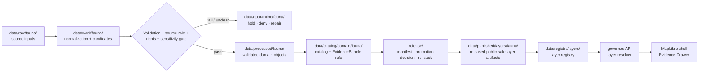

<!-- [KFM_META_BLOCK_V2]
doc_id: kfm://data/published/layers/fauna/readme
name: Fauna Published Layers README
path: data/published/layers/fauna/README.md
type: data-lane-index-readme
version: v0.1.0
status: draft
owners:
  - <fauna-lane-steward>
  - <release-steward>
  - <map-layer-steward>
  - <geoprivacy-steward>
created: 2026-06-26
updated: 2026-06-26
policy_label: public
truth_posture: cite-or-abstain
lifecycle_phase: published
responsibility_root: data/
domain: fauna
artifact_family: released-public-safe-map-layers
sensitivity_posture: deny-exact-sensitive-geometry; public layers require governed release; generalized derivatives require geoprivacy evidence
related:
  - ../README.md
  - ../../README.md
  - occurrence_tiles/README.md
  - range/README.md
  - range_generalized/README.md
  - ../../../../docs/doctrine/directory-rules.md
  - ../../../../docs/domains/fauna/README.md
  - ../../../../docs/domains/fauna/FILE_SYSTEM_PLAN.md
  - ../../../registry/layers/README.md
  - ../../../../release/manifests/README.md
tags:
  - kfm
  - data
  - published
  - layers
  - fauna
  - occurrence
  - range
  - generalized-range
  - geoprivacy
  - maplibre
  - public-safe
  - evidence-first
notes:
  - "This README indexes and governs public-safe fauna published layer lanes."
  - "This path is for released map-layer artifacts and immediate layer sidecars, not release decisions, proofs, receipts, or canonical domain stores."
  - "Sensitive exact geometry, restricted telemetry, steward-only site detail, and unpublished candidates are denied from this subtree."
[/KFM_META_BLOCK_V2] -->

<a id="top"></a>

<div align="center">

# Fauna Published Layers

**Public-safe released map-layer artifacts for fauna occurrence, range, and generalized range surfaces.**


</div>

---

## Quick reference

| Field | Value |
|---|---|
| **Path** | `data/published/layers/fauna/` |
| **Responsibility root** | `data/` |
| **Lifecycle phase** | `published/` — released public-safe artifacts only |
| **Domain lane** | `fauna/` |
| **Artifact family** | Released public-safe fauna map layers and direct sidecars |
| **Child lanes** | `occurrence_tiles/`, `range/`, `range_generalized/` |
| **Primary consumers** | Governed API layer resolver, MapLibre shell, Evidence Drawer, public-safe exports, release QA |
| **Release authority** | `release/manifests/` and `release/promotion_decisions/`, not this directory |
| **Proof authority** | `data/proofs/` and `data/receipts/`, not this directory |
| **Default failure posture** | `ABSTAIN` unresolved public claims; `DENY` exact sensitive geometry or restricted attributes |

---

## 1. Purpose

This directory is the parent lane for **released public-safe fauna map-layer artifacts**. It groups the fauna layer outputs that public clients may consume after evidence, rights, sensitivity, validation, review, release, and rollback gates have passed.

The directory is an artifact delivery surface, not an authority store. It does not hold raw observations, canonical processed records, catalog truth, proof packs, release decisions, review notes, or AI-generated conclusions.

> [!IMPORTANT]
> A file in this subtree is not automatically publishable just because it lives under `data/published/`. Public exposure still depends on a valid release manifest, promotion decision, proof and receipt chain, policy outcome, layer registry entry, and rollback target.

---

## 2. Lane map

| Lane | Purpose | Public safety posture |
|---|---|---|
| [`occurrence_tiles/`](occurrence_tiles/README.md) | Released non-sensitive occurrence-backed tile artifacts and direct sidecars. | Exact public tiles only for approved non-sensitive taxa and approved fields. Sensitive exact occurrence is denied. |
| [`range/`](range/README.md) | Released public-safe range and distribution artifacts. | Normal public range products; not a shortcut for exact sensitive sites or occurrence-derived exact geometry. |
| [`range_generalized/`](range_generalized/README.md) | Released generalized public range derivatives. | Preferred public lane for sensitive-derived or restricted-derived range outputs after geoprivacy/redaction. |

If a fauna layer does not fit these lanes, do not create a new sibling folder casually. First confirm the owning root, artifact family, policy posture, registry shape, release path, and whether a Directory Rules or ADR update is needed.

---

## 3. What belongs here

| Artifact class | Examples | Boundary |
|---|---|---|
| Released public fauna layer bytes | PMTiles, GeoParquet, GeoJSON, public tileset bundles | Must be public-safe as bytes, not merely safe as a rendered style |
| Layer sidecars | `layer.manifest.json`, `tiles.json`, `*.sha256`, `fields.allowlist.json` | Must point to release state and registry state |
| Public-safe style fragments | `style.fragment.json` | Rendering hints only; cannot act as policy/redaction/release authority |
| Release-local README files | `<release_id>/README.md` | Explain the release-local artifact contents without duplicating proof authority |
| Generated pointers | `latest.json` | Must be release-generated and rollback-safe, not hand-edited |

---

## 4. What does not belong here

| Do not place | Correct home | Reason |
|---|---|---|
| RAW source files | `data/raw/fauna/<source_id>/<run_id>/` | RAW is intake, not publication |
| WORK files or candidates | `data/work/fauna/<run_id>/` | WORK may contain unresolved state |
| Quarantined material | `data/quarantine/fauna/<reason>/<run_id>/` | Failed/unclear materials are not public release |
| Canonical processed fauna objects | `data/processed/fauna/...` | Processed does not equal published |
| Catalog records or triplets | `data/catalog/...` or graph/catalog lanes | Catalog/triplet state is authority, not map payload |
| EvidenceBundle / ProofPack | `data/proofs/` | Proof authority stays separate from layer bytes |
| Validation, transform, or redaction receipts | `data/receipts/` | Receipts are process memory, not public payloads |
| Release manifests / promotion decisions | `release/` | Publication decision authority belongs to release governance |
| Sensitive exact sites | restricted processed/catalog lanes only | Public exact sensitive geometry is denied |
| Telemetry tracks or high-frequency movement traces | restricted lanes only | Movement traces can reveal sensitive locations |
| AI-generated map claims | governed answer/provenance paths only | AI is interpretive, not root truth or release authority |

---

## 5. Publication boundary



<!-- END OF MERMAID -->

The normal public path is:

```text
released fauna layer artifact
→ layer registry entry
→ ReleaseManifest
→ governed API / layer resolver
→ MapLibre shell
→ Evidence Drawer / citation surface
```

The forbidden shortcut is:

```text
RAW / WORK / QUARANTINE / restricted internal source
→ direct public map layer
```

---

## 6. Public-safety rules

| Rule | Required behavior |
|---|---|
| **Exact sensitive geometry is denied** | Nests, dens, roosts, hibernacula, spawning sites, telemetry traces, steward-controlled sites, and sensitive exact occurrences do not enter this public subtree. |
| **Layer bytes must already be safe** | Do not rely on style filters, hidden fields, or client-side logic as redaction. |
| **Source role remains visible** | Observation, modeled range, regulatory boundary, administrative boundary, expert-curated layer, and generalized derivative are different claim types. |
| **Evidence references remain resolvable** | Public layer features or manifests must carry safe evidence references or resolver keys. |
| **Rights are release gates** | No artifact is placed here unless source terms allow the declared public derivative. |
| **Generalization must be receipted** | Sensitive-derived public artifacts require redaction/geoprivacy evidence and release review. |
| **Temporal context survives** | Valid time, source time, transform time, release time, and correction time must not collapse into a single undated layer. |
| **AI is not authority** | Generated summaries or Focus Mode text cannot replace evidence, policy, review, release, or rollback state. |
| **Rollback is mandatory** | Each public layer must be tied to a rollback target and correction/withdrawal path. |

---

## 7. Recommended subtree shape

```text
data/published/layers/fauna/
├── README.md
├── occurrence_tiles/
│   └── README.md
├── range/
│   └── README.md
└── range_generalized/
    └── README.md
```

Release-id folders may be used inside each child lane once artifact versions exist:

```text
<lane>/
├── README.md
├── <release_id>/
│   ├── <artifact>.pmtiles
│   ├── <artifact>.geoparquet
│   ├── <artifact>.sha256
│   ├── layer.manifest.json
│   ├── fields.allowlist.json
│   └── README.md
└── latest.json
```

`latest.json` must be generated from release state and must be removed or withheld when rollback state is missing or stale.

---

## 8. Minimum layer manifest expectations

Each child lane may refine these fields, but a public fauna layer manifest or sidecar should include at least:

| Field | Purpose |
|---|---|
| `layer_id` | Stable public layer id |
| `domain` | `fauna` |
| `artifact_family` | `occurrence_tiles`, `range`, `range_generalized`, or approved controlled value |
| `claim_character` | Observation-backed, modeled, regulatory, administrative, expert-curated, generalized, or equivalent controlled value |
| `release_id` | Pointer to `release/manifests/<release_id>.json` |
| `artifact_href` | Relative or release-resolved artifact path |
| `artifact_sha256` | Digest of released bytes |
| `format` | `pmtiles`, `geoparquet`, `geojson`, or approved public format |
| `bounds` | Public-safe spatial bounds |
| `minzoom` / `maxzoom` | Tile zoom range, when tiled |
| `taxon_scope` | Taxon or taxon group represented by the artifact |
| `sensitivity_posture` | Public-safe posture, generalized derivative posture, or deny/withhold reason |
| `field_allowlist_ref` | Pointer to approved public field allowlist |
| `evidence_bundle_refs` | Safe references or resolver keys |
| `redaction_receipt_refs` | Required for sensitive-derived or restricted-derived inputs |
| `policy_decision_ref` | Release policy decision reference |
| `rollback_ref` | Rollback card or rollback target |
| `correction_path` | Where corrections, supersessions, or withdrawals are recorded |

---

## 9. Validation checklist

Before adding or updating a fauna published-layer artifact, reviewers should be able to answer **yes** to each item.

- [ ] The artifact belongs under an existing child lane or a new lane has been approved through the proper architecture/governance path.
- [ ] Every contributing source has a source descriptor.
- [ ] Source role is explicit and compatible with the public claim.
- [ ] Taxon identity and taxon crosswalks are resolved or uncertainty is labeled.
- [ ] Rights and license posture allow this public derivative.
- [ ] Sensitive exact sites, restricted telemetry, private steward detail, and restricted attributes are absent from the released bytes.
- [ ] Generalized derivatives include redaction/geoprivacy receipt references.
- [ ] Field allowlist has been checked against the actual released bytes.
- [ ] EvidenceBundle references resolve through governed lookup.
- [ ] Layer registry entry references the artifact family and release id.
- [ ] ReleaseManifest and PromotionDecision exist under `release/`.
- [ ] Rollback card or rollback target exists.
- [ ] Correction and withdrawal paths are documented.
- [ ] Public UI consumes the layer through governed APIs or release-resolved artifact manifests, not RAW, WORK, QUARANTINE, restricted stores, or direct model output.

---

## 10. Suggested checks

Use the repository validator orchestrator when available:

```bash
python tools/validate_all.py
```

Potential fauna-layer checks should cover:

```text
tools/validators/domains/fauna/taxonomy_resolution/
tools/validators/domains/fauna/source_role_authority/
tools/validators/domains/fauna/sensitivity_classification/
tools/validators/domains/fauna/geoprivacy_transform/
tools/validators/domains/fauna/redaction_receipt/
tools/validators/domains/fauna/tile_field_allowlist/
tools/validators/domains/fauna/layer_manifest/
tests/domains/fauna/sensitivity/
tests/domains/fauna/geoprivacy/
tests/domains/fauna/tiles/
```

If a validator is not implemented yet, mark the candidate `NEEDS VERIFICATION` rather than treating the gap as a pass.

---

## 11. Map consumer rules

Consumers should:

1. Load only release-resolved artifacts or manifests.
2. Resolve feature details through the governed API or Evidence Drawer payload.
3. Display release, stale, sensitivity, transform, and correction state where available.
4. Avoid presenting map-layer geometry as stronger evidence than its source role supports.
5. Preserve `ABSTAIN`, `DENY`, and `ERROR` outcomes in UI state.
6. Avoid direct reads from RAW, WORK, QUARANTINE, restricted processed/catalog lanes, or internal stores.
7. Keep AI and Focus Mode answers subordinate to evidence, policy, review, redaction, and release state.

---

## 12. Common failure modes

| Failure | Outcome |
|---|---|
| Public artifact includes exact sensitive geometry | `DENY` release; withdraw or quarantine artifact |
| Artifact exists without release manifest | Not a valid public layer |
| Field is hidden in style but present in payload | Publication leak; treat as incident |
| Layer lacks evidence references | `ABSTAIN` claims; block Evidence Drawer support |
| Occurrence-backed surface is presented as a regulatory range | Source-role violation; correct or withdraw claim |
| Modeled range lacks model/source/version notes | `ABSTAIN` model-specific claims until documented |
| Source rights are unresolved | `DENY` or hold in quarantine |
| `latest.json` points to artifact without rollback target | Release drift; remove alias until fixed |
| New sibling lane appears without governance note | Directory drift; require review or ADR/migration note |

---

## 13. Maintainer checklist

- Keep this subtree limited to released public-safe fauna map-layer artifacts and direct sidecars.
- Put release decisions in `release/`, not here.
- Put proof and receipt objects in `data/proofs/` and `data/receipts/`, not here.
- Keep exact sensitive geometry, restricted telemetry, and steward-only details out of this subtree.
- Use child README files to document lane-specific rules.
- Prefer release-id subfolders when more than one version exists.
- Update this README when child lanes, artifact naming, manifest shape, validator paths, or release gates change.

---

## 14. Status notes

| Claim | Status |
|---|---|
| This README defines the intended boundary for `data/published/layers/fauna/`. | **CONFIRMED authored** |
| The target path exists in the live repository. | **CONFIRMED by GitHub contents API during this edit** |
| `occurrence_tiles/`, `range/`, and `range_generalized/` have lane README files. | **CONFIRMED by recent GitHub edits in this session** |
| Actual released fauna layer artifacts exist in these lanes. | **UNKNOWN** |
| Fauna layer publication validators are implemented and wired in CI. | **NEEDS VERIFICATION** |
| Any specific source has been approved for public fauna layer publication. | **NEEDS VERIFICATION** |
| The current public UI loads these layers through a governed API. | **UNKNOWN** |

---

## Related files

- [`occurrence_tiles/README.md`](occurrence_tiles/README.md) — occurrence-backed public-safe tile lane
- [`range/README.md`](range/README.md) — public-safe range lane
- [`range_generalized/README.md`](range_generalized/README.md) — generalized public-safe range lane
- [`../README.md`](../README.md) — published layer family lane
- [`../../README.md`](../../README.md) — `data/published/` lane
- [`../../../../docs/doctrine/directory-rules.md`](../../../../docs/doctrine/directory-rules.md) — placement and lifecycle doctrine
- [`../../../../docs/domains/fauna/FILE_SYSTEM_PLAN.md`](../../../../docs/domains/fauna/FILE_SYSTEM_PLAN.md) — fauna path and sensitivity placement plan
- [`../../../registry/layers/README.md`](../../../registry/layers/README.md) — layer registry entry point
- [`../../../../release/manifests/README.md`](../../../../release/manifests/README.md) — release manifest authority

---

<div align="center">

**KFM rule:** fauna published layers are public-safe delivery artifacts, not source authority, proof authority, release authority, or AI truth.

[Back to top](#top)

</div>
