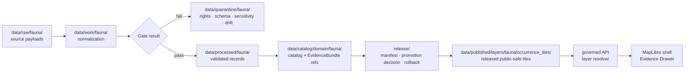

<!-- [KFM_META_BLOCK_V2]
doc_id: kfm://data/published/layers/fauna/occurrence-tiles-readme
name: Fauna Occurrence Tiles Published Layer README
path: data/published/layers/fauna/occurrence_tiles/README.md
type: data-lane-readme
version: v0.1.0
status: draft
owners:
  - <fauna-lane-steward>
  - <release-steward>
  - <map-layer-steward>
created: 2026-06-26
updated: 2026-06-26
policy_label: public
truth_posture: cite-or-abstain
lifecycle_phase: published
responsibility_root: data/
domain: fauna
artifact_family: released-public-safe-map-layer
sensitivity_posture: deny-exact-sensitive-occurrence; allow-public-safe-generalized-derivative
related:
  - ../../README.md
  - ../README.md
  - ../../../../../docs/doctrine/directory-rules.md
  - ../../../../../docs/domains/fauna/README.md
  - ../../../../../docs/domains/fauna/FILE_SYSTEM_PLAN.md
  - ../../../../../docs/standards/PMTILES.md
  - ../../../../../data/registry/layers/README.md
  - ../../../../../release/manifests/README.md
tags:
  - kfm
  - data
  - published
  - layers
  - fauna
  - occurrence
  - pmtiles
  - geoprivacy
  - public-safe
  - evidence-first
notes:
  - "This README documents the publication lane for released public-safe fauna occurrence tile artifacts."
  - "The README does not prove that any tile artifact has been released. Release state must be verified through ReleaseManifest, EvidenceBundle, validation reports, policy decisions, receipts, and rollback targets."
  - "Exact sensitive occurrence, nest, den, roost, hibernacula, spawning, or steward-controlled locations are denied from this path."
[/KFM_META_BLOCK_V2] -->

<a id="top"></a>

<div align="center">

# Fauna Occurrence Tiles

**Released public-safe tile artifacts for occurrence-backed fauna map layers.**


</div>

---

## Quick reference

| Field | Value |
|---|---|
| **Path** | `data/published/layers/fauna/occurrence_tiles/` |
| **Responsibility root** | `data/` |
| **Lifecycle phase** | `published/` — released public-safe artifacts only |
| **Domain lane** | `fauna/` |
| **Artifact family** | Public-safe occurrence tile bundles, tile manifests, integrity sidecars, and layer README guidance |
| **Primary consumers** | Governed API layer resolver, MapLibre shell, Evidence Drawer, release QA, public-safe exports |
| **Primary non-consumers** | RAW processors, unrestricted AI context, source connectors, direct internal-store readers |
| **Release authority** | `release/manifests/` and `release/promotion_decisions/`, not this directory |
| **Proof authority** | `data/proofs/` and `data/receipts/`, not this README |
| **Default failure posture** | `DENY` exact sensitive location; `ABSTAIN` when evidence, rights, policy, or release state cannot be resolved |

---

## 1. Purpose

This directory is the publication lane for **released, public-safe fauna occurrence tile artifacts**. It is intended for map-ready derivatives such as PMTiles or equivalent tile bundles that have passed fauna-specific geoprivacy, field allowlist, rights, validation, evidence, policy, review, and release gates.

The durable unit of truth is not the tile by itself. The tile is a downstream delivery artifact. Public claims must remain traceable through the release manifest, layer registry entry, EvidenceBundle, validation reports, policy decision, receipt chain, correction path, and rollback target.

> [!IMPORTANT]
> A file being present under `data/published/layers/fauna/occurrence_tiles/` is not enough to prove publication correctness. Publication is a governed state transition. Verify the matching release record before exposing or citing an artifact.

---

## 2. What belongs here

| Artifact | Example name | Required condition before placement |
|---|---|---|
| Public-safe PMTiles or tile bundle | `fauna_occurrence_public_vYYYYMMDD.pmtiles` | ReleaseManifest exists; no exact sensitive coordinates; field allowlist passes |
| Tile metadata sidecar | `fauna_occurrence_public_vYYYYMMDD.tiles.json` | References artifact digest, bounds, zoom range, schema version, layer id, and release id |
| Integrity sidecar | `fauna_occurrence_public_vYYYYMMDD.sha256` | Digest generated from the exact released bytes |
| Public layer descriptor | `layer.json` or `layer.manifest.json` | Points to governed layer registry and release manifest |
| README / human guidance | `README.md` | Explains path boundaries and release expectations |
| Optional sample style fragment | `style.fragment.json` | Contains rendering hints only; does not carry policy or proof authority |

A valid artifact in this folder should be **boring to serve and safe to inspect**. The risky work must already have happened upstream: source-role verification, occurrence split, geoprivacy transform, redaction receipt, validation, policy decision, steward review where required, release manifest, and rollback card.

---

## 3. What does not belong here

| Do not place | Correct home | Reason |
|---|---|---|
| RAW source payloads | `data/raw/fauna/<source_id>/<run_id>/` | RAW is immutable intake, not public output |
| Normalization scratch files | `data/work/fauna/<run_id>/` | WORK can contain candidates and unresolved state |
| Failed or unresolved material | `data/quarantine/fauna/<reason>/<run_id>/` | Quarantine is not a publication lane |
| Canonical processed occurrence records | `data/processed/fauna/...` | Processed does not imply public release |
| Exact sensitive occurrence geometry | restricted processed/catalog lanes only | Public exact sensitive occurrence is denied |
| Release manifests | `release/manifests/` | Release decisions are not artifacts |
| Promotion decisions | `release/promotion_decisions/` | Decision authority stays in `release/` |
| EvidenceBundles / ProofPacks | `data/proofs/` | Proof authority stays separate from delivery artifacts |
| Pipeline run receipts | `data/receipts/` | Receipts are process memory, not tile payloads |
| Private steward review notes | restricted review/control-plane path | May contain non-public rationale or sensitive context |
| Style-only redaction assumptions | nowhere | Hiding a field in MapLibre style is not publication control |

---

## 4. Publication boundary



<!-- END OF MERMAID -->

The public path is:

```text
released tile artifact
→ release manifest
→ governed API / layer resolver
→ MapLibre shell
→ Evidence Drawer / citation surface
```

The public path is **not**:

```text
source payload
→ direct tile generation
→ public map
```

---

## 5. Fauna occurrence safety rules

Fauna occurrence tiles are high-risk because even a technically valid map can leak sensitive animal locations. The following rules are mandatory for this lane.

| Rule | Required behavior |
|---|---|
| **Exact sensitive occurrence denial** | Sensitive taxa, nests, dens, roosts, hibernacula, spawning sites, and steward-controlled locations must not be published as exact geometry. |
| **Geoprivacy transform first** | Any public derivative from sensitive or stewardship-controlled material requires a documented geoprivacy transform. |
| **Redaction receipt required** | Public-safe derivatives must be traceable to a redaction receipt or equivalent proof object. |
| **Tile field allowlist** | Public tiles must contain only approved fields; hidden style fields are still leaked fields. |
| **Evidence preserved** | Tile features must retain safe evidence references or resolver keys sufficient for EvidenceBundle lookup. |
| **Rights checked** | Source rights, license, and permitted claim roles must be resolved before release. |
| **Temporal scope preserved** | Source time, observed time, valid time, retrieval time, release time, and correction time stay distinct where material. |
| **Negative outcomes visible** | Missing evidence, unclear rights, unresolved sensitivity, or absent release state produce `ABSTAIN` or `DENY`, not a silent layer. |

---

## 6. Expected artifact layout

This directory may stay flat for a small first release. Once multiple versions exist, prefer a release-id subfolder to keep rollback and digest checks inspectable.

```text
data/published/layers/fauna/occurrence_tiles/
├── README.md
├── <release_id>/
│   ├── fauna_occurrence_public.pmtiles
│   ├── fauna_occurrence_public.pmtiles.sha256
│   ├── layer.manifest.json
│   ├── tile_fields.allowlist.json
│   ├── style.fragment.json
│   └── README.md                  # optional release-local note
└── latest.json                     # optional pointer; must be generated from release manifest
```

`latest.json` must never be hand-edited as an authority shortcut. It may point to the current artifact only when generated from a valid ReleaseManifest and rollback target.

---

## 7. Minimum manifest expectations

A layer manifest or tile sidecar for this folder should include, at minimum:

| Field | Purpose |
|---|---|
| `layer_id` | Stable layer identifier, for example `fauna.occurrence_tiles.public` |
| `domain` | `fauna` |
| `artifact_family` | `occurrence_tiles` |
| `release_id` | Pointer to `release/manifests/<release_id>.json` |
| `artifact_href` | Relative or release-resolved tile artifact path |
| `artifact_sha256` | Digest of released bytes |
| `format` | `pmtiles` or other approved tile format |
| `bounds` | Public-safe spatial bounds |
| `minzoom` / `maxzoom` | Tile zoom range |
| `field_allowlist_ref` | Pointer to the tile-field allowlist checked during release |
| `evidence_bundle_refs` | Safe references or resolver keys, not raw evidence payloads |
| `policy_decision_ref` | Release policy decision reference |
| `redaction_receipt_refs` | Required when generalized from sensitive or steward-controlled material |
| `rollback_ref` | Rollback card or rollback target |
| `correction_path` | Where public correction or withdrawal notices are recorded |

---

## 8. Validation checklist

Before a tile artifact is added or updated here, reviewers should be able to answer **yes** to each item.

- [ ] A matching source descriptor exists for every contributing source.
- [ ] Source role is explicit and not inferred from convenience.
- [ ] Rights and license status are resolved for public release.
- [ ] Sensitive occurrence classification ran before tile generation.
- [ ] Exact sensitive geometry is absent from the tile payload.
- [ ] Geoprivacy transform and redaction receipt exist when needed.
- [ ] Tile field allowlist test passed on the actual released bytes.
- [ ] EvidenceBundle references resolve through governed lookup.
- [ ] Layer registry entry points to this artifact family.
- [ ] ReleaseManifest and PromotionDecision exist under `release/`.
- [ ] Rollback card or rollback target exists.
- [ ] Correction and withdrawal paths are documented.
- [ ] Public UI consumes the layer through governed APIs or released artifact manifests, not through RAW, WORK, QUARANTINE, or internal stores.

---

## 9. Suggested checks

The exact command set is repository-version-sensitive. Prefer the repo's current validator orchestrator when available.

```bash
python tools/validate_all.py
```

Potential fauna-specific checks should cover:

```text
tools/validators/domains/fauna/occurrence_split/
tools/validators/domains/fauna/redaction_receipt/
tools/validators/domains/fauna/tile_field_allowlist/
tools/validators/domains/fauna/ai_no_leak/
tests/domains/fauna/tiles/
tests/domains/fauna/sensitivity/
```

If a validator does not exist yet, do not treat that as a pass. Mark the release candidate `NEEDS VERIFICATION` and keep the artifact out of public aliases until the gap is closed or explicitly accepted by review.

---

## 10. Governance notes for map consumers

MapLibre, PMTiles, style JSON, popups, screenshots, and Focus Mode answers are downstream carriers. They do not create truth.

Consumers should:

1. Load only release-resolved tile URLs or manifests.
2. Display release, stale, sensitivity, and correction state where available.
3. Resolve feature details through the governed API or Evidence Drawer payload.
4. Avoid presenting tile attributes as complete source evidence.
5. Preserve `ABSTAIN`, `DENY`, and `ERROR` outcomes in UI state.
6. Never allow Focus Mode or AI output to reveal restricted geometry or replace evidence.

---

## 11. Common failure modes

| Failure | Outcome |
|---|---|
| Tile contains exact sensitive coordinate fields | `DENY` release; quarantine or withdraw artifact |
| Tile lacks evidence or resolver references | `ABSTAIN` public claims; block Evidence Drawer claims |
| Tile exists but release manifest is missing | Not a valid published layer |
| Tile was generated directly from RAW | Lifecycle violation; rebuild from governed processed/catalog inputs |
| Source rights are unresolved | `DENY` or hold in quarantine until resolved |
| Style hides sensitive fields but payload still contains them | Publication leak; treat as incident |
| `latest.json` points to an artifact without rollback target | Release drift; remove alias until manifest is valid |

---

## 12. Maintainer checklist

- Keep this folder limited to released public-safe tile artifacts and directly necessary sidecars.
- Put release decisions in `release/`, not here.
- Put proof and receipt objects in `data/proofs/` and `data/receipts/`, not here.
- Keep exact restricted occurrence records out of this path.
- Prefer release-id subfolders once more than one artifact version exists.
- Update this README when artifact naming, manifest shape, validator paths, or release gates change.

---

## 13. Status notes

| Claim | Status |
|---|---|
| This README defines the intended boundary for `data/published/layers/fauna/occurrence_tiles/`. | **CONFIRMED authored** |
| The target path exists in the live repository. | **CONFIRMED by GitHub contents API during this edit** |
| Actual released occurrence tile artifacts exist here. | **UNKNOWN** |
| Fauna tile validators are implemented and wired in CI. | **NEEDS VERIFICATION** |
| Any specific source has been approved for public occurrence tiling. | **NEEDS VERIFICATION** |
| The current public UI loads this layer through a governed API. | **UNKNOWN** |

---

## Related files

- [`../README.md`](../README.md) — fauna published layer lane
- [`../../README.md`](../../README.md) — published layer family lane
- [`../../../README.md`](../../../README.md) — `data/published/` lane
- [`../../../../../docs/doctrine/directory-rules.md`](../../../../../docs/doctrine/directory-rules.md) — placement and lifecycle doctrine
- [`../../../../../docs/domains/fauna/FILE_SYSTEM_PLAN.md`](../../../../../docs/domains/fauna/FILE_SYSTEM_PLAN.md) — fauna path and sensitivity placement plan
- [`../../../../../data/registry/layers/README.md`](../../../../../data/registry/layers/README.md) — layer registry entry point
- [`../../../../../release/manifests/README.md`](../../../../../release/manifests/README.md) — release manifest authority

---

<div align="center">

**KFM rule:** public tiles are delivery artifacts, not root truth. Evidence, policy, review, release, correction, and rollback stay inspectable.

[Back to top](#top)

</div>
