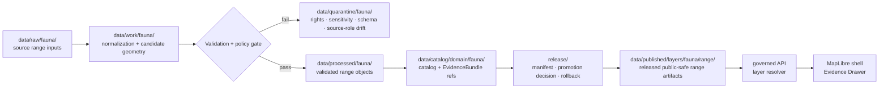

<!-- [KFM_META_BLOCK_V2]
doc_id: kfm://data/published/layers/fauna/range-readme
name: Fauna Range Published Layer README
path: data/published/layers/fauna/range/README.md
type: data-lane-readme
version: v0.1.0
status: draft
owners:
  - <fauna-lane-steward>
  - <release-steward>
  - <map-layer-steward>
created: 2026-06-26
updated: 2026-06-26
policy_label: public
truth_posture: cite-or-abstain
lifecycle_phase: published
responsibility_root: data/
domain: fauna
artifact_family: released-public-safe-range-layer
sensitivity_posture: public-non-sensitive-ranges; deny-exact-sensitive-sites; route sensitive-public-derivatives-through-generalization
related:
  - ../../README.md
  - ../README.md
  - ../range_generalized/README.md
  - ../../../../../docs/doctrine/directory-rules.md
  - ../../../../../docs/domains/fauna/README.md
  - ../../../../../docs/domains/fauna/FILE_SYSTEM_PLAN.md
  - ../../../../../docs/standards/PMTILES.md
  - ../../../../../data/registry/layers/README.md
  - ../../../../../release/manifests/README.md
tags:
  - kfm
  - data
  - published
  - layers
  - fauna
  - range
  - distribution
  - public-safe
  - geoprivacy
  - evidence-first
notes:
  - "This README documents the public-safe fauna range layer publication lane."
  - "This path is for released range artifacts, not release decisions, proof bundles, receipts, or canonical processed records."
  - "Sensitive exact sites and occurrence-derived exact locations are denied from this path. Public derivatives for sensitive taxa should normally route through range_generalized or another explicitly approved generalized layer lane."
[/KFM_META_BLOCK_V2] -->

<a id="top"></a>

<div align="center">

# Fauna Range Layers

**Released public-safe species range and distribution-layer artifacts for the Fauna domain.**


</div>

---

## Quick reference

| Field | Value |
|---|---|
| **Path** | `data/published/layers/fauna/range/` |
| **Responsibility root** | `data/` |
| **Lifecycle phase** | `published/` — released public-safe artifacts only |
| **Domain lane** | `fauna/` |
| **Artifact family** | Public-safe species range / distribution layer artifacts and sidecars |
| **Primary consumers** | Governed API layer resolver, MapLibre shell, Evidence Drawer, public-safe exports, release QA |
| **Release authority** | `release/manifests/` and `release/promotion_decisions/`, not this directory |
| **Proof authority** | `data/proofs/` and `data/receipts/`, not this directory |
| **Default failure posture** | `ABSTAIN` when evidence, source role, rights, policy, release, or rollback state cannot be resolved; `DENY` exact sensitive locations |

---

## 1. Purpose

This directory holds **released public-safe fauna range layer artifacts**. Typical artifacts represent species ranges, distribution polygons, seasonal ranges, coarse habitat-linked ranges, or other map-ready range products that have passed KFM evidence, policy, rights, validation, review, release, and rollback gates.

A range layer is a downstream carrier. It does not replace the source record, processed domain object, catalog record, EvidenceBundle, policy decision, or release manifest. Every public claim made from a range artifact must remain inspectable through the governed KFM chain.

> [!IMPORTANT]
> Presence in `data/published/layers/fauna/range/` means the artifact is in the published artifact lane, but it does **not** by itself prove that release is valid. Verify the corresponding `ReleaseManifest`, `PromotionDecision`, proof pack, receipt chain, layer registry entry, and rollback target before exposing or citing the layer.

---

## 2. What belongs here

| Artifact | Example name | Required condition before placement |
|---|---|---|
| Public-safe range vector bundle | `fauna_range_public_vYYYYMMDD.pmtiles` or `fauna_range_public_vYYYYMMDD.geojson` | ReleaseManifest exists; source role and rights are resolved; no exact sensitive sites |
| Public-safe range GeoParquet | `fauna_range_public_vYYYYMMDD.geoparquet` | Released analytical/export artifact with digest and manifest reference |
| Tile metadata sidecar | `fauna_range_public_vYYYYMMDD.tiles.json` | References bounds, zoom range, source lineage, schema version, layer id, release id, and digest |
| Integrity sidecar | `fauna_range_public_vYYYYMMDD.sha256` | Digest generated from the exact released bytes |
| Layer descriptor | `layer.manifest.json` or `layer.json` | Points to governed layer registry and release manifest |
| Field allowlist | `range_fields.allowlist.json` | Documents public fields included in the released artifact |
| Optional style fragment | `style.fragment.json` | Rendering hints only; no proof, policy, or release authority |
| README / release-local guidance | `README.md` | Explains boundaries for this lane or a release-id subfolder |

Artifacts in this folder should be safe for public map consumption. The upstream chain must already have resolved taxon identity, source role, rights, spatial generalization, temporal validity, evidence references, policy decisions, release decisions, and rollback.

---

## 3. What does not belong here

| Do not place | Correct home | Reason |
|---|---|---|
| RAW source payloads | `data/raw/fauna/<source_id>/<run_id>/` | RAW is intake, not public release |
| Normalization scratch outputs | `data/work/fauna/<run_id>/` | WORK may contain unresolved candidate state |
| Failed or rights-unclear material | `data/quarantine/fauna/<reason>/<run_id>/` | Quarantine is not a publication lane |
| Canonical processed range records | `data/processed/fauna/...` | Processed does not imply public release |
| Sensitive exact sites: nests, dens, roosts, hibernacula, spawning sites | restricted processed/catalog lanes only | Public exact location is denied |
| Sensitive-taxon exact occurrence-derived range | restricted processed/catalog lanes, then generalized derivative if approved | Exact occurrence-derived sensitive geometry must not be public |
| Sensitive-taxon generalized public range artifact | usually `data/published/layers/fauna/range_generalized/` | Keeps sensitive public derivatives visibly separate |
| Release manifest | `release/manifests/` | Release decisions are not published bytes |
| Promotion decision | `release/promotion_decisions/` | Decision authority belongs to `release/` |
| EvidenceBundle / ProofPack | `data/proofs/` | Proof authority stays separate from delivery artifacts |
| Run / validation / redaction receipts | `data/receipts/` | Receipts are process memory, not range payloads |
| Private steward notes | restricted review/control-plane path | May contain sensitive rationale or non-public review details |

---

## 4. Publication boundary



<!-- END OF MERMAID -->

The normal public path is:

```text
released range artifact
→ ReleaseManifest
→ governed API / layer resolver
→ MapLibre shell
→ Evidence Drawer / citation surface
```

The forbidden shortcut is:

```text
source range file
→ direct public map layer
```

---

## 5. Range-layer safety rules

| Rule | Required behavior |
|---|---|
| **Range is not occurrence truth** | Range polygons summarize or model distribution; they must not be treated as exact occurrence evidence. |
| **Source role must be explicit** | Regulatory range, modeled range, observation-derived range, and administrative range are different claim types. |
| **No sensitive exact site leakage** | Nests, dens, roosts, hibernacula, spawning sites, telemetry points, and exact steward-controlled locations are denied from this path. |
| **Sensitive derivatives stay visibly generalized** | Public derivatives for sensitive taxa should normally land in `range_generalized/` or another approved generalized lane. |
| **Evidence references are required** | Range features must carry safe evidence references or resolver keys sufficient for EvidenceBundle lookup. |
| **Temporal support must be visible** | Valid time, source time, retrieval time, release time, and correction time must not collapse into one undated map. |
| **Rights must be resolved** | Source terms must allow this public derivative and the declared downstream use. |
| **Tile/style fields are allowlisted** | Public files contain only approved fields; hiding fields in a style is not redaction. |
| **Release is reversible** | Every public artifact has a rollback target and correction/withdrawal path. |

---

## 6. Expected artifact layout

Small early releases may remain flat. Once multiple versions exist, prefer release-id folders so release review, rollback, and digest verification stay inspectable.

```text
data/published/layers/fauna/range/
├── README.md
├── <release_id>/
│   ├── fauna_range_public.pmtiles
│   ├── fauna_range_public.geoparquet
│   ├── fauna_range_public.sha256
│   ├── layer.manifest.json
│   ├── range_fields.allowlist.json
│   ├── style.fragment.json
│   └── README.md                  # optional release-local note
└── latest.json                     # optional generated pointer from ReleaseManifest
```

`latest.json` must be generated from release state, not hand-edited. If release state or rollback state is missing, remove or withhold the pointer.

---

## 7. Minimum layer manifest expectations

A layer manifest or sidecar for this directory should include at least:

| Field | Purpose |
|---|---|
| `layer_id` | Stable layer id, for example `fauna.range.public` |
| `domain` | `fauna` |
| `artifact_family` | `range` |
| `claim_character` | `observed_summary`, `modeled_range`, `regulatory_range`, `administrative_range`, or equivalent controlled value |
| `release_id` | Pointer to `release/manifests/<release_id>.json` |
| `artifact_href` | Relative or release-resolved artifact path |
| `artifact_sha256` | Digest of released bytes |
| `format` | `pmtiles`, `geoparquet`, `geojson`, or other approved public format |
| `bounds` | Public-safe spatial bounds |
| `minzoom` / `maxzoom` | Tile zoom range, when tiled |
| `taxon_scope` | Taxon or taxon group represented by the artifact |
| `temporal_scope` | Valid/source/release temporal support |
| `field_allowlist_ref` | Pointer to public field allowlist |
| `evidence_bundle_refs` | Safe references or resolver keys |
| `policy_decision_ref` | Release policy decision reference |
| `redaction_receipt_refs` | Required if derived from sensitive or restricted material |
| `rollback_ref` | Rollback card or rollback target |
| `correction_path` | Where corrections, supersessions, or withdrawals are recorded |

---

## 8. Validation checklist

Before adding or updating a range artifact here, reviewers should be able to answer **yes** to each item.

- [ ] Every contributing source has a source descriptor.
- [ ] Source role is explicit and not inferred from convenience.
- [ ] Taxon identity and taxon crosswalks are resolved or uncertainty is labeled.
- [ ] Rights and license posture allow public range publication.
- [ ] Sensitive exact sites and exact restricted locations are absent.
- [ ] Sensitive-taxon public derivatives are generalized and routed to the correct public lane.
- [ ] Field allowlist has been checked against the actual released bytes.
- [ ] EvidenceBundle references resolve through governed lookup.
- [ ] Layer registry entry references this artifact family and release id.
- [ ] ReleaseManifest and PromotionDecision exist under `release/`.
- [ ] Rollback card or rollback target exists.
- [ ] Correction and withdrawal paths are documented.
- [ ] Public UI consumes the layer through governed APIs or release-resolved artifact manifests, not RAW, WORK, QUARANTINE, or internal stores.

---

## 9. Suggested checks

Use the repository validator orchestrator when available:

```bash
python tools/validate_all.py
```

Potential range-specific checks should cover:

```text
tools/validators/domains/fauna/taxonomy_resolution/
tools/validators/domains/fauna/source_role_authority/
tools/validators/domains/fauna/range_publication/
tools/validators/domains/fauna/redaction_receipt/
tools/validators/domains/fauna/tile_field_allowlist/
tests/domains/fauna/sensitivity/
tests/domains/fauna/tiles/
```

If a validator is not implemented yet, mark the candidate `NEEDS VERIFICATION` rather than treating the gap as a pass.

---

## 10. Map consumer rules

Consumers should:

1. Load only release-resolved artifacts or manifests.
2. Resolve feature details through the governed API or Evidence Drawer payload.
3. Display release, stale, sensitivity, and correction state where available.
4. Avoid presenting range polygons as exact occurrence evidence.
5. Preserve `ABSTAIN`, `DENY`, and `ERROR` outcomes in UI state.
6. Avoid direct reads from RAW, WORK, QUARANTINE, or internal processed stores.
7. Keep AI and Focus Mode answers subordinate to evidence, policy, review, and release state.

---

## 11. Common failure modes

| Failure | Outcome |
|---|---|
| Range artifact includes exact sensitive sites or exact restricted coordinates | `DENY` release; withdraw or quarantine artifact |
| Range artifact lacks evidence references | `ABSTAIN` public claims; block Evidence Drawer claims |
| Range exists without ReleaseManifest | Not a valid public layer |
| Regulatory range is presented as observed occurrence evidence | Source-role violation; correct or withdraw claim |
| Modeled range lacks model/source/version notes | `ABSTAIN` model-specific claims until documented |
| Source rights are unresolved | `DENY` or hold in quarantine |
| Style hides disallowed fields but payload still contains them | Publication leak; treat as incident |
| `latest.json` points to an artifact without rollback target | Release drift; remove alias until fixed |

---

## 12. Maintainer checklist

- Keep this folder limited to released public-safe range-layer artifacts and direct sidecars.
- Put release decisions in `release/`, not here.
- Put proof and receipt objects in `data/proofs/` and `data/receipts/`, not here.
- Keep exact sensitive locations and steward-only details out of this path.
- Use `range_generalized/` for sensitive-taxon public derivatives unless a release decision explicitly justifies otherwise.
- Prefer release-id subfolders when more than one version exists.
- Update this README when artifact naming, manifest shape, validator paths, or release gates change.

---

## 13. Status notes

| Claim | Status |
|---|---|
| This README defines the intended boundary for `data/published/layers/fauna/range/`. | **CONFIRMED authored** |
| The target path exists in the live repository. | **CONFIRMED by GitHub contents API during this edit** |
| Actual released fauna range artifacts exist here. | **UNKNOWN** |
| Range publication validators are implemented and wired in CI. | **NEEDS VERIFICATION** |
| Any specific source has been approved for public range publication. | **NEEDS VERIFICATION** |
| The current public UI loads this layer through a governed API. | **UNKNOWN** |

---

## Related files

- [`../README.md`](../README.md) — fauna published layer lane
- [`../range_generalized/README.md`](../range_generalized/README.md) — generalized public derivatives for sensitive/public-safe range outputs
- [`../../README.md`](../../README.md) — published layer family lane
- [`../../../README.md`](../../../README.md) — `data/published/` lane
- [`../../../../../docs/doctrine/directory-rules.md`](../../../../../docs/doctrine/directory-rules.md) — placement and lifecycle doctrine
- [`../../../../../docs/domains/fauna/FILE_SYSTEM_PLAN.md`](../../../../../docs/domains/fauna/FILE_SYSTEM_PLAN.md) — fauna path and sensitivity placement plan
- [`../../../../../data/registry/layers/README.md`](../../../../../data/registry/layers/README.md) — layer registry entry point
- [`../../../../../release/manifests/README.md`](../../../../../release/manifests/README.md) — release manifest authority

---

<div align="center">

**KFM rule:** a range layer is a public-safe representation surface, not occurrence truth, source authority, policy authority, or release authority.

[Back to top](#top)

</div>
