<!-- [KFM_META_BLOCK_V2]
doc_id: kfm://data/published/layers/fauna/range-generalized-readme
name: Fauna Generalized Range Published Layer README
path: data/published/layers/fauna/range_generalized/README.md
type: data-lane-readme
version: v0.1.0
status: draft
owners:
  - <fauna-lane-steward>
  - <geoprivacy-steward>
  - <release-steward>
  - <map-layer-steward>
created: 2026-06-26
updated: 2026-06-26
policy_label: public
truth_posture: cite-or-abstain
lifecycle_phase: published
responsibility_root: data/
domain: fauna
artifact_family: released-public-safe-generalized-range-layer
sensitivity_posture: generalized-public-derivative-only; deny-exact-sensitive-geometry; require-redaction-receipts-for-sensitive-derived-inputs
related:
  - ../../README.md
  - ../README.md
  - ../range/README.md
  - ../../../../../docs/doctrine/directory-rules.md
  - ../../../../../docs/domains/fauna/README.md
  - ../../../../../docs/domains/fauna/FILE_SYSTEM_PLAN.md
  - ../../../../../docs/standards/PMTILES.md
  - ../../../../../data/registry/layers/README.md
  - ../../../../../release/manifests/README.md
tags:
  - kfm
  - data
  - published
  - layers
  - fauna
  - range-generalized
  - generalized-range
  - geoprivacy
  - redaction
  - public-safe
  - evidence-first
notes:
  - "This README documents the public-safe generalized fauna range publication lane."
  - "This path is for released generalized range artifacts and direct sidecars only."
  - "Exact sensitive sites, exact occurrence geometry, restricted telemetry, and steward-controlled coordinates are denied from this path."
  - "Generalization is a governed transform that must be backed by receipts, policy decisions, evidence references, validation, release state, and rollback."
[/KFM_META_BLOCK_V2] -->

<a id="top"></a>

<div align="center">

# Fauna Generalized Range Layers

**Released public-safe generalized range artifacts for sensitive-aware fauna map layers.**


</div>

---

## Quick reference

| Field | Value |
|---|---|
| **Path** | `data/published/layers/fauna/range_generalized/` |
| **Responsibility root** | `data/` |
| **Lifecycle phase** | `published/` — released public-safe artifacts only |
| **Domain lane** | `fauna/` |
| **Artifact family** | Generalized public-safe range artifacts and sidecars |
| **Primary consumers** | Governed API layer resolver, MapLibre shell, Evidence Drawer, public-safe exports, release QA |
| **Release authority** | `release/manifests/` and `release/promotion_decisions/`, not this directory |
| **Proof authority** | `data/proofs/` and `data/receipts/`, not this directory |
| **Default failure posture** | `ABSTAIN` when evidence, source role, rights, transform, release, or rollback state cannot be resolved; `DENY` exact sensitive geometry |

---

## 1. Purpose

This directory holds **released public-safe generalized fauna range artifacts**. It is the preferred public lane for range products that are derived from sensitive, restricted, steward-controlled, or occurrence-backed source material but have passed an approved geoprivacy/generalization transform.

Generalized range artifacts may include coarse range polygons, density-safe tiles, generalized distribution envelopes, public-safe grid or hex summaries, or other map-ready derivatives that intentionally reduce precision and remove sensitive fields.

A generalized range layer is still a downstream carrier. It does not replace the source record, processed object, catalog record, EvidenceBundle, redaction receipt, policy decision, or release manifest.

> [!IMPORTANT]
> Generalization is not decoration and is not a MapLibre style trick. The released bytes must already be public-safe. If sensitive coordinates, private fields, or steward-only rationale remain inside the payload, the artifact must be withdrawn or quarantined.

---

## 2. What belongs here

| Artifact | Example name | Required condition before placement |
|---|---|---|
| Generalized range PMTiles | `fauna_range_generalized_vYYYYMMDD.pmtiles` | ReleaseManifest exists; transform receipt exists; payload contains no exact sensitive geometry |
| Generalized range GeoParquet | `fauna_range_generalized_vYYYYMMDD.geoparquet` | Public-safe generalized export with digest and manifest reference |
| Generalized grid or hex summary | `fauna_range_generalized_grid_vYYYYMMDD.pmtiles` | Cell size, suppression rules, and minimum support thresholds are documented |
| Tile metadata sidecar | `fauna_range_generalized_vYYYYMMDD.tiles.json` | References bounds, zoom range, transform, schema version, layer id, release id, and digest |
| Integrity sidecar | `fauna_range_generalized_vYYYYMMDD.sha256` | Digest generated from the exact released bytes |
| Layer descriptor | `layer.manifest.json` or `layer.json` | Points to governed layer registry and release manifest |
| Redaction/generalization summary | `generalization.summary.json` | Public-safe description of transform method, thresholds, and withheld details |
| Field allowlist | `range_generalized_fields.allowlist.json` | Documents public fields included in the released artifact |
| Optional style fragment | `style.fragment.json` | Rendering hints only; no proof, policy, redaction, or release authority |
| README / release-local guidance | `README.md` | Explains boundaries for this lane or a release-id subfolder |

Artifacts in this folder must be safe as bytes, not merely safe as styled output. Public clients should be able to download the artifact without receiving exact sensitive geometry, restricted fields, private steward notes, or non-public review rationale.

---

## 3. What does not belong here

| Do not place | Correct home | Reason |
|---|---|---|
| RAW source payloads | `data/raw/fauna/<source_id>/<run_id>/` | RAW is intake, not public release |
| Normalization scratch outputs | `data/work/fauna/<run_id>/` | WORK may contain unresolved candidate state |
| Failed or rights-unclear material | `data/quarantine/fauna/<reason>/<run_id>/` | Quarantine is not a publication lane |
| Canonical processed range records | `data/processed/fauna/...` | Processed does not imply public release |
| Exact occurrence points | restricted processed/catalog lanes, or non-sensitive occurrence tiles when approved | Generalized range is not exact occurrence publication |
| Exact sensitive sites: nests, dens, roosts, hibernacula, spawning sites | restricted processed/catalog lanes only | Public exact sensitive locations are denied |
| Telemetry tracks or high-frequency movement traces | restricted processed/catalog lanes only | Movement traces can reveal sensitive locations even without labels |
| Private steward notes or restricted rationale | restricted review/control-plane path | May contain sensitive or non-public information |
| Release manifest | `release/manifests/` | Release authority belongs to `release/` |
| Promotion decision | `release/promotion_decisions/` | Decision authority belongs to `release/` |
| EvidenceBundle / ProofPack | `data/proofs/` | Proof authority stays separate from delivery artifacts |
| Redaction or validation receipts | `data/receipts/` | Receipts are process memory, not the layer payload |
| Non-generalized public range artifact | `../range/` | Keeps normal public range and generalized derivatives distinct |

---

## 4. Publication boundary

```mermaid
flowchart LR
    RAW["data/raw/fauna/<br/>sensitive or mixed source inputs"] --> WORK["data/work/fauna/<br/>normalization + candidate geometry"]
    WORK --> SENS{Sensitivity + rights gate}
    SENS -->|fail / unclear| QUAR["data/quarantine/fauna/<br/>rights · sensitivity · source-role drift"]
    SENS -->|restricted exact| REST["restricted processed/catalog lanes<br/>not public"]
    REST --> GEN["geoprivacy transform<br/>generalize · suppress · redact"]
    WORK -->|public-safe non-sensitive| RANGE["data/published/layers/fauna/range/<br/>normal public range lane"]
    GEN --> RECEIPT["data/receipts/<br/>redaction + transform receipts"]
    GEN --> PROC["data/processed/fauna/<br/>validated generalized derivative"]
    PROC --> CAT["data/catalog/domain/fauna/<br/>catalog + EvidenceBundle refs"]
    CAT --> REL["release/<br/>manifest · promotion decision · rollback"]
    REL --> PUB["data/published/layers/fauna/range_generalized/<br/>released generalized range artifacts"]
    PUB --> API["governed API<br/>layer resolver"]
    API --> UI["MapLibre shell<br/>Evidence Drawer"]
```



<!-- END OF MERMAID -->

The normal public path is:

```text
generalized released artifact
→ transform/redaction receipt references
→ ReleaseManifest
→ governed API / layer resolver
→ MapLibre shell
→ Evidence Drawer / citation surface
```

The forbidden shortcut is:

```text
sensitive source geometry
→ style-level blur or hidden fields
→ public map layer
```

---

## 5. Generalization rules

| Rule | Required behavior |
|---|---|
| **Bytes must be safe** | Sensitive geometry and restricted attributes must be removed or transformed before publication. |
| **Transform must be inspectable** | Public-safe transform summary and restricted receipt references must identify what generalization happened. |
| **No style-only redaction** | Hiding points, fields, or labels in a style file is not publication control. |
| **Minimum support matters** | Grid, hex, or density products must define minimum support or suppression thresholds where relevant. |
| **Precision must match risk** | More sensitive taxa, seasons, sites, or source types require stronger generalization or denial. |
| **Source role must remain visible** | Modeled, observed-summary, regulatory, administrative, and expert-curated ranges are different claim types. |
| **Evidence is still required** | Generalized features must carry safe evidence references or resolver keys sufficient for governed lookup. |
| **Temporal context must survive** | Valid time, source time, transform time, release time, and correction time must not collapse into one undated layer. |
| **AI is not release authority** | AI may summarize or help inspect, but cannot replace evidence, steward review, policy decision, or release manifest. |
| **Rollback is mandatory** | Every public generalized artifact must be tied to a rollback target and correction/withdrawal path. |

---

## 6. Expected artifact layout

Small early releases may remain flat. Once multiple versions exist, prefer release-id folders so transform, release, rollback, and digest verification stay inspectable.

```text
data/published/layers/fauna/range_generalized/
├── README.md
├── <release_id>/
│   ├── fauna_range_generalized.pmtiles
│   ├── fauna_range_generalized.geoparquet
│   ├── fauna_range_generalized.sha256
│   ├── layer.manifest.json
│   ├── range_generalized_fields.allowlist.json
│   ├── generalization.summary.json
│   ├── style.fragment.json
│   └── README.md                  # optional release-local note
└── latest.json                     # optional generated pointer from ReleaseManifest
```

`latest.json` must be generated from release state, not hand-edited. If release state, transform receipt state, or rollback state is missing, remove or withhold the pointer.

---

## 7. Minimum manifest expectations

A layer manifest or sidecar for this directory should include at least:

| Field | Purpose |
|---|---|
| `layer_id` | Stable layer id, for example `fauna.range.generalized.public` |
| `domain` | `fauna` |
| `artifact_family` | `range_generalized` |
| `claim_character` | `generalized_range`, `density_safe_summary`, `coarse_distribution`, or equivalent controlled value |
| `release_id` | Pointer to `release/manifests/<release_id>.json` |
| `artifact_href` | Relative or release-resolved artifact path |
| `artifact_sha256` | Digest of released bytes |
| `format` | `pmtiles`, `geoparquet`, `geojson`, or other approved public format |
| `bounds` | Public-safe generalized spatial bounds |
| `minzoom` / `maxzoom` | Tile zoom range, when tiled |
| `taxon_scope` | Taxon or taxon group represented by the artifact |
| `sensitivity_basis` | Public-safe sensitivity classification or sensitivity-rule reference |
| `generalization_method` | Public-safe method label such as `coarsened_polygon`, `grid_summary`, `hex_summary`, `range_envelope`, or `suppressed_density` |
| `generalization_parameters_public` | Public-safe parameters such as grid size or coarse class; omit restricted details |
| `minimum_support_rule` | Suppression or aggregation rule, when relevant |
| `temporal_scope` | Valid/source/transform/release temporal support |
| `field_allowlist_ref` | Pointer to public field allowlist |
| `evidence_bundle_refs` | Safe references or resolver keys |
| `redaction_receipt_refs` | Required for sensitive-derived or restricted-derived inputs |
| `policy_decision_ref` | Release policy decision reference |
| `rollback_ref` | Rollback card or rollback target |
| `correction_path` | Where corrections, supersessions, or withdrawals are recorded |

---

## 8. Validation checklist

Before adding or updating a generalized range artifact here, reviewers should be able to answer **yes** to each item.

- [ ] Every contributing source has a source descriptor.
- [ ] Source role is explicit and not inferred from convenience.
- [ ] Taxon identity and taxon crosswalks are resolved or uncertainty is labeled.
- [ ] Rights and license posture allow this public generalized derivative.
- [ ] Sensitive exact sites, exact occurrence points, telemetry traces, and restricted attributes are absent from the released bytes.
- [ ] Generalization method, public parameters, and suppression rules are documented.
- [ ] Redaction/generalization receipts exist for sensitive-derived or restricted-derived inputs.
- [ ] Field allowlist has been checked against the actual released bytes.
- [ ] EvidenceBundle references resolve through governed lookup.
- [ ] Layer registry entry references this artifact family and release id.
- [ ] ReleaseManifest and PromotionDecision exist under `release/`.
- [ ] Rollback card or rollback target exists.
- [ ] Correction and withdrawal paths are documented.
- [ ] Public UI consumes the layer through governed APIs or release-resolved artifact manifests, not RAW, WORK, QUARANTINE, restricted stores, or direct model output.

---

## 9. Suggested checks

Use the repository validator orchestrator when available:

```bash
python tools/validate_all.py
```

Potential generalized-range-specific checks should cover:

```text
tools/validators/domains/fauna/taxonomy_resolution/
tools/validators/domains/fauna/source_role_authority/
tools/validators/domains/fauna/sensitivity_classification/
tools/validators/domains/fauna/geoprivacy_transform/
tools/validators/domains/fauna/redaction_receipt/
tools/validators/domains/fauna/range_generalized_publication/
tools/validators/domains/fauna/tile_field_allowlist/
tests/domains/fauna/sensitivity/
tests/domains/fauna/geoprivacy/
tests/domains/fauna/tiles/
```

If a validator is not implemented yet, mark the candidate `NEEDS VERIFICATION` rather than treating the gap as a pass.

---

## 10. Map consumer rules

Consumers should:

1. Load only release-resolved artifacts or manifests.
2. Resolve feature details through the governed API or Evidence Drawer payload.
3. Display release, stale, sensitivity, transform, and correction state where available.
4. Avoid presenting generalized ranges as exact occurrence evidence.
5. Preserve `ABSTAIN`, `DENY`, and `ERROR` outcomes in UI state.
6. Avoid direct reads from RAW, WORK, QUARANTINE, restricted processed/catalog lanes, or internal stores.
7. Keep AI and Focus Mode answers subordinate to evidence, policy, review, redaction, and release state.

---

## 11. Common failure modes

| Failure | Outcome |
|---|---|
| Released payload still contains exact sensitive geometry | `DENY` release; withdraw or quarantine artifact |
| Generalization exists only in style, not bytes | Publication leak; treat as incident |
| Redaction/generalization receipt is missing | `ABSTAIN` public safety claim; block release for sensitive-derived material |
| Minimum support threshold is undocumented | `NEEDS VERIFICATION`; withhold density/grid claims |
| Regulatory range is presented as observed occurrence evidence | Source-role violation; correct or withdraw claim |
| Modeled generalized range lacks model/source/version notes | `ABSTAIN` model-specific claims until documented |
| Source rights are unresolved | `DENY` or hold in quarantine |
| Field allowlist differs from actual released payload | Publication leak; correct payload before release |
| `latest.json` points to an artifact without rollback target | Release drift; remove alias until fixed |

---

## 12. Maintainer checklist

- Keep this folder limited to released public-safe generalized range artifacts and direct sidecars.
- Put release decisions in `release/`, not here.
- Put proof and receipt objects in `data/proofs/` and `data/receipts/`, not here.
- Keep exact sensitive locations, telemetry traces, and steward-only details out of this path.
- Use `../range/` for non-sensitive normal public range artifacts.
- Prefer release-id subfolders when more than one version exists.
- Update this README when artifact naming, manifest shape, geoprivacy transform rules, validator paths, or release gates change.

---

## 13. Status notes

| Claim | Status |
|---|---|
| This README defines the intended boundary for `data/published/layers/fauna/range_generalized/`. | **CONFIRMED authored** |
| The target path exists in the live repository. | **CONFIRMED by GitHub contents API during this edit** |
| Actual released generalized fauna range artifacts exist here. | **UNKNOWN** |
| Generalized range publication validators are implemented and wired in CI. | **NEEDS VERIFICATION** |
| Any specific source has been approved for public generalized range publication. | **NEEDS VERIFICATION** |
| The current public UI loads this layer through a governed API. | **UNKNOWN** |

---

## Related files

- [`../README.md`](../README.md) — fauna published layer lane
- [`../range/README.md`](../range/README.md) — normal public-safe range lane
- [`../../README.md`](../../README.md) — published layer family lane
- [`../../../README.md`](../../../README.md) — `data/published/` lane
- [`../../../../../docs/doctrine/directory-rules.md`](../../../../../docs/doctrine/directory-rules.md) — placement and lifecycle doctrine
- [`../../../../../docs/domains/fauna/FILE_SYSTEM_PLAN.md`](../../../../../docs/domains/fauna/FILE_SYSTEM_PLAN.md) — fauna path and sensitivity placement plan
- [`../../../../../data/registry/layers/README.md`](../../../../../data/registry/layers/README.md) — layer registry entry point
- [`../../../../../release/manifests/README.md`](../../../../../release/manifests/README.md) — release manifest authority

---

<div align="center">

**KFM rule:** generalized public range is a governed derivative, not a shortcut around evidence, redaction, policy, release, or rollback.

[Back to top](#top)

</div>
