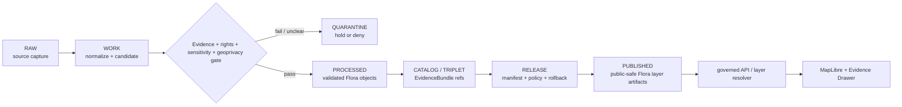

<!-- [KFM_META_BLOCK_V2]
doc_id: kfm://data/published/layers/flora/readme
name: Flora Published Layers README
path: data/published/layers/flora/README.md
type: data-lane-readme
version: v0.1.0
status: draft
owners:
  - <flora-domain-steward>
  - <release-steward>
  - <map-layer-steward>
  - <sensitivity-steward>
created: 2026-06-27
updated: 2026-06-27
policy_label: restricted-review
truth_posture: cite-or-abstain
lifecycle_phase: published
responsibility_root: data/
domain: flora
artifact_family: released-public-safe-flora-map-layers
sensitivity_posture: fail-closed-for-rare-protected-cultural-steward-reviewed-flora; geoprivacy-required; public-safe-derivatives-only; release-required
related:
  - ../README.md
  - ../../README.md
  - ../../../README.md
  - ../../../../docs/domains/flora/ARCHITECTURE.md
  - ../../../../docs/domains/flora/API_CONTRACTS.md
  - ../../../../docs/domains/flora/RELEASE_INDEX.md
  - ../../../../contracts/domains/flora/flora_occurrence.md
  - ../../../../contracts/domains/flora/occurrence_public.md
  - ../../../../contracts/domains/flora/rare_plant_record.md
  - ../../../../contracts/domains/flora/phenology_observation.md
  - ../../../processed/flora/README.md
  - ../../../proofs/proof_pack/flora/README.md
  - ../../../../release/manifests/README.md
tags:
  - kfm
  - data
  - published
  - layers
  - flora
  - rare-plants
  - geoprivacy
  - occurrence-public
  - vegetation-community
  - range-polygon
  - release
  - evidence-first
notes:
  - "This README documents the released public-safe Flora published-layer lane."
  - "Exact rare, protected, culturally sensitive, or steward-reviewed flora geometry is denied from public layers unless a documented geoprivacy transform and review state allow a public-safe derivative."
  - "Published artifacts here are downstream delivery artifacts; release, proof, receipt, policy, source, processed, and catalog authority stay in their owning roots."
[/KFM_META_BLOCK_V2] -->

<a id="top"></a>

# Flora Published Layers

Released public-safe flora layer artifacts for governed map and API delivery.

<p>
  
  
  
  
  
  
</p>

**Quick links:** [Scope](#scope) · [Repo fit](#repo-fit) · [Layer families](#layer-families) · [Inputs](#inputs) · [Exclusions](#exclusions) · [Directory map](#directory-map) · [Publication boundary](#publication-boundary) · [Required checks](#required-checks-before-use) · [Status notes](#status-notes)

> [!CAUTION]
> Flora layers are public only after evidence, rights, sensitivity, review, release, correction, and rollback gates close. Exact rare-plant, protected-plant, culturally sensitive, steward-reviewed, or sensitive-join geometry must fail closed unless a documented geoprivacy transform allows a public-safe derivative.

---

## Scope

This directory holds released public-safe Flora layer artifacts. These layers may support map display, governed API delivery, Evidence Drawer lookups, public occurrence views, vegetation-community context, public-safe range or distribution surfaces, invasive-plant context, phenology views, and restoration-context views after the normal KFM release gates have passed.

A Flora layer here is a downstream delivery artifact. It is not the source record, exact occurrence record, RarePlantRecord, botanical authority, catalog truth, proof bundle, release decision, redaction receipt authority, registry authority, or AI interpretation.

---

## Repo fit

| Field | Value |
|---|---|
| Path | `data/published/layers/flora/` |
| Responsibility root | `data/` |
| Lifecycle phase | `published/` |
| Domain lane | `flora` |
| Artifact role | Released public-safe flora layer bytes and sidecars |
| Public surface posture | Governed API / release-resolved artifacts only |
| Release authority | `release/`, not this directory |
| Proof authority | `data/proofs/` and `data/receipts/`, not this directory |
| Source registry authority | `data/registry/sources/flora/`, not this directory |
| Default failure posture | `DENY`, `HOLD`, `RESTRICT`, or `ABSTAIN` when evidence, source role, rights, sensitivity, geoprivacy, review, release, correction, or rollback support is insufficient |

---

## Layer families

The following layer families are appropriate only when each artifact is release-approved and public-safe:

| Layer family | Public boundary |
|---|---|
| Public flora occurrences | Generalized or non-sensitive occurrence geometry only; exact sensitive records denied |
| Vegetation communities | Public-safe polygons with classification, source role, and caveats preserved |
| Range / distribution surfaces | Modeled or aggregated surface; must not be presented as raw occurrence truth |
| Invasive plant context | Public-safe detection or management context; private-land and sensitive joins reviewed |
| Phenology observations | Time-scoped public-safe observations with method and temporal caveats |
| Restoration planting context | Public-safe restoration summaries; private-land or stewardship details reviewed |
| Geoprivacy-generalized rare-plant context | Generalized, withheld, staged, or denied geometry only with review and transform support |

---

## Inputs

Accepted content is limited to release-approved, public-safe derivatives such as:

- PMTiles, GeoParquet, GeoJSON, vector-tile, raster-tile, or API payload artifacts;
- public occurrence, generalized occurrence, vegetation-community, range/distribution, invasive, phenology, or restoration-context layer artifacts;
- layer manifests, tile metadata, caveat summaries, review summaries, and release pointers;
- field allowlists, digests, and generated release metadata;
- public-safe geoprivacy summaries that describe the release class without exposing exact restricted geometry;
- release-local notes that explain artifact contents without replacing proof, receipt, policy, or release authority.

---

## Exclusions

| Do not place here | Correct authority home |
|---|---|
| RAW source captures or source mirrors | `data/raw/flora/` or source-specific intake |
| WORK files, candidates, unresolved joins, or review drafts | `data/work/flora/` |
| Quarantined or unclear material | `data/quarantine/flora/` |
| Canonical processed Flora objects | `data/processed/flora/` |
| Catalog records, triplets, or graph truth | `data/catalog/` and triplet/projection lanes |
| EvidenceBundle / ProofPack | `data/proofs/` |
| Validation, transform, geoprivacy, redaction, build, or release receipts | `data/receipts/` or proof-pack lanes |
| Release manifests or promotion decisions | `release/` |
| Source descriptors or source activation records | `data/registry/sources/flora/` |
| Exact rare-plant, protected-plant, culturally sensitive, or steward-only geometry | Restricted governed lanes only; not public published layers |
| Obscured coordinates reconstructed into exact locations | Not allowed; quarantine and review |
| Sensitive joins released without geoprivacy receipt and review | Not allowed; quarantine and review |
| Direct model-generated claims | Governed answer/provenance paths only |

---

## Directory map

```text
data/published/layers/flora/
├── README.md
├── <release_id>/
│   ├── flora_public.pmtiles
│   ├── flora_public.geoparquet
│   ├── flora_public.sha256
│   ├── layer.manifest.json
│   ├── fields.allowlist.json
│   ├── geoprivacy.summary.json
│   ├── review.summary.json
│   ├── caveats.summary.json
│   └── README.md
└── latest.json
```

`latest.json` must be generated from release state. Remove or withhold it when release, review, digest, registry, geoprivacy, correction, or rollback support is incomplete.

---

## Publication boundary



The forbidden shortcut is:

```text
RAW / WORK / QUARANTINE / processed candidate / direct source record / exact sensitive geometry / direct model output
→ direct public Flora layer
```

---

## Required checks before use

- [ ] Confirm the release manifest and promotion decision.
- [ ] Confirm proof and receipt closure.
- [ ] Confirm source descriptors, source roles, record-level licenses/rights, and current terms.
- [ ] Confirm sensitivity classification for taxa, sources, joins, and output products.
- [ ] Confirm geoprivacy transform, redaction receipt, reviewer attestation, or denial state where applicable.
- [ ] Confirm exact rare/protected/culturally sensitive/steward-only geometry is absent from released bytes.
- [ ] Confirm field allowlist and released-byte digest.
- [ ] Confirm layer registry entry.
- [ ] Confirm rollback target and correction path.
- [ ] Confirm `latest.json`, if present, is generated from release state.
- [ ] Confirm public clients consume this layer through governed APIs or release-resolved artifacts.
- [ ] Confirm AI summaries or Focus Mode outputs cite released evidence and do not become layer truth.

---

## Status notes

| Claim | Status |
|---|---|
| This README defines the requested path boundary. | **CONFIRMED authored** |
| The target path exists in the live repository. | **CONFIRMED by GitHub contents API during this edit** |
| Flora doctrine identifies `data/published/layers/flora/` as the released public-safe artifact lane. | **CONFIRMED by GitHub contents API during this edit** |
| Exact rare-plant public geometry fails closed unless public-safe geoprivacy release support exists. | **CONFIRMED by GitHub contents API during this edit** |
| Actual released artifacts exist in this subtree. | **UNKNOWN** |
| Validators for every Flora published layer family are implemented and wired in CI. | **NEEDS VERIFICATION** |
| A release manifest currently approves a Flora public layer. | **UNKNOWN** |

---

## Related files

- [`../README.md`](../README.md)
- [`../../README.md`](../../README.md)
- [`../../../README.md`](../../../README.md)
- [`../../../../docs/domains/flora/ARCHITECTURE.md`](../../../../docs/domains/flora/ARCHITECTURE.md)
- [`../../../../docs/domains/flora/API_CONTRACTS.md`](../../../../docs/domains/flora/API_CONTRACTS.md)
- [`../../../../docs/domains/flora/RELEASE_INDEX.md`](../../../../docs/domains/flora/RELEASE_INDEX.md)
- [`../../../../contracts/domains/flora/flora_occurrence.md`](../../../../contracts/domains/flora/flora_occurrence.md)
- [`../../../../contracts/domains/flora/occurrence_public.md`](../../../../contracts/domains/flora/occurrence_public.md)
- [`../../../../contracts/domains/flora/rare_plant_record.md`](../../../../contracts/domains/flora/rare_plant_record.md)
- [`../../../processed/flora/README.md`](../../../processed/flora/README.md)
- [`../../../proofs/proof_pack/flora/README.md`](../../../proofs/proof_pack/flora/README.md)
- [`../../../../release/manifests/README.md`](../../../../release/manifests/README.md)

---

KFM rule: this directory is a released public-safe Flora layer lane only. It is not source authority, proof authority, release authority, catalog authority, exact occurrence authority, rare-plant authority, redaction-receipt authority, registry authority, or AI truth.

[Back to top](#top)
