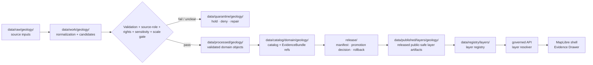

<!-- [KFM_META_BLOCK_V2]
doc_id: kfm://data/published/layers/geology/readme
name: Geology Published Layers README
path: data/published/layers/geology/README.md
type: data-lane-index-readme
version: v0.1.0
status: draft
owners:
  - <geology-domain-steward>
  - <release-steward>
  - <map-layer-steward>
created: 2026-06-26
updated: 2026-06-26
policy_label: public
truth_posture: cite-or-abstain
lifecycle_phase: published
responsibility_root: data/
domain: geology
artifact_family: released-public-safe-geology-map-layers
sensitivity_posture: public-layer-artifacts-only; policy-sensitive-details-require-review-before-public-release
related:
  - ../README.md
  - ../../README.md
  - surficial/README.md
  - ../../../../docs/doctrine/directory-rules.md
  - ../../../../docs/domains/geology/README.md
  - ../../../../docs/domains/geology/RELEASE_INDEX.md
  - ../../../registry/layers/README.md
  - ../../../../release/manifests/README.md
tags:
  - kfm
  - data
  - published
  - layers
  - geology
  - maplibre
  - public-safe
  - evidence-first
notes:
  - "This README indexes and governs public-safe Geology published layer lanes."
  - "This path is for released map-layer artifacts and immediate sidecars, not release decisions, proof bundles, receipts, source inputs, or canonical domain stores."
  - "Surficial is the only child lane confirmed by a README edit in this session; future child lanes remain PROPOSED until created and reviewed."
[/KFM_META_BLOCK_V2] -->

<a id="top"></a>

<div align="center">

# Geology Published Layers

**Released public-safe map-layer artifacts for the Geology domain.**


</div>

---

## Quick reference

| Field | Value |
|---|---|
| **Path** | `data/published/layers/geology/` |
| **Responsibility root** | `data/` |
| **Lifecycle phase** | `published/` — released public-safe artifacts only |
| **Domain lane** | `geology/` |
| **Artifact family** | Released public-safe Geology map layers and direct sidecars |
| **Confirmed child lane** | [`surficial/`](surficial/README.md) |
| **Primary consumers** | Governed API layer resolver, MapLibre shell, Evidence Drawer, public-safe exports, release QA |
| **Release authority** | `release/manifests/` and `release/promotion_decisions/`, not this directory |
| **Proof authority** | `data/proofs/` and `data/receipts/`, not this directory |
| **Default failure posture** | `ABSTAIN` unresolved public claims; `DENY` or `RESTRICT` unresolved policy-sensitive detail |

---

## 1. Purpose

This directory is the parent lane for **released public-safe Geology map-layer artifacts**. It groups map delivery outputs after evidence, source role, rights, sensitivity, validation, review, release, and rollback gates have passed.

This is an artifact delivery surface. It is not a source repository, canonical processed store, catalog truth store, proof store, release authority, review archive, or AI interpretation lane.

> [!IMPORTANT]
> A file under `data/published/layers/geology/` is not automatically valid public output. Public exposure still depends on a valid `ReleaseManifest`, `PromotionDecision`, evidence/proof closure, policy outcome, layer registry entry, digest verification, and rollback target.

---

## 2. Lane map

| Lane | Status | Purpose |
|---|---:|---|
| [`surficial/`](surficial/README.md) | **CONFIRMED README** | Public-safe surficial geology layer artifacts for unconsolidated cover and parent-material context. |
| Future child lanes | **PROPOSED** | Additional geology layer families may be added only after architecture, policy, release, and Directory Rules review. |

Do not create a new sibling lane casually. Confirm the owning root, artifact family, policy posture, layer registry shape, source role, release path, and whether an ADR or migration note is required.

---

## 3. What belongs here

| Artifact class | Examples | Boundary |
|---|---|---|
| Released public Geology layer bytes | PMTiles, GeoParquet, GeoJSON, COG sidecars | Must be public-safe as bytes, not merely safe as a rendered style |
| Layer sidecars | `layer.manifest.json`, `tiles.json`, `*.sha256`, `fields.allowlist.json` | Must point to release state, registry state, evidence refs, and digests |
| Scale / lineage summaries | `scale_lineage.summary.json`, source-map notes | Required where source scale, map edition, or compilation lineage affects interpretation |
| Public-safe style fragments | `style.fragment.json` | Rendering hints only; cannot act as source, proof, policy, or release authority |
| Release-local README files | `<release_id>/README.md` | Explain release-local artifact contents without duplicating proof or release authority |
| Generated pointers | `latest.json` | Must be release-generated and rollback-safe, not hand-edited |

---

## 4. What does not belong here

| Do not place | Correct home | Reason |
|---|---|---|
| RAW source downloads | `data/raw/geology/<source_id>/<run_id>/` | RAW is intake, not publication |
| WORK files or candidates | `data/work/geology/<run_id>/` | WORK may contain unresolved candidates |
| Quarantined material | `data/quarantine/geology/<reason>/<run_id>/` | Failed or unclear materials are not public release |
| Canonical processed Geology objects | `data/processed/geology/...` | Processed does not equal published |
| Catalog records, triplets, or graph truth | `data/catalog/...` or graph/catalog lanes | Catalog authority stays separate from map bytes |
| EvidenceBundle / ProofPack | `data/proofs/` | Proof authority stays separate from delivery artifacts |
| Validation, build, or model receipts | `data/receipts/` | Receipts are process memory, not layer payloads |
| Release manifests / promotion decisions | `release/` | Release decision authority belongs to release governance |
| Policy-sensitive unpublished detail | governed restricted or generalized release path | Public layer bytes must already be approved for public exposure |
| AI-generated geology claims | governed answer/provenance paths only | AI is interpretive, not source, evidence, policy, or release authority |

---

## 5. Publication boundary



<!-- END OF MERMAID -->

The normal public path is:

```text
released geology layer artifact
→ layer registry entry
→ ReleaseManifest
→ governed API / layer resolver
→ MapLibre shell
→ Evidence Drawer / citation surface
```

The forbidden shortcut is:

```text
RAW / WORK / QUARANTINE / internal store
→ direct public map layer
```

---

## 6. Geology public-safety rules

| Rule | Required behavior |
|---|---|
| **Source role is explicit** | Authority, compilation, model, interpretation, and aggregate roles must not collapse. |
| **Scale is a claim boundary** | Public layer manifests must preserve source scale, compilation scale, map edition, and boundary-version limitations. |
| **Layer bytes are safe first** | Do not rely on style filters or client-side hiding as publication control. |
| **Policy-sensitive detail fails closed** | Unresolved or higher-risk details are withheld, generalized, or routed through review before public exposure. |
| **Evidence references are required** | Features or manifests must carry safe evidence references or resolver keys sufficient for EvidenceBundle lookup. |
| **Temporal context survives** | Source date, retrieval date, boundary version, release time, and correction time must not collapse. |
| **AI is not authority** | Generated summaries or Focus Mode claims cannot replace source attribution, evidence, review, or release state. |
| **Rollback is mandatory** | Each public layer must be tied to rollback and correction/withdrawal paths. |

---

## 7. Recommended subtree shape

Current verified child README in this session:

```text
data/published/layers/geology/
├── README.md
└── surficial/
    └── README.md
```

Future lanes should be added only after governance/release review:

```text
data/published/layers/geology/
└── <future_layer_lane>/       # PROPOSED until created and reviewed
```

Release-id folders may be used inside each child lane once artifact versions exist:

```text
<lane>/
├── README.md
├── <release_id>/
│   ├── <artifact>.pmtiles
│   ├── <artifact>.geoparquet
│   ├── <artifact>.sha256
│   ├── layer.manifest.json
│   ├── fields.allowlist.json
│   └── README.md
└── latest.json
```

`latest.json` must be generated from release state and removed or withheld when rollback state is missing, stale, or inconsistent.

---

## 8. Minimum layer manifest expectations

| Field | Purpose |
|---|---|
| `layer_id` | Stable public layer id |
| `domain` | `geology` |
| `sublane` | Child lane or approved controlled value |
| `artifact_family` | Approved map-layer family |
| `claim_character` | Authority map, observed map, compilation, model, interpretation, generalized summary, or equivalent controlled value |
| `release_id` | Pointer to `release/manifests/<release_id>.json` |
| `artifact_href` | Relative or release-resolved artifact path |
| `artifact_sha256` | Digest of released bytes |
| `format` | `pmtiles`, `geoparquet`, `geojson`, `cog`, or approved public format |
| `bounds` | Public-safe spatial bounds |
| `source_refs` | Source descriptor, source map, or catalog refs |
| `source_scale` | Source and compilation scale when relevant |
| `sensitivity_posture` | Public-safe, generalized, restricted, deny, or withhold reason |
| `field_allowlist_ref` | Pointer to approved public field allowlist |
| `evidence_bundle_refs` | Safe references or resolver keys |
| `policy_decision_ref` | Release policy decision reference |
| `rollback_ref` | Rollback card or rollback target |
| `correction_path` | Where corrections, supersessions, or withdrawals are recorded |

---

## 9. Validation checklist

- [ ] The artifact belongs under an existing child lane or a new lane has been approved through the proper architecture/governance path.
- [ ] Every contributing source has a source descriptor.
- [ ] Source role is explicit and compatible with the public claim.
- [ ] Source scale and boundary-version limits are represented where relevant.
- [ ] Rights and license posture allow this public derivative.
- [ ] Public fields are allowlisted and checked against the actual released bytes.
- [ ] EvidenceBundle references resolve through governed lookup.
- [ ] Layer registry entry references the artifact family and release id.
- [ ] ReleaseManifest and PromotionDecision exist under `release/`.
- [ ] Rollback card or rollback target exists.
- [ ] Correction and withdrawal paths are documented.
- [ ] Public UI consumes the layer through governed APIs or release-resolved artifact manifests, not RAW, WORK, QUARANTINE, internal stores, or direct model output.

---

## 10. Suggested checks

Use the repository validator orchestrator when available:

```bash
python tools/validate_all.py
```

Potential Geology layer checks should cover:

```text
tools/validators/domains/geology/source_role_authority/
tools/validators/domains/geology/public_safe_geometry/
tools/validators/domains/geology/scale_lineage/
tools/validators/domains/geology/layer_manifest/
tools/validators/domains/geology/tile_field_allowlist/
tests/domains/geology/layers/
tests/domains/geology/release/
```

If a validator is not implemented yet, mark the candidate `NEEDS VERIFICATION` rather than treating the gap as a pass.

---

## 11. Map consumer rules

Consumers should:

1. Load only release-resolved artifacts or manifests.
2. Resolve feature details through the governed API or Evidence Drawer payload.
3. Display release, stale, source scale, sensitivity, and correction state where available.
4. Avoid presenting map-layer geometry as stronger evidence than its source role supports.
5. Preserve `ABSTAIN`, `DENY`, and `ERROR` outcomes in UI state.
6. Avoid direct reads from RAW, WORK, QUARANTINE, internal stores, or direct model output.
7. Keep AI and Focus Mode answers subordinate to evidence, source role, scale, policy, review, and release state.

---

## 12. Common failure modes

| Failure | Outcome |
|---|---|
| Public artifact exists without ReleaseManifest | Not a valid public layer |
| Source scale or map edition is missing | `ABSTAIN` scale-sensitive claims; block strong map interpretation |
| Field is hidden in style but present in payload | Publication leak; correct payload before release |
| Source rights are unresolved | `DENY` or hold in quarantine |
| Layer lacks EvidenceBundle references | `ABSTAIN` public claims; block Evidence Drawer support |
| `latest.json` points to artifact without rollback target | Release drift; remove alias until fixed |
| New sibling lane appears without governance note | Directory drift; require review or ADR/migration note |

---

## 13. Maintainer checklist

- Keep this subtree limited to released public-safe Geology map-layer artifacts and direct sidecars.
- Put release decisions in `release/`, not here.
- Put proof and receipt objects in `data/proofs/` and `data/receipts/`, not here.
- Preserve source role, source scale, source map edition, boundary version, and sensitivity posture.
- Use child README files to document lane-specific rules.
- Prefer release-id subfolders when more than one version exists.
- Update this README when child lanes, artifact naming, manifest shape, validator paths, sensitivity rules, or release gates change.

---

## 14. Status notes

| Claim | Status |
|---|---|
| This README defines the intended boundary for `data/published/layers/geology/`. | **CONFIRMED authored** |
| This path exists in the live repository. | **CONFIRMED by GitHub contents API during this edit** |
| `surficial/README.md` exists and was updated in this session. | **CONFIRMED by recent GitHub edit in this session** |
| Other child lanes listed here exist in the repository. | **UNKNOWN / PROPOSED** |
| Actual released Geology layer artifacts exist in this subtree. | **UNKNOWN** |
| Geology layer publication validators are implemented and wired in CI. | **NEEDS VERIFICATION** |
| Any specific source has been approved for public Geology layer publication. | **NEEDS VERIFICATION** |
| The current public UI loads these layers through a governed API. | **UNKNOWN** |

---

## Related files

- [`surficial/README.md`](surficial/README.md) — surficial geology published layer lane
- [`../README.md`](../README.md) — published layer family lane
- [`../../README.md`](../../README.md) — `data/published/` lane
- [`../../../../docs/doctrine/directory-rules.md`](../../../../docs/doctrine/directory-rules.md) — placement and lifecycle doctrine
- [`../../../../docs/domains/geology/README.md`](../../../../docs/domains/geology/README.md) — Geology domain landing page
- [`../../../../docs/domains/geology/RELEASE_INDEX.md`](../../../../docs/domains/geology/RELEASE_INDEX.md) — release-surface index; not release authority
- [`../../../registry/layers/README.md`](../../../registry/layers/README.md) — layer registry entry point
- [`../../../../release/manifests/README.md`](../../../../release/manifests/README.md) — release manifest authority

---

<div align="center">

**KFM rule:** Geology published layers are public-safe delivery artifacts, not source authority, proof authority, release authority, canonical geology truth, or AI truth.

[Back to top](#top)

</div>
