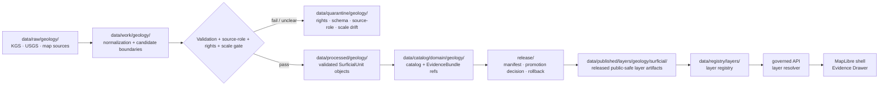

<!-- [KFM_META_BLOCK_V2]
doc_id: kfm://data/published/layers/geology/surficial-readme
name: Surficial Geology Published Layer README
path: data/published/layers/geology/surficial/README.md
type: data-lane-readme
version: v0.1.0
status: draft
owners:
  - <geology-domain-steward>
  - <surficial-sublane-steward>
  - <release-steward>
  - <map-layer-steward>
created: 2026-06-26
updated: 2026-06-26
policy_label: public
truth_posture: cite-or-abstain
lifecycle_phase: published
responsibility_root: data/
domain: geology
sublane: surficial
artifact_family: released-public-safe-surficial-geology-layer
sensitivity_posture: mostly-public-safe-t0; preserve-source-scale-and-cross-lane-boundaries; deny-unreleased-or-misclassified-derivatives
related:
  - ../README.md
  - ../../README.md
  - ../../../README.md
  - ../../../../../docs/doctrine/directory-rules.md
  - ../../../../../docs/domains/geology/README.md
  - ../../../../../docs/domains/geology/surficial.md
  - ../../../../../docs/domains/geology/SCOPE.md
  - ../../../../../docs/domains/geology/SOURCES.md
  - ../../../../../docs/domains/geology/SENSITIVITY.md
  - ../../../../../docs/domains/geology/UI_MAP_SURFACES.md
  - ../../../../../data/registry/layers/README.md
  - ../../../../../release/manifests/README.md
tags:
  - kfm
  - data
  - published
  - layers
  - geology
  - surficial
  - quaternary
  - geologic-map
  - parent-material
  - public-safe
  - evidence-first
notes:
  - "This README documents the public-safe surficial geology layer publication lane."
  - "This path is for released surficial map artifacts and direct sidecars only, not release decisions, proof bundles, receipts, source inputs, or canonical domain stores."
  - "Surficial geology supplies parent-material context to Soil and advisory context to Hydrology/Agriculture; it must not be published as soil truth, hydrology measurement truth, or agriculture recommendation truth."
[/KFM_META_BLOCK_V2] -->

<a id="top"></a>

<div align="center">

# Surficial Geology Published Layers

**Released public-safe surficial geology map artifacts for unconsolidated cover, parent-material context, and governed MapLibre surfaces.**


</div>

---

## Quick reference

| Field | Value |
|---|---|
| **Path** | `data/published/layers/geology/surficial/` |
| **Responsibility root** | `data/` |
| **Lifecycle phase** | `published/` — released public-safe artifacts only |
| **Domain lane** | `geology/` |
| **Sublane** | `surficial` — unconsolidated surface cover, such as alluvium, loess, glacial deposits, colluvium, and residuum |
| **Artifact family** | Released public-safe surficial geology map layers and direct sidecars |
| **Primary consumers** | Governed API layer resolver, MapLibre shell, Evidence Drawer, public-safe exports, release QA |
| **Release authority** | `release/manifests/` and `release/promotion_decisions/`, not this directory |
| **Proof authority** | `data/proofs/` and `data/receipts/`, not this directory |
| **Default failure posture** | `ABSTAIN` unresolved public claims; `DENY` unreleased, source-role-collapsed, or policy-invalid artifacts |

---

## 1. Purpose

This directory holds **released public-safe surficial geology layer artifacts**. These artifacts represent mapped bodies of unconsolidated surface cover and associated public-safe attribution such as lithology, geologic age, source map identity, boundary version, scale, and release state.

The lane exists to make surficial geology visible in the public map while preserving KFM's authority boundaries. Surficial geology may provide parent-material context to Soil and advisory context to Hydrology or Agriculture, but it must not become those lanes' canonical truth.

A surficial layer is a downstream carrier. It does not replace the source map, processed `SurficialUnit`, catalog record, EvidenceBundle, source descriptor, policy decision, or release manifest.

> [!IMPORTANT]
> Presence in `data/published/layers/geology/surficial/` does **not** by itself prove that a layer is valid public output. Verify the corresponding `ReleaseManifest`, `PromotionDecision`, proof pack, receipt chain, layer registry entry, rights posture, scale note, and rollback target before exposing or citing the layer.

---

## 2. What belongs here

| Artifact | Example name | Required condition before placement |
|---|---|---|
| Surficial map PMTiles | `geology_surficial_public_vYYYYMMDD.pmtiles` | ReleaseManifest exists; source role, scale, rights, and field allowlist are resolved |
| Surficial GeoParquet | `geology_surficial_public_vYYYYMMDD.geoparquet` | Released analytical/export artifact with digest and manifest reference |
| Surficial GeoJSON | `geology_surficial_public_vYYYYMMDD.geojson` | Small public-safe release or review artifact; avoid large unmanaged payloads |
| Tile metadata sidecar | `geology_surficial_public_vYYYYMMDD.tiles.json` | References bounds, zoom range, layer id, source map lineage, schema version, release id, and digest |
| Integrity sidecar | `geology_surficial_public_vYYYYMMDD.sha256` | Digest generated from the exact released bytes |
| Layer descriptor | `layer.manifest.json` or `layer.json` | Points to governed layer registry and release manifest |
| Field allowlist | `surficial_fields.allowlist.json` | Documents public fields included in the released artifact |
| Scale and lineage note | `scale_lineage.summary.json` | Public-safe description of source scale, map compilation lineage, and boundary version limits |
| Optional style fragment | `style.fragment.json` | Rendering hints only; no proof, source, policy, or release authority |
| README / release-local guidance | `README.md` | Explains boundaries for this lane or a release-id subfolder |

Artifacts in this folder should be safe as public bytes. Public layer payloads should not include unpublished candidate fields, internal QA notes, restricted source credentials, unreviewed AI classifications, or cross-lane claims that belong to Soil, Hydrology, Agriculture, Hazards, or Resources.

---

## 3. What does not belong here

| Do not place | Correct home | Reason |
|---|---|---|
| RAW source maps or downloads | `data/raw/geology/<source_id>/<run_id>/` | RAW is intake, not public release |
| Normalization scratch outputs | `data/work/geology/<run_id>/` | WORK may contain unresolved candidate state |
| Failed, ambiguous, or rights-unclear material | `data/quarantine/geology/<reason>/<run_id>/` | Quarantine is not publication |
| Canonical processed `SurficialUnit` records | `data/processed/geology/...` | Processed state does not equal release state |
| Catalog records, triplets, or graph truth | `data/catalog/...` or graph/catalog lanes | Catalog/triplet authority stays separate from map bytes |
| EvidenceBundle / ProofPack | `data/proofs/` | Proof authority stays separate from delivery artifacts |
| Validation, build, or release receipts | `data/receipts/` | Receipts are process memory, not layer payload |
| Release manifest or promotion decision | `release/` | Release authority belongs to the release root |
| Soil map units, horizons, or soil properties | Soil domain lanes | Surficial geology provides parent-material context only |
| Hydrology measurements | Hydrology domain lanes | Surficial units provide advisory context, not water measurements |
| Agriculture suitability or recommendation claims | Agriculture domain lanes | Surficial context must not become regulatory or recommendation truth |
| Bedrock unit map artifacts | bedrock geology layer lane | Bedrock and surficial are distinct material/layer surfaces |
| AI-generated interpretations as layer attributes | governed review/output lanes only | AI is interpretive, not source or release authority |

---

## 4. Publication boundary



<!-- END OF MERMAID -->

The normal public path is:

```text
released surficial layer artifact
→ layer registry entry
→ ReleaseManifest
→ governed API / layer resolver
→ MapLibre shell
→ Evidence Drawer / citation surface
```

The forbidden shortcut is:

```text
source map / work geometry / unreviewed candidate
→ direct public map layer
```

---

## 5. Surficial-specific governance rules

| Rule | Required behavior |
|---|---|
| **Surficial is unconsolidated cover** | Do not collapse surficial units into bedrock units just because both can appear at the surface. |
| **Scale is a claim boundary** | Public layer manifests must preserve source scale, compilation scale, and boundary-version limitations. |
| **Source role is explicit** | Authority map, observation, compilation, aggregate, and modeled/derived surfaces are different claim types. |
| **Parent-material context is advisory** | Surficial geology may support Soil context; it does not assert soil classification, horizons, or properties. |
| **Hydrology context is advisory** | Surficial units may explain shallow groundwater context; they do not restate water-level or water-quality measurements. |
| **Agriculture context is advisory** | Surficial units may inform parent-material/resource context; they do not become recommendations or regulatory claims. |
| **Evidence references are required** | Features or manifests must carry safe evidence references or resolver keys sufficient for EvidenceBundle lookup. |
| **Temporal context survives** | Source map date, source retrieval date, boundary version time, release time, and correction time must stay distinguishable. |
| **AI is not authority** | Generated lithology summaries or classifications cannot replace source map attribution, review, or release state. |
| **Rollback is mandatory** | Every public surficial layer must be tied to a rollback target and correction/withdrawal path. |

---

## 6. Expected artifact layout

Small early releases may remain flat. Once multiple versions exist, prefer release-id folders so source lineage, scale, release, rollback, and digest verification stay inspectable.

```text
data/published/layers/geology/surficial/
├── README.md
├── <release_id>/
│   ├── geology_surficial_public.pmtiles
│   ├── geology_surficial_public.geoparquet
│   ├── geology_surficial_public.sha256
│   ├── layer.manifest.json
│   ├── surficial_fields.allowlist.json
│   ├── scale_lineage.summary.json
│   ├── style.fragment.json
│   └── README.md                  # optional release-local note
└── latest.json                     # optional generated pointer from ReleaseManifest
```

`latest.json` must be generated from release state, not hand-edited. If release state, digest state, scale/lineage state, or rollback state is missing, remove or withhold the pointer.

---

## 7. Minimum manifest expectations

A layer manifest or sidecar for this directory should include at least:

| Field | Purpose |
|---|---|
| `layer_id` | Stable layer id, for example `geology.surficial.public` |
| `domain` | `geology` |
| `sublane` | `surficial` |
| `artifact_family` | `surficial_geology_layer` |
| `object_family` | `SurficialUnit` or approved controlled value after object-family decision |
| `claim_character` | `authority_map`, `observed_map`, `compiled_map`, `modeled_surface`, or equivalent controlled value |
| `release_id` | Pointer to `release/manifests/<release_id>.json` |
| `artifact_href` | Relative or release-resolved artifact path |
| `artifact_sha256` | Digest of released bytes |
| `format` | `pmtiles`, `geoparquet`, `geojson`, or other approved public format |
| `bounds` | Public-safe spatial bounds |
| `minzoom` / `maxzoom` | Tile zoom range, when tiled |
| `source_map_refs` | Source map, source descriptor, or catalog refs |
| `source_scale` | Source and compilation scale; required for map interpretation |
| `boundary_version_ref` | Boundary version or map edition identifier |
| `temporal_scope` | Source, retrieval, boundary-version, release, and correction temporal support |
| `field_allowlist_ref` | Pointer to public field allowlist |
| `evidence_bundle_refs` | Safe references or resolver keys |
| `policy_decision_ref` | Release policy decision reference |
| `rollback_ref` | Rollback card or rollback target |
| `correction_path` | Where corrections, supersessions, or withdrawals are recorded |

---

## 8. Validation checklist

Before adding or updating a surficial geology artifact here, reviewers should be able to answer **yes** to each item.

- [ ] Every contributing source has a source descriptor.
- [ ] Source role is explicit and compatible with the public claim.
- [ ] `SurficialUnit` / geologic-unit family handling is consistent with the current geology contract decision.
- [ ] Source scale, compilation scale, and boundary-version limits are represented in the manifest or sidecar.
- [ ] Rights and license posture allow this public derivative.
- [ ] Public fields are allowlisted and checked against the actual released bytes.
- [ ] Soil, hydrology, agriculture, hazards, and resources claims are not collapsed into surficial layer attributes.
- [ ] EvidenceBundle references resolve through governed lookup.
- [ ] Layer registry entry references this artifact family and release id.
- [ ] ReleaseManifest and PromotionDecision exist under `release/`.
- [ ] Rollback card or rollback target exists.
- [ ] Correction and withdrawal paths are documented.
- [ ] Public UI consumes the layer through governed APIs or release-resolved artifact manifests, not RAW, WORK, QUARANTINE, internal processed stores, or direct model output.

---

## 9. Suggested checks

Use the repository validator orchestrator when available:

```bash
python tools/validate_all.py
```

Potential surficial-layer-specific checks should cover:

```text
tools/validators/domains/geology/source_role_authority/
tools/validators/domains/geology/surficial_unit_contract/
tools/validators/domains/geology/scale_lineage/
tools/validators/domains/geology/layer_manifest/
tools/validators/domains/geology/tile_field_allowlist/
tools/validators/domains/geology/cross_lane_anti_collapse/
tests/domains/geology/surficial/
tests/domains/geology/layers/
```

If a validator is not implemented yet, mark the candidate `NEEDS VERIFICATION` rather than treating the gap as a pass.

---

## 10. Map consumer rules

Consumers should:

1. Load only release-resolved artifacts or manifests.
2. Resolve feature details through the governed API or Evidence Drawer payload.
3. Display release, stale, source scale, boundary version, and correction state where available.
4. Avoid presenting surficial units as soil map units, hydrology measurements, agriculture recommendations, or bedrock units.
5. Preserve `ABSTAIN`, `DENY`, and `ERROR` outcomes in UI state.
6. Avoid direct reads from RAW, WORK, QUARANTINE, internal processed stores, or source-system mirrors.
7. Keep AI and Focus Mode answers subordinate to evidence, source role, scale, policy, review, and release state.

---

## 11. Common failure modes

| Failure | Outcome |
|---|---|
| Layer exists without ReleaseManifest | Not a valid public layer |
| Source scale or map edition is missing | `ABSTAIN` scale-sensitive claims; block strong map interpretation |
| Surficial unit is presented as a soil map unit | Cross-lane collapse; correct or withdraw claim |
| Surficial unit is presented as a hydrology measurement | Cross-lane collapse; correct or withdraw claim |
| Modeled/derived geomorphic surface is relabeled as observed map authority | Source-role violation; correct or withdraw claim |
| Field is hidden in style but present in payload | Publication leak; correct payload before release |
| Source rights are unresolved | `DENY` or hold in quarantine |
| Layer lacks EvidenceBundle references | `ABSTAIN` public claims; block Evidence Drawer support |
| `latest.json` points to artifact without rollback target | Release drift; remove alias until fixed |

---

## 12. Maintainer checklist

- Keep this folder limited to released public-safe surficial geology map artifacts and direct sidecars.
- Put release decisions in `release/`, not here.
- Put proof and receipt objects in `data/proofs/` and `data/receipts/`, not here.
- Preserve source scale, source map edition, and boundary-version context.
- Keep Soil, Hydrology, Agriculture, Hazards, and Resources claims in their owning lanes.
- Prefer release-id subfolders when more than one version exists.
- Update this README when artifact naming, manifest shape, validator paths, source-role rules, or release gates change.

---

## 13. Status notes

| Claim | Status |
|---|---|
| This README defines the intended boundary for `data/published/layers/geology/surficial/`. | **CONFIRMED authored** |
| The target path exists in the live repository. | **CONFIRMED by GitHub contents API during this edit** |
| Actual released surficial geology artifacts exist here. | **UNKNOWN** |
| Surficial layer publication validators are implemented and wired in CI. | **NEEDS VERIFICATION** |
| Any specific source has been approved for public surficial layer publication. | **NEEDS VERIFICATION** |
| The current public UI loads this layer through a governed API. | **UNKNOWN** |
| The `SurficialUnit` family-vs-subtype decision is resolved in implementation. | **NEEDS VERIFICATION** |

---

## Related files

- [`../README.md`](../README.md) — geology published layer parent lane
- [`../../README.md`](../../README.md) — published layer family lane
- [`../../../README.md`](../../../README.md) — `data/published/` lane
- [`../../../../../docs/doctrine/directory-rules.md`](../../../../../docs/doctrine/directory-rules.md) — placement and lifecycle doctrine
- [`../../../../../docs/domains/geology/surficial.md`](../../../../../docs/domains/geology/surficial.md) — surficial sublane doctrine
- [`../../../../../docs/domains/geology/SOURCES.md`](../../../../../docs/domains/geology/SOURCES.md) — source-family typology
- [`../../../../../docs/domains/geology/SENSITIVITY.md`](../../../../../docs/domains/geology/SENSITIVITY.md) — sensitivity posture
- [`../../../../../docs/domains/geology/UI_MAP_SURFACES.md`](../../../../../docs/domains/geology/UI_MAP_SURFACES.md) — governed map-surface expectations
- [`../../../../../data/registry/layers/README.md`](../../../../../data/registry/layers/README.md) — layer registry entry point
- [`../../../../../release/manifests/README.md`](../../../../../release/manifests/README.md) — release manifest authority

---

<div align="center">

**KFM rule:** surficial geology layers are public-safe map artifacts, not soil truth, hydrology measurements, agriculture recommendations, proof authority, release authority, or AI truth.

[Back to top](#top)

</div>
