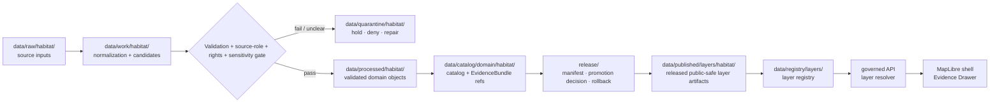

<!-- [KFM_META_BLOCK_V2]
doc_id: kfm://data/published/layers/habitat/readme
name: Habitat Published Layers README
path: data/published/layers/habitat/README.md
type: data-lane-index-readme
version: v0.1.0
status: draft
owners:
  - <habitat-lane-steward>
  - <release-steward>
  - <map-layer-steward>
created: 2026-06-26
updated: 2026-06-26
policy_label: public
truth_posture: cite-or-abstain
lifecycle_phase: published
responsibility_root: data/
domain: habitat
artifact_family: released-public-safe-habitat-map-layers
sensitivity_posture: public-safe-derivatives-only; fail-closed-on-sensitive-joins; habitat-layers-are-evidence-context-not-sovereign-truth
related:
  - ../README.md
  - ../../README.md
  - ecoregions/README.md
  - land_cover/README.md
  - ../../../../docs/doctrine/directory-rules.md
  - ../../../../docs/domains/habitat/README.md
  - ../../../../docs/domains/habitat/sublanes/ecoregions.md
  - ../../../../docs/domains/habitat/sublanes/land_cover.md
  - ../../../registry/layers/README.md
  - ../../../../release/manifests/README.md
tags:
  - kfm
  - data
  - published
  - layers
  - habitat
  - ecoregions
  - land-cover
  - maplibre
  - public-safe
  - evidence-first
notes:
  - "This README indexes and governs public-safe Habitat published layer lanes."
  - "This path is for released map-layer artifacts and immediate sidecars, not release decisions, proof bundles, receipts, source inputs, processed records, catalog records, or direct AI outputs."
  - "The child lanes confirmed by README edits in this session are ecoregions/ and land_cover/. Future Habitat layer lanes remain PROPOSED until created and reviewed."
[/KFM_META_BLOCK_V2] -->

<a id="top"></a>

<div align="center">

# Habitat Published Layers

**Released public-safe map-layer artifacts for the Habitat domain.**


</div>

---

## Quick reference

| Field | Value |
|---|---|
| **Path** | `data/published/layers/habitat/` |
| **Responsibility root** | `data/` |
| **Lifecycle phase** | `published/` — released public-safe artifacts only |
| **Domain lane** | `habitat/` |
| **Artifact family** | Released public-safe Habitat map layers and direct sidecars |
| **Confirmed child lanes in this session** | [`ecoregions/`](ecoregions/README.md), [`land_cover/`](land_cover/README.md) |
| **Future/proposed layer lanes** | `ecological_systems/`, `patches/`, `suitability/`, `connectivity/`, `restoration/`, or other ADR/release-approved lanes |
| **Primary consumers** | Governed API layer resolver, MapLibre shell, Evidence Drawer, public-safe exports, release QA |
| **Release authority** | `release/manifests/` and `release/promotion_decisions/`, not this directory |
| **Proof authority** | `data/proofs/` and `data/receipts/`, not this directory |
| **Default failure posture** | `ABSTAIN` unresolved public claims; `DENY` or `RESTRICT` unsafe joins, unresolved rights, policy-sensitive detail, or missing release state |

---

## 1. Purpose

This directory is the parent lane for **released public-safe Habitat map-layer artifacts**. It groups map delivery outputs for Habitat after evidence, source role, rights, sensitivity, validation, catalog closure, review, release, and rollback gates have passed.

This is an artifact delivery surface. It is not a source repository, canonical processed store, catalog truth store, proof store, release authority, review archive, or AI interpretation lane.

> [!IMPORTANT]
> A file under `data/published/layers/habitat/` is not automatically valid public output. Public exposure still depends on a valid `ReleaseManifest`, `PromotionDecision`, evidence/proof closure, policy outcome, layer registry entry, digest verification, correction path, and rollback target.

---

## 2. Lane map

| Lane | Status | Purpose | Public-safety posture |
|---|---:|---|---|
| [`ecoregions/`](ecoregions/README.md) | **CONFIRMED README** | Public-safe ecoregion and regionalization context layers. | Context only; not occurrence, patch, suitability, restoration, or regulatory truth. |
| [`land_cover/`](land_cover/README.md) | **CONFIRMED README** | Public-safe land-cover observations, cover-class derivatives, and summary layers. | Evidence/context only; not habitat assertion, species occurrence, crop, soil, hydrology, or regulatory truth by itself. |
| `ecological_systems/` | **PROPOSED** | Public-safe ecological-system layers or crosswalk outputs. | Requires source/version, class scheme, rights, evidence, and release review. |
| `patches/` | **PROPOSED** | Public-safe habitat patch layers. | Must not expose sensitive joins or imply species presence without evidence. |
| `suitability/` | **PROPOSED** | Public-safe suitability or model-output surfaces. | Model-vs-observation labels, receipts, uncertainty, and policy outcome required. |
| `connectivity/` | **PROPOSED** | Public-safe corridor/connectivity surfaces. | Requires model/reality boundary, evidence support, and sensitivity review. |
| `restoration/` | **PROPOSED** | Public-safe restoration opportunity or prioritization surfaces. | Advisory only unless policy, stewardship, rights, and review allow stronger claims. |

Do not create a new sibling lane casually. Confirm the owning root, artifact family, policy posture, layer registry shape, source role, release path, and whether an ADR or migration note is required.

---

## 3. What belongs here

| Artifact class | Examples | Boundary |
|---|---|---|
| Released public Habitat layer bytes | PMTiles, COGs, GeoParquet, GeoJSON, vector-tile bundles | Must be public-safe as bytes, not merely safe as a rendered style |
| Layer sidecars | `layer.manifest.json`, `tiles.json`, `*.sha256`, `fields.allowlist.json` | Must point to release state, registry state, evidence refs, and digests |
| Source/version summaries | `source_version.summary.json`, `source_class_scheme.summary.json` | Required where source framework, product, class scheme, vintage, or crosswalk affects interpretation |
| Uncertainty/model summaries | `uncertainty.summary.json`, `model_receipt.summary.json` | Required where a layer is modeled, generalized, reclassified, or summarized |
| Public-safe style fragments | `style.fragment.json` | Rendering hints only; cannot act as source, proof, policy, redaction, or release authority |
| Release-local README files | `<release_id>/README.md` | Explain release-local artifact contents without duplicating proof or release authority |
| Generated pointers | `latest.json` | Must be release-generated and rollback-safe, not hand-edited |

---

## 4. What does not belong here

| Do not place | Correct home | Reason |
|---|---|---|
| RAW source downloads | `data/raw/habitat/<source_id>/<run_id>/` | RAW is intake, not publication |
| WORK files or candidates | `data/work/habitat/<run_id>/` | WORK may contain unresolved candidates or unreviewed joins |
| Quarantined material | `data/quarantine/habitat/<reason>/<run_id>/` | Failed or unclear materials are not public release |
| Canonical processed Habitat objects | `data/processed/habitat/...` | Processed does not equal published |
| Catalog records, triplets, or graph truth | `data/catalog/...` or graph/catalog lanes | Catalog authority stays separate from map bytes |
| EvidenceBundle / ProofPack | `data/proofs/` | Proof authority stays separate from delivery artifacts |
| Validation, transform, build, model, or release receipts | `data/receipts/` | Receipts are process memory, not layer payloads |
| Release manifests / promotion decisions | `release/` | Release decision authority belongs to release governance |
| Species occurrence, plant record, crop, soil, hydrology, hazard, or administrative truth | Owning domain lanes | Habitat layers may provide context but must not replace other domains' authority |
| AI-generated ecological claims | governed answer/provenance paths only | AI is interpretive, not source, evidence, policy, or release authority |

---

## 5. Publication boundary



<!-- END OF MERMAID -->

The normal public path is:

```text
released habitat layer artifact
→ layer registry entry
→ ReleaseManifest
→ governed API / layer resolver
→ MapLibre shell
→ Evidence Drawer / citation surface
```

The forbidden shortcut is:

```text
RAW / WORK / QUARANTINE / processed candidate / direct model output
→ direct public map layer
```

---

## 6. Habitat public-safety rules

| Rule | Required behavior |
|---|---|
| **Habitat layers are evidence-bounded** | Public layers carry source role, evidence refs, release state, and limitation context. |
| **Source role is explicit** | Observation, model, regulatory, context, aggregate, administrative, candidate, and synthetic roles must not collapse. |
| **Layer bytes are safe first** | Do not rely on style filters or client-side hiding as publication control. |
| **Cross-lane joins fail closed** | Joins touching protected biodiversity, private context, or stewardship-controlled data require policy, review, transform receipts, and release support. |
| **Model outputs are labeled** | Suitability, connectivity, restoration, or other derived surfaces must carry model/uncertainty/reality-boundary notes. |
| **Class schemes and source versions are visible** | Land-cover and ecological-system surfaces must preserve source product, source vintage, class scheme, crosswalk, and uncertainty context. |
| **Evidence references are required** | Features or manifests must carry safe evidence references or resolver keys sufficient for EvidenceBundle lookup. |
| **Temporal context survives** | Source time, valid time, retrieval time, model/build time, release time, and correction time must not collapse. |
| **AI is not authority** | Generated summaries, labels, or Focus Mode claims cannot replace source attribution, evidence, review, or release state. |
| **Rollback is mandatory** | Every public Habitat layer must be tied to rollback and correction/withdrawal paths. |

---

## 7. Recommended subtree shape

Current verified child READMEs in this session:

```text
data/published/layers/habitat/
├── README.md
├── ecoregions/
│   └── README.md
└── land_cover/
    └── README.md
```

Future lanes should be added only after governance/release review:

```text
data/published/layers/habitat/
├── ecological_systems/       # PROPOSED
├── patches/                  # PROPOSED
├── suitability/              # PROPOSED
├── connectivity/             # PROPOSED
└── restoration/              # PROPOSED
```

Release-id folders may be used inside each child lane once artifact versions exist:

```text
<lane>/
├── README.md
├── <release_id>/
│   ├── <artifact>.pmtiles
│   ├── <artifact>.tif
│   ├── <artifact>.geoparquet
│   ├── <artifact>.sha256
│   ├── layer.manifest.json
│   ├── fields.allowlist.json
│   └── README.md
└── latest.json
```

`latest.json` must be generated from release state and removed or withheld when rollback state is missing, stale, or inconsistent.

---

## 8. Minimum layer manifest expectations

| Field | Purpose |
|---|---|
| `layer_id` | Stable public layer id |
| `domain` | `habitat` |
| `sublane` | `ecoregions`, `land_cover`, or approved controlled value |
| `artifact_family` | Approved map-layer family |
| `claim_character` | Observation context, regionalization context, generalized layer, model output, suitability surface, summary, or equivalent controlled value |
| `release_id` | Pointer to `release/manifests/<release_id>.json` |
| `artifact_href` | Relative or release-resolved artifact path |
| `artifact_sha256` | Digest of released bytes |
| `format` | `pmtiles`, `cog`, `geoparquet`, `geojson`, or approved public format |
| `bounds` | Public-safe spatial bounds |
| `source_refs` | Source descriptor, source product, source framework, or catalog refs |
| `source_version` | Source vintage, framework version, class scheme, or observation period where relevant |
| `sensitivity_posture` | Public-safe, generalized, restricted, deny, or withhold reason |
| `field_allowlist_ref` | Pointer to approved public field allowlist |
| `evidence_bundle_refs` | Safe references or resolver keys |
| `policy_decision_ref` | Release policy decision reference |
| `rollback_ref` | Rollback card or rollback target |
| `correction_path` | Where corrections, supersessions, or withdrawals are recorded |

---

## 9. Validation checklist

- [ ] The artifact belongs under an existing child lane or a new lane has been approved through the proper architecture/governance path.
- [ ] Every contributing source has a source descriptor.
- [ ] Source role is explicit and compatible with the public claim.
- [ ] Source product/framework, source version, class scheme, model version, or analysis unit is represented where relevant.
- [ ] Rights and license posture allow this public derivative.
- [ ] Sensitive or policy-sensitive joins are absent or have policy/review/transform/release support.
- [ ] Public fields are allowlisted and checked against the actual released bytes.
- [ ] Habitat context is not presented as stronger truth than the evidence supports.
- [ ] EvidenceBundle references resolve through governed lookup.
- [ ] Layer registry entry references the artifact family and release id.
- [ ] ReleaseManifest and PromotionDecision exist under `release/`.
- [ ] Rollback card or rollback target exists.
- [ ] Correction and withdrawal paths are documented.
- [ ] Public UI consumes the layer through governed APIs or release-resolved artifact manifests, not RAW, WORK, QUARANTINE, processed stores, or direct model output.

---

## 10. Suggested checks

Use the repository validator orchestrator when available:

```bash
python tools/validate_all.py
```

Potential Habitat layer checks should cover:

```text
tools/validators/domains/habitat/source_role_authority/
tools/validators/domains/habitat/layer_manifest/
tools/validators/domains/habitat/tile_field_allowlist/
tools/validators/domains/habitat/cross_lane_join_safety/
tools/validators/domains/habitat/model_receipt/
tests/domains/habitat/layers/
tests/domains/habitat/release/
```

If a validator is not implemented yet, mark the candidate `NEEDS VERIFICATION` rather than treating the gap as a pass.

---

## 11. Map consumer rules

Consumers should:

1. Load only release-resolved artifacts or manifests.
2. Resolve feature details through the governed API or Evidence Drawer payload.
3. Display release, stale, source role, source version, sensitivity, uncertainty, model/reality-boundary, and correction state where available.
4. Avoid presenting habitat map layers as stronger evidence than their source role supports.
5. Preserve `ABSTAIN`, `DENY`, and `ERROR` outcomes in UI state.
6. Avoid direct reads from RAW, WORK, QUARANTINE, processed stores, source mirrors, or direct model output.
7. Keep AI and Focus Mode answers subordinate to evidence, source role, rights, policy, review, and release state.

---

## 12. Common failure modes

| Failure | Outcome |
|---|---|
| Public artifact exists without ReleaseManifest | Not a valid public layer |
| Source product, framework, class scheme, or model version is missing | `ABSTAIN` source/version-sensitive claims |
| Source rights are unresolved | `DENY` or hold in quarantine |
| Sensitive join output is included without review/release support | `DENY`, withdraw, or quarantine artifact |
| Context layer is presented as occurrence, suitability, regulatory, or stewardship truth | Source-role violation; correct or withdraw claim |
| Field is hidden in style but present in payload | Publication leak; correct payload before release |
| Layer lacks EvidenceBundle references | `ABSTAIN` public claims; block Evidence Drawer support |
| `latest.json` points to artifact without rollback target | Release drift; remove alias until fixed |
| New sibling lane appears without governance note | Directory drift; require review or ADR/migration note |

---

## 13. Maintainer checklist

- Keep this subtree limited to released public-safe Habitat map-layer artifacts and direct sidecars.
- Put release decisions in `release/`, not here.
- Put proof and receipt objects in `data/proofs/` and `data/receipts/`, not here.
- Preserve source role, source version, class scheme, model/reality boundary, uncertainty, and release state.
- Keep species occurrence, crop, soil, hydrology, hazards, administrative, and regulatory truth in their owning lanes.
- Use child README files to document lane-specific rules.
- Prefer release-id subfolders when more than one version exists.
- Update this README when child lanes, artifact naming, manifest shape, validator paths, source-role rules, or release gates change.

---

## 14. Status notes

| Claim | Status |
|---|---|
| This README defines the intended boundary for `data/published/layers/habitat/`. | **CONFIRMED authored** |
| The target path exists in the live repository. | **CONFIRMED by GitHub contents API during this edit** |
| `ecoregions/README.md` and `land_cover/README.md` exist and were updated in this session. | **CONFIRMED by recent GitHub edits in this session** |
| Other child lanes listed here exist in the repository. | **UNKNOWN / PROPOSED** |
| Actual released Habitat layer artifacts exist in this subtree. | **UNKNOWN** |
| Habitat layer publication validators are implemented and wired in CI. | **NEEDS VERIFICATION** |
| Any specific source has been approved for public Habitat layer publication. | **NEEDS VERIFICATION** |
| The current public UI loads these layers through a governed API. | **UNKNOWN** |

---

## Related files

- [`ecoregions/README.md`](ecoregions/README.md) — ecoregions published layer lane
- [`land_cover/README.md`](land_cover/README.md) — land-cover published layer lane
- [`../README.md`](../README.md) — published layer family lane
- [`../../README.md`](../../README.md) — `data/published/` lane
- [`../../../../docs/doctrine/directory-rules.md`](../../../../docs/doctrine/directory-rules.md) — placement and lifecycle doctrine
- [`../../../../docs/domains/habitat/README.md`](../../../../docs/domains/habitat/README.md) — Habitat domain landing page
- [`../../../../docs/domains/habitat/sublanes/ecoregions.md`](../../../../docs/domains/habitat/sublanes/ecoregions.md) — ecoregions sublane doctrine
- [`../../../../docs/domains/habitat/sublanes/land_cover.md`](../../../../docs/domains/habitat/sublanes/land_cover.md) — land-cover sublane doctrine
- [`../../../registry/layers/README.md`](../../../registry/layers/README.md) — layer registry entry point
- [`../../../../release/manifests/README.md`](../../../../release/manifests/README.md) — release manifest authority

---

<div align="center">

**KFM rule:** Habitat published layers are public-safe delivery artifacts, not source authority, proof authority, release authority, canonical habitat truth, or AI truth.

[Back to top](#top)

</div>
