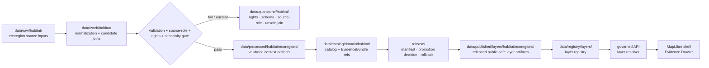

<!-- [KFM_META_BLOCK_V2]
doc_id: kfm://data/published/layers/habitat/ecoregions-readme
name: Habitat Ecoregions Published Layer README
path: data/published/layers/habitat/ecoregions/README.md
type: data-lane-readme
version: v0.1.0
status: draft
owners:
  - <habitat-lane-steward>
  - <ecoregions-sublane-steward>
  - <release-steward>
  - <map-layer-steward>
created: 2026-06-26
updated: 2026-06-26
policy_label: public
truth_posture: cite-or-abstain
lifecycle_phase: published
responsibility_root: data/
domain: habitat
sublane: ecoregions
artifact_family: released-public-safe-ecoregion-layer
sensitivity_posture: public-regionalization-layer; fail-closed-on-sensitive-cross-lane-joins; ecoregions-are-context-not-occurrence-truth
related:
  - ../README.md
  - ../../README.md
  - ../../../README.md
  - ../../../../../docs/doctrine/directory-rules.md
  - ../../../../../docs/domains/habitat/README.md
  - ../../../../../docs/domains/habitat/sublanes/ecoregions.md
  - ../../../../../data/processed/habitat/ecoregions/README.md
  - ../../../../../data/catalog/domain/habitat/ecoregions/README.md
  - ../../../../../data/registry/layers/README.md
  - ../../../../../release/manifests/README.md
tags:
  - kfm
  - data
  - published
  - layers
  - habitat
  - ecoregions
  - ecological-systems
  - regionalization
  - landscape-context
  - maplibre
  - public-safe
  - evidence-first
notes:
  - "This README documents the public-safe Habitat ecoregions layer publication lane."
  - "This path is for released ecoregion/regionalization map artifacts and direct sidecars only, not release decisions, proof bundles, receipts, source inputs, processed records, or catalog records."
  - "Ecoregions classify places as regional context. They are not species occurrence truth, habitat patch truth, regulatory critical-habitat truth, or suitability truth by themselves."
[/KFM_META_BLOCK_V2] -->

<a id="top"></a>

<div align="center">

# Habitat Ecoregions Published Layers

**Released public-safe ecoregion and regionalization map artifacts for Habitat landscape context.**


</div>

---

## Quick reference

| Field | Value |
|---|---|
| **Path** | `data/published/layers/habitat/ecoregions/` |
| **Responsibility root** | `data/` |
| **Lifecycle phase** | `published/` — released public-safe artifacts only |
| **Domain lane** | `habitat/` |
| **Sublane** | `ecoregions` — ecoregion and ecological regionalization context |
| **Artifact family** | Released public-safe ecoregion map layers and direct sidecars |
| **Primary consumers** | Governed API layer resolver, MapLibre shell, Evidence Drawer, public-safe exports, release QA |
| **Release authority** | `release/manifests/` and `release/promotion_decisions/`, not this directory |
| **Proof authority** | `data/proofs/` and `data/receipts/`, not this directory |
| **Default failure posture** | `ABSTAIN` unresolved public claims; `DENY` or `RESTRICT` unsafe joins, unresolved rights, or missing release state |

---

## 1. Purpose

This directory holds **released public-safe Habitat ecoregion layer artifacts**. These artifacts represent ecoregional or ecological regionalization polygons and associated public-safe attribution after evidence, source role, rights, sensitivity, validation, catalog closure, release, and rollback gates have passed.

Ecoregions are context layers. They help place habitat, land-cover, ecological-system, restoration, connectivity, soil, hydrology, hazards, agriculture, fauna, and flora questions into a broader landscape frame. They do **not** prove species presence, habitat patch condition, regulatory critical habitat, suitability, restoration priority, or management action by themselves.

A published ecoregion layer is a downstream carrier. It does not replace the source framework, processed ecoregion object, catalog record, EvidenceBundle, source descriptor, policy decision, or release manifest.

> [!IMPORTANT]
> Presence in `data/published/layers/habitat/ecoregions/` does **not** by itself prove that a layer is valid public output. Verify the corresponding `ReleaseManifest`, `PromotionDecision`, proof pack, receipt chain, layer registry entry, rights posture, source-version notes, and rollback target before exposing or citing the layer.

---

## 2. What belongs here

| Artifact | Example name | Required condition before placement |
|---|---|---|
| Ecoregion map PMTiles | `habitat_ecoregions_public_vYYYYMMDD.pmtiles` | ReleaseManifest exists; source role, source version, rights, and field allowlist are resolved |
| Ecoregion GeoParquet | `habitat_ecoregions_public_vYYYYMMDD.geoparquet` | Released analytical/export artifact with digest and manifest reference |
| Ecoregion GeoJSON | `habitat_ecoregions_public_vYYYYMMDD.geojson` | Small public-safe release or review artifact; avoid large unmanaged payloads |
| Tile metadata sidecar | `habitat_ecoregions_public_vYYYYMMDD.tiles.json` | References bounds, zoom range, layer id, source framework, schema version, release id, and digest |
| Integrity sidecar | `habitat_ecoregions_public_vYYYYMMDD.sha256` | Digest generated from the exact released bytes |
| Layer descriptor | `layer.manifest.json` or `layer.json` | Points to governed layer registry and release manifest |
| Field allowlist | `ecoregions_fields.allowlist.json` | Documents public fields included in the released artifact |
| Source/version summary | `source_version.summary.json` | Public-safe description of framework, level, version, source URI, and source role |
| Optional style fragment | `style.fragment.json` | Rendering hints only; no proof, source, policy, or release authority |
| README / release-local guidance | `README.md` | Explains boundaries for this lane or a release-id subfolder |

Artifacts in this folder should be safe as public bytes. Public payloads should not include unpublished candidate fields, internal QA notes, unreviewed AI classifications, sensitive join outputs, or claims owned by Fauna, Flora, Hydrology, Soil, Agriculture, Hazards, or regulatory critical-habitat lanes.

---

## 3. What does not belong here

| Do not place | Correct home | Reason |
|---|---|---|
| RAW source downloads | `data/raw/habitat/<source_id>/<run_id>/` | RAW is intake, not publication |
| Normalization scratch outputs | `data/work/habitat/<run_id>/` | WORK may contain unresolved candidate state |
| Failed, ambiguous, or rights-unclear material | `data/quarantine/habitat/<reason>/<run_id>/` | Quarantine is not publication |
| Canonical processed ecoregion artifacts | `data/processed/habitat/ecoregions/` | Processed state does not equal release state |
| Catalog records or catalog projections | `data/catalog/domain/habitat/`, `data/catalog/stac/habitat/`, `data/catalog/dcat/habitat/`, `data/catalog/prov/habitat/` | Catalog authority stays separate from map bytes |
| EvidenceBundle / ProofPack | `data/proofs/` | Proof authority stays separate from delivery artifacts |
| Validation, transform, build, or release receipts | `data/receipts/` | Receipts are process memory, not layer payload |
| Release manifest or promotion decision | `release/` | Release authority belongs to the release root |
| Species occurrence truth | Fauna or Flora domain lanes | Ecoregions are regional context, not occurrence evidence |
| Habitat patch, suitability, or restoration truth | Habitat sibling lanes | Ecoregions do not prove patch condition or suitability by themselves |
| Regulatory critical-habitat truth | Critical-habitat lane or regulatory source lane | Regulatory claims require separate source role and release path |
| AI-generated ecological claims | governed answer/provenance paths only | AI is interpretive, not source or release authority |

---

## 4. Publication boundary



<!-- END OF MERMAID -->

The normal public path is:

```text
released ecoregion layer artifact
→ layer registry entry
→ ReleaseManifest
→ governed API / layer resolver
→ MapLibre shell
→ Evidence Drawer / citation surface
```

The forbidden shortcut is:

```text
source ecoregion file / processed candidate / unreviewed join
→ direct public map layer
```

---

## 5. Ecoregion-specific governance rules

| Rule | Required behavior |
|---|---|
| **Ecoregions are context** | They classify places by a named framework/version; they do not prove species, patch, suitability, or regulatory truth. |
| **Source role is explicit** | Authority, context, model, aggregate, and derived source roles must not collapse. |
| **Framework and level are visible** | Layer manifests should state framework, level, version, extent, and source identifiers. |
| **CRS and tiling are documented** | Preserve source CRS/provenance and document any tiling projection or simplification. |
| **Field allowlists are mandatory** | Public tiles contain only approved fields; hiding fields in a style is not publication control. |
| **Sensitive joins fail closed** | Cross-lane joins touching sensitive biodiversity or private context require policy, review, transform receipts, and release support. |
| **Evidence references are required** | Features or manifests must carry safe evidence references or resolver keys sufficient for EvidenceBundle lookup. |
| **Temporal context survives** | Valid time, retrieval time, source version time, release time, and correction time must stay distinguishable. |
| **AI is not authority** | Generated summaries or classifications cannot replace source attribution, review, or release state. |
| **Rollback is mandatory** | Every public ecoregion layer must be tied to rollback and correction/withdrawal paths. |

---

## 6. Expected artifact layout

Small early releases may remain flat. Once multiple versions exist, prefer release-id folders so source lineage, release, rollback, and digest verification stay inspectable.

```text
data/published/layers/habitat/ecoregions/
├── README.md
├── <release_id>/
│   ├── habitat_ecoregions_public.pmtiles
│   ├── habitat_ecoregions_public.geoparquet
│   ├── habitat_ecoregions_public.sha256
│   ├── layer.manifest.json
│   ├── ecoregions_fields.allowlist.json
│   ├── source_version.summary.json
│   ├── style.fragment.json
│   └── README.md                  # optional release-local note
└── latest.json                     # optional generated pointer from ReleaseManifest
```

`latest.json` must be generated from release state, not hand-edited. If release state, source-version state, digest state, or rollback state is missing, remove or withhold the pointer.

---

## 7. Minimum manifest expectations

A layer manifest or sidecar for this directory should include at least:

| Field | Purpose |
|---|---|
| `layer_id` | Stable layer id, for example `habitat.ecoregions.public` |
| `domain` | `habitat` |
| `sublane` | `ecoregions` |
| `artifact_family` | `ecoregion_layer` |
| `claim_character` | `regionalization_context`, `authority_framework`, `compiled_context`, or equivalent controlled value |
| `release_id` | Pointer to `release/manifests/<release_id>.json` |
| `artifact_href` | Relative or release-resolved artifact path |
| `artifact_sha256` | Digest of released bytes |
| `format` | `pmtiles`, `geoparquet`, `geojson`, or other approved public format |
| `bounds` | Public-safe spatial bounds |
| `minzoom` / `maxzoom` | Tile zoom range, when tiled |
| `framework` | Source framework or classification authority |
| `ecoregion_level` | Level or hierarchy represented by the layer |
| `source_version_ref` | Source version, download, or descriptor reference |
| `source_crs` | Source CRS/provenance note where relevant |
| `tiling_crs` | Tiling projection where relevant |
| `temporal_scope` | Valid/retrieval/source/release/correction time support |
| `field_allowlist_ref` | Pointer to public field allowlist |
| `evidence_bundle_refs` | Safe references or resolver keys |
| `policy_decision_ref` | Release policy decision reference |
| `rollback_ref` | Rollback card or rollback target |
| `correction_path` | Where corrections, supersessions, or withdrawals are recorded |

---

## 8. Validation checklist

Before adding or updating an ecoregion artifact here, reviewers should be able to answer **yes** to each item.

- [ ] Every contributing source has a source descriptor.
- [ ] Source role is explicit and compatible with the public claim.
- [ ] Framework, level, source version, extent, and source identifiers are represented.
- [ ] CRS, reprojection, simplification, and tiling behavior are documented where relevant.
- [ ] Rights and license posture allow this public derivative.
- [ ] Sensitive cross-lane joins are absent or have policy/review/transform/release support.
- [ ] Public fields are allowlisted and checked against the actual released bytes.
- [ ] Ecoregion context is not presented as occurrence, patch, suitability, restoration, or regulatory truth.
- [ ] EvidenceBundle references resolve through governed lookup.
- [ ] Layer registry entry references this artifact family and release id.
- [ ] ReleaseManifest and PromotionDecision exist under `release/`.
- [ ] Rollback card or rollback target exists.
- [ ] Correction and withdrawal paths are documented.
- [ ] Public UI consumes the layer through governed APIs or release-resolved artifact manifests, not RAW, WORK, QUARANTINE, processed stores, or direct model output.

---

## 9. Suggested checks

Use the repository validator orchestrator when available:

```bash
python tools/validate_all.py
```

Potential ecoregion-layer-specific checks should cover:

```text
tools/validators/domains/habitat/ecoregions/source_role_authority/
tools/validators/domains/habitat/ecoregions/framework_level_version/
tools/validators/domains/habitat/ecoregions/crs_and_tiling/
tools/validators/domains/habitat/ecoregions/layer_manifest/
tools/validators/domains/habitat/ecoregions/tile_field_allowlist/
tools/validators/domains/habitat/ecoregions/cross_lane_join_safety/
tests/domains/habitat/ecoregions/
tests/domains/habitat/layers/
```

If a validator is not implemented yet, mark the candidate `NEEDS VERIFICATION` rather than treating the gap as a pass.

---

## 10. Map consumer rules

Consumers should:

1. Load only release-resolved artifacts or manifests.
2. Resolve feature details through the governed API or Evidence Drawer payload.
3. Display release, stale, source framework, source version, hierarchy level, sensitivity, and correction state where available.
4. Avoid presenting ecoregion polygons as occurrence evidence, habitat patch evidence, suitability evidence, or regulatory truth.
5. Preserve `ABSTAIN`, `DENY`, and `ERROR` outcomes in UI state.
6. Avoid direct reads from RAW, WORK, QUARANTINE, processed stores, source mirrors, or direct model output.
7. Keep AI and Focus Mode answers subordinate to evidence, source role, rights, policy, review, and release state.

---

## 11. Common failure modes

| Failure | Outcome |
|---|---|
| Layer exists without ReleaseManifest | Not a valid public layer |
| Framework, hierarchy level, or source version is missing | `ABSTAIN` source/version-sensitive claims |
| Source rights are unresolved | `DENY` or hold in quarantine |
| Sensitive join output is included without review/release support | `DENY`, withdraw, or quarantine artifact |
| Ecoregion is presented as occurrence, suitability, restoration, or regulatory truth | Source-role violation; correct or withdraw claim |
| Field is hidden in style but present in payload | Publication leak; correct payload before release |
| Layer lacks EvidenceBundle references | `ABSTAIN` public claims; block Evidence Drawer support |
| `latest.json` points to artifact without rollback target | Release drift; remove alias until fixed |

---

## 12. Maintainer checklist

- Keep this folder limited to released public-safe ecoregion map artifacts and direct sidecars.
- Put release decisions in `release/`, not here.
- Put proof and receipt objects in `data/proofs/` and `data/receipts/`, not here.
- Preserve source role, source framework, hierarchy level, source version, CRS/projection, and release state.
- Keep species occurrence, habitat patch, suitability, restoration, and regulatory claims in their owning lanes.
- Prefer release-id subfolders when more than one version exists.
- Update this README when artifact naming, manifest shape, validator paths, source-role rules, or release gates change.

---

## 13. Status notes

| Claim | Status |
|---|---|
| This README defines the intended boundary for `data/published/layers/habitat/ecoregions/`. | **CONFIRMED authored** |
| The target path exists in the live repository. | **CONFIRMED by GitHub contents API during this edit** |
| Actual released habitat ecoregion artifacts exist here. | **UNKNOWN** |
| Habitat ecoregion publication validators are implemented and wired in CI. | **NEEDS VERIFICATION** |
| Any specific source has been approved for public ecoregion layer publication. | **NEEDS VERIFICATION** |
| The current public UI loads this layer through a governed API. | **UNKNOWN** |

---

## Related files

- [`../README.md`](../README.md) — Habitat published layer parent lane
- [`../../README.md`](../../README.md) — published layer family lane
- [`../../../README.md`](../../../README.md) — `data/published/` lane
- [`../../../../../docs/doctrine/directory-rules.md`](../../../../../docs/doctrine/directory-rules.md) — placement and lifecycle doctrine
- [`../../../../../docs/domains/habitat/sublanes/ecoregions.md`](../../../../../docs/domains/habitat/sublanes/ecoregions.md) — ecoregions sublane doctrine
- [`../../../../../data/processed/habitat/ecoregions/README.md`](../../../../../data/processed/habitat/ecoregions/README.md) — processed ecoregions lane
- [`../../../../../data/catalog/domain/habitat/ecoregions/README.md`](../../../../../data/catalog/domain/habitat/ecoregions/README.md) — catalog ecoregions lane
- [`../../../../../data/registry/layers/README.md`](../../../../../data/registry/layers/README.md) — layer registry entry point
- [`../../../../../release/manifests/README.md`](../../../../../release/manifests/README.md) — release manifest authority

---

<div align="center">

**KFM rule:** ecoregion layers are public-safe regional context artifacts, not occurrence truth, habitat patch truth, regulatory truth, proof authority, release authority, or AI truth.

[Back to top](#top)

</div>
