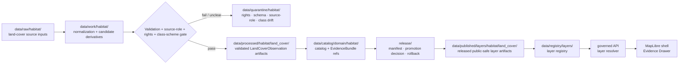

<!-- [KFM_META_BLOCK_V2]
doc_id: kfm://data/published/layers/habitat/land-cover-readme
name: Habitat Land Cover Published Layer README
path: data/published/layers/habitat/land_cover/README.md
type: data-lane-readme
version: v0.1.0
status: draft
owners:
  - <habitat-lane-steward>
  - <land-cover-sublane-steward>
  - <release-steward>
  - <map-layer-steward>
created: 2026-06-26
updated: 2026-06-26
policy_label: public
truth_posture: cite-or-abstain
lifecycle_phase: published
responsibility_root: data/
domain: habitat
sublane: land_cover
artifact_family: released-public-safe-land-cover-layer
sensitivity_posture: public-safe-derivative-layer; source-role-and-vintage-required; land-cover-is-evidence-context-not-habitat-truth-by-itself
related:
  - ../README.md
  - ../../README.md
  - ../../../README.md
  - ../../../../../docs/doctrine/directory-rules.md
  - ../../../../../docs/domains/habitat/README.md
  - ../../../../../docs/domains/habitat/sublanes/land_cover.md
  - ../../../../../data/processed/habitat/land_cover/README.md
  - ../../../../../data/registry/layers/README.md
  - ../../../../../release/manifests/README.md
tags:
  - kfm
  - data
  - published
  - layers
  - habitat
  - land-cover
  - land-cover-observation
  - nlcd
  - landfire
  - gap
  - nwi
  - public-safe
  - evidence-first
notes:
  - "This README documents the public-safe Habitat land-cover layer publication lane."
  - "This path is for released land-cover map artifacts and direct sidecars only, not release decisions, proof bundles, receipts, source inputs, processed records, or catalog records."
  - "Land-cover classes are source classifications and context evidence. They are not species occurrence truth, habitat patch truth, suitability truth, crop truth, soil truth, hydrology truth, or regulatory truth by themselves."
[/KFM_META_BLOCK_V2] -->

<a id="top"></a>

<div align="center">

# Habitat Land Cover Published Layers

**Released public-safe land-cover map artifacts for Habitat evidence and landscape-context surfaces.**


</div>

---

## Quick reference

| Field | Value |
|---|---|
| **Path** | `data/published/layers/habitat/land_cover/` |
| **Responsibility root** | `data/` |
| **Lifecycle phase** | `published/` — released public-safe artifacts only |
| **Domain lane** | `habitat/` |
| **Sublane** | `land_cover` — land-cover observations, cover-class derivatives, and public-safe summary layers |
| **Artifact family** | Released public-safe land-cover map layers and direct sidecars |
| **Primary consumers** | Governed API layer resolver, MapLibre shell, Evidence Drawer, public-safe exports, release QA |
| **Release authority** | `release/manifests/` and `release/promotion_decisions/`, not this directory |
| **Proof authority** | `data/proofs/` and `data/receipts/`, not this directory |
| **Default failure posture** | `ABSTAIN` unresolved public claims; `DENY` or `RESTRICT` unresolved rights, unsafe joins, or missing release state |

---

## 1. Purpose

This directory holds **released public-safe Habitat land-cover layer artifacts**. These artifacts represent public map delivery products derived from governed `LandCoverObservation` evidence, class-scheme profiles, cover-class crosswalks, generalized cover layers, uncertainty summaries, or change summaries.

Land cover is evidence and context. A land-cover class from a source product is not, by itself, a habitat assertion, species occurrence, habitat patch condition, suitability score, restoration priority, crop truth, soil property, hydrology measurement, or regulatory determination.

A published land-cover layer is a downstream carrier. It does not replace the source product, processed `LandCoverObservation`, catalog record, EvidenceBundle, source descriptor, policy decision, or release manifest.

> [!IMPORTANT]
> Presence in `data/published/layers/habitat/land_cover/` does **not** by itself prove that a layer is valid public output. Verify the corresponding `ReleaseManifest`, `PromotionDecision`, proof pack, receipt chain, layer registry entry, rights posture, source-vintage notes, class-scheme notes, and rollback target before exposing or citing the layer.

---

## 2. What belongs here

| Artifact | Example name | Required condition before placement |
|---|---|---|
| Land-cover PMTiles | `habitat_land_cover_public_vYYYYMMDD.pmtiles` | ReleaseManifest exists; source role, source vintage, class scheme, rights, and field allowlist are resolved |
| Land-cover COG | `habitat_land_cover_public_vYYYYMMDD.tif` | Released public-safe raster artifact with overviews, digest, manifest reference, and delivery checks |
| Land-cover GeoParquet | `habitat_land_cover_public_vYYYYMMDD.geoparquet` | Released vector/export artifact with digest and manifest reference |
| Change-summary layer | `habitat_land_cover_change_summary_vYYYYMMDD.pmtiles` | Threshold profile, analysis unit, source vintages, and evidence refs are documented |
| Tile metadata sidecar | `habitat_land_cover_public_vYYYYMMDD.tiles.json` | References bounds, zoom range, layer id, source product, schema version, release id, and digest |
| Integrity sidecar | `habitat_land_cover_public_vYYYYMMDD.sha256` | Digest generated from the exact released bytes |
| Layer descriptor | `layer.manifest.json` or `layer.json` | Points to governed layer registry and release manifest |
| Field allowlist | `land_cover_fields.allowlist.json` | Documents public fields included in the released artifact |
| Source/class summary | `source_class_scheme.summary.json` | Public-safe description of source product, vintage, class scheme, CRS, resolution, and crosswalks |
| Optional style fragment | `style.fragment.json` | Rendering hints only; no proof, source, policy, or release authority |
| README / release-local guidance | `README.md` | Explains boundaries for this lane or a release-id subfolder |

Artifacts in this folder should be safe as public bytes. Public payloads should not include unpublished candidate fields, internal QA notes, silent class recodes, unreviewed AI classifications, unsafe join outputs, or claims owned by other Habitat sublanes or adjacent domains.

---

## 3. What does not belong here

| Do not place | Correct home | Reason |
|---|---|---|
| RAW source downloads | `data/raw/habitat/<source_id>/<run_id>/` | RAW is intake, not publication |
| Normalization scratch outputs | `data/work/habitat/<run_id>/` | WORK may contain unresolved candidate state |
| Failed, ambiguous, or rights-unclear material | `data/quarantine/habitat/<reason>/<run_id>/` | Quarantine is not publication |
| Canonical processed land-cover artifacts | `data/processed/habitat/land_cover/` | Processed state does not equal release state |
| Catalog records or catalog projections | `data/catalog/domain/habitat/`, `data/catalog/stac/habitat/`, `data/catalog/dcat/habitat/`, `data/catalog/prov/habitat/` | Catalog authority stays separate from map bytes |
| EvidenceBundle / ProofPack | `data/proofs/` | Proof authority stays separate from delivery artifacts |
| Validation, transform, build, model, or release receipts | `data/receipts/` | Receipts are process memory, not layer payload |
| Release manifest or promotion decision | `release/` | Release authority belongs to the release root |
| Habitat patch, suitability, connectivity, or restoration truth | Habitat sibling lanes | Land cover supplies inputs and context only |
| Species occurrence truth | Fauna or Flora domain lanes | Land cover does not assert species presence |
| Crop classification truth | Agriculture domain lanes | Crop-specific classification belongs to Agriculture unless explicitly joined as context |
| Soil or hydrology truth | Soil or Hydrology lanes | Land cover can contextualize, not replace those domains |
| AI-generated ecological claims | governed answer/provenance paths only | AI is interpretive, not source or release authority |

---

## 4. Publication boundary



<!-- END OF MERMAID -->

The normal public path is:

```text
released land-cover layer artifact
→ layer registry entry
→ ReleaseManifest
→ governed API / layer resolver
→ MapLibre shell
→ Evidence Drawer / citation surface
```

The forbidden shortcut is:

```text
source raster / processed candidate / unreviewed derivative
→ direct public map layer
```

---

## 5. Land-cover-specific governance rules

| Rule | Required behavior |
|---|---|
| **Land cover is evidence context** | It supports Habitat analysis but does not become patch, suitability, restoration, occurrence, crop, soil, hydrology, or regulatory truth by itself. |
| **Source role is explicit** | Observation, model, context, aggregate, and derived products must not collapse. |
| **Class scheme is visible** | Layer manifests should state source product, source vintage, class scheme, crosswalk version, and analysis scope. |
| **Raster handling is documented** | CRS, resolution, resampling method, valid-pixel footprint, nodata, COG/PMTiles tiling, and overviews must be documented where relevant. |
| **Field allowlists are mandatory** | Public tiles contain only approved fields; hiding fields in a style is not publication control. |
| **Change summaries are thresholded** | Change-rate layers require a threshold/materiality profile and must distinguish observed change from interpretation. |
| **Sensitive joins fail closed** | Cross-lane joins touching protected biodiversity, private context, or stewardship-controlled data require policy, review, transform receipts, and release support. |
| **Evidence references are required** | Features or manifests must carry safe evidence references or resolver keys sufficient for EvidenceBundle lookup. |
| **Temporal context survives** | Source vintage, observation/valid period, retrieval time, release time, and correction time must stay distinguishable. |
| **AI is not authority** | Generated summaries, labels, or classifications cannot replace source attribution, review, or release state. |
| **Rollback is mandatory** | Every public land-cover layer must be tied to rollback and correction/withdrawal paths. |

---

## 6. Expected artifact layout

Small early releases may remain flat. Once multiple versions exist, prefer release-id folders so source lineage, class scheme, release, rollback, and digest verification stay inspectable.

```text
data/published/layers/habitat/land_cover/
├── README.md
├── <release_id>/
│   ├── habitat_land_cover_public.pmtiles
│   ├── habitat_land_cover_public.tif
│   ├── habitat_land_cover_public.geoparquet
│   ├── habitat_land_cover_public.sha256
│   ├── layer.manifest.json
│   ├── land_cover_fields.allowlist.json
│   ├── source_class_scheme.summary.json
│   ├── style.fragment.json
│   └── README.md                  # optional release-local note
└── latest.json                     # optional generated pointer from ReleaseManifest
```

`latest.json` must be generated from release state, not hand-edited. If release state, source-vintage state, class-scheme state, digest state, or rollback state is missing, remove or withhold the pointer.

---

## 7. Minimum manifest expectations

A layer manifest or sidecar for this directory should include at least:

| Field | Purpose |
|---|---|
| `layer_id` | Stable layer id, for example `habitat.land_cover.public` |
| `domain` | `habitat` |
| `sublane` | `land_cover` |
| `artifact_family` | `land_cover_layer` |
| `claim_character` | `observation_context`, `generalized_cover_layer`, `change_summary`, `modeled_derivative`, or equivalent controlled value |
| `release_id` | Pointer to `release/manifests/<release_id>.json` |
| `artifact_href` | Relative or release-resolved artifact path |
| `artifact_sha256` | Digest of released bytes |
| `format` | `pmtiles`, `cog`, `geoparquet`, `geojson`, or other approved public format |
| `bounds` | Public-safe spatial bounds |
| `minzoom` / `maxzoom` | Tile zoom range, when tiled |
| `source_product` | Source product or source family |
| `source_vintage` | Source vintage or observation period |
| `class_scheme_ref` | Class scheme profile and version |
| `crosswalk_ref` | Required if public classes were crosswalked or reclassified |
| `source_resolution` | Native source resolution or analysis resolution |
| `source_crs` | Source CRS/provenance note where relevant |
| `delivery_crs` | Delivery projection where relevant |
| `valid_pixel_footprint_ref` | Required for raster-derived products when available |
| `uncertainty_ref` | Classification accuracy, uncertainty, or quality note when available |
| `temporal_scope` | Source/observation/retrieval/release/correction time support |
| `field_allowlist_ref` | Pointer to public field allowlist |
| `evidence_bundle_refs` | Safe references or resolver keys |
| `policy_decision_ref` | Release policy decision reference |
| `rollback_ref` | Rollback card or rollback target |
| `correction_path` | Where corrections, supersessions, or withdrawals are recorded |

---

## 8. Validation checklist

Before adding or updating a land-cover artifact here, reviewers should be able to answer **yes** to each item.

- [ ] Every contributing source has a source descriptor.
- [ ] Source role is explicit and compatible with the public claim.
- [ ] Source product, vintage, class scheme, scope, and identifiers are represented.
- [ ] CRS, resolution, nodata, valid-pixel footprint, reprojection, resampling, and tiling behavior are documented where relevant.
- [ ] Rights and license posture allow this public derivative.
- [ ] Public fields are allowlisted and checked against the actual released bytes.
- [ ] Change summaries identify source vintages, analysis unit, and threshold/materiality profile.
- [ ] Land-cover context is not presented as patch, suitability, occurrence, crop, soil, hydrology, restoration, or regulatory truth.
- [ ] Sensitive cross-lane joins are absent or have policy/review/transform/release support.
- [ ] EvidenceBundle references resolve through governed lookup.
- [ ] Layer registry entry references this artifact family and release id.
- [ ] ReleaseManifest and PromotionDecision exist under `release/`.
- [ ] Rollback card or rollback target exists.
- [ ] Correction and withdrawal paths are documented.
- [ ] Public UI consumes the layer through governed APIs or release-resolved artifact manifests, not RAW, WORK, QUARANTINE, processed stores, or direct model output.

---

## 9. Suggested checks

Use the repository validator orchestrator when available:

```bash
python tools/validate_all.py
```

Potential land-cover-layer-specific checks should cover:

```text
tools/validators/domains/habitat/land_cover/source_role_authority/
tools/validators/domains/habitat/land_cover/class_scheme_profile/
tools/validators/domains/habitat/land_cover/raster_delivery/
tools/validators/domains/habitat/land_cover/change_summary_thresholds/
tools/validators/domains/habitat/land_cover/layer_manifest/
tools/validators/domains/habitat/land_cover/tile_field_allowlist/
tools/validators/domains/habitat/land_cover/cross_lane_join_safety/
tests/domains/habitat/land_cover/
tests/domains/habitat/layers/
```

If a validator is not implemented yet, mark the candidate `NEEDS VERIFICATION` rather than treating the gap as a pass.

---

## 10. Map consumer rules

Consumers should:

1. Load only release-resolved artifacts or manifests.
2. Resolve feature details through the governed API or Evidence Drawer payload.
3. Display release, stale, source product, source vintage, class scheme, analysis resolution, uncertainty, and correction state where available.
4. Avoid presenting land-cover classes as occurrence evidence, habitat patch evidence, suitability evidence, crop truth, soil truth, hydrology truth, or regulatory truth.
5. Preserve `ABSTAIN`, `DENY`, and `ERROR` outcomes in UI state.
6. Avoid direct reads from RAW, WORK, QUARANTINE, processed stores, source mirrors, or direct model output.
7. Keep AI and Focus Mode answers subordinate to evidence, source role, rights, policy, review, and release state.

---

## 11. Common failure modes

| Failure | Outcome |
|---|---|
| Layer exists without ReleaseManifest | Not a valid public layer |
| Source product, vintage, or class scheme is missing | `ABSTAIN` source/version-sensitive claims |
| Source rights are unresolved | `DENY` or hold in quarantine |
| Silent class recode or undocumented crosswalk is used | Source-role/class-scheme violation; correct or withdraw claim |
| Change summary lacks threshold profile | `NEEDS VERIFICATION`; withhold change claim |
| Land-cover class is presented as occurrence, patch, suitability, crop, soil, hydrology, or regulatory truth | Source-role violation; correct or withdraw claim |
| Field is hidden in style but present in payload | Publication leak; correct payload before release |
| Layer lacks EvidenceBundle references | `ABSTAIN` public claims; block Evidence Drawer support |
| `latest.json` points to artifact without rollback target | Release drift; remove alias until fixed |

---

## 12. Maintainer checklist

- Keep this folder limited to released public-safe land-cover map artifacts and direct sidecars.
- Put release decisions in `release/`, not here.
- Put proof and receipt objects in `data/proofs/` and `data/receipts/`, not here.
- Preserve source role, source product, source vintage, class scheme, CRS/resolution, uncertainty, and release state.
- Keep Habitat patch, suitability, restoration, connectivity, species occurrence, crop, soil, hydrology, and regulatory claims in their owning lanes.
- Prefer release-id subfolders when more than one version exists.
- Update this README when artifact naming, manifest shape, validator paths, source-role rules, class schemes, or release gates change.

---

## 13. Status notes

| Claim | Status |
|---|---|
| This README defines the intended boundary for `data/published/layers/habitat/land_cover/`. | **CONFIRMED authored** |
| The target path exists in the live repository. | **CONFIRMED by GitHub contents API during this edit** |
| Actual released habitat land-cover artifacts exist here. | **UNKNOWN** |
| Habitat land-cover publication validators are implemented and wired in CI. | **NEEDS VERIFICATION** |
| Any specific source has been approved for public land-cover layer publication. | **NEEDS VERIFICATION** |
| The current public UI loads this layer through a governed API. | **UNKNOWN** |

---

## Related files

- [`../README.md`](../README.md) — Habitat published layer parent lane
- [`../../README.md`](../../README.md) — published layer family lane
- [`../../../README.md`](../../../README.md) — `data/published/` lane
- [`../../../../../docs/doctrine/directory-rules.md`](../../../../../docs/doctrine/directory-rules.md) — placement and lifecycle doctrine
- [`../../../../../docs/domains/habitat/sublanes/land_cover.md`](../../../../../docs/domains/habitat/sublanes/land_cover.md) — land-cover sublane doctrine
- [`../../../../../data/processed/habitat/land_cover/README.md`](../../../../../data/processed/habitat/land_cover/README.md) — processed land-cover lane
- [`../../../../../data/registry/layers/README.md`](../../../../../data/registry/layers/README.md) — layer registry entry point
- [`../../../../../release/manifests/README.md`](../../../../../release/manifests/README.md) — release manifest authority

---

<div align="center">

**KFM rule:** land-cover layers are public-safe evidence/context artifacts, not habitat truth, occurrence truth, regulatory truth, proof authority, release authority, or AI truth.

[Back to top](#top)

</div>
