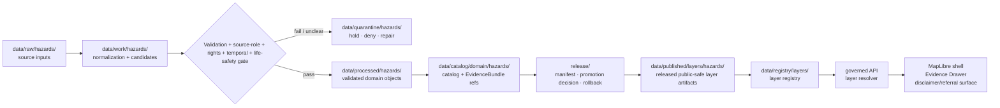

<!-- [KFM_META_BLOCK_V2]
doc_id: kfm://data/published/layers/hazards/readme
name: Hazards Published Layers README
path: data/published/layers/hazards/README.md
type: data-lane-index-readme
version: v0.1.0
status: draft
owners:
  - <hazards-domain-steward>
  - <release-steward>
  - <map-layer-steward>
created: 2026-06-26
updated: 2026-06-26
policy_label: public
truth_posture: cite-or-abstain
lifecycle_phase: published
responsibility_root: data/
domain: hazards
artifact_family: released-public-safe-hazards-map-layers
sensitivity_posture: public-context-only; not-alert-authority; source-role-temporal-and-release-state-required
related:
  - ../README.md
  - ../../README.md
  - flood_event/README.md
  - nfhl/README.md
  - ../../../../docs/doctrine/directory-rules.md
  - ../../../../docs/domains/hazards/README.md
  - ../../../../docs/domains/hazards/FILE_SYSTEM_PLAN.md
  - ../../../registry/layers/README.md
  - ../../../../release/manifests/README.md
tags:
  - kfm
  - data
  - published
  - layers
  - hazards
  - flood-event
  - nfhl
  - regulatory-context
  - life-safety-boundary
  - maplibre
  - public-safe
  - evidence-first
notes:
  - "This README indexes and governs public-safe Hazards published layer lanes."
  - "This path is for released Hazards map-layer artifacts and immediate sidecars, not release decisions, proof bundles, receipts, source inputs, processed records, catalog records, operational alerting, or direct AI outputs."
  - "The child lanes confirmed by README edits in this session are flood_event/ and nfhl/. Future Hazards layer lanes remain PROPOSED until created and reviewed."
  - "KFM is not an emergency alert system. Hazards layers provide evidence/context only and must refer life-safety action to official sources."
[/KFM_META_BLOCK_V2] -->

<a id="top"></a>

<div align="center">

# Hazards Published Layers

**Released public-safe map-layer artifacts for the Hazards domain.**


</div>

---

## Quick reference

| Field | Value |
|---|---|
| **Path** | `data/published/layers/hazards/` |
| **Responsibility root** | `data/` |
| **Lifecycle phase** | `published/` — released public-safe artifacts only |
| **Domain lane** | `hazards/` |
| **Artifact family** | Released public-safe Hazards map layers and direct sidecars |
| **Confirmed child lanes in this session** | [`flood_event/`](flood_event/README.md), [`nfhl/`](nfhl/README.md) |
| **Future/proposed layer lanes** | `disaster_declarations/`, `wildfire_detection/`, `smoke_context/`, `drought/`, `earthquake/`, `heat_cold/`, `exposure_summary/`, or other ADR/release-approved lanes |
| **Primary consumers** | Governed API layer resolver, MapLibre shell, Evidence Drawer, public-safe exports, release QA |
| **Release authority** | `release/manifests/` and `release/promotion_decisions/`, not this directory |
| **Proof authority** | `data/proofs/` and `data/receipts/`, not this directory |
| **Life-safety posture** | Not an alert, warning, instruction, evacuation, routing, or emergency-response authority |
| **Default failure posture** | `ABSTAIN` unresolved public claims; `DENY` live-alert misuse, expired-operational-state-as-current, source-role collapse, unresolved rights, missing disclaimer, unsafe joins, or missing release state |

---

## 1. Purpose

This directory is the parent lane for **released public-safe Hazards map-layer artifacts**. It groups map delivery outputs after evidence, source role, rights, temporal handling, sensitivity, validation, catalog closure, review, release, correction, and rollback gates have passed.

This is an artifact delivery surface. It is not a source repository, canonical processed store, catalog truth store, proof store, release authority, review archive, official-source substitute, emergency alerting system, or AI interpretation lane.

> [!IMPORTANT]
> A file under `data/published/layers/hazards/` is not automatically valid public output. Public exposure still depends on a valid `ReleaseManifest`, `PromotionDecision`, evidence/proof closure, policy outcome, layer registry entry, digest verification, life-safety disclaimer, official-source referral, correction path, and rollback target.

---

## 2. Lane map

| Lane | Status | Purpose | Public-safety posture |
|---|---:|---|---|
| [`flood_event/`](flood_event/README.md) | **CONFIRMED README** | Released flood-event context, observation, impact, timeline, or public-safe footprint layers. | Evidence/context only; not alerting, warning, instruction, or official-source authority. |
| [`nfhl/`](nfhl/README.md) | **CONFIRMED README** | Released regulatory flood-context layers. | Regulatory/context only; not observed flood-event truth or emergency authority. |
| `disaster_declarations/` | **PROPOSED** | Public-safe administrative disaster-declaration layers or summaries. | Administrative context only; not observed hazard footprint. |
| `wildfire_detection/` | **PROPOSED** | Public-safe reviewed wildfire detection or candidate-detection summaries. | Detection/candidate roles must remain visible. |
| `smoke_context/` | **PROPOSED** | Public-safe smoke context or modeled/observed smoke layers. | Observed/model roles and time windows must remain visible. |
| `drought/` | **PROPOSED** | Public-safe drought indicators or aggregate drought-context layers. | Aggregate/context only; not per-place certainty without evidence. |
| `earthquake/` | **PROPOSED** | Public-safe earthquake-event layers. | Observation with uncertainty; source and revision state required. |
| `heat_cold/` | **PROPOSED** | Public-safe heat/cold event or advisory-context layers. | Not alert authority; temporal state and official-source referral required. |
| `exposure_summary/` | **PROPOSED** | Public-safe derived exposure summaries. | Cross-lane sensitivity review and release support required. |

Do not create a new sibling lane casually. Confirm the owning root, artifact family, policy posture, layer registry shape, source role, temporal posture, release path, and whether an ADR or migration note is required.

---

## 3. What belongs here

| Artifact class | Examples | Boundary |
|---|---|---|
| Released public Hazards layer bytes | PMTiles, GeoParquet, GeoJSON, vector-tile bundles, public-safe COGs | Must be public-safe as bytes, not merely safe as a rendered style |
| Layer sidecars | `layer.manifest.json`, `tiles.json`, `*.sha256`, `fields.allowlist.json` | Must point to release state, registry state, evidence refs, and digests |
| Source-role summaries | `source_role.summary.json`, `role_boundary.summary.json` | Required where observed, regulatory, modeled, administrative, aggregate, candidate, or synthetic roles could be confused |
| Temporal summaries | `temporal_scope.summary.json`, `event_timeline.summary.json` | Required where event, valid, issue, expiry, source, retrieval, release, or correction times affect meaning |
| Disclaimer/referral sidecars | `life_safety_boundary.json`, `official_source_referral.json` | Required for public Hazards layers where life-safety misuse is plausible |
| Public-safe style fragments | `style.fragment.json` | Rendering hints only; cannot act as source, proof, policy, alert, redaction, or release authority |
| Release-local README files | `<release_id>/README.md` | Explain release-local artifact contents without duplicating proof or release authority |
| Generated pointers | `latest.json` | Must be release-generated and rollback-safe, not hand-edited |

---

## 4. What does not belong here

| Do not place | Correct home | Reason |
|---|---|---|
| RAW source downloads | `data/raw/hazards/<source_id>/<run_id>/` | RAW is intake, not publication |
| WORK files or candidates | `data/work/hazards/<run_id>/` | WORK may contain unresolved candidates or unreviewed joins |
| Quarantined material | `data/quarantine/hazards/<reason>/<run_id>/` | Failed, stale, expired, rights-unclear, or unsafe material is not public release |
| Canonical processed Hazards objects | `data/processed/hazards/...` | Processed does not equal published |
| Catalog records, triplets, or graph truth | `data/catalog/...` or graph/catalog lanes | Catalog authority stays separate from map bytes |
| EvidenceBundle / ProofPack | `data/proofs/` | Proof authority stays separate from delivery artifacts |
| Validation, transform, build, redaction, or release receipts | `data/receipts/` | Receipts are process memory, not layer payloads |
| Release manifests / promotion decisions | `release/` | Release decision authority belongs to release governance |
| Current alerting, warnings, evacuation, routing, or emergency-response instructions | Official external authorities; KFM may only refer | KFM is not an emergency alert system |
| Hydrology measurement truth | Hydrology domain lanes | Hazards can cite water context but does not own hydrology measurements |
| Infrastructure, road, rail, parcel, or administrative identity | Owning domain lanes | Hazards can summarize approved exposure, not re-author adjacent-domain identity |
| Legal, insurance, engineering, or permitting advice | Outside KFM publication authority | Hazards layers are evidence/context, not professional determinations |
| AI-generated hazard claims | governed answer/provenance paths only | AI is interpretive, not source, evidence, policy, official-source, or release authority |

---

## 5. Publication boundary



<!-- END OF MERMAID -->

The normal public path is:

```text
released hazards layer artifact
→ layer registry entry
→ ReleaseManifest
→ governed API / layer resolver
→ MapLibre shell
→ Evidence Drawer / disclaimer surface
```

The forbidden shortcut is:

```text
RAW / WORK / QUARANTINE / processed candidate / operational feed / direct model output
→ direct public map layer
```

---

## 6. Hazards public-safety rules

| Rule | Required behavior |
|---|---|
| **Not alert authority** | Public surfaces must make clear that KFM is not an emergency alert, warning, instruction, or response system. |
| **Source role is explicit** | Observed, regulatory, modeled, aggregate, administrative, candidate, and synthetic roles must not collapse. |
| **Temporal fields stay separate** | Event, observed, valid, issue, expiry, source, retrieval, release, and correction times must not collapse where material. |
| **Expired operational context cannot be live** | Expired or stale operational context must be withdrawn, corrected, rolled back, or displayed only as historical context. |
| **Official-source referral is required** | Public UI should refer life-safety and authoritative interpretation to official sources. |
| **Layer bytes are safe first** | Do not rely on style filters or client-side hiding as publication control. |
| **Cross-lane joins fail closed** | Joins with infrastructure, private, transportation, hydrology, or other policy-sensitive context require policy, review, transform receipts, and release support. |
| **Evidence references are required** | Features or manifests must carry safe evidence references or resolver keys sufficient for EvidenceBundle lookup. |
| **AI is not authority** | Generated summaries or Focus Mode answers cannot replace source attribution, evidence, review, release state, or official-source referral. |
| **Rollback is mandatory** | Every public Hazards layer must be tied to rollback and correction/withdrawal paths. |

---

## 7. Recommended subtree shape

Current verified child READMEs in this session:

```text
data/published/layers/hazards/
├── README.md
├── flood_event/
│   └── README.md
└── nfhl/
    └── README.md
```

Future lanes should be added only after governance/release review:

```text
data/published/layers/hazards/
├── disaster_declarations/   # PROPOSED
├── wildfire_detection/      # PROPOSED
├── smoke_context/           # PROPOSED
├── drought/                 # PROPOSED
├── earthquake/              # PROPOSED
├── heat_cold/               # PROPOSED
└── exposure_summary/        # PROPOSED
```

Release-id folders may be used inside each child lane once artifact versions exist:

```text
<lane>/
├── README.md
├── <release_id>/
│   ├── <artifact>.pmtiles
│   ├── <artifact>.geoparquet
│   ├── <artifact>.geojson
│   ├── <artifact>.sha256
│   ├── layer.manifest.json
│   ├── fields.allowlist.json
│   ├── life_safety_boundary.json
│   ├── official_source_referral.json
│   └── README.md
└── latest.json
```

`latest.json` must be generated from release state and removed or withheld when rollback state, temporal state, disclaimer/referral state, digest state, or release state is missing.

---

## 8. Minimum layer manifest expectations

| Field | Purpose |
|---|---|
| `layer_id` | Stable public layer id |
| `domain` | `hazards` |
| `sublane` | `flood_event`, `nfhl`, or approved controlled value |
| `artifact_family` | Approved map-layer family |
| `claim_character` | Observed event, regulatory context, modeled context, administrative context, aggregate summary, public-safe exposure summary, or equivalent controlled value |
| `release_id` | Pointer to `release/manifests/<release_id>.json` |
| `artifact_href` | Relative or release-resolved artifact path |
| `artifact_sha256` | Digest of released bytes |
| `format` | `pmtiles`, `geoparquet`, `geojson`, `cog`, or approved public format |
| `bounds` | Public-safe spatial bounds |
| `source_refs` | Source descriptor, source feed, official source referral, or catalog refs |
| `source_role` | Canonical source role; must not be inferred from convenience |
| `temporal_scope` | Event/observed/valid/issue/expiry/source/retrieval/release/correction time support where material |
| `life_safety_boundary_ref` | Disclaimer and official-source referral reference |
| `sensitivity_posture` | Public-safe, generalized, restricted, deny, or withhold reason |
| `field_allowlist_ref` | Pointer to approved public field allowlist |
| `evidence_bundle_refs` | Safe references or resolver keys |
| `policy_decision_ref` | Release policy decision reference |
| `rollback_ref` | Rollback card or rollback target |
| `correction_path` | Where corrections, supersessions, or withdrawals are recorded |

---

## 9. Validation checklist

- [ ] The artifact belongs under an existing child lane or a new lane has been approved through the proper architecture/governance path.
- [ ] Every contributing source has a source descriptor.
- [ ] Source role is explicit and compatible with the public claim.
- [ ] Temporal scope is represented without collapsing event, issue, expiry, retrieval, release, or correction time where material.
- [ ] Rights and license posture allow this public derivative.
- [ ] Life-safety disclaimer and official-source referral are present where needed.
- [ ] Public fields are allowlisted and checked against the actual released bytes.
- [ ] Expired operational context is not presented as current.
- [ ] Regulatory, modeled, administrative, observed, aggregate, candidate, and synthetic roles are not collapsed.
- [ ] Sensitive cross-lane joins are absent or have policy/review/transform/release support.
- [ ] EvidenceBundle references resolve through governed lookup.
- [ ] Layer registry entry references the artifact family and release id.
- [ ] ReleaseManifest and PromotionDecision exist under `release/`.
- [ ] Rollback card or rollback target exists.
- [ ] Correction and withdrawal paths are documented.
- [ ] Public UI consumes the layer through governed APIs or release-resolved artifact manifests, not RAW, WORK, QUARANTINE, processed stores, operational feeds, or direct model output.

---

## 10. Suggested checks

Use the repository validator orchestrator when available:

```bash
python tools/validate_all.py
```

Potential Hazards layer checks should cover:

```text
tools/validators/domains/hazards/source_role_anti_collapse/
tools/validators/domains/hazards/temporal_role/
tools/validators/domains/hazards/operational_expiry_freshness/
tools/validators/domains/hazards/life_safety_boundary/
tools/validators/domains/hazards/layer_manifest/
tools/validators/domains/hazards/tile_field_allowlist/
tools/validators/domains/hazards/cross_lane_join_safety/
tests/domains/hazards/layers/
tests/domains/hazards/release/
```

If a validator is not implemented yet, mark the candidate `NEEDS VERIFICATION` rather than treating the gap as a pass.

---

## 11. Map consumer rules

Consumers should:

1. Load only release-resolved artifacts or manifests.
2. Resolve feature details through the governed API or Evidence Drawer payload.
3. Display release, stale, source role, temporal state, disclaimer/referral, sensitivity, and correction state where available.
4. Avoid presenting Hazards map layers as official alerting, emergency instructions, professional advice, or stronger evidence than their source role supports.
5. Preserve `ABSTAIN`, `DENY`, and `ERROR` outcomes in UI state.
6. Avoid direct reads from RAW, WORK, QUARANTINE, processed stores, operational feeds, source mirrors, or direct model output.
7. Keep AI and Focus Mode answers subordinate to evidence, source role, time, policy, review, release state, and official-source referral.

---

## 12. Common failure modes

| Failure | Outcome |
|---|---|
| Public artifact exists without ReleaseManifest | Not a valid public layer |
| Expired operational context is displayed as current | `DENY`, withdraw, correct, or roll back |
| Regulatory context is labeled as observed event | Source-role violation; correct or withdraw claim |
| Life-safety disclaimer or official-source referral is missing where needed | Hold release; no public surface change |
| Source role or temporal scope is missing | `ABSTAIN` role/time-sensitive claims |
| Source rights are unresolved | `DENY` or hold in quarantine |
| Sensitive join output is included without review/release support | `DENY`, withdraw, or quarantine artifact |
| Field is hidden in style but present in payload | Publication leak; correct payload before release |
| Layer lacks EvidenceBundle references | `ABSTAIN` public claims; block Evidence Drawer support |
| `latest.json` points to artifact without rollback target | Release drift; remove alias until fixed |
| New sibling lane appears without governance note | Directory drift; require review or ADR/migration note |

---

## 13. Maintainer checklist

- Keep this subtree limited to released public-safe Hazards map-layer artifacts and direct sidecars.
- Put release decisions in `release/`, not here.
- Put proof and receipt objects in `data/proofs/` and `data/receipts/`, not here.
- Preserve source role, temporal scope, disclaimer/referral, field allowlist, evidence refs, and release state.
- Keep official alerting, emergency instructions, hydrology measurements, infrastructure identity, transport identity, and professional determinations in their owning or external authority lanes.
- Use child README files to document lane-specific rules.
- Prefer release-id subfolders when more than one version exists.
- Update this README when child lanes, artifact naming, manifest shape, validator paths, source-role rules, temporal rules, or release gates change.

---

## 14. Status notes

| Claim | Status |
|---|---|
| This README defines the intended boundary for `data/published/layers/hazards/`. | **CONFIRMED authored** |
| The target path exists in the live repository. | **CONFIRMED by GitHub contents API during this edit** |
| `flood_event/README.md` and `nfhl/README.md` exist and were updated in this session. | **CONFIRMED by recent GitHub edits in this session** |
| Other child lanes listed here exist in the repository. | **UNKNOWN / PROPOSED** |
| Actual released Hazards layer artifacts exist in this subtree. | **UNKNOWN** |
| Hazards layer publication validators are implemented and wired in CI. | **NEEDS VERIFICATION** |
| Any specific source has been approved for public Hazards layer publication. | **NEEDS VERIFICATION** |
| The current public UI loads these layers through a governed API. | **UNKNOWN** |
| KFM currently displays Hazards life-safety disclaimers in UI. | **UNKNOWN** |

---

## Related files

- [`flood_event/README.md`](flood_event/README.md) — flood-event published layer lane
- [`nfhl/README.md`](nfhl/README.md) — NFHL regulatory flood-context published layer lane
- [`../README.md`](../README.md) — published layer family lane
- [`../../README.md`](../../README.md) — `data/published/` lane
- [`../../../../docs/doctrine/directory-rules.md`](../../../../docs/doctrine/directory-rules.md) — placement and lifecycle doctrine
- [`../../../../docs/domains/hazards/FILE_SYSTEM_PLAN.md`](../../../../docs/domains/hazards/FILE_SYSTEM_PLAN.md) — Hazards domain placement and life-safety boundary plan
- [`../../../registry/layers/README.md`](../../../registry/layers/README.md) — layer registry entry point
- [`../../../../release/manifests/README.md`](../../../../release/manifests/README.md) — release manifest authority

---

<div align="center">

**KFM rule:** Hazards published layers are public-safe evidence/context delivery artifacts, not emergency alerts, instructions, proof authority, release authority, official-source authority, professional advice, or AI truth.

[Back to top](#top)

</div>
