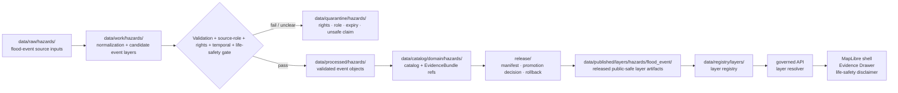

<!-- [KFM_META_BLOCK_V2]
doc_id: kfm://data/published/layers/hazards/flood-event-readme
name: Hazards Flood Event Published Layer README
path: data/published/layers/hazards/flood_event/README.md
type: data-lane-readme
version: v0.1.0
status: draft
owners:
  - <hazards-domain-steward>
  - <flood-event-lane-steward>
  - <release-steward>
  - <map-layer-steward>
created: 2026-06-26
updated: 2026-06-26
policy_label: public
truth_posture: cite-or-abstain
lifecycle_phase: published
responsibility_root: data/
domain: hazards
sublane: flood_event
artifact_family: released-public-safe-flood-event-layer
sensitivity_posture: public-context-only; not-alert-authority; observed-regulatory-modeled-administrative-roles-must-not-collapse
related:
  - ../README.md
  - ../../README.md
  - ../../../README.md
  - ../../../../../docs/doctrine/directory-rules.md
  - ../../../../../docs/domains/hazards/README.md
  - ../../../../../docs/domains/hazards/FILE_SYSTEM_PLAN.md
  - ../../../../../docs/domains/hydrology/README.md
  - ../../../../../data/registry/layers/README.md
  - ../../../../../release/manifests/README.md
tags:
  - kfm
  - data
  - published
  - layers
  - hazards
  - flood-event
  - flood-context
  - hazard-event
  - public-safe
  - life-safety-boundary
  - evidence-first
notes:
  - "This README documents the public-safe Hazards flood-event layer publication lane."
  - "This path is for released flood-event map artifacts and direct sidecars only, not release decisions, proof bundles, receipts, source inputs, processed records, catalog records, operational alerting, or direct AI outputs."
  - "KFM is not an emergency alert system. Flood-event layers are historical, observed, modeled, administrative, or contextual evidence surfaces only; life-safety action must be referred to official sources."
[/KFM_META_BLOCK_V2] -->

<a id="top"></a>

<div align="center">

# Hazards Flood Event Published Layers

**Released public-safe flood-event map artifacts for Hazards context and evidence review.**


</div>

---

## Quick reference

| Field | Value |
|---|---|
| **Path** | `data/published/layers/hazards/flood_event/` |
| **Responsibility root** | `data/` |
| **Lifecycle phase** | `published/` — released public-safe artifacts only |
| **Domain lane** | `hazards/` |
| **Sublane** | `flood_event` — released flood-event context, observation, impact, timeline, or public-safe footprint layers |
| **Artifact family** | Released public-safe flood-event map layers and direct sidecars |
| **Primary consumers** | Governed API layer resolver, MapLibre shell, Evidence Drawer, public-safe exports, release QA |
| **Release authority** | `release/manifests/` and `release/promotion_decisions/`, not this directory |
| **Proof authority** | `data/proofs/` and `data/receipts/`, not this directory |
| **Life-safety posture** | Not an alert, warning, instruction, or evacuation authority |
| **Default failure posture** | `ABSTAIN` unresolved public claims; `DENY` current-alert misuse, expired-operational-state-as-live, role collapse, unresolved rights, or missing release state |

---

## 1. Purpose

This directory holds **released public-safe Hazards flood-event layer artifacts**. These artifacts can represent time-bounded flood-event context, observed impacts, modeled or derived event footprints, historical event summaries, public-safe exposure summaries, or event timelines after evidence, source role, rights, temporal, sensitivity, validation, catalog closure, review, release, and rollback gates have passed.

A flood-event layer is an evidence surface, not a life-safety product. It must not tell users what to do during an emergency, present expired operational context as current, or replace official warning and emergency-management sources.

A published flood-event layer is a downstream carrier. It does not replace the source feed, processed `HazardEvent`, `FloodContext`, `ImpactArea`, `HazardTimeline`, catalog record, EvidenceBundle, source descriptor, policy decision, or release manifest.

> [!IMPORTANT]
> Presence in `data/published/layers/hazards/flood_event/` does **not** by itself prove that a layer is valid public output. Verify the corresponding `ReleaseManifest`, `PromotionDecision`, proof pack, receipt chain, layer registry entry, life-safety disclaimer, official-source referral, rights posture, temporal scope, and rollback target before exposing or citing the layer.

---

## 2. What belongs here

| Artifact | Example name | Required condition before placement |
|---|---|---|
| Flood-event PMTiles | `hazards_flood_event_public_vYYYYMMDD.pmtiles` | ReleaseManifest exists; source role, temporal scope, rights, disclaimer, and field allowlist are resolved |
| Flood-event GeoParquet | `hazards_flood_event_public_vYYYYMMDD.geoparquet` | Released analytical/export artifact with digest and manifest reference |
| Flood-event GeoJSON | `hazards_flood_event_public_vYYYYMMDD.geojson` | Small public-safe release or review artifact; avoid large unmanaged payloads |
| Event timeline sidecar | `flood_event_timeline.summary.json` | Distinguishes observed, valid, issue, expiry, retrieval, release, and correction times |
| Official-source referral sidecar | `official_source_referral.json` | Points users to official sources without making KFM the alert authority |
| Tile metadata sidecar | `hazards_flood_event_public_vYYYYMMDD.tiles.json` | References bounds, zoom range, layer id, source role, schema version, release id, and digest |
| Integrity sidecar | `hazards_flood_event_public_vYYYYMMDD.sha256` | Digest generated from the exact released bytes |
| Layer descriptor | `layer.manifest.json` or `layer.json` | Points to governed layer registry and release manifest |
| Field allowlist | `flood_event_fields.allowlist.json` | Documents public fields included in the released artifact |
| Optional style fragment | `style.fragment.json` | Rendering hints only; no proof, source, policy, alert, or release authority |
| README / release-local guidance | `README.md` | Explains boundaries for this lane or a release-id subfolder |

Artifacts in this folder should be safe as public bytes. Public payloads should not include unreviewed candidate fields, private notes, restricted joins, unpublished operational context, direct emergency instructions, or claims owned by Hydrology, Infrastructure, Roads/Rail, Weather/Air, or emergency-management source authorities.

---

## 3. What does not belong here

| Do not place | Correct home | Reason |
|---|---|---|
| RAW source downloads | `data/raw/hazards/<source_id>/<run_id>/` | RAW is intake, not publication |
| Normalization scratch outputs | `data/work/hazards/<run_id>/` | WORK may contain unresolved candidate state |
| Failed, ambiguous, expired, or rights-unclear material | `data/quarantine/hazards/<reason>/<run_id>/` | Quarantine is not publication |
| Canonical processed Hazards objects | `data/processed/hazards/...` | Processed state does not equal release state |
| Catalog records or catalog projections | `data/catalog/domain/hazards/` | Catalog authority stays separate from map bytes |
| EvidenceBundle / ProofPack | `data/proofs/` | Proof authority stays separate from delivery artifacts |
| Validation, transform, build, redaction, or release receipts | `data/receipts/` | Receipts are process memory, not layer payload |
| Release manifest or promotion decision | `release/` | Release authority belongs to the release root |
| Current alerting, warning, evacuation, routing, or emergency instructions | Official external authority; KFM can only refer | KFM is not an emergency alert system |
| Regulatory flood-zone products relabeled as observed flood events | Separate regulatory/context lane | Regulatory and observed event roles must not collapse |
| Hydrology measurement truth | Hydrology domain lanes | Hazards can cite water context but does not own hydrology measurements |
| Infrastructure exposure truth | Settlements/Infrastructure or cross-cutting exposure lanes | Hazards can summarize approved exposure, not re-author infrastructure identity |
| AI-generated hazard claims | governed answer/provenance paths only | AI is interpretive, not source or release authority |

---

## 4. Publication boundary



<!-- END OF MERMAID -->

The normal public path is:

```text
released flood-event layer artifact
→ layer registry entry
→ ReleaseManifest
→ governed API / layer resolver
→ MapLibre shell
→ Evidence Drawer / disclaimer surface
```

The forbidden shortcut is:

```text
source feed / work candidate / expired operational context / direct model output
→ direct public map layer
```

---

## 5. Flood-event-specific governance rules

| Rule | Required behavior |
|---|---|
| **Not alert authority** | Every public surface must make clear that KFM is not an emergency alert or instruction system. |
| **Source role is explicit** | Observed, regulatory, modeled, aggregate, administrative, candidate, and synthetic roles must not collapse. |
| **Temporal fields stay separate** | Event time, observed time, valid time, issue time, expiry time, source time, retrieval time, release time, and correction time must not collapse. |
| **Expired operational context cannot be live** | Expired operational context must be withdrawn, corrected, rolled back, or displayed only as historical context. |
| **Regulatory is not observed** | Regulatory flood products are not observed flood events and must not share this lane without explicit role separation. |
| **Official-source referral is required** | Public UI should direct life-safety users to official sources instead of treating KFM as the authority. |
| **Field allowlists are mandatory** | Public tiles contain only approved fields; hiding fields in a style is not publication control. |
| **Sensitive joins fail closed** | Joins with infrastructure, private, or other policy-sensitive context require policy, review, transform receipts, and release support. |
| **Evidence references are required** | Features or manifests must carry safe evidence references or resolver keys sufficient for EvidenceBundle lookup. |
| **AI is not authority** | Generated flood summaries or Focus Mode answers cannot replace source attribution, evidence, review, release state, or official alerting. |
| **Rollback is mandatory** | Every public flood-event layer must be tied to rollback and correction/withdrawal paths. |

---

## 6. Expected artifact layout

Small early releases may remain flat. Once multiple versions exist, prefer release-id folders so temporal state, source role, release, rollback, and digest verification stay inspectable.

```text
data/published/layers/hazards/flood_event/
├── README.md
├── <release_id>/
│   ├── hazards_flood_event_public.pmtiles
│   ├── hazards_flood_event_public.geoparquet
│   ├── hazards_flood_event_public.geojson
│   ├── hazards_flood_event_public.sha256
│   ├── layer.manifest.json
│   ├── flood_event_fields.allowlist.json
│   ├── flood_event_timeline.summary.json
│   ├── official_source_referral.json
│   ├── style.fragment.json
│   └── README.md                  # optional release-local note
└── latest.json                     # optional generated pointer from ReleaseManifest
```

`latest.json` must be generated from release state, not hand-edited. If release state, temporal state, disclaimer/referral state, digest state, or rollback state is missing, remove or withhold the pointer.

---

## 7. Minimum manifest expectations

A layer manifest or sidecar for this directory should include at least:

| Field | Purpose |
|---|---|
| `layer_id` | Stable layer id, for example `hazards.flood_event.public` |
| `domain` | `hazards` |
| `sublane` | `flood_event` |
| `artifact_family` | `flood_event_layer` |
| `claim_character` | `observed_event`, `historical_context`, `modeled_event_footprint`, `administrative_context`, `aggregate_summary`, or equivalent controlled value |
| `release_id` | Pointer to `release/manifests/<release_id>.json` |
| `artifact_href` | Relative or release-resolved artifact path |
| `artifact_sha256` | Digest of released bytes |
| `format` | `pmtiles`, `geoparquet`, `geojson`, or other approved public format |
| `bounds` | Public-safe spatial bounds |
| `source_refs` | Source descriptor, source feed, or catalog refs |
| `source_role` | Canonical source role; must not be inferred from convenience |
| `temporal_scope` | Event/observed/valid/issue/expiry/source/retrieval/release/correction time support |
| `life_safety_boundary_ref` | Disclaimer and official-source referral reference |
| `field_allowlist_ref` | Pointer to public field allowlist |
| `evidence_bundle_refs` | Safe references or resolver keys |
| `policy_decision_ref` | Release policy decision reference |
| `rollback_ref` | Rollback card or rollback target |
| `correction_path` | Where corrections, supersessions, or withdrawals are recorded |

---

## 8. Validation checklist

Before adding or updating a flood-event artifact here, reviewers should be able to answer **yes** to each item.

- [ ] Every contributing source has a source descriptor.
- [ ] Source role is explicit and compatible with the public claim.
- [ ] Temporal scope is represented without collapsing event, issue, expiry, retrieval, release, or correction time.
- [ ] Rights and license posture allow this public derivative.
- [ ] Life-safety disclaimer and official-source referral are present.
- [ ] Public fields are allowlisted and checked against the actual released bytes.
- [ ] Expired operational context is not presented as current.
- [ ] Regulatory, modeled, administrative, observed, aggregate, candidate, and synthetic roles are not collapsed.
- [ ] Sensitive cross-lane joins are absent or have policy/review/transform/release support.
- [ ] EvidenceBundle references resolve through governed lookup.
- [ ] Layer registry entry references this artifact family and release id.
- [ ] ReleaseManifest and PromotionDecision exist under `release/`.
- [ ] Rollback card or rollback target exists.
- [ ] Correction and withdrawal paths are documented.
- [ ] Public UI consumes the layer through governed APIs or release-resolved artifact manifests, not RAW, WORK, QUARANTINE, processed stores, operational feeds, or direct model output.

---

## 9. Suggested checks

Use the repository validator orchestrator when available:

```bash
python tools/validate_all.py
```

Potential flood-event-layer-specific checks should cover:

```text
tools/validators/domains/hazards/source_role_anti_collapse/
tools/validators/domains/hazards/temporal_role/
tools/validators/domains/hazards/operational_expiry_freshness/
tools/validators/domains/hazards/life_safety_boundary/
tools/validators/domains/hazards/layer_manifest/
tools/validators/domains/hazards/tile_field_allowlist/
tools/validators/domains/hazards/cross_lane_join_safety/
tests/domains/hazards/flood_event/
tests/domains/hazards/layers/
```

If a validator is not implemented yet, mark the candidate `NEEDS VERIFICATION` rather than treating the gap as a pass.

---

## 10. Map consumer rules

Consumers should:

1. Load only release-resolved artifacts or manifests.
2. Resolve feature details through the governed API or Evidence Drawer payload.
3. Display release, stale, source role, temporal state, disclaimer/referral, sensitivity, and correction state where available.
4. Avoid presenting flood-event context as official alerting, emergency instructions, or stronger evidence than its source role supports.
5. Preserve `ABSTAIN`, `DENY`, and `ERROR` outcomes in UI state.
6. Avoid direct reads from RAW, WORK, QUARANTINE, processed stores, operational feeds, source mirrors, or direct model output.
7. Keep AI and Focus Mode answers subordinate to evidence, source role, time, policy, review, release state, and official-source referral.

---

## 11. Common failure modes

| Failure | Outcome |
|---|---|
| Layer exists without ReleaseManifest | Not a valid public layer |
| Expired operational context is displayed as current | `DENY`, withdraw, correct, or roll back |
| Regulatory flood context is labeled as observed flood event | Source-role violation; correct or withdraw claim |
| Life-safety disclaimer or official-source referral is missing | Hold release; no public surface change |
| Source role or temporal scope is missing | `ABSTAIN` role/time-sensitive claims |
| Source rights are unresolved | `DENY` or hold in quarantine |
| Sensitive join output is included without review/release support | `DENY`, withdraw, or quarantine artifact |
| Field is hidden in style but present in payload | Publication leak; correct payload before release |
| Layer lacks EvidenceBundle references | `ABSTAIN` public claims; block Evidence Drawer support |
| `latest.json` points to artifact without rollback target | Release drift; remove alias until fixed |

---

## 12. Maintainer checklist

- Keep this folder limited to released public-safe flood-event map artifacts and direct sidecars.
- Put release decisions in `release/`, not here.
- Put proof and receipt objects in `data/proofs/` and `data/receipts/`, not here.
- Preserve source role, temporal scope, event state, disclaimer/referral, field allowlist, and release state.
- Keep official alerting, emergency instructions, regulatory flood-zone products, hydrology measurements, and infrastructure identity in their owning lanes.
- Prefer release-id subfolders when more than one version exists.
- Update this README when artifact naming, manifest shape, validator paths, source-role rules, temporal rules, or release gates change.

---

## 13. Status notes

| Claim | Status |
|---|---|
| This README defines the intended boundary for `data/published/layers/hazards/flood_event/`. | **CONFIRMED authored** |
| The target path exists in the live repository. | **CONFIRMED by GitHub contents API during this edit** |
| Actual released flood-event artifacts exist here. | **UNKNOWN** |
| Flood-event publication validators are implemented and wired in CI. | **NEEDS VERIFICATION** |
| Any specific source has been approved for public flood-event layer publication. | **NEEDS VERIFICATION** |
| The current public UI loads this layer through a governed API. | **UNKNOWN** |
| KFM currently displays Hazards life-safety disclaimers in UI. | **UNKNOWN** |

---

## Related files

- [`../README.md`](../README.md) — Hazards published layer parent lane
- [`../../README.md`](../../README.md) — published layer family lane
- [`../../../README.md`](../../../README.md) — `data/published/` lane
- [`../../../../../docs/doctrine/directory-rules.md`](../../../../../docs/doctrine/directory-rules.md) — placement and lifecycle doctrine
- [`../../../../../docs/domains/hazards/FILE_SYSTEM_PLAN.md`](../../../../../docs/domains/hazards/FILE_SYSTEM_PLAN.md) — Hazards domain placement and life-safety boundary plan
- [`../../../../../docs/domains/hydrology/README.md`](../../../../../docs/domains/hydrology/README.md) — Hydrology domain boundary
- [`../../../../../data/registry/layers/README.md`](../../../../../data/registry/layers/README.md) — layer registry entry point
- [`../../../../../release/manifests/README.md`](../../../../../release/manifests/README.md) — release manifest authority

---

<div align="center">

**KFM rule:** flood-event layers are public-safe evidence/context artifacts, not emergency alerts, instructions, proof authority, release authority, official-source authority, or AI truth.

[Back to top](#top)

</div>
