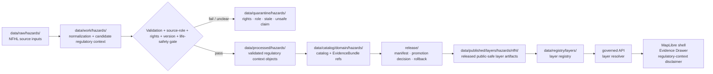

<!-- [KFM_META_BLOCK_V2]
doc_id: kfm://data/published/layers/hazards/nfhl-readme
name: Hazards NFHL Published Layer README
path: data/published/layers/hazards/nfhl/README.md
type: data-lane-readme
version: v0.1.0
status: draft
owners:
  - <hazards-domain-steward>
  - <nfhl-lane-steward>
  - <release-steward>
  - <map-layer-steward>
created: 2026-06-26
updated: 2026-06-26
policy_label: public
truth_posture: cite-or-abstain
lifecycle_phase: published
responsibility_root: data/
domain: hazards
sublane: nfhl
artifact_family: released-public-safe-regulatory-flood-context-layer
sensitivity_posture: public-regulatory-context-only; not-observed-flood-event; not-alert-authority; regulatory-observed-modeled-administrative-roles-must-not-collapse
related:
  - ../README.md
  - ../../README.md
  - ../../../README.md
  - ../flood_event/README.md
  - ../../../../../docs/doctrine/directory-rules.md
  - ../../../../../docs/domains/hazards/README.md
  - ../../../../../docs/domains/hazards/FILE_SYSTEM_PLAN.md
  - ../../../../../docs/domains/hydrology/README.md
  - ../../../../../contracts/domains/hydrology/nfhl_zone.md
  - ../../../../../data/registry/layers/README.md
  - ../../../../../release/manifests/README.md
tags:
  - kfm
  - data
  - published
  - layers
  - hazards
  - nfhl
  - flood-context
  - regulatory
  - public-safe
  - life-safety-boundary
  - evidence-first
notes:
  - "This README documents the public-safe Hazards NFHL layer publication lane."
  - "This path is for released regulatory flood-context map artifacts and direct sidecars only, not release decisions, proof bundles, receipts, source inputs, processed records, catalog records, operational alerting, or direct AI outputs."
  - "NFHL-style regulatory flood context must not be published, queried, or summarized as observed flood-event inundation. The flood_event/ lane is separate."
  - "KFM is not an emergency alert system. NFHL layers are regulatory/context evidence surfaces only; life-safety action must be referred to official sources."
[/KFM_META_BLOCK_V2] -->

<a id="top"></a>

<div align="center">

# Hazards NFHL Published Layers

**Released public-safe regulatory flood-context map artifacts for Hazards review and evidence display.**


</div>

---

## Quick reference

| Field | Value |
|---|---|
| **Path** | `data/published/layers/hazards/nfhl/` |
| **Responsibility root** | `data/` |
| **Lifecycle phase** | `published/` — released public-safe artifacts only |
| **Domain lane** | `hazards/` |
| **Sublane** | `nfhl` — regulatory flood-context layers, not observed flood events |
| **Artifact family** | Released public-safe regulatory flood-context map layers and direct sidecars |
| **Sibling boundary** | [`../flood_event/`](../flood_event/README.md) is for flood-event context; NFHL must not be collapsed into observed event truth |
| **Primary consumers** | Governed API layer resolver, MapLibre shell, Evidence Drawer, public-safe exports, release QA |
| **Release authority** | `release/manifests/` and `release/promotion_decisions/`, not this directory |
| **Proof authority** | `data/proofs/` and `data/receipts/`, not this directory |
| **Life-safety posture** | Not an alert, warning, instruction, or evacuation authority |
| **Default failure posture** | `ABSTAIN` unresolved public claims; `DENY` regulatory-as-observed collapse, missing release state, unresolved rights, absent disclaimer, or unsafe joins |

---

## 1. Purpose

This directory holds **released public-safe Hazards NFHL layer artifacts**. These artifacts represent regulatory flood-context geometry and attribution after evidence, source role, rights, temporal/version, sensitivity, validation, catalog closure, review, release, and rollback gates have passed.

NFHL-type flood context is regulatory/context evidence. It is not an observed flood event, real-time inundation, water-level measurement, emergency warning, evacuation instruction, insurance advice, engineering determination, or hydrologic forecast.

A published NFHL layer is a downstream carrier. It does not replace the source feed, processed `FloodContext`, `NFHLZone`, catalog record, EvidenceBundle, source descriptor, policy decision, or release manifest.

> [!IMPORTANT]
> Presence in `data/published/layers/hazards/nfhl/` does **not** by itself prove that a layer is valid public output. Verify the corresponding `ReleaseManifest`, `PromotionDecision`, proof pack, receipt chain, layer registry entry, regulatory-context disclaimer, official-source referral, rights posture, source version, and rollback target before exposing or citing the layer.

---

## 2. What belongs here

| Artifact | Example name | Required condition before placement |
|---|---|---|
| NFHL PMTiles | `hazards_nfhl_public_vYYYYMMDD.pmtiles` | ReleaseManifest exists; source role, source version, rights, disclaimer, and field allowlist are resolved |
| NFHL GeoParquet | `hazards_nfhl_public_vYYYYMMDD.geoparquet` | Released analytical/export artifact with digest and manifest reference |
| NFHL GeoJSON | `hazards_nfhl_public_vYYYYMMDD.geojson` | Small public-safe release or review artifact; avoid large unmanaged payloads |
| Regulatory context summary | `nfhl_regulatory_context.summary.json` | Describes source role, version, limits, and non-event boundary |
| Official-source referral sidecar | `official_source_referral.json` | Points users to official sources without making KFM the authority |
| Tile metadata sidecar | `hazards_nfhl_public_vYYYYMMDD.tiles.json` | References bounds, zoom range, layer id, source role, source version, schema version, release id, and digest |
| Integrity sidecar | `hazards_nfhl_public_vYYYYMMDD.sha256` | Digest generated from the exact released bytes |
| Layer descriptor | `layer.manifest.json` or `layer.json` | Points to governed layer registry and release manifest |
| Field allowlist | `nfhl_fields.allowlist.json` | Documents public fields included in the released artifact |
| Optional style fragment | `style.fragment.json` | Rendering hints only; no proof, source, policy, alert, regulatory decision, or release authority |
| README / release-local guidance | `README.md` | Explains boundaries for this lane or a release-id subfolder |

Artifacts in this folder should be safe as public bytes. Public payloads should not include unreviewed candidate fields, internal QA notes, private source notes, direct emergency instructions, event-inundation claims, or claims owned by Hydrology, Infrastructure, Roads/Rail, Weather/Air, emergency-management authorities, or insurance/legal advisers.

---

## 3. What does not belong here

| Do not place | Correct home | Reason |
|---|---|---|
| RAW source downloads | `data/raw/hazards/<source_id>/<run_id>/` | RAW is intake, not publication |
| Normalization scratch outputs | `data/work/hazards/<run_id>/` | WORK may contain unresolved candidate state |
| Failed, ambiguous, stale, or rights-unclear material | `data/quarantine/hazards/<reason>/<run_id>/` | Quarantine is not publication |
| Canonical processed Hazards objects | `data/processed/hazards/...` | Processed state does not equal release state |
| Catalog records or catalog projections | `data/catalog/domain/hazards/` | Catalog authority stays separate from map bytes |
| EvidenceBundle / ProofPack | `data/proofs/` | Proof authority stays separate from delivery artifacts |
| Validation, transform, build, redaction, or release receipts | `data/receipts/` | Receipts are process memory, not layer payload |
| Release manifest or promotion decision | `release/` | Release authority belongs to the release root |
| Observed flood-event layers | `../flood_event/` | Observed event context and regulatory flood context must remain distinct |
| Current alerting, warning, evacuation, routing, or emergency instructions | Official external authority; KFM can only refer | KFM is not an emergency alert system |
| Hydrology measurement truth | Hydrology domain lanes | NFHL context does not own water-level, streamflow, or flood measurement truth |
| Infrastructure exposure truth | Settlements/Infrastructure or governed exposure lanes | Hazards can summarize approved exposure, not re-author infrastructure identity |
| Legal, insurance, engineering, or permitting advice | Outside KFM publication authority | This lane is map context, not professional or legal determination |
| AI-generated hazard claims | governed answer/provenance paths only | AI is interpretive, not source or release authority |

---

## 4. Publication boundary



<!-- END OF MERMAID -->

The normal public path is:

```text
released NFHL regulatory-context layer artifact
→ layer registry entry
→ ReleaseManifest
→ governed API / layer resolver
→ MapLibre shell
→ Evidence Drawer / disclaimer surface
```

The forbidden shortcut is:

```text
source feed / work candidate / regulatory context mislabeled as observed event
→ direct public map layer
```

---

## 5. NFHL-specific governance rules

| Rule | Required behavior |
|---|---|
| **Regulatory is not observed** | NFHL-style regulatory context must not be labeled or queried as observed flood-event inundation. |
| **Not alert authority** | Public surfaces must make clear that KFM is not an emergency alert or instruction system. |
| **Not professional advice** | The layer is evidence/context; it does not provide legal, insurance, engineering, or permitting advice. |
| **Source role is explicit** | Regulatory, observed, modeled, aggregate, administrative, candidate, and synthetic roles must not collapse. |
| **Version fields stay visible** | Source version, effective date where applicable, retrieval time, release time, and correction time must stay distinguishable. |
| **Official-source referral is required** | Public UI should direct users to official sources for authoritative regulatory interpretation and life-safety action. |
| **Field allowlists are mandatory** | Public tiles contain only approved fields; hiding fields in a style is not publication control. |
| **Sensitive joins fail closed** | Joins with infrastructure, private, or other policy-sensitive context require policy, review, transform receipts, and release support. |
| **Evidence references are required** | Features or manifests must carry safe evidence references or resolver keys sufficient for EvidenceBundle lookup. |
| **AI is not authority** | Generated summaries or Focus Mode answers cannot replace source attribution, evidence, review, release state, or official-source interpretation. |
| **Rollback is mandatory** | Every public NFHL layer must be tied to rollback and correction/withdrawal paths. |

---

## 6. Expected artifact layout

Small early releases may remain flat. Once multiple versions exist, prefer release-id folders so source version, source role, release, rollback, and digest verification stay inspectable.

```text
data/published/layers/hazards/nfhl/
├── README.md
├── <release_id>/
│   ├── hazards_nfhl_public.pmtiles
│   ├── hazards_nfhl_public.geoparquet
│   ├── hazards_nfhl_public.geojson
│   ├── hazards_nfhl_public.sha256
│   ├── layer.manifest.json
│   ├── nfhl_fields.allowlist.json
│   ├── nfhl_regulatory_context.summary.json
│   ├── official_source_referral.json
│   ├── style.fragment.json
│   └── README.md                  # optional release-local note
└── latest.json                     # optional generated pointer from ReleaseManifest
```

`latest.json` must be generated from release state, not hand-edited. If release state, source-version state, disclaimer/referral state, digest state, or rollback state is missing, remove or withhold the pointer.

---

## 7. Minimum manifest expectations

A layer manifest or sidecar for this directory should include at least:

| Field | Purpose |
|---|---|
| `layer_id` | Stable layer id, for example `hazards.nfhl.public` |
| `domain` | `hazards` |
| `sublane` | `nfhl` |
| `artifact_family` | `regulatory_flood_context_layer` |
| `claim_character` | `regulatory_context`, `administrative_context`, `public_safe_summary`, or equivalent controlled value |
| `release_id` | Pointer to `release/manifests/<release_id>.json` |
| `artifact_href` | Relative or release-resolved artifact path |
| `artifact_sha256` | Digest of released bytes |
| `format` | `pmtiles`, `geoparquet`, `geojson`, or other approved public format |
| `bounds` | Public-safe spatial bounds |
| `source_refs` | Source descriptor, source feed, or catalog refs |
| `source_role` | Canonical source role; must be regulatory/context, not observed event |
| `source_version` | Source version, effective date, edition, or retrieval marker where relevant |
| `temporal_scope` | Source/effective/retrieval/release/correction time support |
| `life_safety_boundary_ref` | Disclaimer and official-source referral reference |
| `regulatory_context_ref` | Public-safe explanation of the layer's regulatory/context meaning and limits |
| `field_allowlist_ref` | Pointer to public field allowlist |
| `evidence_bundle_refs` | Safe references or resolver keys |
| `policy_decision_ref` | Release policy decision reference |
| `rollback_ref` | Rollback card or rollback target |
| `correction_path` | Where corrections, supersessions, or withdrawals are recorded |

---

## 8. Validation checklist

Before adding or updating an NFHL artifact here, reviewers should be able to answer **yes** to each item.

- [ ] Every contributing source has a source descriptor.
- [ ] Source role is explicit and compatible with the public claim.
- [ ] Regulatory/context role is preserved and not labeled as observed flood-event truth.
- [ ] Source version, effective/source date where applicable, retrieval time, release time, and correction time are represented.
- [ ] Rights and license posture allow this public derivative.
- [ ] Life-safety disclaimer and official-source referral are present.
- [ ] Public fields are allowlisted and checked against the actual released bytes.
- [ ] Legal, insurance, engineering, permitting, or emergency-instruction claims are absent.
- [ ] Sensitive cross-lane joins are absent or have policy/review/transform/release support.
- [ ] EvidenceBundle references resolve through governed lookup.
- [ ] Layer registry entry references this artifact family and release id.
- [ ] ReleaseManifest and PromotionDecision exist under `release/`.
- [ ] Rollback card or rollback target exists.
- [ ] Correction and withdrawal paths are documented.
- [ ] Public UI consumes the layer through governed APIs or release-resolved artifact manifests, not RAW, WORK, QUARANTINE, processed stores, operational feeds, or direct model output.

---

## 9. Suggested checks

Use the repository validator orchestrator when available:

```bash
python tools/validate_all.py
```

Potential NFHL-layer-specific checks should cover:

```text
tools/validators/domains/hazards/source_role_anti_collapse/
tools/validators/domains/hazards/regulatory_not_observed/
tools/validators/domains/hazards/life_safety_boundary/
tools/validators/domains/hazards/layer_manifest/
tools/validators/domains/hazards/tile_field_allowlist/
tools/validators/domains/hazards/cross_lane_join_safety/
tests/domains/hazards/nfhl/
tests/domains/hazards/layers/
```

If a validator is not implemented yet, mark the candidate `NEEDS VERIFICATION` rather than treating the gap as a pass.

---

## 10. Map consumer rules

Consumers should:

1. Load only release-resolved artifacts or manifests.
2. Resolve feature details through the governed API or Evidence Drawer payload.
3. Display release, stale, source role, source version, regulatory-context disclaimer/referral, sensitivity, and correction state where available.
4. Avoid presenting NFHL regulatory context as observed inundation, current emergency information, life-safety instruction, or professional advice.
5. Preserve `ABSTAIN`, `DENY`, and `ERROR` outcomes in UI state.
6. Avoid direct reads from RAW, WORK, QUARANTINE, processed stores, operational feeds, source mirrors, or direct model output.
7. Keep AI and Focus Mode answers subordinate to evidence, source role, time, policy, review, release state, and official-source referral.

---

## 11. Common failure modes

| Failure | Outcome |
|---|---|
| Layer exists without ReleaseManifest | Not a valid public layer |
| Regulatory context is displayed as observed flood event | `DENY`, correct, or withdraw claim |
| Life-safety disclaimer or official-source referral is missing | Hold release; no public surface change |
| Source role, source version, or effective/retrieval time is missing | `ABSTAIN` role/version-sensitive claims |
| Source rights are unresolved | `DENY` or hold in quarantine |
| Sensitive join output is included without review/release support | `DENY`, withdraw, or quarantine artifact |
| Field is hidden in style but present in payload | Publication leak; correct payload before release |
| Layer lacks EvidenceBundle references | `ABSTAIN` public claims; block Evidence Drawer support |
| `latest.json` points to artifact without rollback target | Release drift; remove alias until fixed |
| NFHL and flood_event are merged into a single undifferentiated flood layer | Source-role collapse; require separate layers and manifests |

---

## 12. Maintainer checklist

- Keep this folder limited to released public-safe NFHL/regulatory flood-context map artifacts and direct sidecars.
- Put release decisions in `release/`, not here.
- Put proof and receipt objects in `data/proofs/` and `data/receipts/`, not here.
- Preserve source role, source version, temporal scope, regulatory-context disclaimer, official-source referral, field allowlist, and release state.
- Keep observed flood-event layers, official alerting, emergency instructions, hydrology measurements, and infrastructure identity in their owning lanes.
- Prefer release-id subfolders when more than one version exists.
- Update this README when artifact naming, manifest shape, validator paths, source-role rules, temporal/version rules, or release gates change.

---

## 13. Status notes

| Claim | Status |
|---|---|
| This README defines the intended boundary for `data/published/layers/hazards/nfhl/`. | **CONFIRMED authored** |
| The target path exists in the live repository. | **CONFIRMED by GitHub contents API during this edit** |
| Actual released NFHL artifacts exist here. | **UNKNOWN** |
| NFHL publication validators are implemented and wired in CI. | **NEEDS VERIFICATION** |
| Any specific source has been approved for public NFHL layer publication. | **NEEDS VERIFICATION** |
| The current public UI loads this layer through a governed API. | **UNKNOWN** |
| KFM currently displays Hazards life-safety/regulatory-context disclaimers in UI. | **UNKNOWN** |

---

## Related files

- [`../README.md`](../README.md) — Hazards published layer parent lane
- [`../flood_event/README.md`](../flood_event/README.md) — observed/contextual flood-event layer lane
- [`../../README.md`](../../README.md) — published layer family lane
- [`../../../README.md`](../../../README.md) — `data/published/` lane
- [`../../../../../docs/doctrine/directory-rules.md`](../../../../../docs/doctrine/directory-rules.md) — placement and lifecycle doctrine
- [`../../../../../docs/domains/hazards/FILE_SYSTEM_PLAN.md`](../../../../../docs/domains/hazards/FILE_SYSTEM_PLAN.md) — Hazards domain placement and life-safety boundary plan
- [`../../../../../contracts/domains/hydrology/nfhl_zone.md`](../../../../../contracts/domains/hydrology/nfhl_zone.md) — NFHL zone contract reference if applicable
- [`../../../../../docs/domains/hydrology/README.md`](../../../../../docs/domains/hydrology/README.md) — Hydrology domain boundary
- [`../../../../../data/registry/layers/README.md`](../../../../../data/registry/layers/README.md) — layer registry entry point
- [`../../../../../release/manifests/README.md`](../../../../../release/manifests/README.md) — release manifest authority

---

<div align="center">

**KFM rule:** NFHL layers are public-safe regulatory/context artifacts, not observed flood events, emergency alerts, instructions, professional advice, proof authority, release authority, official-source authority, or AI truth.

[Back to top](#top)

</div>
