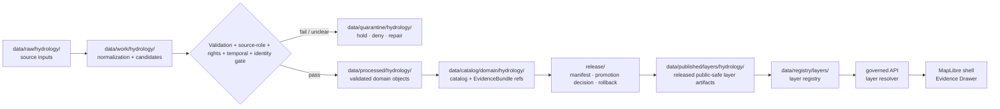

<!-- [KFM_META_BLOCK_V2]
doc_id: kfm://data/published/layers/hydrology/readme
name: Hydrology Published Layers README
path: data/published/layers/hydrology/README.md
type: data-lane-index-readme
version: v0.1.0
status: draft
owners:
  - <hydrology-domain-steward>
  - <release-steward>
  - <map-layer-steward>
created: 2026-06-26
updated: 2026-06-26
policy_label: public
truth_posture: cite-or-abstain
lifecycle_phase: published
responsibility_root: data/
domain: hydrology
artifact_family: released-public-safe-hydrology-map-layers
sensitivity_posture: public-safe-derivatives-only; source-role-time-identity-and-release-state-required; nfhl-regulatory-context-not-observed-flood-truth
related:
  - ../README.md
  - ../../README.md
  - ../../../../docs/doctrine/directory-rules.md
  - ../../../../docs/domains/hydrology/README.md
  - ../../../../docs/domains/hydrology/FILE_SYSTEM_PLAN.md
  - ../../../../docs/domains/hydrology/CANONICAL_PATHS.md
  - ../../../../docs/domains/hydrology/API_CONTRACTS.md
  - ../../../../data/processed/hydrology/README.md
  - ../../../registry/layers/README.md
  - ../../../../release/manifests/README.md
tags:
  - kfm
  - data
  - published
  - layers
  - hydrology
  - huc
  - watershed
  - reach-identity
  - gauge-site
  - flow-observation
  - water-level-observation
  - nfhl-context
  - hydrograph
  - public-safe
  - evidence-first
notes:
  - "This README indexes and governs public-safe Hydrology published layer lanes."
  - "This path is for released Hydrology map-layer artifacts and immediate sidecars, not release decisions, proof bundles, receipts, source inputs, processed records, catalog records, or direct AI outputs."
  - "Concrete Hydrology child layer lanes remain PROPOSED until created and reviewed."
  - "NFHL regulatory context must not be collapsed into observed flood-event truth."
[/KFM_META_BLOCK_V2] -->

<a id="top"></a>

<div align="center">

# Hydrology Published Layers

**Released public-safe map-layer artifacts for the Hydrology domain.**


</div>

---

## Quick reference

| Field | Value |
|---|---|
| **Path** | `data/published/layers/hydrology/` |
| **Responsibility root** | `data/` |
| **Lifecycle phase** | `published/` — released public-safe artifacts only |
| **Domain lane** | `hydrology/` |
| **Artifact family** | Released public-safe Hydrology map layers and direct sidecars |
| **Confirmed child lanes in this session** | None yet |
| **Future/proposed layer lanes** | `watersheds/`, `huc_units/`, `reach_network/`, `gauge_sites/`, `flow_observations/`, `water_level/`, `water_quality/`, `groundwater/`, `nfhl_context/`, `hydrograph/`, `upstream_trace/`, or other ADR/release-approved lanes |
| **Primary consumers** | Governed API layer resolver, MapLibre shell, Evidence Drawer, public-safe exports, release QA |
| **Release authority** | `release/manifests/` and `release/promotion_decisions/`, not this directory |
| **Proof authority** | `data/proofs/` and `data/receipts/`, not this directory |
| **Default failure posture** | `ABSTAIN` unresolved public claims; `DENY` source-role collapse, unresolved rights, ambiguous reach identity, missing evidence, or missing release state |

---

## 1. Purpose

This directory is the parent lane for **released public-safe Hydrology map-layer artifacts**. It groups map delivery outputs after evidence, source role, rights, temporal handling, validation, catalog closure, review, release, correction, and rollback gates have passed.

This is an artifact delivery surface. It is not a source repository, canonical processed store, catalog truth store, proof store, release authority, review archive, official-source substitute, or AI interpretation lane.

> [!IMPORTANT]
> A file under `data/published/layers/hydrology/` is not automatically valid public output. Public exposure still depends on a valid `ReleaseManifest`, `PromotionDecision`, evidence/proof closure, policy outcome, layer registry entry, digest verification, correction path, and rollback target.

---

## 2. Lane map

| Lane | Status | Purpose | Public-safety posture |
|---|---:|---|---|
| `watersheds/` | **PROPOSED** | Released watershed or basin boundary layers. | Public-safe boundary/context only; source vintage and hierarchy required. |
| `huc_units/` | **PROPOSED** | Released HUC unit layers such as HUC12 context. | Public-safe when WBD/source snapshot, hierarchy, and digest are pinned. |
| `reach_network/` | **PROPOSED** | Released hydro-feature or reach identity layers. | Ambiguous reach identity causes `ABSTAIN`; version and identifiers required. |
| `gauge_sites/` | **PROPOSED** | Released public-safe gauge site layers. | Site identity and source role required. |
| `flow_observations/` | **PROPOSED** | Released public-safe flow observation summaries or layers. | Observation/valid/retrieval/release times and units/qualifiers required. |
| `water_level/` | **PROPOSED** | Released public-safe water-level observation summaries or layers. | Observation context only; time and qualifier support required. |
| `water_quality/` | **PROPOSED** | Released public-safe water-quality observation summaries or layers. | Parameter, units, qualifier, source, and evidence required. |
| `groundwater/` | **PROPOSED** | Released public-safe groundwater or aquifer context layers. | Stewardship/privacy implications require policy review. |
| `nfhl_context/` | **PROPOSED** | Released NFHL regulatory-context overlay for hydrology. | Regulatory-only; never observed flood-inundation truth. |
| `hydrograph/` | **PROPOSED** | Released hydrograph projections or public-safe chart/layer artifacts. | Modeled/projection labels, bounds, and run receipts required. |
| `upstream_trace/` | **PROPOSED** | Released upstream trace or network traversal outputs. | Derived output; identity ambiguity and source versions must be visible. |

Do not create a new sibling lane casually. Confirm the owning root, artifact family, policy posture, layer registry shape, source role, temporal posture, release path, and whether an ADR or migration note is required.

---

## 3. What belongs here

| Artifact class | Examples | Boundary |
|---|---|---|
| Released public Hydrology layer bytes | PMTiles, GeoParquet, GeoJSON, public-safe COGs, vector-tile bundles | Must be public-safe as bytes, not merely safe as a rendered style |
| Layer sidecars | `layer.manifest.json`, `tiles.json`, `*.sha256`, `fields.allowlist.json` | Must point to release state, registry state, evidence refs, and digests |
| Source/version summaries | `source_version.summary.json`, `wbd_snapshot.summary.json`, `nhdplus_version.summary.json` | Required where source version, network version, or boundary snapshot affects interpretation |
| Identity summaries | `reach_identity.summary.json`, `gauge_identity.summary.json`, `huc_identity.summary.json` | Required where identity, crosswalk, or ambiguity affects public claims |
| Temporal summaries | `temporal_scope.summary.json`, `observation_time.summary.json` | Required where observed, valid, retrieval, release, or correction times affect meaning |
| Model/run summaries | `run_receipt.summary.json`, `projection_bounds.summary.json` | Required for hydrograph, upstream trace, modeled, or derived layers |
| Public-safe style fragments | `style.fragment.json` | Rendering hints only; cannot act as source, proof, policy, redaction, or release authority |
| Release-local README files | `<release_id>/README.md` | Explain release-local artifact contents without duplicating proof or release authority |
| Generated pointers | `latest.json` | Must be release-generated and rollback-safe, not hand-edited |

---

## 4. What does not belong here

| Do not place | Correct home | Reason |
|---|---|---|
| RAW source downloads | `data/raw/hydrology/<source_id>/<run_id>/` | RAW is intake, not publication |
| WORK files or candidates | `data/work/hydrology/<run_id>/` | WORK may contain unresolved candidates or unreviewed joins |
| Quarantined material | `data/quarantine/hydrology/<reason>/<run_id>/` | Failed, rights-unclear, ambiguous, or unsafe material is not public release |
| Canonical processed Hydrology objects | `data/processed/hydrology/...` | Processed does not equal published |
| Catalog records, triplets, or graph truth | `data/catalog/...` or graph/catalog lanes | Catalog authority stays separate from map bytes |
| EvidenceBundle / ProofPack | `data/proofs/` | Proof authority stays separate from delivery artifacts |
| Validation, transform, build, model, or release receipts | `data/receipts/` | Receipts are process memory, not layer payloads |
| Release manifests / promotion decisions | `release/` | Release decision authority belongs to release governance |
| NFHL regulatory context relabeled as observed flood truth | Regulatory/context lane with explicit role | Regulatory and observed roles must not collapse |
| Hazard-event truth | Hazards domain lanes | Hydrology can provide water context but does not own hazard-event publication |
| Infrastructure, road, parcel, or administrative identity | Owning domain lanes | Hydrology can cite or join approved context, not re-author adjacent identity |
| AI-generated water claims | governed answer/provenance paths only | AI is interpretive, not source, evidence, policy, official-source, or release authority |

---

## 5. Publication boundary



<!-- END OF MERMAID -->

The normal public path is:

```text
released hydrology layer artifact
→ layer registry entry
→ ReleaseManifest
→ governed API / layer resolver
→ MapLibre shell
→ Evidence Drawer / citation surface
```

The forbidden shortcut is:

```text
RAW / WORK / QUARANTINE / processed candidate / direct source feed / direct model output
→ direct public map layer
```

---

## 6. Hydrology public-safety rules

| Rule | Required behavior |
|---|---|
| **Source role is explicit** | Observed, regulatory, modeled, aggregate, administrative, candidate, and synthetic roles must not collapse. |
| **NFHL is regulatory context** | NFHL-style products must not be labeled or queried as observed flood inundation or current flood-event truth. |
| **Identity ambiguity causes abstention** | Ambiguous reach, HUC, gauge, or crosswalk identity must produce `ABSTAIN` or hold, not a confident public claim. |
| **Temporal fields stay separate** | Observed, valid, source, retrieval, release, correction, provisional/final, and model-run times must not collapse where material. |
| **Units and qualifiers travel with observations** | Flow, level, quality, and groundwater observations require units, qualifiers, no-data handling, and source context. |
| **Layer bytes are safe first** | Do not rely on style filters or client-side hiding as publication control. |
| **Cross-lane joins fail closed** | Joins with hazards, infrastructure, private context, roads, agriculture, or other sensitive context require policy, review, transform receipts, and release support. |
| **Evidence references are required** | Features or manifests must carry safe evidence references or resolver keys sufficient for EvidenceBundle lookup. |
| **AI is not authority** | Generated summaries or Focus Mode answers cannot replace source attribution, evidence, review, release state, or official-source referral. |
| **Rollback is mandatory** | Every public Hydrology layer must be tied to rollback and correction/withdrawal paths. |

---

## 7. Recommended subtree shape

No child layer README in this subtree has been confirmed in this session. Future lanes should be added only after governance/release review:

```text
data/published/layers/hydrology/
├── README.md
├── watersheds/              # PROPOSED
├── huc_units/               # PROPOSED
├── reach_network/           # PROPOSED
├── gauge_sites/             # PROPOSED
├── flow_observations/       # PROPOSED
├── water_level/             # PROPOSED
├── water_quality/           # PROPOSED
├── groundwater/             # PROPOSED
├── nfhl_context/            # PROPOSED
├── hydrograph/              # PROPOSED
└── upstream_trace/          # PROPOSED
```

Release-id folders may be used inside each child lane once artifact versions exist:

```text
<lane>/
├── README.md
├── <release_id>/
│   ├── <artifact>.pmtiles
│   ├── <artifact>.geoparquet
│   ├── <artifact>.geojson
│   ├── <artifact>.sha256
│   ├── layer.manifest.json
│   ├── fields.allowlist.json
│   └── README.md
└── latest.json
```

`latest.json` must be generated from release state and removed or withheld when rollback state, temporal state, identity state, digest state, or release state is missing.

---

## 8. Minimum layer manifest expectations

| Field | Purpose |
|---|---|
| `layer_id` | Stable public layer id |
| `domain` | `hydrology` |
| `sublane` | Child lane or approved controlled value |
| `artifact_family` | Approved map-layer family |
| `claim_character` | Boundary context, observed measurement, regulatory context, modeled projection, aggregate summary, trace result, or equivalent controlled value |
| `release_id` | Pointer to `release/manifests/<release_id>.json` |
| `artifact_href` | Relative or release-resolved artifact path |
| `artifact_sha256` | Digest of released bytes |
| `format` | `pmtiles`, `geoparquet`, `geojson`, `cog`, or approved public format |
| `bounds` | Public-safe spatial bounds |
| `source_refs` | Source descriptor, source feed, official source referral, or catalog refs |
| `source_role` | Canonical source role; must not be inferred from convenience |
| `source_version` | Source version, WBD/NHDPlus/NFHL snapshot, gauge source revision, or model version where relevant |
| `identity_refs` | HUC, reach, gauge, feature, crosswalk, or deterministic identity references where relevant |
| `temporal_scope` | Observed/valid/source/retrieval/release/correction/model-run time support where material |
| `unit_qualifier_ref` | Required for measurement layers where units, parameter codes, or qualifiers affect meaning |
| `sensitivity_posture` | Public-safe, generalized, restricted, deny, or withhold reason |
| `field_allowlist_ref` | Pointer to approved public field allowlist |
| `evidence_bundle_refs` | Safe references or resolver keys |
| `policy_decision_ref` | Release policy decision reference |
| `rollback_ref` | Rollback card or rollback target |
| `correction_path` | Where corrections, supersessions, or withdrawals are recorded |

---

## 9. Validation checklist

- [ ] The artifact belongs under an existing child lane or a new lane has been approved through the proper architecture/governance path.
- [ ] Every contributing source has a source descriptor.
- [ ] Source role is explicit and compatible with the public claim.
- [ ] Source version, identity references, temporal scope, units, qualifiers, and no-data handling are represented where relevant.
- [ ] Rights and license posture allow this public derivative.
- [ ] Public fields are allowlisted and checked against the actual released bytes.
- [ ] NFHL or regulatory-context material is not presented as observed flood-event truth.
- [ ] Ambiguous reach, HUC, gauge, or crosswalk identity is resolved or causes `ABSTAIN`.
- [ ] Sensitive cross-lane joins are absent or have policy/review/transform/release support.
- [ ] EvidenceBundle references resolve through governed lookup.
- [ ] Layer registry entry references the artifact family and release id.
- [ ] ReleaseManifest and PromotionDecision exist under `release/`.
- [ ] Rollback card or rollback target exists.
- [ ] Correction and withdrawal paths are documented.
- [ ] Public UI consumes the layer through governed APIs or release-resolved artifact manifests, not RAW, WORK, QUARANTINE, processed stores, source feeds, or direct model output.

---

## 10. Suggested checks

Use the repository validator orchestrator when available:

```bash
python tools/validate_all.py
```

Potential Hydrology layer checks should cover:

```text
tools/validators/domains/hydrology/source_role_authority/
tools/validators/domains/hydrology/reach_identity_ambiguity/
tools/validators/domains/hydrology/huc_fingerprint/
tools/validators/domains/hydrology/nfhl_role_separation/
tools/validators/domains/hydrology/temporal_scope/
tools/validators/domains/hydrology/unit_qualifier/
tools/validators/domains/hydrology/layer_manifest/
tools/validators/domains/hydrology/tile_field_allowlist/
tools/validators/domains/hydrology/cross_lane_join_safety/
tests/domains/hydrology/layers/
tests/domains/hydrology/release/
```

If a validator is not implemented yet, mark the candidate `NEEDS VERIFICATION` rather than treating the gap as a pass.

---

## 11. Map consumer rules

Consumers should:

1. Load only release-resolved artifacts or manifests.
2. Resolve feature details through the governed API or Evidence Drawer payload.
3. Display release, stale, source role, source version, identity state, temporal state, units/qualifiers, sensitivity, and correction state where available.
4. Avoid presenting Hydrology map layers as stronger evidence than their source role supports.
5. Preserve `ABSTAIN`, `DENY`, and `ERROR` outcomes in UI state.
6. Avoid direct reads from RAW, WORK, QUARANTINE, processed stores, source feeds, source mirrors, or direct model output.
7. Keep AI and Focus Mode answers subordinate to evidence, source role, identity, time, policy, review, release state, and official-source referral.

---

## 12. Common failure modes

| Failure | Outcome |
|---|---|
| Public artifact exists without ReleaseManifest | Not a valid public layer |
| NFHL regulatory context is displayed as observed flood event | Source-role violation; correct or withdraw claim |
| Ambiguous reach/HUC/gauge identity is presented as certain | `ABSTAIN`, correct, or hold release |
| Units, parameter codes, qualifiers, or no-data handling are missing | `ABSTAIN` measurement-sensitive claims |
| Source version or temporal scope is missing | `ABSTAIN` source/time-sensitive claims |
| Source rights are unresolved | `DENY` or hold in quarantine |
| Sensitive join output is included without review/release support | `DENY`, withdraw, or quarantine artifact |
| Field is hidden in style but present in payload | Publication leak; correct payload before release |
| Layer lacks EvidenceBundle references | `ABSTAIN` public claims; block Evidence Drawer support |
| `latest.json` points to artifact without rollback target | Release drift; remove alias until fixed |
| New sibling lane appears without governance note | Directory drift; require review or ADR/migration note |

---

## 13. Maintainer checklist

- Keep this subtree limited to released public-safe Hydrology map-layer artifacts and direct sidecars.
- Put release decisions in `release/`, not here.
- Put proof and receipt objects in `data/proofs/` and `data/receipts/`, not here.
- Preserve source role, source version, identity state, temporal scope, units/qualifiers, field allowlist, evidence refs, and release state.
- Keep hazard-event publication, infrastructure identity, transport identity, and professional determinations in their owning or external authority lanes.
- Use child README files to document lane-specific rules.
- Prefer release-id subfolders when more than one version exists.
- Update this README when child lanes, artifact naming, manifest shape, validator paths, source-role rules, identity rules, temporal rules, or release gates change.

---

## 14. Status notes

| Claim | Status |
|---|---|
| This README defines the intended boundary for `data/published/layers/hydrology/`. | **CONFIRMED authored** |
| The target path exists in the live repository. | **CONFIRMED by GitHub contents API during this edit** |
| Child Hydrology published-layer READMEs exist in this subtree. | **UNKNOWN / PROPOSED** |
| Actual released Hydrology layer artifacts exist in this subtree. | **UNKNOWN** |
| Hydrology layer publication validators are implemented and wired in CI. | **NEEDS VERIFICATION** |
| Any specific source has been approved for public Hydrology layer publication. | **NEEDS VERIFICATION** |
| The current public UI loads these layers through a governed API. | **UNKNOWN** |

---

## Related files

- [`../README.md`](../README.md) — published layer family lane
- [`../../README.md`](../../README.md) — `data/published/` lane
- [`../../../../docs/doctrine/directory-rules.md`](../../../../docs/doctrine/directory-rules.md) — placement and lifecycle doctrine
- [`../../../../docs/domains/hydrology/FILE_SYSTEM_PLAN.md`](../../../../docs/domains/hydrology/FILE_SYSTEM_PLAN.md) — Hydrology file-system placement plan
- [`../../../../docs/domains/hydrology/CANONICAL_PATHS.md`](../../../../docs/domains/hydrology/CANONICAL_PATHS.md) — Hydrology path convention reference
- [`../../../../docs/domains/hydrology/API_CONTRACTS.md`](../../../../docs/domains/hydrology/API_CONTRACTS.md) — governed API contract reference
- [`../../../../data/processed/hydrology/README.md`](../../../../data/processed/hydrology/README.md) — processed Hydrology lane
- [`../../../registry/layers/README.md`](../../../registry/layers/README.md) — layer registry entry point
- [`../../../../release/manifests/README.md`](../../../../release/manifests/README.md) — release manifest authority

---

<div align="center">

**KFM rule:** Hydrology published layers are public-safe evidence/context delivery artifacts, not source authority, proof authority, release authority, official-source authority, professional advice, canonical hydrology truth, or AI truth.

[Back to top](#top)

</div>
