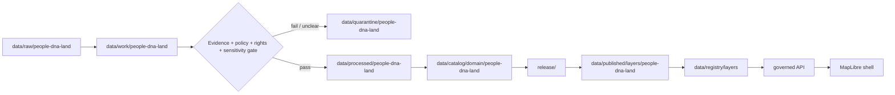

<!-- [KFM_META_BLOCK_V2]
doc_id: kfm://data/published/layers/people-dna-land/readme
name: People DNA Land Published Layers README
path: data/published/layers/people-dna-land/README.md
type: data-lane-index-readme
version: v0.1.0
status: draft
owners:
  - <people-dna-land-domain-steward>
  - <privacy-steward>
  - <release-steward>
  - <map-layer-steward>
created: 2026-06-26
updated: 2026-06-26
policy_label: restricted-review
truth_posture: cite-or-abstain
lifecycle_phase: published
responsibility_root: data/
domain: people-dna-land
artifact_family: released-public-safe-people-dna-land-map-layers
sensitivity_posture: restricted-review; public-safe-derivatives-only; release-required
related:
  - ../README.md
  - ../../README.md
  - land-ownership/README.md
  - ../../../../docs/doctrine/directory-rules.md
  - ../../../../docs/domains/people-dna-land/SCOPE_AND_BOUNDARY.md
  - ../../../../docs/domains/people-dna-land/SENSITIVITY.md
  - ../../../registry/layers/README.md
  - ../../../../release/manifests/README.md
tags:
  - kfm
  - data
  - published
  - layers
  - people-dna-land
  - restricted-review
  - public-safe
  - evidence-first
notes:
  - "This README indexes and governs public-safe People/DNA/Land published layer lanes."
  - "This path is for released public-safe map-layer artifacts and immediate sidecars only."
  - "The confirmed child lane in this session is land-ownership/."
[/KFM_META_BLOCK_V2] -->

<a id="top"></a>

<div align="center">

# People/DNA/Land Published Layers

**Released public-safe map-layer artifacts for the People/DNA/Land domain.**


</div>

---

## Quick reference

| Field | Value |
|---|---|
| **Path** | `data/published/layers/people-dna-land/` |
| **Responsibility root** | `data/` |
| **Lifecycle phase** | `published/` — released public-safe artifacts only |
| **Domain lane** | `people-dna-land/` |
| **Confirmed child lanes in this session** | [`land-ownership/`](land-ownership/README.md) |
| **Primary consumers** | Governed API layer resolver, MapLibre shell, Evidence Drawer, public-safe exports, release QA |
| **Release authority** | `release/manifests/` and `release/promotion_decisions/`, not this directory |
| **Proof authority** | `data/proofs/` and `data/receipts/`, not this directory |
| **Default failure posture** | `DENY`, `RESTRICT`, or `ABSTAIN` when evidence, policy, rights, source role, or release state is insufficient |

---

## 1. Purpose

This directory is the parent lane for released public-safe People/DNA/Land map-layer artifacts. It groups map delivery outputs only after evidence, policy, rights, sensitivity, validation, catalog closure, review, release, correction, and rollback gates have passed.

This is an artifact delivery surface. It is not a source repository, canonical processed store, catalog truth store, proof store, release authority, review archive, legal authority, identity authority, or AI interpretation lane.

> [!IMPORTANT]
> A file under `data/published/layers/people-dna-land/` is not automatically valid public output. Public exposure still depends on a valid `ReleaseManifest`, `PromotionDecision`, proof closure, policy outcome, layer registry entry, digest verification, correction path, and rollback target.

---

## 2. Lane map

| Lane | Status | Purpose | Public-safety posture |
|---|---:|---|---|
| [`land-ownership/`](land-ownership/README.md) | **CONFIRMED README** | Released public-safe land-ownership context and generalized map artifacts. | Context only; release and review required. |
| `residence-events/` | **PROPOSED** | Public-safe generalized residence-event context. | Requires governance review before creation. |
| `migration-events/` | **PROPOSED** | Public-safe movement-context summaries. | Requires governance review before creation. |
| `genealogy-aggregates/` | **PROPOSED** | Aggregated genealogy-context layers. | Requires governance review before creation. |
| `public-person-context/` | **PROPOSED** | Reviewed public historical-person context layers. | Requires governance review before creation. |
| `consent-safe-views/` | **PROPOSED** | Explicitly approved release views. | Requires governance review before creation. |

---

## 3. What belongs here

| Artifact class | Boundary |
|---|---|
| Released public-safe layer bytes | PMTiles, GeoParquet, GeoJSON, or vector tiles only after release approval |
| Layer sidecars | Manifests, tile metadata, field allowlists, digests, and public-safe caveat summaries |
| Public-safe style fragments | Rendering hints only; no source, proof, policy, or release authority |
| Release-local README files | Release-local explanation without duplicating proof or release authority |
| Generated pointers | `latest.json` only when generated from release state and rollback-safe |

---

## 4. What does not belong here

| Do not place | Correct home |
|---|---|
| RAW source records | `data/raw/people-dna-land/` |
| WORK files or unresolved candidates | `data/work/people-dna-land/` |
| Quarantined or unclear material | `data/quarantine/people-dna-land/` |
| Canonical processed objects | `data/processed/people-dna-land/` |
| Catalog records or graph truth | `data/catalog/` or graph/catalog lanes |
| EvidenceBundle / ProofPack | `data/proofs/` |
| Receipts | `data/receipts/` |
| Release manifests or promotion decisions | `release/` |
| AI-generated claims | Governed answer/provenance paths only |

---

## 5. Publication boundary



<!-- END OF MERMAID -->

The normal public path is:

```text
released People/DNA/Land layer artifact
→ layer registry entry
→ ReleaseManifest
→ governed API / layer resolver
→ MapLibre shell
→ Evidence Drawer
```

The forbidden shortcut is:

```text
RAW / WORK / QUARANTINE / processed candidate / direct source record / direct model output
→ direct public map layer
```

---

## 6. Required checks

- [ ] The artifact belongs under an approved child lane.
- [ ] Every contributing source has a source descriptor.
- [ ] Source role is explicit and compatible with the public claim.
- [ ] Rights and policy posture allow the public derivative.
- [ ] Public fields are allowlisted and checked against the released bytes.
- [ ] EvidenceBundle references resolve through governed lookup.
- [ ] Layer registry entry references the artifact family and release id.
- [ ] ReleaseManifest and PromotionDecision exist under `release/`.
- [ ] Rollback target exists.
- [ ] Public UI consumes the layer through governed APIs or release-resolved artifact manifests.

---

## 7. Status notes

| Claim | Status |
|---|---|
| This README defines the intended boundary for `data/published/layers/people-dna-land/`. | **CONFIRMED authored** |
| The target path exists in the live repository. | **CONFIRMED by GitHub contents API during this edit** |
| `land-ownership/README.md` exists and was updated in this session. | **CONFIRMED by recent GitHub edit in this session** |
| Other child lanes listed here exist in the repository. | **UNKNOWN / PROPOSED** |
| Actual released People/DNA/Land layer artifacts exist in this subtree. | **UNKNOWN** |
| Publication validators are implemented and wired in CI. | **NEEDS VERIFICATION** |
| The current public UI loads these layers through a governed API. | **UNKNOWN** |

---

## Related files

- [`land-ownership/README.md`](land-ownership/README.md) — land-ownership published layer lane
- [`../README.md`](../README.md) — published layer family lane
- [`../../README.md`](../../README.md) — `data/published/` lane
- [`../../../../docs/doctrine/directory-rules.md`](../../../../docs/doctrine/directory-rules.md) — placement and lifecycle doctrine
- [`../../../../docs/domains/people-dna-land/SCOPE_AND_BOUNDARY.md`](../../../../docs/domains/people-dna-land/SCOPE_AND_BOUNDARY.md) — domain boundary and ownership rules
- [`../../../../docs/domains/people-dna-land/SENSITIVITY.md`](../../../../docs/domains/people-dna-land/SENSITIVITY.md) — sensitivity posture
- [`../../../registry/layers/README.md`](../../../registry/layers/README.md) — layer registry entry point
- [`../../../../release/manifests/README.md`](../../../../release/manifests/README.md) — release manifest authority

---

<div align="center">

**KFM rule:** People/DNA/Land published layers are public-safe evidence/context delivery artifacts, not proof authority, release authority, legal authority, identity authority, or AI truth.

[Back to top](#top)

</div>
