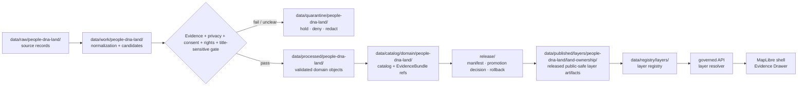

<!-- [KFM_META_BLOCK_V2]
doc_id: kfm://data/published/layers/people-dna-land/land-ownership-readme
name: People DNA Land Ownership Published Layer README
path: data/published/layers/people-dna-land/land-ownership/README.md
type: data-lane-readme
version: v0.1.0
status: draft
owners:
  - <people-dna-land-domain-steward>
  - <land-ownership-steward>
  - <privacy-steward>
  - <release-steward>
  - <map-layer-steward>
created: 2026-06-26
updated: 2026-06-26
policy_label: restricted-review
truth_posture: cite-or-abstain
lifecycle_phase: published
responsibility_root: data/
domain: people-dna-land
sublane: land-ownership
artifact_family: released-public-safe-land-ownership-context-layer
sensitivity_posture: T4-deny-by-default; public-safe-generalized-context-only; no-living-person-leakage; no-dna-leakage; no-title-or-legal-determination
related:
  - ../README.md
  - ../../README.md
  - ../../../README.md
  - ../../../../../docs/doctrine/directory-rules.md
  - ../../../../../docs/domains/people-dna-land/README.md
  - ../../../../../docs/domains/people-dna-land/SCOPE_AND_BOUNDARY.md
  - ../../../../../docs/domains/people-dna-land/SENSITIVITY.md
  - ../../../../../docs/domains/people-dna-land/DATA_LIFECYCLE.md
  - ../../../../../packages/domains/people-dna-land/land-ownership/README.md
  - ../../../../../contracts/domains/people-dna-land/land-ownership/README.md
  - ../../../../../data/registry/layers/README.md
  - ../../../../../release/manifests/README.md
tags:
  - kfm
  - data
  - published
  - layers
  - people-dna-land
  - land-ownership
  - parcels
  - title-sensitive
  - privacy
  - living-person
  - dna-deny
  - public-safe
  - evidence-first
notes:
  - "This README documents the public-safe People/DNA/Land land-ownership published layer lane."
  - "This path is for released, privacy-reviewed, public-safe land-ownership context artifacts and direct sidecars only, not release decisions, proof bundles, receipts, source inputs, processed records, catalog records, legal/title decisions, living-person data, DNA evidence, or direct AI outputs."
  - "Assessor/tax rows, parcel geometry, name strings, land instruments, and chain candidates must not be collapsed into ownership truth, title truth, boundary truth, person identity, or release approval."
[/KFM_META_BLOCK_V2] -->

<a id="top"></a>

<div align="center">

# People/DNA/Land — Land Ownership Published Layers

**Released public-safe land-ownership context map artifacts, constrained by privacy, consent, evidence, and release gates.**


</div>

---

## Quick reference

| Field | Value |
|---|---|
| **Path** | `data/published/layers/people-dna-land/land-ownership/` |
| **Responsibility root** | `data/` |
| **Lifecycle phase** | `published/` — released public-safe artifacts only |
| **Domain lane** | `people-dna-land/` |
| **Sublane** | `land-ownership` — land-ownership context, ownership-interval summaries, parcel-context derivatives, and title-sensitive public-safe layers |
| **Artifact family** | Released public-safe land-ownership context map layers and direct sidecars |
| **Primary consumers** | Governed API layer resolver, MapLibre shell, Evidence Drawer, public-safe exports, release QA |
| **Release authority** | `release/manifests/` and `release/promotion_decisions/`, not this directory |
| **Proof authority** | `data/proofs/` and `data/receipts/`, not this directory |
| **Privacy posture** | T4 / deny-by-default; publish only generalized or explicitly approved public-safe derivatives |
| **Default failure posture** | `DENY` or `RESTRICT` living-person, DNA, private parcel, title-sensitive, rights-unclear, or consent-unclear material; `ABSTAIN` unsupported ownership/title claims |

---

## 1. Purpose

This directory holds **released public-safe People/DNA/Land land-ownership layer artifacts**. These artifacts may represent generalized parcel context, public-safe ownership-interval summaries, land-instrument context, or chain-of-title-candidate visualization aids after evidence, privacy, consent, rights, sensitivity, validation, catalog closure, review, release, correction, and rollback gates have passed.

This lane is not a title system. It does not determine ownership, title marketability, legal boundaries, heirs, liens, encumbrances, mineral rights, water rights, easements, or legal conclusions. It also must not expose living-person, DNA/genomic, private-residence, or consent-controlled details.

A published land-ownership layer is a downstream carrier. It does not replace the source record, processed `Land Ownership Assertion`, `Ownership Interval`, `LandInstrument`, `Assessor Record`, `TaxRecord`, `LandParcel`, catalog record, EvidenceBundle, source descriptor, policy decision, consent state, review record, or release manifest.

> [!IMPORTANT]
> Presence in `data/published/layers/people-dna-land/land-ownership/` does **not** by itself prove that a layer is valid public output. Verify the corresponding `ReleaseManifest`, `PromotionDecision`, proof pack, privacy/sensitivity review, consent state where applicable, field allowlist, receipt chain, layer registry entry, rights posture, correction path, and rollback target before exposing or citing the layer.

---

## 2. What belongs here

| Artifact | Example name | Required condition before placement |
|---|---|---|
| Generalized land-ownership context PMTiles | `people_dna_land_ownership_public_vYYYYMMDD.pmtiles` | ReleaseManifest exists; privacy review, source role, rights, consent/restriction posture, and field allowlist are resolved |
| Public-safe ownership-interval summary | `ownership_interval_public_summary_vYYYYMMDD.geoparquet` | Aggregated or generalized enough for public release; no living-person or DNA leakage |
| Parcel-context derivative | `parcel_context_public_vYYYYMMDD.pmtiles` | Explicit caveat that parcel geometry is not title boundary or ownership proof |
| Land-instrument context summary | `land_instrument_context_public_vYYYYMMDD.geojson` | Evidence-bound, public-safe, non-legal explanatory layer |
| Privacy/redaction sidecar | `privacy_release.summary.json` | Describes public-safe transform, withheld fields, consent/restriction posture, and review state |
| Tile metadata sidecar | `land_ownership_public_vYYYYMMDD.tiles.json` | References bounds, zoom range, layer id, source role, schema version, release id, and digest |
| Integrity sidecar | `land_ownership_public_vYYYYMMDD.sha256` | Digest generated from the exact released bytes |
| Layer descriptor | `layer.manifest.json` or `layer.json` | Points to governed layer registry and release manifest |
| Field allowlist | `land_ownership_fields.allowlist.json` | Documents public fields included in the released artifact |
| Optional style fragment | `style.fragment.json` | Rendering hints only; no proof, source, policy, privacy, title, or release authority |
| README / release-local guidance | `README.md` | Explains boundaries for this lane or a release-id subfolder |

Artifacts in this folder should be safe as public bytes. Public payloads should not include names of living people, raw or inferred DNA evidence, precise private-residence linkage, unredacted personal identifiers, restricted ownership assertions, nonpublic parcel joins, unreviewed chain-of-title candidates, or legal/title conclusions.

---

## 3. What does not belong here

| Do not place | Correct home | Reason |
|---|---|---|
| RAW deeds, assessor extracts, tax rolls, parcel downloads, court/probate records, surveys, or source files | `data/raw/people-dna-land/<source_id>/<run_id>/` or governed source-specific intake | RAW is intake, not publication |
| WORK files or chain candidates | `data/work/people-dna-land/<run_id>/` | WORK may contain unresolved candidates or private joins |
| Quarantined or rights-unclear material | `data/quarantine/people-dna-land/<reason>/<run_id>/` | Failed or unclear material is not public release |
| Canonical processed person, DNA, land, parcel, or ownership objects | `data/processed/people-dna-land/...` | Processed does not equal published |
| Catalog records, triplets, or graph truth | `data/catalog/...` or graph/catalog lanes | Catalog authority stays separate from map bytes |
| EvidenceBundle / ProofPack | `data/proofs/` | Proof authority stays separate from delivery artifacts |
| Validation, transform, privacy, consent, redaction, build, or release receipts | `data/receipts/` | Receipts are process memory, not layer payloads |
| Release manifests / promotion decisions | `release/` | Release decision authority belongs to release governance |
| Living-person records, private addresses, DNA kit/segment/match evidence, consent records, or revocation records | Restricted People/DNA/Land lanes and consent/policy stores | Public layer lane must not expose them |
| Legal, title, boundary, heirship, mineral, easement, lien, tax, or ownership determinations | Outside public map authority; KFM may only carry evidence-bound assertions | This lane is not legal/title authority |
| Agriculture, hydrology, hazards, roads, settlements, or archaeology truth | Owning domain lanes | People/DNA/Land may consume context but cannot re-author adjacent-domain truth |
| AI-generated ownership claims | governed answer/provenance paths only | AI is interpretive, not source, evidence, policy, consent, or release authority |

---

## 4. Publication boundary



<!-- END OF MERMAID -->

The normal public path is:

```text
released land-ownership context layer artifact
→ layer registry entry
→ ReleaseManifest
→ governed API / layer resolver
→ MapLibre shell
→ Evidence Drawer / citation surface
```

The forbidden shortcut is:

```text
RAW / WORK / QUARANTINE / processed candidate / direct source record / direct model output
→ direct public map layer
```

---

## 5. Land-ownership public-safety rules

| Rule | Required behavior |
|---|---|
| **Default deny** | Living-person, DNA, private parcel, consent-controlled, rights-unclear, or title-sensitive material is denied or restricted unless release support explicitly allows publication. |
| **Evidence is not title** | Instruments, assessor rows, tax rows, parcel geometry, name strings, and chain candidates are evidence/context, not final ownership or legal truth. |
| **Parcel geometry is not title boundary** | Public parcel layers require geometry-role caveats, source/version notes, precision limits, and release review. |
| **Assessor/tax is administrative context** | Assessor and tax records must not be presented as title proof or complete ownership truth. |
| **Names are assertions** | Grantor, grantee, owner-of-record, heir, trustee, and claimant strings must not collapse into person/entity identity without reviewed evidence. |
| **DNA never leaks through land** | DNA kit IDs, match evidence, genetic segments, relationship hypotheses, and consent records must not appear in public land layers. |
| **Temporal roles stay separate** | Execution, recording, effective, tax year, assessor year, survey, retrieval, review, release, and correction dates must not collapse. |
| **Field allowlists are mandatory** | Public tiles contain only approved fields; hiding fields in a style is not publication control. |
| **Cross-lane joins fail closed** | Joins with settlements, archaeology, agriculture, hydrology, hazards, roads, or spatial foundation must preserve owner lane, sensitivity, and EvidenceBundle support. |
| **AI is not authority** | Generated summaries or Focus Mode answers cannot replace source attribution, evidence, privacy review, consent, policy, or release state. |
| **Rollback is mandatory** | Every public land-ownership layer must be tied to rollback and correction/withdrawal paths. |

---

## 6. Expected artifact layout

Small early releases may remain flat. Once multiple versions exist, prefer release-id folders so privacy review, source role, release, rollback, and digest verification stay inspectable.

```text
data/published/layers/people-dna-land/land-ownership/
├── README.md
├── <release_id>/
│   ├── land_ownership_context_public.pmtiles
│   ├── land_ownership_context_public.geoparquet
│   ├── land_ownership_context_public.geojson
│   ├── land_ownership_context_public.sha256
│   ├── layer.manifest.json
│   ├── land_ownership_fields.allowlist.json
│   ├── privacy_release.summary.json
│   ├── title_boundary_caveat.summary.json
│   ├── style.fragment.json
│   └── README.md                  # optional release-local note
└── latest.json                     # optional generated pointer from ReleaseManifest
```

`latest.json` must be generated from release state, not hand-edited. If release state, privacy review, consent/restriction posture, digest state, or rollback state is missing, remove or withhold the pointer.

---

## 7. Minimum manifest expectations

A layer manifest or sidecar for this directory should include at least:

| Field | Purpose |
|---|---|
| `layer_id` | Stable layer id, for example `people_dna_land.land_ownership.public` |
| `domain` | `people-dna-land` |
| `sublane` | `land-ownership` |
| `artifact_family` | `land_ownership_context_layer` |
| `claim_character` | `public_safe_context`, `generalized_parcel_context`, `ownership_interval_summary`, `instrument_context`, or equivalent controlled value |
| `release_id` | Pointer to `release/manifests/<release_id>.json` |
| `artifact_href` | Relative or release-resolved artifact path |
| `artifact_sha256` | Digest of released bytes |
| `format` | `pmtiles`, `geoparquet`, `geojson`, or other approved public format |
| `bounds` | Public-safe spatial bounds |
| `source_refs` | Source descriptor, source record refs, or catalog refs |
| `source_role` | Canonical source role; must not be inferred from convenience |
| `privacy_review_ref` | Privacy/sensitivity decision reference |
| `consent_or_restriction_ref` | Consent, restriction, withholding, or non-applicability reference |
| `title_boundary_caveat_ref` | Public-safe caveat explaining non-title and non-boundary authority |
| `temporal_scope` | Execution/recording/effective/source/retrieval/release/correction time support where relevant |
| `field_allowlist_ref` | Pointer to public field allowlist |
| `evidence_bundle_refs` | Safe references or resolver keys |
| `policy_decision_ref` | Release policy decision reference |
| `rollback_ref` | Rollback card or rollback target |
| `correction_path` | Where corrections, supersessions, or withdrawals are recorded |

---

## 8. Validation checklist

Before adding or updating a land-ownership artifact here, reviewers should be able to answer **yes** to each item.

- [ ] Every contributing source has a source descriptor.
- [ ] Source role is explicit and compatible with the public claim.
- [ ] Rights and license posture allow this public derivative.
- [ ] Privacy, sensitivity, and consent/restriction posture allow public release.
- [ ] Public fields are allowlisted and checked against the actual released bytes.
- [ ] Living-person, DNA, private-address, private-parcel, and restricted relationship data are absent.
- [ ] Parcel geometry is not presented as title boundary or ownership proof.
- [ ] Assessor/tax context is not presented as title proof.
- [ ] Name strings are not presented as canonical person/entity identity without reviewed evidence.
- [ ] Legal/title, heirship, mineral, lien, easement, tax, boundary, or professional conclusions are absent.
- [ ] Sensitive cross-lane joins are absent or have policy/review/transform/release support.
- [ ] EvidenceBundle references resolve through governed lookup.
- [ ] Layer registry entry references this artifact family and release id.
- [ ] ReleaseManifest and PromotionDecision exist under `release/`.
- [ ] Rollback card or rollback target exists.
- [ ] Correction and withdrawal paths are documented.
- [ ] Public UI consumes the layer through governed APIs or release-resolved artifact manifests, not RAW, WORK, QUARANTINE, processed stores, source records, or direct model output.

---

## 9. Suggested checks

Use the repository validator orchestrator when available:

```bash
python tools/validate_all.py
```

Potential land-ownership-layer-specific checks should cover:

```text
tools/validators/domains/people-dna-land/privacy_release/
tools/validators/domains/people-dna-land/consent_and_restriction/
tools/validators/domains/people-dna-land/land_ownership_anti_collapse/
tools/validators/domains/people-dna-land/title_boundary_caveat/
tools/validators/domains/people-dna-land/layer_manifest/
tools/validators/domains/people-dna-land/tile_field_allowlist/
tools/validators/domains/people-dna-land/cross_lane_join_safety/
tests/domains/people-dna-land/land_ownership/
tests/domains/people-dna-land/layers/
```

If a validator is not implemented yet, mark the candidate `NEEDS VERIFICATION` rather than treating the gap as a pass.

---

## 10. Map consumer rules

Consumers should:

1. Load only release-resolved artifacts or manifests.
2. Resolve feature details through the governed API or Evidence Drawer payload.
3. Display release, sensitivity, source role, evidence state, privacy/restriction state, caveats, stale state, and correction state where available.
4. Avoid presenting land-ownership context as ownership truth, title proof, legal advice, parcel-boundary truth, person identity, DNA inference, or consent authority.
5. Preserve `ABSTAIN`, `DENY`, `RESTRICT`, and `ERROR` outcomes in UI state.
6. Avoid direct reads from RAW, WORK, QUARANTINE, processed stores, source mirrors, private records, or direct model output.
7. Keep AI and Focus Mode answers subordinate to evidence, source role, privacy, consent, policy, review, release state, and correction state.

---

## 11. Common failure modes

| Failure | Outcome |
|---|---|
| Layer exists without ReleaseManifest | Not a valid public layer |
| Living-person, DNA, private address, or restricted relation leaks into payload | `DENY`, withdraw, correct, or quarantine artifact |
| Parcel geometry is displayed as title boundary | Source-role/title-boundary violation; correct or withdraw claim |
| Assessor/tax row is displayed as ownership truth | Administrative-to-title collapse; correct or withdraw claim |
| Name string is displayed as canonical person/entity identity | Identity collapse; require reviewed evidence or abstain |
| Source rights or consent/restriction state is unresolved | `DENY` or hold in quarantine |
| Field is hidden in style but present in payload | Publication leak; correct payload before release |
| Layer lacks EvidenceBundle references | `ABSTAIN` public claims; block Evidence Drawer support |
| `latest.json` points to artifact without rollback target | Release drift; remove alias until fixed |
| AI summary makes a title/legal/ownership conclusion | Treat as generated overreach; retract or replace with evidence-bounded wording |

---

## 12. Maintainer checklist

- Keep this folder limited to released public-safe land-ownership context artifacts and direct sidecars.
- Put release decisions in `release/`, not here.
- Put proof and receipt objects in `data/proofs/` and `data/receipts/`, not here.
- Preserve source role, privacy review, consent/restriction state, evidence refs, caveats, field allowlist, and release state.
- Keep living-person, DNA, private parcel, title-sensitive, legal, and professional determinations out of public layer payloads.
- Use release-id subfolders when more than one version exists.
- Update this README when artifact naming, manifest shape, validator paths, privacy rules, consent rules, anti-collapse rules, or release gates change.

---

## 13. Status notes

| Claim | Status |
|---|---|
| This README defines the intended boundary for `data/published/layers/people-dna-land/land-ownership/`. | **CONFIRMED authored** |
| The target path exists in the live repository. | **CONFIRMED by GitHub contents API during this edit** |
| Actual released land-ownership layer artifacts exist here. | **UNKNOWN** |
| People/DNA/Land land-ownership publication validators are implemented and wired in CI. | **NEEDS VERIFICATION** |
| Any specific source has been approved for public land-ownership layer publication. | **NEEDS VERIFICATION** |
| The current public UI loads this layer through a governed API. | **UNKNOWN** |
| Any live or restricted person/DNA/parcel release state has been approved for this folder. | **UNKNOWN; assume DENY until proven otherwise** |

---

## Related files

- [`../README.md`](../README.md) — People/DNA/Land published layer parent lane
- [`../../README.md`](../../README.md) — published layer family lane
- [`../../../README.md`](../../../README.md) — `data/published/` lane
- [`../../../../../docs/doctrine/directory-rules.md`](../../../../../docs/doctrine/directory-rules.md) — placement and lifecycle doctrine
- [`../../../../../docs/domains/people-dna-land/SCOPE_AND_BOUNDARY.md`](../../../../../docs/domains/people-dna-land/SCOPE_AND_BOUNDARY.md) — People/DNA/Land domain boundary and ownership rules
- [`../../../../../docs/domains/people-dna-land/SENSITIVITY.md`](../../../../../docs/domains/people-dna-land/SENSITIVITY.md) — People/DNA/Land sensitivity posture
- [`../../../../../docs/domains/people-dna-land/DATA_LIFECYCLE.md`](../../../../../docs/domains/people-dna-land/DATA_LIFECYCLE.md) — lifecycle gate reference
- [`../../../../../packages/domains/people-dna-land/land-ownership/README.md`](../../../../../packages/domains/people-dna-land/land-ownership/README.md) — implementation-helper boundary
- [`../../../../../contracts/domains/people-dna-land/land-ownership/README.md`](../../../../../contracts/domains/people-dna-land/land-ownership/README.md) — semantic contract boundary
- [`../../../../../data/registry/layers/README.md`](../../../../../data/registry/layers/README.md) — layer registry entry point
- [`../../../../../release/manifests/README.md`](../../../../../release/manifests/README.md) — release manifest authority

---

<div align="center">

**KFM rule:** land-ownership published layers are public-safe evidence/context delivery artifacts, not title truth, legal advice, living-person release, DNA release, proof authority, release authority, or AI truth.

[Back to top](#top)

</div>
