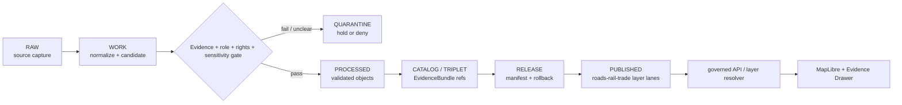

<!-- [KFM_META_BLOCK_V2]
doc_id: kfm://data/published/layers/roads-rail-trade/readme
name: Roads Rail Trade Published Layers README
path: data/published/layers/roads-rail-trade/README.md
type: data-lane-index-readme
version: v0.1.0
status: draft
owners:
  - <roads-rail-trade-domain-steward>
  - <release-steward>
  - <map-layer-steward>
created: 2026-06-26
updated: 2026-06-26
policy_label: restricted-review
truth_posture: cite-or-abstain
lifecycle_phase: published
responsibility_root: data/
domain: roads-rail-trade
artifact_family: released-public-safe-roads-rail-trade-map-layers
sensitivity_posture: public-safe-derivatives-only; source-role-preserving; review-and-release-required
related:
  - cultural-corridors-generalized/README.md
  - facilities/README.md
  - graph/README.md
  - ../README.md
  - ../../README.md
  - ../../../README.md
  - ../../../../docs/domains/roads-rail-trade/ARCHITECTURE.md
  - ../../../../docs/domains/roads-rail-trade/PIPELINE.md
  - ../../../../docs/domains/roads-rail-trade/GRAPH_PROJECTIONS.md
  - ../../../../docs/domains/roads-rail-trade/HISTORIC_ROUTES.md
  - ../../../../docs/doctrine/directory-rules.md
  - ../../../proofs/roads-rail-trade/README.md
  - ../../../../release/manifests/README.md
tags:
  - kfm
  - data
  - published
  - layers
  - roads-rail-trade
  - transport
  - roads
  - rail
  - trade-routes
  - published-layers
  - release
  - evidence-first
notes:
  - "This README indexes the Roads/Rail/Trade published-layer lane and its confirmed child README lanes in this session."
  - "Published artifacts here are downstream delivery artifacts; release, proof, receipt, policy, source, processed, catalog, and graph-authority objects stay in their owning roots."
  - "Derived maps, tiles, and graph projections do not replace canonical evidence or catalog truth."
[/KFM_META_BLOCK_V2] -->

<a id="top"></a>

# Roads/Rail/Trade Published Layers

Released public-safe layer artifacts for Roads/Rail/Trade map and connectivity views.

<p>
  
  
  
  
  
  
</p>

**Quick links:** [Scope](#scope) · [Repo fit](#repo-fit) · [Confirmed child lanes](#confirmed-child-lanes) · [Inputs](#inputs) · [Exclusions](#exclusions) · [Publication boundary](#publication-boundary) · [Required checks](#required-checks-before-use) · [Status notes](#status-notes)

> [!IMPORTANT]
> This parent lane is an index for released public-safe Roads/Rail/Trade layer artifacts. It is not source authority, proof authority, release authority, catalog truth, graph truth, route truth, or AI truth.

---

## Scope

This directory indexes released public-safe Roads/Rail/Trade layer lanes under `data/published/layers/roads-rail-trade/`. Child lanes may expose map-layer bytes, sidecars, caveat summaries, and release pointers after governance, validation, proof closure, release, correction, and rollback requirements are met.

The public value of these layers is delivery and inspection. They help users view released artifacts, resolve evidence through governed interfaces, and understand caveats. They do not create or replace canonical road, rail, route, facility, corridor, graph, catalog, or EvidenceBundle truth.

---

## Repo fit

| Field | Value |
|---|---|
| Path | `data/published/layers/roads-rail-trade/` |
| Responsibility root | `data/` |
| Lifecycle phase | `published/` |
| Domain lane | `roads-rail-trade` |
| Artifact role | Released public-safe layer artifacts and child-lane indexes |
| Upstream lifecycle | `RAW -> WORK / QUARANTINE -> PROCESSED -> CATALOG / TRIPLET -> RELEASE -> PUBLISHED` |
| Release authority | `release/`, not this directory |
| Proof authority | `data/proofs/` and `data/receipts/`, not this directory |
| Catalog authority | `data/catalog/`, not this directory |
| Default failure posture | `DENY`, `HOLD`, `RESTRICT`, or `ABSTAIN` when evidence, source role, sensitivity, rights, review, release, or rollback support is insufficient |

---

## Confirmed child lanes

The child lanes below are confirmed by README files edited or verified in this session. This table does not prove released artifact bytes exist under those lanes.

| Child lane | Role | Public boundary |
|---|---|---|
| [`cultural-corridors-generalized/`](cultural-corridors-generalized/README.md) | Generalized cultural-corridor layer artifacts | Generalized public geometry only; exact sensitive detail and overprecision denied |
| [`facilities/`](facilities/README.md) | Public-safe transport facility layer artifacts | Facility detail must be field-allowlisted, release-reviewed, and rollback-ready |
| [`graph/`](graph/README.md) | Derived graph-projection layer artifacts | Graph is a downstream read model, not canonical transport truth |

---

## Inputs

Accepted content is limited to release-approved, public-safe derivatives such as:

- child-lane README files and release-local notes;
- PMTiles, GeoParquet, GeoJSON, vector-tile, or graph-projection artifacts inside child release folders;
- layer manifests, tile metadata, graph metadata, or caveat summaries;
- field allowlists, digests, and generated release pointers;
- `latest.json` files generated from release state;
- documentation that helps consumers locate released layers without replacing proof or release authority.

---

## Exclusions

| Do not place here | Correct authority home |
|---|---|
| RAW source captures or source mirrors | `data/raw/roads-rail-trade/` or source-specific intake |
| WORK files, unresolved candidates, joins, or review drafts | `data/work/roads-rail-trade/` |
| Quarantined or unclear material | `data/quarantine/roads-rail-trade/` |
| Canonical processed road, rail, route, facility, corridor, or graph objects | `data/processed/roads-rail-trade/` or the proper canonical lane |
| Catalog records, triplets, or graph truth | `data/catalog/` and triplet/projection lanes |
| EvidenceBundle / ProofPack | `data/proofs/` |
| Validation, transform, redaction, build, graph-build, or release receipts | `data/receipts/` |
| Release manifests or promotion decisions | `release/` |
| Sensitive operational infrastructure detail or exact restricted cultural detail | Restricted governed lanes only; not public published layers |
| Direct model-generated claims | Governed answer/provenance paths only |

---

## Directory map

```text
data/published/layers/roads-rail-trade/
├── README.md
├── cultural-corridors-generalized/
│   └── README.md
├── facilities/
│   └── README.md
└── graph/
    └── README.md
```

> [!NOTE]
> This directory map lists child README lanes confirmed in this session. It does not assert that released artifact payloads already exist under any child release folder.

---

## Publication boundary



The forbidden shortcut is:

```text
RAW / WORK / QUARANTINE / processed candidate / direct source record / graph projection / direct model output
→ direct public map layer
```

---

## Required checks before use

- [ ] Confirm the target child lane is appropriate for the artifact family.
- [ ] Confirm the release manifest and promotion decision.
- [ ] Confirm proof and receipt closure.
- [ ] Confirm source descriptors, source roles, and rights posture.
- [ ] Confirm sensitivity review and any required public-safe transforms.
- [ ] Confirm field allowlist and released-byte digest.
- [ ] Confirm layer registry entry.
- [ ] Confirm rollback target and correction path.
- [ ] Confirm `latest.json`, if present, is generated from release state.
- [ ] Confirm public clients consume layers through governed APIs or release-resolved artifacts.
- [ ] Confirm no child lane is used as source, proof, release, registry, catalog, graph, or AI authority.

---

## Status notes

| Claim | Status |
|---|---|
| This README defines the parent published-layer index boundary. | **CONFIRMED authored** |
| The target path exists in the live repository. | **CONFIRMED by GitHub contents API during this edit** |
| `cultural-corridors-generalized/README.md` exists. | **CONFIRMED by recent GitHub edit in this session** |
| `facilities/README.md` exists. | **CONFIRMED by recent GitHub edit in this session** |
| `graph/README.md` exists. | **CONFIRMED by recent GitHub edit in this session** |
| Actual released artifacts exist under child release folders. | **UNKNOWN** |
| Validators for every child lane are implemented and wired in CI. | **NEEDS VERIFICATION** |
| Current release manifests approve all listed lanes. | **UNKNOWN** |

---

## Related files

- [`cultural-corridors-generalized/README.md`](cultural-corridors-generalized/README.md)
- [`facilities/README.md`](facilities/README.md)
- [`graph/README.md`](graph/README.md)
- [`../README.md`](../README.md)
- [`../../README.md`](../../README.md)
- [`../../../README.md`](../../../README.md)
- [`../../../../docs/domains/roads-rail-trade/ARCHITECTURE.md`](../../../../docs/domains/roads-rail-trade/ARCHITECTURE.md)
- [`../../../../docs/domains/roads-rail-trade/PIPELINE.md`](../../../../docs/domains/roads-rail-trade/PIPELINE.md)
- [`../../../../docs/domains/roads-rail-trade/GRAPH_PROJECTIONS.md`](../../../../docs/domains/roads-rail-trade/GRAPH_PROJECTIONS.md)
- [`../../../../docs/domains/roads-rail-trade/HISTORIC_ROUTES.md`](../../../../docs/domains/roads-rail-trade/HISTORIC_ROUTES.md)
- [`../../../proofs/roads-rail-trade/README.md`](../../../proofs/roads-rail-trade/README.md)
- [`../../../../release/manifests/README.md`](../../../../release/manifests/README.md)

---

KFM rule: this parent directory indexes released Roads/Rail/Trade layer lanes only. It is not source authority, proof authority, release authority, catalog authority, graph authority, route truth, facility truth, corridor truth, registry authority, or AI truth.

[Back to top](#top)
