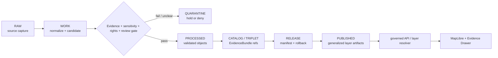

<!-- [KFM_META_BLOCK_V2]
doc_id: kfm://data/published/layers/roads-rail-trade/cultural-corridors-generalized/readme
name: Roads Rail Trade Cultural Corridors Generalized Published Layer README
path: data/published/layers/roads-rail-trade/cultural-corridors-generalized/README.md
type: data-lane-readme
version: v0.1.0
status: draft
owners:
  - <roads-rail-trade-domain-steward>
  - <cultural-heritage-steward>
  - <release-steward>
  - <map-layer-steward>
created: 2026-06-26
updated: 2026-06-26
policy_label: restricted-review
truth_posture: cite-or-abstain
lifecycle_phase: published
responsibility_root: data/
domain: roads-rail-trade
sublane: cultural-corridors-generalized
artifact_family: released-public-safe-generalized-cultural-corridor-layer
sensitivity_posture: generalized-public-geometry-only; steward-review-required; exact-sensitive-detail-denied; overprecision-denied
related:
  - ../README.md
  - ../../README.md
  - ../../../README.md
  - ../../../../../docs/domains/roads-rail-trade/ARCHITECTURE.md
  - ../../../../../docs/domains/roads-rail-trade/HISTORIC_ROUTES.md
  - ../../../../../docs/domains/roads-rail-trade/PIPELINE.md
  - ../../../../../docs/domains/roads-rail-trade/SOURCES.md
  - ../../../../../docs/domains/roads-rail-trade/SOURCE_FAMILIES.md
  - ../../../../../docs/doctrine/directory-rules.md
  - ../../../../proofs/roads-rail-trade/README.md
  - ../../../../../release/manifests/README.md
tags:
  - kfm
  - data
  - published
  - layers
  - roads-rail-trade
  - cultural-corridors
  - generalized
  - historic-routes
  - sensitivity
  - release
  - evidence-first
notes:
  - "This README documents the released, public-safe, generalized cultural-corridor layer lane for Roads/Rail/Trade."
  - "Published artifacts here are downstream delivery artifacts; release, proof, receipt, policy, source, and catalog authority stay in their owning roots."
  - "Exact sensitive locations, restricted-source fields, unreviewed cultural/corridor claims, and overprecise historic alignments do not belong in this lane."
[/KFM_META_BLOCK_V2] -->

<a id="top"></a>

# Roads/Rail/Trade — Cultural Corridors Generalized Published Layers

Released public-safe generalized corridor artifacts for culturally sensitive historic mobility and trade-route context.

<p>
  
  
  
  
  
  
</p>

**Quick links:** [Scope](#scope) · [Repo fit](#repo-fit) · [Inputs](#inputs) · [Exclusions](#exclusions) · [Publication boundary](#publication-boundary) · [Required checks](#required-checks-before-use) · [Status notes](#status-notes)

> [!CAUTION]
> This lane is for **generalized public geometry only**. Cultural-corridor outputs must preserve source role, uncertainty, review state, release state, and public-safe generalization. Exact sensitive detail, restricted-source-derived fields, and overprecise historic alignments do not belong here.

---

## Scope

This directory holds released public-safe layer artifacts for generalized cultural corridor context in the Roads/Rail/Trade domain. These layers may support map viewing, Evidence Drawer lookups, and public-safe interpretive context after the normal KFM release gates have passed.

A corridor layer here is a downstream delivery artifact. It is not the source record, route truth, cultural authority, catalog truth, proof bundle, release decision, or AI interpretation.

---

## Repo fit

| Field | Value |
|---|---|
| Path | `data/published/layers/roads-rail-trade/cultural-corridors-generalized/` |
| Responsibility root | `data/` |
| Lifecycle phase | `published/` |
| Domain lane | `roads-rail-trade` |
| Parent published layer lane | `data/published/layers/roads-rail-trade/` |
| Artifact role | Released generalized public-safe layer bytes and sidecars |
| Release authority | `release/`, not this directory |
| Proof authority | `data/proofs/` and `data/receipts/`, not this directory |
| Default failure posture | `DENY`, `HOLD`, `RESTRICT`, or `ABSTAIN` when evidence, source role, sensitivity, rights, review, release, or rollback support is insufficient |

---

## Inputs

Accepted content is limited to release-approved, public-safe derivatives such as:

- generalized cultural-corridor PMTiles, GeoParquet, GeoJSON, or vector-tile artifacts;
- public-safe uncertainty bands or corridor envelopes;
- layer manifests and tile metadata;
- field allowlists, digests, and generated release pointers;
- public-safe caveat summaries;
- release-local notes that explain artifact contents without replacing proof or release authority.

---

## Exclusions

| Do not place here | Correct authority home |
|---|---|
| RAW source captures or source mirrors | `data/raw/roads-rail-trade/` or source-specific intake |
| WORK files, route candidates, unresolved joins, or review drafts | `data/work/roads-rail-trade/` |
| Quarantined or unclear material | `data/quarantine/roads-rail-trade/` |
| Canonical processed route/corridor objects | `data/processed/roads-rail-trade/` |
| Catalog records, triplets, or graph truth | `data/catalog/` or graph/catalog lanes |
| EvidenceBundle / ProofPack | `data/proofs/` |
| Validation, transform, redaction, build, or release receipts | `data/receipts/` |
| Release manifests or promotion decisions | `release/` |
| Exact sensitive locations or restricted-source detail | Restricted governed lanes only; not public published layers |
| Direct model-generated claims | Governed answer/provenance paths only |

---

## Directory map

```text
data/published/layers/roads-rail-trade/cultural-corridors-generalized/
├── README.md
├── <release_id>/
│   ├── cultural_corridors_generalized.pmtiles
│   ├── cultural_corridors_generalized.geoparquet
│   ├── cultural_corridors_generalized.sha256
│   ├── layer.manifest.json
│   ├── fields.allowlist.json
│   ├── generalization.summary.json
│   ├── review.summary.json
│   └── README.md
└── latest.json
```

`latest.json` must be generated from release state. Remove or withhold it when release, review, digest, registry, correction, or rollback support is incomplete.

---

## Publication boundary



The forbidden shortcut is:

```text
RAW / WORK / QUARANTINE / processed candidate / direct source record / direct model output
→ direct public map layer
```

---

## Required checks before use

- [ ] Confirm the release manifest and promotion decision.
- [ ] Confirm proof and receipt closure.
- [ ] Confirm source descriptors, source roles, and rights posture.
- [ ] Confirm sensitivity and steward-review outcome.
- [ ] Confirm generalization transform and uncertainty/caveat sidecars.
- [ ] Confirm field allowlist and released-byte digest.
- [ ] Confirm layer registry entry.
- [ ] Confirm rollback target and correction path.
- [ ] Confirm public clients consume this layer through governed APIs or release-resolved artifacts.
- [ ] Confirm no exact sensitive detail or restricted-source-derived field is present in released bytes.

---

## Status notes

| Claim | Status |
|---|---|
| This README defines the requested path boundary. | **CONFIRMED authored** |
| The target path exists in the live repository. | **CONFIRMED by GitHub contents API during this edit** |
| The parent `data/published/layers/roads-rail-trade/README.md` exists as an empty placeholder. | **CONFIRMED by GitHub contents API during this edit** |
| Actual released artifacts exist in this subtree. | **UNKNOWN** |
| Validators for this exact layer are implemented and wired in CI. | **NEEDS VERIFICATION** |
| A release manifest currently approves a cultural-corridor generalized layer. | **UNKNOWN** |

---

## Related files

- [`../README.md`](../README.md)
- [`../../README.md`](../../README.md)
- [`../../../README.md`](../../../README.md)
- [`../../../../../docs/domains/roads-rail-trade/ARCHITECTURE.md`](../../../../../docs/domains/roads-rail-trade/ARCHITECTURE.md)
- [`../../../../../docs/domains/roads-rail-trade/HISTORIC_ROUTES.md`](../../../../../docs/domains/roads-rail-trade/HISTORIC_ROUTES.md)
- [`../../../../../docs/domains/roads-rail-trade/PIPELINE.md`](../../../../../docs/domains/roads-rail-trade/PIPELINE.md)
- [`../../../../proofs/roads-rail-trade/README.md`](../../../../proofs/roads-rail-trade/README.md)
- [`../../../../../release/manifests/README.md`](../../../../../release/manifests/README.md)

---

KFM rule: this directory is a released generalized layer lane only. It is not source authority, proof authority, release authority, cultural authority, route truth, registry authority, or AI truth.

[Back to top](#top)
