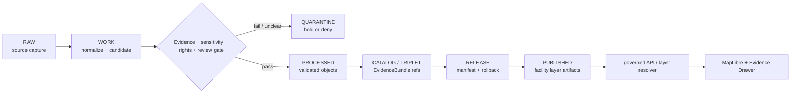

<!-- [KFM_META_BLOCK_V2]
doc_id: kfm://data/published/layers/roads-rail-trade/facilities/readme
name: Roads Rail Trade Facilities Published Layer README
path: data/published/layers/roads-rail-trade/facilities/README.md
type: data-lane-readme
version: v0.1.0
status: draft
owners:
  - <roads-rail-trade-domain-steward>
  - <release-steward>
  - <map-layer-steward>
created: 2026-06-26
updated: 2026-06-26
policy_label: restricted-review
truth_posture: cite-or-abstain
lifecycle_phase: published
responsibility_root: data/
domain: roads-rail-trade
sublane: facilities
artifact_family: released-public-safe-transport-facility-layer
sensitivity_posture: public-safe-derivatives-only; infrastructure-detail-review-required; release-required
related:
  - ../README.md
  - ../../README.md
  - ../../../README.md
  - ../../../../../docs/domains/roads-rail-trade/ARCHITECTURE.md
  - ../../../../../docs/domains/roads-rail-trade/PIPELINE.md
  - ../../../../../docs/domains/roads-rail-trade/SOURCES.md
  - ../../../../../docs/domains/roads-rail-trade/SOURCE_FAMILIES.md
  - ../../../../../docs/doctrine/directory-rules.md
  - ../../../../proofs/roads-rail-trade/README.md
  - ../../../../../release/manifests/README.md
tags:
  - kfm
  - data
  - published
  - layers
  - roads-rail-trade
  - facilities
  - transport-facilities
  - infrastructure
  - release
  - evidence-first
notes:
  - "This README documents the released, public-safe transport facilities layer lane for Roads/Rail/Trade."
  - "Published artifacts here are downstream delivery artifacts; release, proof, receipt, policy, source, and catalog authority stay in their owning roots."
  - "Facility detail must remain release-reviewed and public-safe; sensitive operational or restricted infrastructure detail does not belong in this lane."
[/KFM_META_BLOCK_V2] -->

<a id="top"></a>

# Roads/Rail/Trade — Facilities Published Layers

Released public-safe layer artifacts for transport facilities in the Roads/Rail/Trade domain.

<p>
  
  
  
  
  
  
</p>

**Quick links:** [Scope](#scope) · [Repo fit](#repo-fit) · [Inputs](#inputs) · [Exclusions](#exclusions) · [Publication boundary](#publication-boundary) · [Required checks](#required-checks-before-use) · [Status notes](#status-notes)

> [!CAUTION]
> This lane is for **released public-safe facility layers only**. Facility data can include infrastructure-sensitive details, so public artifacts must be reviewed, field-allowlisted, release-linked, and rollback-ready before use.

---

## Scope

This directory holds released public-safe layer artifacts for Roads/Rail/Trade transport facilities. Facility layers may support map viewing, Evidence Drawer lookups, and public-safe routing or context displays after the normal KFM release gates have passed.

A facility layer here is a downstream delivery artifact. It is not the source record, facility truth, catalog truth, proof bundle, release decision, registry authority, or AI interpretation.

---

## Repo fit

| Field | Value |
|---|---|
| Path | `data/published/layers/roads-rail-trade/facilities/` |
| Responsibility root | `data/` |
| Lifecycle phase | `published/` |
| Domain lane | `roads-rail-trade` |
| Parent published layer lane | `data/published/layers/roads-rail-trade/` |
| Artifact role | Released public-safe facility layer bytes and sidecars |
| Release authority | `release/`, not this directory |
| Proof authority | `data/proofs/` and `data/receipts/`, not this directory |
| Default failure posture | `DENY`, `HOLD`, `RESTRICT`, or `ABSTAIN` when evidence, source role, sensitivity, rights, review, release, or rollback support is insufficient |

---

## Inputs

Accepted content is limited to release-approved, public-safe derivatives such as:

- transport-facility PMTiles, GeoParquet, GeoJSON, or vector-tile artifacts;
- facility-category or facility-context layers with public-safe fields only;
- layer manifests and tile metadata;
- field allowlists, digests, and generated release pointers;
- public-safe caveat summaries;
- release-local notes that explain artifact contents without replacing proof or release authority.

---

## Exclusions

| Do not place here | Correct authority home |
|---|---|
| RAW source captures or source mirrors | `data/raw/roads-rail-trade/` or source-specific intake |
| WORK files, candidates, unresolved joins, or review drafts | `data/work/roads-rail-trade/` |
| Quarantined or unclear material | `data/quarantine/roads-rail-trade/` |
| Canonical processed facility objects | `data/processed/roads-rail-trade/` |
| Catalog records, triplets, or graph truth | `data/catalog/` or graph/catalog lanes |
| EvidenceBundle / ProofPack | `data/proofs/` |
| Validation, transform, redaction, build, or release receipts | `data/receipts/` |
| Release manifests or promotion decisions | `release/` |
| Sensitive operational infrastructure detail | Restricted governed lanes only; not public published layers |
| Direct model-generated claims | Governed answer/provenance paths only |

---

## Directory map

```text
data/published/layers/roads-rail-trade/facilities/
├── README.md
├── <release_id>/
│   ├── facilities.pmtiles
│   ├── facilities.geoparquet
│   ├── facilities.sha256
│   ├── layer.manifest.json
│   ├── fields.allowlist.json
│   ├── review.summary.json
│   └── README.md
└── latest.json
```

`latest.json` must be generated from release state. Remove or withhold it when release, review, digest, registry, correction, or rollback support is incomplete.

---

## Publication boundary



The forbidden shortcut is:

```text
RAW / WORK / QUARANTINE / processed candidate / direct source record / direct model output
→ direct public map layer
```

---

## Required checks before use

- [ ] Confirm the release manifest and promotion decision.
- [ ] Confirm proof and receipt closure.
- [ ] Confirm source descriptors, source roles, and rights posture.
- [ ] Confirm sensitivity and review outcome.
- [ ] Confirm field allowlist and released-byte digest.
- [ ] Confirm layer registry entry.
- [ ] Confirm rollback target and correction path.
- [ ] Confirm public clients consume this layer through governed APIs or release-resolved artifacts.
- [ ] Confirm sensitive operational infrastructure detail is absent from released bytes.

---

## Status notes

| Claim | Status |
|---|---|
| This README defines the requested path boundary. | **CONFIRMED authored** |
| The target path exists in the live repository. | **CONFIRMED by GitHub contents API during this edit** |
| The parent `data/published/layers/roads-rail-trade/README.md` exists as an empty placeholder. | **CONFIRMED by GitHub contents API during this edit** |
| Actual released artifacts exist in this subtree. | **UNKNOWN** |
| Validators for this exact layer are implemented and wired in CI. | **NEEDS VERIFICATION** |
| A release manifest currently approves a facilities layer. | **UNKNOWN** |

---

## Related files

- [`../README.md`](../README.md)
- [`../../README.md`](../../README.md)
- [`../../../README.md`](../../../README.md)
- [`../../../../../docs/domains/roads-rail-trade/ARCHITECTURE.md`](../../../../../docs/domains/roads-rail-trade/ARCHITECTURE.md)
- [`../../../../../docs/domains/roads-rail-trade/PIPELINE.md`](../../../../../docs/domains/roads-rail-trade/PIPELINE.md)
- [`../../../../proofs/roads-rail-trade/README.md`](../../../../proofs/roads-rail-trade/README.md)
- [`../../../../../release/manifests/README.md`](../../../../../release/manifests/README.md)

---

KFM rule: this directory is a released facility layer lane only. It is not source authority, proof authority, release authority, facility truth, registry authority, or AI truth.

[Back to top](#top)
