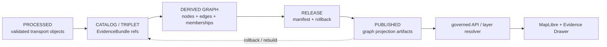

<!-- [KFM_META_BLOCK_V2]
doc_id: kfm://data/published/layers/roads-rail-trade/graph/readme
name: Roads Rail Trade Graph Published Layer README
path: data/published/layers/roads-rail-trade/graph/README.md
type: data-lane-readme
version: v0.1.0
status: draft
owners:
  - <roads-rail-trade-domain-steward>
  - <graph-analytics-steward>
  - <release-steward>
  - <map-layer-steward>
created: 2026-06-26
updated: 2026-06-26
policy_label: restricted-review
truth_posture: cite-or-abstain
lifecycle_phase: published
responsibility_root: data/
domain: roads-rail-trade
sublane: graph
artifact_family: released-public-safe-transport-graph-projection-layer
sensitivity_posture: derived-read-model-only; not-canonical-truth; source-role-and-tier-preserving; release-required
related:
  - ../README.md
  - ../../README.md
  - ../../../README.md
  - ../../../../../docs/domains/roads-rail-trade/GRAPH_PROJECTIONS.md
  - ../../../../../docs/domains/roads-rail-trade/ARCHITECTURE.md
  - ../../../../../docs/domains/roads-rail-trade/PIPELINE.md
  - ../../../../../docs/doctrine/directory-rules.md
  - ../../../../proofs/roads-rail-trade/README.md
  - ../../../../../release/manifests/README.md
tags:
  - kfm
  - data
  - published
  - layers
  - roads-rail-trade
  - graph
  - graph-projection
  - derived
  - evidencebundle
  - rollback
  - release
  - evidence-first
notes:
  - "This README documents the released, public-safe graph-projection layer lane for Roads/Rail/Trade."
  - "Graph artifacts are downstream read models over EvidenceBundles; they are not canonical truth."
  - "Published graph views must be rebuildable, rollback-safe, source-role-preserving, and consumed through governed APIs or release-resolved artifacts."
[/KFM_META_BLOCK_V2] -->

<a id="top"></a>

# Roads/Rail/Trade — Graph Published Layers

Released public-safe graph-projection artifacts for Roads/Rail/Trade connectivity views.

<p>
  
  
  
  
  
  
</p>

**Quick links:** [Scope](#scope) · [Repo fit](#repo-fit) · [Inputs](#inputs) · [Exclusions](#exclusions) · [Publication boundary](#publication-boundary) · [Required checks](#required-checks-before-use) · [Status notes](#status-notes)

> [!IMPORTANT]
> This lane is for **released derived graph projections only**. A graph artifact can answer connectivity questions, but it cannot become the place where route, segment, facility, or corridor truth first exists. EvidenceBundle and canonical catalog state outrank the graph.

---

## Scope

This directory holds released public-safe graph-projection artifacts for Roads/Rail/Trade connectivity views. These artifacts may support governed API queries, MapLibre connectivity views, Evidence Drawer lookups, and public-safe graph summaries after the normal KFM release gates have passed.

A graph layer here is a downstream read model. It is not the source record, road truth, rail truth, route truth, catalog truth, proof bundle, release decision, registry authority, or AI interpretation.

---

## Repo fit

| Field | Value |
|---|---|
| Path | `data/published/layers/roads-rail-trade/graph/` |
| Responsibility root | `data/` |
| Lifecycle phase | `published/` |
| Domain lane | `roads-rail-trade` |
| Parent published layer lane | `data/published/layers/roads-rail-trade/` |
| Artifact role | Released public-safe graph projection bytes and sidecars |
| Upstream derivation authority | Catalog/EvidenceBundle and triplet/projection pipelines, not this directory |
| Release authority | `release/`, not this directory |
| Proof authority | `data/proofs/` and `data/receipts/`, not this directory |
| Default failure posture | `DENY`, `HOLD`, `RESTRICT`, or `ABSTAIN` when evidence, source role, sensitivity tier, rights, review, release, rebuild, or rollback support is insufficient |

---

## Inputs

Accepted content is limited to release-approved, public-safe derivatives such as:

- transport graph PMTiles, GeoParquet, JSON, GraphML-like export, or vector-tile artifacts;
- network-node, network-edge, route-membership, and movement-story projection layers;
- layer manifests and graph metadata;
- field allowlists, digests, and generated release pointers;
- derivation summaries that point back to catalog-closed evidence;
- public-safe caveat summaries;
- release-local notes that explain artifact contents without replacing proof or release authority.

---

## Exclusions

| Do not place here | Correct authority home |
|---|---|
| RAW source captures or source mirrors | `data/raw/roads-rail-trade/` or source-specific intake |
| WORK files, candidates, unresolved joins, or graph build drafts | `data/work/roads-rail-trade/` |
| Quarantined or unclear material | `data/quarantine/roads-rail-trade/` |
| Canonical processed road, rail, route, facility, or corridor objects | `data/processed/roads-rail-trade/` |
| Catalog records, triplets, or canonical EvidenceBundle state | `data/catalog/` and triplet/projection lanes |
| EvidenceBundle / ProofPack | `data/proofs/` |
| Validation, transform, graph-build, redaction, or release receipts | `data/receipts/` |
| Release manifests or promotion decisions | `release/` |
| Direct model-generated graph claims | Governed answer/provenance paths only |
| Graph edits that rewrite canonical truth | Not allowed; rebuild from evidence instead |

---

## Directory map

```text
data/published/layers/roads-rail-trade/graph/
├── README.md
├── <release_id>/
│   ├── transport_graph.geojson
│   ├── transport_graph.geoparquet
│   ├── transport_graph.pmtiles
│   ├── transport_graph.sha256
│   ├── layer.manifest.json
│   ├── fields.allowlist.json
│   ├── derivation.summary.json
│   ├── rollback.summary.json
│   └── README.md
└── latest.json
```

`latest.json` must be generated from release state. Remove or withhold it when release, review, digest, registry, correction, rebuild, or rollback support is incomplete.

---

## Publication boundary



The forbidden shortcut is:

```text
RAW / WORK / QUARANTINE / processed candidate / direct source record / direct model output / hand-edited graph
→ direct public graph layer
```

---

## Required checks before use

- [ ] Confirm the release manifest and promotion decision.
- [ ] Confirm proof and receipt closure.
- [ ] Confirm source descriptors, source roles, and rights posture.
- [ ] Confirm every graph element has evidence lineage or a resolver key.
- [ ] Confirm graph derivation is deterministic and rebuildable from catalog-closed evidence.
- [ ] Confirm source roles and sensitivity tiers are preserved in the projection.
- [ ] Confirm route memberships do not collapse designations or roles.
- [ ] Confirm field allowlist and released-byte digest.
- [ ] Confirm layer registry entry.
- [ ] Confirm rollback target, correction path, and stale-state handling.
- [ ] Confirm public clients consume this layer through governed APIs or release-resolved artifacts.

---

## Status notes

| Claim | Status |
|---|---|
| This README defines the requested path boundary. | **CONFIRMED authored** |
| The target path exists in the live repository. | **CONFIRMED by GitHub contents API during this edit** |
| `docs/domains/roads-rail-trade/GRAPH_PROJECTIONS.md` exists and states graph projection doctrine. | **CONFIRMED by GitHub contents API during this edit** |
| Actual released graph artifacts exist in this subtree. | **UNKNOWN** |
| Validators for this exact layer are implemented and wired in CI. | **NEEDS VERIFICATION** |
| A release manifest currently approves a Roads/Rail/Trade graph layer. | **UNKNOWN** |

---

## Related files

- [`../README.md`](../README.md)
- [`../../README.md`](../../README.md)
- [`../../../README.md`](../../../README.md)
- [`../../../../../docs/domains/roads-rail-trade/GRAPH_PROJECTIONS.md`](../../../../../docs/domains/roads-rail-trade/GRAPH_PROJECTIONS.md)
- [`../../../../../docs/domains/roads-rail-trade/ARCHITECTURE.md`](../../../../../docs/domains/roads-rail-trade/ARCHITECTURE.md)
- [`../../../../../docs/domains/roads-rail-trade/PIPELINE.md`](../../../../../docs/domains/roads-rail-trade/PIPELINE.md)
- [`../../../../proofs/roads-rail-trade/README.md`](../../../../proofs/roads-rail-trade/README.md)
- [`../../../../../release/manifests/README.md`](../../../../../release/manifests/README.md)

---

KFM rule: this directory is a released graph-projection layer lane only. It is not source authority, proof authority, release authority, canonical transport truth, registry authority, or AI truth.

[Back to top](#top)
