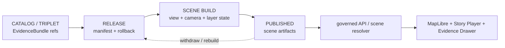

<!-- [KFM_META_BLOCK_V2]
doc_id: kfm://data/published/layers/scene/readme
name: Scene Published Layers README
path: data/published/layers/scene/README.md
type: data-lane-readme
version: v0.1.0
status: draft
owners:
  - <scene-steward>
  - <story-subsystem-owner>
  - <map-layer-steward>
  - <release-steward>
created: 2026-06-26
updated: 2026-06-26
policy_label: restricted-review
truth_posture: cite-or-abstain
lifecycle_phase: published
responsibility_root: data/
domain: scene
artifact_family: released-public-safe-scene-layer-artifacts
sensitivity_posture: derived-carrier-only; not-sovereign-truth; governed-map-runtime-required; release-required
related:
  - ../README.md
  - ../../README.md
  - ../../../README.md
  - ../../../../docs/doctrine/derived-stays-derived.md
  - ../../../../docs/doctrine/map-first.md
  - ../../../../docs/architecture/story/README.md
  - ../../../../docs/architecture/map-master/README.md
  - ../../../../docs/architecture/ui/README.md
  - ../../../../docs/doctrine/directory-rules.md
  - ../../../proofs/README.md
  - ../../../../release/manifests/README.md
tags:
  - kfm
  - data
  - published
  - layers
  - scene
  - story
  - maplibre
  - derived
  - carrier
  - release
  - evidence-first
notes:
  - "This README documents the released public-safe scene artifact lane under data/published/layers/."
  - "Scenes are downstream carriers and presentations; they are not sovereign truth."
  - "Scene artifacts must be release-bound, rebuildable or withdrawable, evidence-linked, policy-reviewed, and consumed through governed map/story interfaces."
[/KFM_META_BLOCK_V2] -->

<a id="top"></a>

# Scene Published Layers

Released public-safe scene artifacts for governed map and story playback surfaces.

<p>
  
  
  
  
  
  
</p>

**Quick links:** [Scope](#scope) · [Repo fit](#repo-fit) · [Inputs](#inputs) · [Exclusions](#exclusions) · [Directory map](#directory-map) · [Publication boundary](#publication-boundary) · [Required checks](#required-checks-before-use) · [Status notes](#status-notes)

> [!IMPORTANT]
> A scene is a **derived carrier**. It may arrange camera, time, layers, annotations, and story playback state, but it must not become the place where a KFM claim first exists. EvidenceBundle, policy, release state, correction state, and governed map/story interfaces outrank the scene.

---

## Scope

This directory holds released public-safe scene artifacts for KFM map and story playback surfaces. A scene may package view state, camera path, layer selections, time windows, story-node pointers, caveats, and presentation metadata after the normal KFM release gates have passed.

A scene artifact here is a downstream delivery or snapshot artifact. It is not the source record, EvidenceBundle, catalog truth, proof bundle, release decision, policy decision, registry authority, map runtime authority, story authoring workspace, or AI interpretation.

---

## Repo fit

| Field | Value |
|---|---|
| Path | `data/published/layers/scene/` |
| Responsibility root | `data/` |
| Lifecycle phase | `published/` |
| Artifact role | Released public-safe scene artifacts and sidecars |
| Upstream authority | EvidenceBundle, catalog/release state, story/map contracts, and governed API envelopes |
| Runtime posture | Governed map/story surfaces only |
| Release authority | `release/`, not this directory |
| Proof authority | `data/proofs/` and `data/receipts/`, not this directory |
| Default failure posture | `DENY`, `HOLD`, `RESTRICT`, or `ABSTAIN` when evidence, policy, sensitivity, rights, release, correction, rebuild, or rollback support is insufficient |

---

## Inputs

Accepted content is limited to release-approved, public-safe derivatives such as:

- scene manifests and scene-index files generated from release state;
- camera paths, view-state snapshots, and layer-state sidecars;
- story-node or story-manifest pointers that resolve through governed interfaces;
- public-safe caveat summaries and reality-boundary notes;
- field allowlists, digests, and generated release pointers;
- release-local notes that explain scene contents without replacing proof or release authority.

---

## Exclusions

| Do not place here | Correct authority home |
|---|---|
| RAW source captures or uploaded media/source mirrors | Source-specific `data/raw/` or intake lanes |
| WORK scene drafts, authoring scratch, prompt outputs, or unresolved story nodes | `data/work/` or the appropriate story/authoring workspace |
| Quarantined or unclear scene content | `data/quarantine/` |
| Canonical processed domain objects | Their `data/processed/<domain>/` lanes |
| Catalog records, triplets, graph truth, or EvidenceBundle state | `data/catalog/`, triplet lanes, or proof lanes |
| EvidenceBundle / ProofPack | `data/proofs/` |
| Validation, transform, representation, scene-build, or release receipts | `data/receipts/` |
| Release manifests or promotion decisions | `release/` |
| Sensitive geometry or restricted fields hidden only by styling | Restricted governed lanes only; not public scene artifacts |
| Direct model-generated claims | Governed answer/provenance paths only |

---

## Directory map

```text
data/published/layers/scene/
├── README.md
├── <release_id>/
│   ├── scene.manifest.json
│   ├── scene.index.json
│   ├── view_state.json
│   ├── camera_path.json
│   ├── layers.allowlist.json
│   ├── reality_boundary_note.json
│   ├── scene.sha256
│   └── README.md
└── latest.json
```

`latest.json` must be generated from release state. Remove or withhold it when release, review, digest, registry, correction, rebuild, or rollback support is incomplete.

---

## Publication boundary



The forbidden shortcut is:

```text
RAW / WORK / QUARANTINE / direct source record / direct model output / unreleased story draft
→ direct public scene artifact
```

---

## Required checks before use

- [ ] Confirm the release manifest and promotion decision.
- [ ] Confirm proof and receipt closure.
- [ ] Confirm every scene claim resolves to governed evidence or abstains.
- [ ] Confirm source roles, rights, sensitivity, and policy outcomes.
- [ ] Confirm scene build, representation, and reality-boundary sidecars.
- [ ] Confirm layer allowlist and released-byte digest.
- [ ] Confirm scene registry or resolver entry.
- [ ] Confirm rollback target, correction path, and withdrawal path.
- [ ] Confirm the scene is rebuildable from release state or clearly marked as a timestamped snapshot.
- [ ] Confirm public clients consume this scene through governed map/story APIs or release-resolved artifacts.
- [ ] Confirm no sensitive geometry or restricted field is exposed by relying on style-only hiding.

---

## Status notes

| Claim | Status |
|---|---|
| This README defines the requested path boundary. | **CONFIRMED authored** |
| The target path exists in the live repository. | **CONFIRMED by GitHub contents API during this edit** |
| KFM doctrine names scenes as downstream derived artifacts, not truth. | **CONFIRMED from `docs/doctrine/derived-stays-derived.md`** |
| Story architecture references scene manifests and governed map/story playback. | **CONFIRMED from `docs/architecture/story/README.md`** |
| Actual released scene artifacts exist in this subtree. | **UNKNOWN** |
| Validators for this exact scene lane are implemented and wired in CI. | **NEEDS VERIFICATION** |
| A release manifest currently approves a scene layer. | **UNKNOWN** |

---

## Related files

- [`../README.md`](../README.md)
- [`../../README.md`](../../README.md)
- [`../../../README.md`](../../../README.md)
- [`../../../../docs/doctrine/derived-stays-derived.md`](../../../../docs/doctrine/derived-stays-derived.md)
- [`../../../../docs/doctrine/map-first.md`](../../../../docs/doctrine/map-first.md)
- [`../../../../docs/architecture/story/README.md`](../../../../docs/architecture/story/README.md)
- [`../../../../docs/architecture/map-master/README.md`](../../../../docs/architecture/map-master/README.md)
- [`../../../../docs/architecture/ui/README.md`](../../../../docs/architecture/ui/README.md)
- [`../../../proofs/README.md`](../../../proofs/README.md)
- [`../../../../release/manifests/README.md`](../../../../release/manifests/README.md)

---

KFM rule: this directory is a released scene-carrier lane only. It is not source authority, proof authority, release authority, catalog authority, map runtime authority, story authoring authority, registry authority, or AI truth.

[Back to top](#top)
