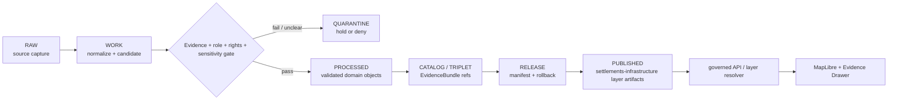

<!-- [KFM_META_BLOCK_V2]
doc_id: kfm://data/published/layers/settlements-infrastructure/readme
name: Settlements Infrastructure Published Layers README
path: data/published/layers/settlements-infrastructure/README.md
type: data-lane-readme
version: v0.1.0
status: draft
owners:
  - <settlements-infrastructure-domain-steward>
  - <release-steward>
  - <map-layer-steward>
created: 2026-06-26
updated: 2026-06-26
policy_label: restricted-review
truth_posture: cite-or-abstain
lifecycle_phase: published
responsibility_root: data/
domain: settlements-infrastructure
placement_status: WORKING_CANONICAL_NEEDS_VERIFICATION
artifact_family: released-public-safe-settlements-infrastructure-map-layers
sensitivity_posture: public-safe-derivatives-only; critical-asset-detail-review-required; sovereignty-and-cultural-adjacency-review-required; release-required
related:
  - ../settlement/README.md
  - ../README.md
  - ../../README.md
  - ../../../README.md
  - ../../../../docs/domains/settlements-infrastructure/CANONICAL_PATHS.md
  - ../../../../docs/domains/settlements-infrastructure/DATA_LIFECYCLE.md
  - ../../../../docs/domains/settlements-infrastructure/sublanes/settlements.md
  - ../../../../docs/domains/settlements-infrastructure/RELEASE_INDEX.md
  - ../../../../docs/doctrine/directory-rules.md
  - ../../../proofs/README.md
  - ../../../../release/manifests/README.md
tags:
  - kfm
  - data
  - published
  - layers
  - settlements-infrastructure
  - settlement
  - infrastructure
  - places
  - municipalities
  - facilities
  - service-areas
  - release
  - evidence-first
notes:
  - "This README documents the settlements-infrastructure published-layer lane using the working canonical slug identified by current domain path docs."
  - "Slug variance with data/published/layers/settlement/ is recorded as a compatibility/open-verification issue, not silently resolved here."
  - "Published artifacts here are downstream delivery artifacts; release, proof, receipt, policy, source, processed, and catalog authority stay in their owning roots."
[/KFM_META_BLOCK_V2] -->

<a id="top"></a>

# Settlements/Infrastructure Published Layers

Released public-safe settlements and infrastructure layer artifacts for place, community, asset, service-area, and dependency views.

<p>
  
  
  
  
  
  
</p>

**Quick links:** [Scope](#scope) · [Repo fit](#repo-fit) · [Inputs](#inputs) · [Exclusions](#exclusions) · [Directory map](#directory-map) · [Publication boundary](#publication-boundary) · [Required checks](#required-checks-before-use) · [Status notes](#status-notes)

> [!IMPORTANT]
> This lane uses the working `settlements-infrastructure` domain segment. It is still marked **NEEDS VERIFICATION** for live artifact maturity, and the separate `settlement/` lane remains a slug-variance/compatibility surface until an ADR, migration note, or directory-rule decision resolves the naming split.

---

## Scope

This directory may hold released public-safe layer artifacts for the combined Settlements/Infrastructure domain. Published layers may support map viewing, Evidence Drawer lookups, public-safe place identity, municipal/census-place display, generalized historic-townsite context, infrastructure asset summaries, service-area views, facility context, and dependency overlays after the normal KFM release gates have passed.

A layer here is a downstream delivery artifact. It is not the source record, settlement truth, infrastructure truth, facility truth, operator truth, cultural authority, catalog truth, proof bundle, release decision, registry authority, or AI interpretation.

---

## Repo fit

| Field | Value |
|---|---|
| Path | `data/published/layers/settlements-infrastructure/` |
| Responsibility root | `data/` |
| Lifecycle phase | `published/` |
| Working domain segment | `settlements-infrastructure` |
| Variant / compatibility path | `data/published/layers/settlement/` |
| Placement status | **WORKING CANONICAL / NEEDS VERIFICATION** |
| Artifact role | Released public-safe settlements/infrastructure layer bytes and sidecars |
| Release authority | `release/`, not this directory |
| Proof authority | `data/proofs/` and `data/receipts/`, not this directory |
| Default failure posture | `DENY`, `HOLD`, `RESTRICT`, or `ABSTAIN` when evidence, source role, sensitivity, critical-asset review, sovereignty/cultural review, rights, release, or rollback support is insufficient |

---

## Inputs

Accepted content is limited to release-approved, public-safe derivatives such as:

- settlement, municipality, census-place, townsite, ghost-town, fort, mission, or reservation-community layer artifacts after review;
- infrastructure asset, facility, service-area, operator, condition-observation, or dependency layer artifacts after review;
- generalized public-safe footprints, points, boundaries, service areas, or aggregates whose precision is supported by evidence and release state;
- PMTiles, GeoParquet, GeoJSON, vector-tile artifacts, or API payload sidecars;
- layer manifests, caveat summaries, tile metadata, and review summaries;
- field allowlists, digests, and generated release pointers;
- release-local notes that explain artifact contents without replacing proof or release authority.

---

## Exclusions

| Do not place here | Correct authority home |
|---|---|
| RAW source captures or source mirrors | `data/raw/settlements-infrastructure/` or source-specific intake |
| WORK files, candidates, unresolved joins, or review drafts | `data/work/settlements-infrastructure/` |
| Quarantined or unclear material | `data/quarantine/settlements-infrastructure/` |
| Canonical processed settlement or infrastructure objects | `data/processed/settlements-infrastructure/` or the ADR-confirmed lane |
| Catalog records, triplets, or graph truth | `data/catalog/` and triplet/projection lanes |
| EvidenceBundle / ProofPack | `data/proofs/` |
| Validation, transform, redaction, build, or release receipts | `data/receipts/` |
| Release manifests or promotion decisions | `release/` |
| Exact restricted cultural, sacred-site, living-person, parcel, or critical infrastructure detail | Restricted governed lanes only; not public published layers |
| Emergency alerts or hazard authority claims | Hazards/official alert authorities; KFM does not become an alert authority |
| Direct model-generated claims | Governed answer/provenance paths only |

---

## Directory map

```text
data/published/layers/settlements-infrastructure/
├── README.md
├── <release_id>/
│   ├── settlements_infrastructure.pmtiles
│   ├── settlements_infrastructure.geoparquet
│   ├── settlements_infrastructure.sha256
│   ├── layer.manifest.json
│   ├── fields.allowlist.json
│   ├── review.summary.json
│   └── README.md
└── latest.json
```

`latest.json` must be generated from release state. Remove or withhold it when release, review, digest, registry, correction, or rollback support is incomplete.

---

## Publication boundary



The forbidden shortcut is:

```text
RAW / WORK / QUARANTINE / processed candidate / direct source record / direct model output
→ direct public settlements-infrastructure layer
```

---

## Required checks before use

- [ ] Confirm the `settlements-infrastructure/` versus `settlement/` segment decision for the specific artifact family.
- [ ] Confirm the release manifest and promotion decision.
- [ ] Confirm proof and receipt closure.
- [ ] Confirm source descriptors, source roles, and rights posture.
- [ ] Confirm sensitivity, critical-asset, sovereignty/cultural-adjacency, and living-person/privacy review outcomes where applicable.
- [ ] Confirm field allowlist and released-byte digest.
- [ ] Confirm layer registry entry.
- [ ] Confirm rollback target and correction path.
- [ ] Confirm `latest.json`, if present, is generated from release state.
- [ ] Confirm public clients consume this layer through governed APIs or release-resolved artifacts.
- [ ] Confirm no restricted detail is exposed by relying on style-only hiding.

---

## Status notes

| Claim | Status |
|---|---|
| This README defines the requested path boundary. | **CONFIRMED authored** |
| The target path exists in the live repository. | **CONFIRMED by GitHub contents API during this edit** |
| Current domain docs identify `settlements-infrastructure` as the working canonical domain slug. | **CONFIRMED by GitHub contents API during this edit** |
| Current domain docs also record slug/path variance involving `settlement`. | **CONFIRMED by GitHub contents API during this edit** |
| Actual released artifacts exist in this subtree. | **UNKNOWN** |
| Validators for this exact layer are implemented and wired in CI. | **NEEDS VERIFICATION** |
| A release manifest currently approves a settlements-infrastructure layer. | **UNKNOWN** |

---

## Related files

- [`../settlement/README.md`](../settlement/README.md)
- [`../README.md`](../README.md)
- [`../../README.md`](../../README.md)
- [`../../../README.md`](../../../README.md)
- [`../../../../docs/domains/settlements-infrastructure/CANONICAL_PATHS.md`](../../../../docs/domains/settlements-infrastructure/CANONICAL_PATHS.md)
- [`../../../../docs/domains/settlements-infrastructure/DATA_LIFECYCLE.md`](../../../../docs/domains/settlements-infrastructure/DATA_LIFECYCLE.md)
- [`../../../../docs/domains/settlements-infrastructure/sublanes/settlements.md`](../../../../docs/domains/settlements-infrastructure/sublanes/settlements.md)
- [`../../../../docs/domains/settlements-infrastructure/RELEASE_INDEX.md`](../../../../docs/domains/settlements-infrastructure/RELEASE_INDEX.md)
- [`../../../proofs/README.md`](../../../proofs/README.md)
- [`../../../../release/manifests/README.md`](../../../../release/manifests/README.md)

---

KFM rule: this directory is a released settlements/infrastructure layer lane only. It is not source authority, proof authority, release authority, catalog authority, settlement truth, infrastructure truth, cultural authority, registry authority, or AI truth.

[Back to top](#top)
