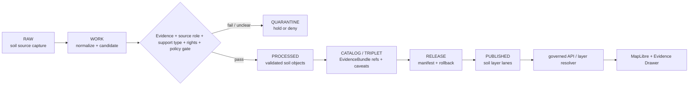

<!-- [KFM_META_BLOCK_V2]
doc_id: kfm://data/published/layers/soil/readme
name: Soil Published Layers README
path: data/published/layers/soil/README.md
type: data-lane-index-readme
version: v0.1.0
status: draft
owners:
  - <soil-domain-steward>
  - <release-steward>
  - <map-layer-steward>
created: 2026-06-27
updated: 2026-06-27
policy_label: public-with-review
truth_posture: cite-or-abstain
lifecycle_phase: published
responsibility_root: data/
domain: soil
artifact_family: released-public-safe-soil-map-layers
sensitivity_posture: public-safe-at-appropriate-scale; support-type-separation-required; farm-owner-operational-detail-review-required; release-required
related:
  - static_survey/README.md
  - gridded_derivative/README.md
  - satellite_grid/README.md
  - ../README.md
  - ../../README.md
  - ../../../README.md
  - ../../../../docs/domains/soil/ARCHITECTURE.md
  - ../../../../docs/domains/soil/DATA_LIFECYCLE.md
  - ../../../../docs/domains/soil/CANONICAL_PATHS.md
  - ../../../../docs/domains/soil/API_CONTRACTS.md
  - ../../../../contracts/domains/soil/domain_layer_descriptor.md
  - ../../../../contracts/domains/soil/hydrologic_soil_group.md
  - ../../../proofs/soil/README.md
  - ../../../../release/manifests/README.md
tags:
  - kfm
  - data
  - published
  - layers
  - soil
  - static-survey
  - gridded-derivative
  - satellite-grid
  - support-type
  - ssurgo
  - sda
  - gssurgo
  - gnatsgo
  - smap
  - release
  - evidence-first
notes:
  - "This README indexes the Soil published-layer lane and its confirmed child README lanes in this session."
  - "Soil published artifacts are downstream delivery artifacts; release, proof, receipt, policy, source, processed, catalog, and registry authority stay in their owning roots."
  - "Support-type separation is mandatory: static survey, gridded derivative, station, satellite, pedon, and interpretation surfaces must not masquerade as one another."
[/KFM_META_BLOCK_V2] -->

<a id="top"></a>

# Soil Published Layers

Released public-safe Soil layer artifacts for governed map and API delivery.

<p>
  
  
  
  
  
  
</p>

**Quick links:** [Scope](#scope) · [Repo fit](#repo-fit) · [Confirmed child lanes](#confirmed-child-lanes) · [Inputs](#inputs) · [Exclusions](#exclusions) · [Directory map](#directory-map) · [Publication boundary](#publication-boundary) · [Required checks](#required-checks-before-use) · [Status notes](#status-notes)

> [!IMPORTANT]
> This parent lane indexes released public-safe Soil map/API artifacts. It does not create soil truth, survey truth, gridded-derivative truth, station observation truth, satellite observation truth, interpretation truth, proof authority, release authority, registry authority, or AI truth. Support type, source role, time caveat, release state, digest, and rollback support must remain inspectable.

---

## Scope

This directory indexes released public-safe Soil layer lanes under `data/published/layers/soil/`. Child lanes may expose map-layer bytes, sidecars, support-type summaries, caveat summaries, field allowlists, digests, and release pointers after governance, validation, proof closure, release, correction, and rollback requirements are met.

The public value of these layers is delivery and inspection. They help users view released soil artifacts, resolve evidence through governed interfaces, and understand support-type and time caveats. They do not create or replace canonical SoilMapUnit, SoilComponent, Horizon, SoilProperty, Hydrologic Soil Group, Soil Moisture Observation, Pedon, ErosionRisk, SuitabilityRating, catalog, or EvidenceBundle truth.

---

## Repo fit

| Field | Value |
|---|---|
| Path | `data/published/layers/soil/` |
| Responsibility root | `data/` |
| Lifecycle phase | `published/` |
| Domain lane | `soil` |
| Artifact role | Released public-safe soil layer artifacts and child-lane indexes |
| Upstream lifecycle | `RAW -> WORK / QUARANTINE -> PROCESSED -> CATALOG / TRIPLET -> RELEASE -> PUBLISHED` |
| Support-type invariant | Static survey, gridded derivative, station, satellite, pedon, and interpretation surfaces stay distinct unless a reviewed derivation says otherwise |
| Release authority | `release/`, not this directory |
| Proof authority | `data/proofs/soil/` and `data/receipts/`, not this directory |
| Catalog authority | `data/catalog/`, not this directory |
| Default failure posture | `DENY`, `HOLD`, `RESTRICT`, or `ABSTAIN` when evidence, source role, support type, rights, time caveat, sensitivity, review, release, or rollback support is insufficient |

---

## Confirmed child lanes

The child lanes below are confirmed by README files edited or verified in this session. This table does not prove released artifact bytes exist under those lanes.

| Child lane | Support type / role | Public boundary |
|---|---|---|
| [`static_survey/`](static_survey/README.md) | `authoritative_static_soil` | SSURGO/SDA-style static survey products; not legal/title/field-level regulatory truth |
| [`gridded_derivative/`](gridded_derivative/README.md) | `gridded_derivative_soil` | gSSURGO/gNATSGO/SoilGrids-style gridded derivatives; not static survey truth |
| [`satellite_grid/`](satellite_grid/README.md) | `satellite_soil_moisture` | Satellite soil-moisture grids with product/QC/time caveats; not station or survey truth |

> [!NOTE]
> Station soil moisture, pedon/profile evidence, erosion risk, suitability rating, and other interpretation surfaces may need their own child lanes later. They are not assumed present here unless repo evidence, release manifests, and README contracts confirm them.

---

## Inputs

Accepted content is limited to release-approved, public-safe derivatives such as:

- child-lane README files and release-local notes;
- PMTiles, Cloud Optimized GeoTIFF, GeoParquet, GeoJSON, vector-tile, raster-tile, or API payload artifacts inside child release folders;
- layer manifests, tile metadata, survey-lineage summaries, support-type summaries, QC summaries, and caveat summaries;
- field allowlists, released-byte digests, and generated release pointers;
- `latest.json` files generated from release state;
- documentation that helps consumers locate released Soil layers without replacing proof, receipt, policy, registry, catalog, or release authority.

---

## Exclusions

| Do not place here | Correct authority home |
|---|---|
| RAW source captures or source mirrors | `data/raw/soil/` or source-specific intake |
| WORK files, unresolved candidates, joins, or review drafts | `data/work/soil/` |
| Quarantined or unclear material | `data/quarantine/soil/` |
| Canonical processed soil objects | `data/processed/soil/` |
| Catalog records, triplets, or graph truth | `data/catalog/` and triplet/projection lanes |
| EvidenceBundle / ProofPack | `data/proofs/soil/` |
| Validation, transform, redaction, grid-build, survey-build, QC, or release receipts | `data/receipts/` |
| Source descriptors, source activation records, or source registry truth | `data/registry/sources/soil/` |
| Release manifests or promotion decisions | `release/` |
| Mixed-support payloads without explicit reviewed derivation | Quarantine or correct support-specific lane |
| Farm-specific, owner-specific, proprietary, legal/title, field-level regulatory, or operational sensor detail | Restricted governed lanes only; not public published layers |
| Direct model-generated claims | Governed answer/provenance paths only |

---

## Directory map

```text
data/published/layers/soil/
├── README.md
├── static_survey/
│   └── README.md
├── gridded_derivative/
│   └── README.md
└── satellite_grid/
    └── README.md
```

> [!NOTE]
> This directory map lists child README lanes confirmed in this session. It does not assert that released artifact payloads already exist under any child release folder.

---

## Publication boundary



The forbidden shortcut is:

```text
RAW / WORK / QUARANTINE / processed candidate / direct source record / direct model output / unlabeled support type
→ direct public Soil layer
```

---

## Required checks before use

- [ ] Confirm the target child lane is appropriate for the artifact support type.
- [ ] Confirm the release manifest and promotion decision.
- [ ] Confirm proof and receipt closure.
- [ ] Confirm source descriptors, source roles, rights posture, and current terms.
- [ ] Confirm support type is present and preserved through catalog, release, and published artifacts.
- [ ] Confirm support-type separation from static survey, gridded derivative, station, satellite, pedon, and interpretation surfaces.
- [ ] Confirm source vintage, observed time where relevant, retrieval time, release time, correction time, and per-product time caveats.
- [ ] Confirm field allowlist and released-byte digest.
- [ ] Confirm layer registry entry.
- [ ] Confirm rollback target and correction path.
- [ ] Confirm `latest.json`, if present, is generated from release state.
- [ ] Confirm public clients consume layers through governed APIs or release-resolved artifacts.
- [ ] Confirm no child lane is used as source, proof, release, registry, catalog, support-type, legal/title, regulatory, or AI authority.

---

## Status notes

| Claim | Status |
|---|---|
| This README defines the parent Soil published-layer index boundary. | **CONFIRMED authored** |
| The target path exists in the live repository. | **CONFIRMED by GitHub contents API during this edit** |
| `static_survey/README.md` exists. | **CONFIRMED by recent GitHub edit in this session** |
| `gridded_derivative/README.md` exists. | **CONFIRMED by recent GitHub edit in this session** |
| `satellite_grid/README.md` exists. | **CONFIRMED by recent GitHub edit in this session** |
| Actual released artifacts exist under child release folders. | **UNKNOWN** |
| Validators for every child lane are implemented and wired in CI. | **NEEDS VERIFICATION** |
| Current release manifests approve all listed lanes. | **UNKNOWN** |

---

## Related files

- [`static_survey/README.md`](static_survey/README.md)
- [`gridded_derivative/README.md`](gridded_derivative/README.md)
- [`satellite_grid/README.md`](satellite_grid/README.md)
- [`../README.md`](../README.md)
- [`../../README.md`](../../README.md)
- [`../../../README.md`](../../../README.md)
- [`../../../../docs/domains/soil/ARCHITECTURE.md`](../../../../docs/domains/soil/ARCHITECTURE.md)
- [`../../../../docs/domains/soil/DATA_LIFECYCLE.md`](../../../../docs/domains/soil/DATA_LIFECYCLE.md)
- [`../../../../docs/domains/soil/CANONICAL_PATHS.md`](../../../../docs/domains/soil/CANONICAL_PATHS.md)
- [`../../../../docs/domains/soil/API_CONTRACTS.md`](../../../../docs/domains/soil/API_CONTRACTS.md)
- [`../../../../contracts/domains/soil/domain_layer_descriptor.md`](../../../../contracts/domains/soil/domain_layer_descriptor.md)
- [`../../../../contracts/domains/soil/hydrologic_soil_group.md`](../../../../contracts/domains/soil/hydrologic_soil_group.md)
- [`../../../proofs/soil/README.md`](../../../proofs/soil/README.md)
- [`../../../../release/manifests/README.md`](../../../../release/manifests/README.md)

---

KFM rule: this parent directory indexes released Soil layer lanes only. It is not source authority, proof authority, release authority, catalog authority, registry authority, support-type authority, legal/title authority, regulatory authority, or AI truth.

[Back to top](#top)
