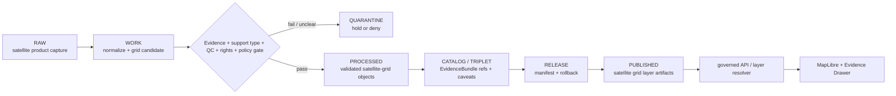

<!-- [KFM_META_BLOCK_V2]
doc_id: kfm://data/published/layers/soil/satellite-grid/readme
name: Soil Satellite Grid Published Layer README
path: data/published/layers/soil/satellite_grid/README.md
type: data-lane-readme
version: v0.1.0
status: draft
owners:
  - <soil-domain-steward>
  - <release-steward>
  - <map-layer-steward>
created: 2026-06-26
updated: 2026-06-26
policy_label: public-with-review
truth_posture: cite-or-abstain
lifecycle_phase: published
responsibility_root: data/
domain: soil
sublane: satellite_grid
artifact_family: released-public-safe-soil-satellite-grid-layer
support_type: satellite_soil_moisture
sensitivity_posture: public-safe-at-appropriate-scale; support-type-separation-required; product-qc-and-time-caveat-required; release-required
related:
  - ../README.md
  - ../../README.md
  - ../../../README.md
  - ../../../../docs/domains/soil/ARCHITECTURE.md
  - ../../../../docs/domains/soil/DATA_LIFECYCLE.md
  - ../../../../docs/domains/soil/CANONICAL_PATHS.md
  - ../../../../docs/domains/soil/API_CONTRACTS.md
  - ../../../../docs/doctrine/derived-stays-derived.md
  - ../../../proofs/soil/README.md
  - ../../../../release/manifests/README.md
tags:
  - kfm
  - data
  - published
  - layers
  - soil
  - satellite-grid
  - satellite-soil-moisture
  - smap
  - support-type
  - release
  - evidence-first
notes:
  - "This README documents the released public-safe satellite-grid layer lane for the Soil domain."
  - "Satellite grids are support-type-specific artifacts; they do not replace static soil survey truth, station observations, gridded derivatives, pedon evidence, or EvidenceBundle authority."
  - "Every published artifact here must preserve support_type, source role, time caveat, product/QC caveats, release state, field allowlist, digest, and rollback path."
[/KFM_META_BLOCK_V2] -->

<a id="top"></a>

# Soil — Satellite Grid Published Layers

Released public-safe satellite soil-grid artifacts for map and API delivery.

<p>
  
  
  
  
  
  
</p>

**Quick links:** [Scope](#scope) · [Repo fit](#repo-fit) · [Inputs](#inputs) · [Exclusions](#exclusions) · [Directory map](#directory-map) · [Publication boundary](#publication-boundary) · [Required checks](#required-checks-before-use) · [Status notes](#status-notes)

> [!IMPORTANT]
> A satellite soil-grid layer is a **support-type-specific derived observation surface**. It may carry SMAP-style or similar satellite soil-moisture products to the public map, but it must not masquerade as static soil survey truth, station soil moisture, gridded derivative soil, pedon evidence, or an interpretation layer without an explicit reviewed derivation step.

---

## Scope

This directory may hold released public-safe satellite soil-grid artifacts. These layers may support map display, API delivery, Evidence Drawer lookups, drought/moisture context, soil-water context, or other public-safe satellite-derived soil views after the normal KFM release gates have passed.

A satellite grid layer here is a downstream delivery artifact. It is not the source record, canonical soil truth, static survey authority, station observation truth, catalog truth, proof bundle, release decision, registry authority, or AI interpretation.

---

## Repo fit

| Field | Value |
|---|---|
| Path | `data/published/layers/soil/satellite_grid/` |
| Responsibility root | `data/` |
| Lifecycle phase | `published/` |
| Domain lane | `soil` |
| Parent published layer lane | `data/published/layers/soil/` |
| Support type | `satellite_soil_moisture` |
| Artifact role | Released public-safe satellite soil-grid layer bytes and sidecars |
| Release authority | `release/`, not this directory |
| Proof authority | `data/proofs/soil/` and `data/receipts/`, not this directory |
| Default failure posture | `DENY`, `HOLD`, `RESTRICT`, or `ABSTAIN` when evidence, source role, support type, QC, product caveat, rights, time caveat, sensitivity, release, or rollback support is insufficient |

---

## Inputs

Accepted content is limited to release-approved, public-safe derivatives such as:

- SMAP or similar satellite-derived soil-moisture grid artifacts after source-role, rights, support-type, QC, caveat, and release review;
- Cloud Optimized GeoTIFF, PMTiles, GeoParquet, GeoJSON, vector-tile, raster-tile, or API payload sidecars;
- public-safe satellite soil-moisture grids, anomaly grids, uncertainty grids, or time-sliced aggregates;
- layer manifests, tile metadata, QC summaries, and support-type/time-caveat summaries;
- field allowlists, digests, and generated release pointers;
- release-local notes that explain artifact contents without replacing proof or release authority.

---

## Exclusions

| Do not place here | Correct authority home |
|---|---|
| RAW source captures or source mirrors | `data/raw/soil/` or source-specific intake |
| WORK files, candidates, unresolved joins, or review drafts | `data/work/soil/` |
| Quarantined or unclear material | `data/quarantine/soil/` |
| Canonical processed soil objects | `data/processed/soil/` |
| Catalog records, triplets, or graph truth | `data/catalog/` and triplet/projection lanes |
| EvidenceBundle / ProofPack | `data/proofs/soil/` |
| Validation, transform, redaction, satellite-grid-build, or release receipts | `data/receipts/` |
| Release manifests or promotion decisions | `release/` |
| Static survey truth labeled as satellite grid | Correct support-specific soil lane, not this sublane |
| Station, gridded derivative, pedon, or interpretation payloads without reviewed derivation | Correct support-specific soil lane or quarantine |
| Farm-specific, owner-specific, proprietary, or operational sensor detail | Restricted governed lanes only; not public published layers |
| Direct model-generated claims | Governed answer/provenance paths only |

---

## Directory map

```text
data/published/layers/soil/satellite_grid/
├── README.md
├── <release_id>/
│   ├── soil_satellite_grid.cog.tif
│   ├── soil_satellite_grid.pmtiles
│   ├── soil_satellite_grid.geoparquet
│   ├── soil_satellite_grid.sha256
│   ├── layer.manifest.json
│   ├── fields.allowlist.json
│   ├── support_type.summary.json
│   ├── qc.summary.json
│   ├── time_caveat.summary.json
│   ├── review.summary.json
│   └── README.md
└── latest.json
```

`latest.json` must be generated from release state. Remove or withhold it when release, review, digest, registry, correction, support-type, QC, or rollback support is incomplete.

---

## Publication boundary



The forbidden shortcut is:

```text
RAW / WORK / QUARANTINE / processed candidate / direct source record / direct model output / unlabeled support type / unreviewed QC state
→ direct public satellite soil-grid layer
```

---

## Required checks before use

- [ ] Confirm the release manifest and promotion decision.
- [ ] Confirm proof and receipt closure.
- [ ] Confirm source descriptors, source roles, rights posture, and current terms.
- [ ] Confirm `support_type = satellite_soil_moisture` is present and preserved.
- [ ] Confirm support-type separation from static survey, gridded derivative, station, pedon, and interpretation surfaces.
- [ ] Confirm satellite product version, QC fields, uncertainty/caveat fields, and product-specific validity limits.
- [ ] Confirm observed time, source/product time, retrieval time, release time, and correction time where material.
- [ ] Confirm field allowlist and released-byte digest.
- [ ] Confirm layer registry entry.
- [ ] Confirm rollback target and correction path.
- [ ] Confirm public clients consume this layer through governed APIs or release-resolved artifacts.
- [ ] Confirm no farm-specific, owner-specific, proprietary, operational sensor, or restricted detail is present in released bytes.

---

## Status notes

| Claim | Status |
|---|---|
| This README defines the requested path boundary. | **CONFIRMED authored** |
| The target path exists in the live repository. | **CONFIRMED by GitHub contents API during this edit** |
| Soil doctrine includes satellite soil moisture as a support type. | **CONFIRMED by GitHub contents API during this edit** |
| Actual released artifacts exist in this subtree. | **UNKNOWN** |
| Validators for this exact layer are implemented and wired in CI. | **NEEDS VERIFICATION** |
| A release manifest currently approves a satellite soil-grid layer. | **UNKNOWN** |

---

## Related files

- [`../README.md`](../README.md)
- [`../../README.md`](../../README.md)
- [`../../../README.md`](../../../README.md)
- [`../../../../docs/domains/soil/ARCHITECTURE.md`](../../../../docs/domains/soil/ARCHITECTURE.md)
- [`../../../../docs/domains/soil/DATA_LIFECYCLE.md`](../../../../docs/domains/soil/DATA_LIFECYCLE.md)
- [`../../../../docs/domains/soil/CANONICAL_PATHS.md`](../../../../docs/domains/soil/CANONICAL_PATHS.md)
- [`../../../../docs/domains/soil/API_CONTRACTS.md`](../../../../docs/domains/soil/API_CONTRACTS.md)
- [`../../../../docs/doctrine/derived-stays-derived.md`](../../../../docs/doctrine/derived-stays-derived.md)
- [`../../../proofs/soil/README.md`](../../../proofs/soil/README.md)
- [`../../../../release/manifests/README.md`](../../../../release/manifests/README.md)

---

KFM rule: this directory is a released satellite soil-grid layer lane only. It is not source authority, proof authority, release authority, catalog authority, static survey truth, station observation truth, gridded-derivative truth, interpretation truth, registry authority, or AI truth.

[Back to top](#top)
