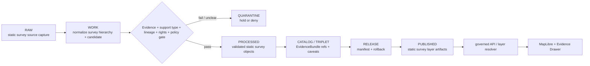

<!-- [KFM_META_BLOCK_V2]
doc_id: kfm://data/published/layers/soil/static-survey/readme
name: Soil Static Survey Published Layer README
path: data/published/layers/soil/static_survey/README.md
type: data-lane-readme
version: v0.1.0
status: draft
owners:
  - <soil-domain-steward>
  - <release-steward>
  - <map-layer-steward>
created: 2026-06-27
updated: 2026-06-27
policy_label: public-with-review
truth_posture: cite-or-abstain
lifecycle_phase: published
responsibility_root: data/
domain: soil
sublane: static_survey
artifact_family: released-public-safe-soil-static-survey-layer
support_type: authoritative_static_soil
sensitivity_posture: public-safe-at-appropriate-scale; support-type-separation-required; farm-owner-operational-detail-review-required; release-required
related:
  - ../README.md
  - ../gridded_derivative/README.md
  - ../satellite_grid/README.md
  - ../../README.md
  - ../../../README.md
  - ../../../../docs/domains/soil/ARCHITECTURE.md
  - ../../../../docs/domains/soil/DATA_LIFECYCLE.md
  - ../../../../docs/domains/soil/CANONICAL_PATHS.md
  - ../../../../docs/domains/soil/API_CONTRACTS.md
  - ../../../../contracts/domains/soil/domain_layer_descriptor.md
  - ../../../../contracts/domains/soil/hydrologic_soil_group.md
  - ../../../proofs/soil/README.md
  - ../../../../release/manifests/README.md
tags:
  - kfm
  - data
  - published
  - layers
  - soil
  - static-survey
  - ssurgo
  - sda
  - soil-map-unit
  - authoritative-static-soil
  - support-type
  - release
  - evidence-first
notes:
  - "This README documents the released public-safe static survey layer lane for the Soil domain."
  - "Static survey artifacts are support-type-specific products; they do not replace EvidenceBundle authority or masquerade as gridded derivative, station, satellite, pedon, or interpretation surfaces."
  - "Every published artifact here must preserve support_type, source role, survey lineage, time caveat, release state, field allowlist, digest, and rollback path."
[/KFM_META_BLOCK_V2] -->

<a id="top"></a>

# Soil — Static Survey Published Layers

Released public-safe static soil-survey layer artifacts for governed map and API delivery.

<p>
  
  
  
  
  
  
</p>

**Quick links:** [Scope](#scope) · [Repo fit](#repo-fit) · [Inputs](#inputs) · [Exclusions](#exclusions) · [Directory map](#directory-map) · [Publication boundary](#publication-boundary) · [Required checks](#required-checks-before-use) · [Status notes](#status-notes)

> [!IMPORTANT]
> A static soil-survey layer is a **support-type-specific survey artifact**. It may carry SSURGO, SDA, or equivalent static survey products to the public map, but it must not masquerade as gridded derivative soil, station soil moisture, satellite soil moisture, pedon evidence, or an interpretation layer without an explicit reviewed derivation step.

---

## Scope

This directory may hold released public-safe static soil-survey artifacts. These layers may support map display, governed API delivery, Evidence Drawer lookups, soil map-unit context, component/horizon context, hydrologic soil group display, and public-safe static survey views after the normal KFM release gates have passed.

A static survey layer here is a downstream delivery artifact. It is not the source record, EvidenceBundle, catalog truth, proof bundle, release decision, registry authority, field-level legal determination, gridded derivative truth, station observation truth, satellite observation truth, or AI interpretation.

---

## Repo fit

| Field | Value |
|---|---|
| Path | `data/published/layers/soil/static_survey/` |
| Responsibility root | `data/` |
| Lifecycle phase | `published/` |
| Domain lane | `soil` |
| Parent published layer lane | `data/published/layers/soil/` |
| Support type | `authoritative_static_soil` |
| Artifact role | Released public-safe static survey layer bytes and sidecars |
| Release authority | `release/`, not this directory |
| Proof authority | `data/proofs/soil/` and `data/receipts/`, not this directory |
| Default failure posture | `DENY`, `HOLD`, `RESTRICT`, or `ABSTAIN` when evidence, source role, support type, survey lineage, rights, time caveat, sensitivity, release, or rollback support is insufficient |

---

## Inputs

Accepted content is limited to release-approved, public-safe derivatives such as:

- SSURGO, SDA, or equivalent static soil-survey artifacts after source-role, rights, lineage, support-type, and release review;
- public-safe SoilMapUnit, SoilComponent, Horizon, SoilProperty, Hydrologic Soil Group, or component-horizon join layer artifacts;
- PMTiles, GeoParquet, GeoJSON, vector-tile, raster-tile, or API payload sidecars;
- layer manifests, tile metadata, survey lineage summaries, and support-type/time-caveat summaries;
- field allowlists, digests, and generated release pointers;
- release-local notes that explain artifact contents without replacing proof or release authority.

---

## Exclusions

| Do not place here | Correct authority home |
|---|---|
| RAW source captures or source mirrors | `data/raw/soil/` or source-specific intake |
| WORK files, candidates, unresolved joins, or review drafts | `data/work/soil/` |
| Quarantined or unclear material | `data/quarantine/soil/` |
| Canonical processed soil objects | `data/processed/soil/` |
| Catalog records, triplets, or graph truth | `data/catalog/` and triplet/projection lanes |
| EvidenceBundle / ProofPack | `data/proofs/soil/` |
| Validation, transform, redaction, survey-build, or release receipts | `data/receipts/` |
| Release manifests or promotion decisions | `release/` |
| Gridded derivative, station, satellite, pedon, or interpretation payloads without reviewed derivation | Correct support-specific soil lane or quarantine |
| Static survey bytes used as legal parcel, ownership, title, or field-level regulatory truth | Not allowed; route to the correct governed lane or abstain |
| Farm-specific, owner-specific, proprietary, or operational sensor detail | Restricted governed lanes only; not public published layers |
| Direct model-generated claims | Governed answer/provenance paths only |

---

## Directory map

```text
data/published/layers/soil/static_survey/
├── README.md
├── <release_id>/
│   ├── soil_static_survey.pmtiles
│   ├── soil_static_survey.geoparquet
│   ├── soil_static_survey.geojson
│   ├── soil_static_survey.sha256
│   ├── layer.manifest.json
│   ├── fields.allowlist.json
│   ├── survey_lineage.summary.json
│   ├── support_type.summary.json
│   ├── time_caveat.summary.json
│   ├── review.summary.json
│   └── README.md
└── latest.json
```

`latest.json` must be generated from release state. Remove or withhold it when release, review, digest, registry, correction, survey lineage, support type, or rollback support is incomplete.

---

## Publication boundary



The forbidden shortcut is:

```text
RAW / WORK / QUARANTINE / processed candidate / direct source record / direct model output / unlabeled support type / unresolved survey lineage
→ direct public static soil-survey layer
```

---

## Required checks before use

- [ ] Confirm the release manifest and promotion decision.
- [ ] Confirm proof and receipt closure.
- [ ] Confirm source descriptors, source roles, rights posture, and current terms.
- [ ] Confirm `support_type = authoritative_static_soil` is present and preserved.
- [ ] Confirm support-type separation from gridded derivative, station, satellite, pedon, and interpretation surfaces.
- [ ] Confirm survey lineage, MUKEY/COKEY/CHKEY or equivalent hierarchy, and component/horizon joins where material.
- [ ] Confirm source vintage, retrieval time, release time, correction time, and per-product time caveats.
- [ ] Confirm field allowlist and released-byte digest.
- [ ] Confirm layer registry entry.
- [ ] Confirm rollback target and correction path.
- [ ] Confirm public clients consume this layer through governed APIs or release-resolved artifacts.
- [ ] Confirm no farm-specific, owner-specific, proprietary, operational sensor, or restricted detail is present in released bytes.

---

## Status notes

| Claim | Status |
|---|---|
| This README defines the requested path boundary. | **CONFIRMED authored** |
| The target path exists in the live repository. | **CONFIRMED by GitHub contents API during this edit** |
| Soil doctrine includes static survey soil as a distinct support type and surface family. | **CONFIRMED by GitHub contents API during this edit** |
| Actual released artifacts exist in this subtree. | **UNKNOWN** |
| Validators for this exact layer are implemented and wired in CI. | **NEEDS VERIFICATION** |
| A release manifest currently approves a static survey soil layer. | **UNKNOWN** |

---

## Related files

- [`../README.md`](../README.md)
- [`../gridded_derivative/README.md`](../gridded_derivative/README.md)
- [`../satellite_grid/README.md`](../satellite_grid/README.md)
- [`../../README.md`](../../README.md)
- [`../../../README.md`](../../../README.md)
- [`../../../../docs/domains/soil/ARCHITECTURE.md`](../../../../docs/domains/soil/ARCHITECTURE.md)
- [`../../../../docs/domains/soil/DATA_LIFECYCLE.md`](../../../../docs/domains/soil/DATA_LIFECYCLE.md)
- [`../../../../docs/domains/soil/CANONICAL_PATHS.md`](../../../../docs/domains/soil/CANONICAL_PATHS.md)
- [`../../../../docs/domains/soil/API_CONTRACTS.md`](../../../../docs/domains/soil/API_CONTRACTS.md)
- [`../../../../contracts/domains/soil/domain_layer_descriptor.md`](../../../../contracts/domains/soil/domain_layer_descriptor.md)
- [`../../../../contracts/domains/soil/hydrologic_soil_group.md`](../../../../contracts/domains/soil/hydrologic_soil_group.md)
- [`../../../proofs/soil/README.md`](../../../proofs/soil/README.md)
- [`../../../../release/manifests/README.md`](../../../../release/manifests/README.md)

---

KFM rule: this directory is a released static soil-survey layer lane only. It is not source authority, proof authority, release authority, catalog authority, gridded-derivative truth, station observation truth, satellite observation truth, interpretation truth, registry authority, legal/title authority, or AI truth.

[Back to top](#top)
