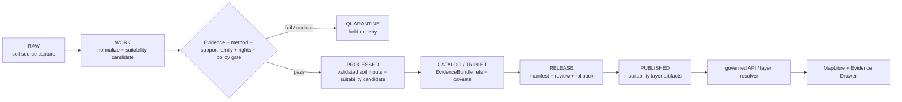

<!-- [KFM_META_BLOCK_V2]
doc_id: kfm://data/published/layers/soil/suitability/readme
name: Soil Suitability Published Layer README
path: data/published/layers/soil/suitability/README.md
type: data-lane-readme
version: v0.1.0
status: draft
owners:
  - <soil-domain-steward>
  - <release-steward>
  - <map-layer-steward>
  - <policy-steward>
created: 2026-06-27
updated: 2026-06-27
policy_label: public-with-review
truth_posture: cite-or-abstain
lifecycle_phase: published
responsibility_root: data/
domain: soil
sublane: suitability
artifact_family: released-public-safe-soil-suitability-layer
support_family: interpretation
support_type_status: NEEDS_VERIFICATION
sensitivity_posture: public-safe-at-appropriate-scale; interpretive-caveats-required; support-type-separation-required; not-legal-economic-operational-or-crop-prescription; release-required
related:
  - ../README.md
  - ../static_survey/README.md
  - ../gridded_derivative/README.md
  - ../satellite_grid/README.md
  - ../../README.md
  - ../../../README.md
  - ../../../../docs/domains/soil/ARCHITECTURE.md
  - ../../../../docs/domains/soil/DATA_LIFECYCLE.md
  - ../../../../docs/domains/soil/CANONICAL_PATHS.md
  - ../../../../docs/domains/soil/API_CONTRACTS.md
  - ../../../../contracts/domains/soil/suitability_rating.md
  - ../../../../contracts/domains/soil/domain_layer_descriptor.md
  - ../../../../contracts/domains/soil/soil_time_caveat.md
  - ../../../proofs/soil/README.md
  - ../../../../release/manifests/README.md
tags:
  - kfm
  - data
  - published
  - layers
  - soil
  - suitability
  - suitability-rating
  - interpretation
  - fitness-for-use
  - caveats
  - support-type
  - release
  - evidence-first
notes:
  - "This README documents the released public-safe Soil suitability layer lane."
  - "Suitability layers are interpretive products; they do not replace source records, EvidenceBundle authority, static survey truth, gridded derivative truth, station/satellite observations, pedon evidence, or release authority."
  - "The exact machine support_type code for suitability/interpretation surfaces is NEEDS VERIFICATION; this README preserves the interpretation family without minting schema authority."
  - "Every published artifact here must preserve method, intended use, inputs, support type/family, source role, time caveat, fitness-for-use limitations, release state, field allowlist, digest, and rollback path."
[/KFM_META_BLOCK_V2] -->

<a id="top"></a>

# Soil — Suitability Published Layers

Released public-safe soil-suitability layer artifacts for governed map and API delivery.

<p>
  
  
  
  
  
  
</p>

**Quick links:** [Scope](#scope) · [Repo fit](#repo-fit) · [Inputs](#inputs) · [Exclusions](#exclusions) · [Directory map](#directory-map) · [Publication boundary](#publication-boundary) · [Required checks](#required-checks-before-use) · [Status notes](#status-notes)

> [!CAUTION]
> A soil suitability layer is an **interpretive product**. It may show released, caveated fitness-for-use context, but it must not become legal advice, economic advice, crop-management prescription, engineering design, operational recommendation, land-use approval, hazard finding, policy decision, release approval, or AI authority.

---

## Scope

This directory may hold released public-safe Soil suitability layer artifacts. These layers may support map display, governed API delivery, Evidence Drawer lookups, caveated fitness-for-use context, public-safe planning exploration, and reviewable suitability summaries after the normal KFM release gates have passed.

A suitability layer here is a downstream delivery artifact. It is not the source record, EvidenceBundle, catalog truth, proof bundle, release decision, method authority, legal/economic/operational recommendation, static survey truth, gridded derivative truth, station observation truth, satellite observation truth, pedon evidence, or AI interpretation.

---

## Repo fit

| Field | Value |
|---|---|
| Path | `data/published/layers/soil/suitability/` |
| Responsibility root | `data/` |
| Lifecycle phase | `published/` |
| Domain lane | `soil` |
| Parent published layer lane | `data/published/layers/soil/` |
| Product family | `SuitabilityRating` / interpretive suitability layer |
| Support family | `interpretation` |
| Exact machine support-type code | **NEEDS VERIFICATION** |
| Artifact role | Released public-safe suitability layer bytes and sidecars |
| Release authority | `release/`, not this directory |
| Proof authority | `data/proofs/soil/` and `data/receipts/`, not this directory |
| Default failure posture | `DENY`, `HOLD`, `RESTRICT`, or `ABSTAIN` when evidence, source role, support type/family, method, intended use, time caveat, rights, sensitivity, release, or rollback support is insufficient |

---

## Inputs

Accepted content is limited to release-approved, public-safe derivatives such as:

- suitability layer artifacts derived from released soil evidence with method, intended use, inputs, support family, limitations, and release state preserved;
- public-safe suitability ratings, ranked/categorical surfaces, scenario summaries, caveated suitability tiles, or API payload sidecars;
- PMTiles, GeoParquet, GeoJSON, vector-tile, raster-tile, Cloud Optimized GeoTIFF, or released API payload artifacts;
- layer manifests, tile metadata, suitability-method summaries, input-evidence summaries, and support-type/time-caveat summaries;
- field allowlists, digests, and generated release pointers;
- release-local notes that explain artifact contents without replacing proof, policy, review, method, or release authority.

---

## Exclusions

| Do not place here | Correct authority home |
|---|---|
| RAW source captures or source mirrors | `data/raw/soil/` or source-specific intake |
| WORK files, candidates, unresolved joins, method drafts, or review drafts | `data/work/soil/` |
| Quarantined or unclear material | `data/quarantine/soil/` |
| Canonical processed soil objects | `data/processed/soil/` |
| Catalog records, triplets, or graph truth | `data/catalog/` and triplet/projection lanes |
| EvidenceBundle / ProofPack | `data/proofs/soil/` |
| Validation, transform, redaction, suitability-build, method, or release receipts | `data/receipts/` |
| Release manifests or promotion decisions | `release/` |
| Static survey, gridded derivative, station, satellite, or pedon payloads without reviewed suitability derivation | Correct support-specific soil lane or quarantine |
| Legal, economic, operational, engineering, crop-management, parcel, land-use, hazard, or regulatory recommendations | Owning authority / governed decision lane; not this public layer |
| Farm-specific, owner-specific, proprietary, or operational sensor detail | Restricted governed lanes only; not public published layers |
| Direct model-generated suitability claims | Governed answer/provenance paths only |

---

## Directory map

```text
data/published/layers/soil/suitability/
├── README.md
├── <release_id>/
│   ├── soil_suitability.pmtiles
│   ├── soil_suitability.cog.tif
│   ├── soil_suitability.geoparquet
│   ├── soil_suitability.sha256
│   ├── layer.manifest.json
│   ├── fields.allowlist.json
│   ├── suitability_method.summary.json
│   ├── input_evidence.summary.json
│   ├── support_family.summary.json
│   ├── time_caveat.summary.json
│   ├── review.summary.json
│   └── README.md
└── latest.json
```

`latest.json` must be generated from release state. Remove or withhold it when release, review, digest, registry, correction, method, support family, or rollback support is incomplete.

---

## Publication boundary



The forbidden shortcut is:

```text
RAW / WORK / QUARANTINE / processed candidate / direct source record / direct model output / unlabeled support family / uncaveated method
→ direct public soil-suitability layer
```

---

## Required checks before use

- [ ] Confirm the release manifest and promotion decision.
- [ ] Confirm proof and receipt closure.
- [ ] Confirm source descriptors, source roles, rights posture, and current terms.
- [ ] Confirm the suitability method, intended use, fitness-for-use profile, inputs, limitations, and caveats.
- [ ] Confirm the support family is preserved and the exact machine support-type code is resolved or explicitly documented as **NEEDS VERIFICATION**.
- [ ] Confirm support-type separation from static survey, gridded derivative, station, satellite, pedon, and other interpretation surfaces.
- [ ] Confirm source vintage, observed time where relevant, retrieval time, release time, correction time, and per-product time caveats.
- [ ] Confirm field allowlist and released-byte digest.
- [ ] Confirm layer registry entry.
- [ ] Confirm rollback target and correction path.
- [ ] Confirm public clients consume this layer through governed APIs or release-resolved artifacts.
- [ ] Confirm the artifact does not present legal, economic, operational, engineering, crop, hazard, parcel, land-use, or regulatory decisions as KFM authority.

---

## Status notes

| Claim | Status |
|---|---|
| This README defines the requested path boundary. | **CONFIRMED authored** |
| The target path exists in the live repository. | **CONFIRMED by GitHub contents API during this edit** |
| Soil doctrine includes SuitabilityRating as an interpretive product with caveats. | **CONFIRMED by GitHub contents API during this edit** |
| The exact machine support-type code for suitability layers is implemented. | **NEEDS VERIFICATION** |
| Actual released artifacts exist in this subtree. | **UNKNOWN** |
| Validators for this exact layer are implemented and wired in CI. | **NEEDS VERIFICATION** |
| A release manifest currently approves a soil-suitability layer. | **UNKNOWN** |

---

## Related files

- [`../README.md`](../README.md)
- [`../static_survey/README.md`](../static_survey/README.md)
- [`../gridded_derivative/README.md`](../gridded_derivative/README.md)
- [`../satellite_grid/README.md`](../satellite_grid/README.md)
- [`../../README.md`](../../README.md)
- [`../../../README.md`](../../../README.md)
- [`../../../../docs/domains/soil/ARCHITECTURE.md`](../../../../docs/domains/soil/ARCHITECTURE.md)
- [`../../../../docs/domains/soil/DATA_LIFECYCLE.md`](../../../../docs/domains/soil/DATA_LIFECYCLE.md)
- [`../../../../docs/domains/soil/CANONICAL_PATHS.md`](../../../../docs/domains/soil/CANONICAL_PATHS.md)
- [`../../../../docs/domains/soil/API_CONTRACTS.md`](../../../../docs/domains/soil/API_CONTRACTS.md)
- [`../../../../contracts/domains/soil/suitability_rating.md`](../../../../contracts/domains/soil/suitability_rating.md)
- [`../../../../contracts/domains/soil/domain_layer_descriptor.md`](../../../../contracts/domains/soil/domain_layer_descriptor.md)
- [`../../../../contracts/domains/soil/soil_time_caveat.md`](../../../../contracts/domains/soil/soil_time_caveat.md)
- [`../../../proofs/soil/README.md`](../../../proofs/soil/README.md)
- [`../../../../release/manifests/README.md`](../../../../release/manifests/README.md)

---

KFM rule: this directory is a released soil-suitability layer lane only. It is not source authority, proof authority, release authority, catalog authority, method authority, static survey truth, gridded-derivative truth, station observation truth, satellite observation truth, pedon evidence truth, legal/economic/operational/regulatory authority, or AI truth.

[Back to top](#top)
