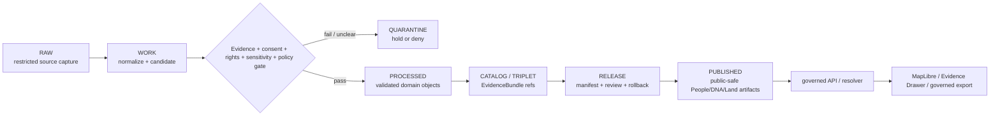

<!-- [KFM_META_BLOCK_V2]
doc_id: kfm://data/published/people-dna-land/readme
name: People DNA Land Published README
path: data/published/people-dna-land/README.md
type: data-lane-readme
version: v0.1.0
status: draft
owners:
  - <people-dna-land-domain-steward>
  - <privacy-steward>
  - <consent-steward>
  - <release-steward>
  - <policy-steward>
created: 2026-06-27
updated: 2026-06-27
policy_label: restricted-review
truth_posture: cite-or-abstain
lifecycle_phase: published
responsibility_root: data/
domain: people-dna-land
artifact_family: released-public-safe-people-dna-land-artifacts
sensitivity_posture: T4-deny-by-default; living-person-fields-fail-closed; raw-DNA-non-public; private-person-parcel-joins-denied-by-default; title-and-parcel-boundary-controls-preserved; release-required
related:
  - ../README.md
  - ../layers/people-dna-land/README.md
  - ../layers/people-dna-land/land-ownership/README.md
  - ../../README.md
  - ../../proofs/README.md
  - ../../receipts/README.md
  - ../../../docs/domains/people-dna-land/SCOPE_AND_BOUNDARY.md
  - ../../../docs/domains/people-dna-land/SENSITIVITY.md
  - ../../../docs/doctrine/directory-rules.md
  - ../../../docs/architecture/sensitive-domain-fail-closed.md
  - ../../../release/manifests/README.md
tags:
  - kfm
  - data
  - published
  - people-dna-land
  - people
  - genealogy
  - dna
  - land-ownership
  - consent
  - privacy
  - restricted-review
  - release
  - evidence-first
notes:
  - "This README replaces a greenfield stub and documents the non-layer published lane for People/DNA/Land release artifacts."
  - "People/DNA/Land is a high-sensitivity domain: living-person, DNA/genomic, title, parcel, private person-parcel join, consent, sovereignty, and cultural-adjacency controls fail closed unless policy and release evidence allow a public-safe derivative."
  - "Map-layer artifacts belong under data/published/layers/people-dna-land/; this lane is for broader released public-safe People/DNA/Land artifacts and indexes."
  - "This directory is not source authority, proof authority, receipt authority, release authority, title authority, identity authority, consent authority, or AI truth."
[/KFM_META_BLOCK_V2] -->

<a id="top"></a>

# People/DNA/Land Published Artifacts

Released public-safe People/DNA/Land artifacts for governed KFM delivery and inspection surfaces.

<p>
  
  
  
  
  
  
</p>

**Quick links:** [Scope](#scope) · [Repo fit](#repo-fit) · [Published families](#published-families) · [Inputs](#inputs) · [Exclusions](#exclusions) · [Directory map](#directory-map) · [Publication boundary](#publication-boundary) · [Required checks](#required-checks-before-use) · [Status notes](#status-notes)

> [!CAUTION]
> **High-sensitivity lane.** People/DNA/Land governs living-person evidence, genealogy, restricted DNA/genomic evidence, land instruments, ownership intervals, consent, review, correction, and rollback. Public publication is deny-by-default unless evidence, rights, source role, consent where required, sensitivity review, policy decision, release manifest, correction path, and rollback support allow a public-safe derivative.

---

## Scope

This directory may hold released public-safe People/DNA/Land artifacts that are not specifically map-layer bytes. Examples include release-local public summaries, aggregate-only exports, public-safe indexes, generalized context packages, caveat summaries, allowed-field descriptors, and release pointers after the normal KFM gates close.

Artifacts here are downstream publication surfaces. They do not create person truth, genealogy truth, DNA truth, title truth, parcel-boundary truth, consent truth, legal authority, source authority, proof authority, catalog authority, release authority, or AI truth.

Map-layer artifacts for this domain belong under [`../layers/people-dna-land/`](../layers/people-dna-land/README.md), not directly in this directory.

---

## Repo fit

| Field | Value |
|---|---|
| Path | `data/published/people-dna-land/` |
| Responsibility root | `data/` |
| Lifecycle phase | `published/` |
| Domain lane | `people-dna-land` |
| Artifact role | Released public-safe non-layer People/DNA/Land artifacts, sidecars, and indexes |
| Layer counterpart | `data/published/layers/people-dna-land/` |
| Release authority | `release/`, not this directory |
| Proof authority | `data/proofs/` and `data/receipts/`, not this directory |
| Registry authority | `data/registry/`, not this directory |
| Default failure posture | `DENY`, `RESTRICT`, `HOLD`, or `ABSTAIN` when evidence, consent, source role, rights, sensitivity, review, release, correction, or rollback support is insufficient |

---

## Published families

Only released, public-safe, derivative artifacts may appear here. The families below describe possible contents; they do not prove payloads currently exist.

| Family | Public boundary |
|---|---|
| Aggregate population or genealogy summaries | Aggregate-only; no living-person, raw-DNA, kit, segment, or private person-parcel leakage |
| Public historical-person context | Review-bound, source-role-preserving, and evidence-cited; no living-person exposure |
| Land-ownership context summaries | Context only; not title truth, not legal boundary, not ownership certification |
| Consent-safe release views | Only where consent, review, policy, and release state explicitly support publication |
| Redaction/generalization summaries | May describe public transformation classes without exposing restricted inputs |
| Release-local indexes | Navigation only; must not replace release manifests, proofs, catalogs, or registries |

---

## Inputs

Accepted content is limited to release-approved, public-safe derivatives such as:

- aggregate-only summaries with no re-identification path;
- public-safe historical-person or genealogy context packages after review;
- public-safe land-ownership context packages that clearly deny title/boundary authority;
- consent-safe release views with review, policy, release, correction, and rollback support;
- sidecars such as `fields.allowlist.json`, `redaction.summary.json`, `review.summary.json`, `caveats.summary.json`, digest files, and release-local README files;
- generated `latest.json` or index pointers only when derived from release state.

---

## Exclusions

| Do not place here | Correct authority home |
|---|---|
| RAW source captures, genealogy uploads, DNA files, kit IDs, segments, or source mirrors | `data/raw/people-dna-land/` or restricted source intake |
| WORK files, candidates, unresolved identities, joins, consent drafts, or review drafts | `data/work/people-dna-land/` |
| Quarantined, rights-unclear, consent-unclear, sensitivity-unclear, or policy-held material | `data/quarantine/people-dna-land/` |
| Canonical processed People/DNA/Land objects | `data/processed/people-dna-land/` |
| Catalog records, EvidenceBundles, triplets, or graph truth | `data/catalog/`, triplet lanes, or proof lanes |
| EvidenceBundle / ProofPack | `data/proofs/` |
| Validation, redaction, consent, review, release, correction, or rollback receipts | `data/receipts/` |
| Source descriptors, source activation decisions, or source registry truth | `data/registry/sources/people-dna-land/` or the ADR-confirmed source registry lane |
| Release manifests, promotion decisions, rollback cards, or correction authority | `release/` |
| Public map-layer bytes | `data/published/layers/people-dna-land/` |
| Living-person fields, raw DNA/genomic payloads, kit identifiers, raw segments, or private person-parcel joins | Restricted governed lanes only; public lane must deny by default |
| Assessor/tax records presented as title truth, or parcel geometry presented as legal boundary truth | Not allowed; route to governed review or abstain |
| Direct model-generated identity, kinship, ownership, title, or DNA claims | Governed answer/provenance paths only |

---

## Directory map

```text
data/published/people-dna-land/
├── README.md
├── <release_id>/
│   ├── public_index.json
│   ├── public_summary.json
│   ├── fields.allowlist.json
│   ├── redaction.summary.json
│   ├── consent.summary.json
│   ├── review.summary.json
│   ├── caveats.summary.json
│   ├── artifact.sha256
│   └── README.md
└── latest.json
```

`latest.json` must be generated from release state. Remove or withhold it when release, review, consent, digest, registry, correction, or rollback support is incomplete.

---

## Publication boundary



The forbidden shortcut is:

```text
RAW / WORK / QUARANTINE / processed candidate / direct source record / direct model output / unresolved consent / living-person field / raw DNA payload / private person-parcel join
→ direct public People/DNA/Land artifact
```

---

## Required checks before use

- [ ] Confirm the artifact belongs in non-layer `data/published/people-dna-land/`, not `data/published/layers/people-dna-land/`.
- [ ] Confirm source descriptors, source roles, rights posture, and current terms.
- [ ] Confirm consent, revocation, living-person, DNA/genomic, person-parcel, title, parcel-boundary, sovereignty, cultural-adjacency, and sensitivity review outcomes where applicable.
- [ ] Confirm proof and receipt closure.
- [ ] Confirm catalog/EvidenceBundle closure for every claim carried by the artifact.
- [ ] Confirm release manifest, promotion decision, rollback target, and correction path.
- [ ] Confirm field allowlist, redaction/generalization summary, review summary, and released-byte digest.
- [ ] Confirm `latest.json`, if present, is generated from release state.
- [ ] Confirm public clients consume artifacts through governed APIs or release-resolved artifacts.
- [ ] Confirm aggregates cannot be reverse-engineered into living-person, raw-DNA, kit, segment, private person-parcel, or restricted title/boundary claims.
- [ ] Confirm no artifact is treated as source, proof, release, catalog, registry, title, identity, consent, legal, or AI authority.

---

## Status notes

| Claim | Status |
|---|---|
| This README replaces the greenfield stub at `data/published/people-dna-land/README.md`. | **CONFIRMED authored** |
| The target path existed in the live repository as a stub before this edit. | **CONFIRMED by GitHub contents API during this edit** |
| `data/published/layers/people-dna-land/README.md` exists as the map-layer counterpart. | **CONFIRMED by GitHub contents API during this edit** |
| People/DNA/Land doctrine marks this as a T4 / deny-by-default sensitive context. | **CONFIRMED by GitHub contents API during this edit** |
| Actual released non-layer People/DNA/Land artifacts exist in this subtree. | **UNKNOWN** |
| Release manifests approve artifacts in this subtree. | **UNKNOWN** |
| Validators and CI checks enforce this lane. | **NEEDS VERIFICATION** |
| This README is release, title, identity, consent, or legal authority. | **DENY** |

---

## Related files

- [`../README.md`](../README.md)
- [`../layers/people-dna-land/README.md`](../layers/people-dna-land/README.md)
- [`../layers/people-dna-land/land-ownership/README.md`](../layers/people-dna-land/land-ownership/README.md)
- [`../../README.md`](../../README.md)
- [`../../proofs/README.md`](../../proofs/README.md)
- [`../../receipts/README.md`](../../receipts/README.md)
- [`../../../docs/domains/people-dna-land/SCOPE_AND_BOUNDARY.md`](../../../docs/domains/people-dna-land/SCOPE_AND_BOUNDARY.md)
- [`../../../docs/domains/people-dna-land/SENSITIVITY.md`](../../../docs/domains/people-dna-land/SENSITIVITY.md)
- [`../../../docs/doctrine/directory-rules.md`](../../../docs/doctrine/directory-rules.md)
- [`../../../docs/architecture/sensitive-domain-fail-closed.md`](../../../docs/architecture/sensitive-domain-fail-closed.md)
- [`../../../release/manifests/README.md`](../../../release/manifests/README.md)

---

KFM rule: this directory is a released public-safe People/DNA/Land artifact lane only. It is not source authority, proof authority, receipt authority, release authority, catalog authority, registry authority, title authority, parcel-boundary authority, identity authority, consent authority, legal authority, or AI truth.

[Back to top](#top)
