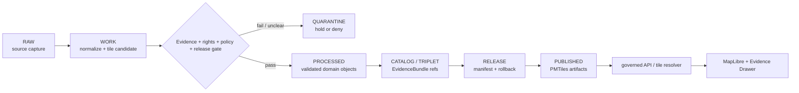

<!-- [KFM_META_BLOCK_V2]
doc_id: kfm://data/published/pmtiles/readme
name: Published PMTiles README
path: data/published/pmtiles/README.md
type: data-lane-index-readme
version: v0.1.0
status: draft
owners:
  - <data-publication-steward>
  - <map-layer-steward>
  - <release-steward>
created: 2026-06-27
updated: 2026-06-27
policy_label: public-with-review
truth_posture: cite-or-abstain
lifecycle_phase: published
responsibility_root: data/
artifact_family: released-public-safe-pmtiles
format: PMTiles
sensitivity_posture: public-safe-derivatives-only; release-required; format-is-not-authority
tags:
  - kfm
  - data
  - published
  - pmtiles
  - maplibre
  - tile-delivery
  - public-safe
  - release
  - evidence-first
related:
  - ../README.md
  - ../layers/README.md
  - atmosphere/README.md
  - fauna/README.md
  - flora/README.md
  - geology/README.md
  - soil/README.md
  - ../../README.md
  - ../../../release/manifests/README.md
  - ../../../contracts/data/layer_manifest.md
  - ../../../docs/doctrine/derived-stays-derived.md
  - ../../../docs/doctrine/map-first.md
notes:
  - "This README replaces the greenfield stub and documents the parent PMTiles format lane under data/published/."
  - "PMTiles are downstream delivery carriers; they do not replace source records, processed domain objects, catalog records, EvidenceBundles, proofs, receipts, policy decisions, release manifests, layer manifests, or AI receipts."
  - "Child lane README presence does not prove PMTiles payload presence, release-manifest approval, validator wiring, CI enforcement, or hosting readiness."
[/KFM_META_BLOCK_V2] -->

<a id="top"></a>

# Published PMTiles

Released public-safe PMTiles delivery artifacts for governed KFM map surfaces.

<p>
  
  
  
  
  
  
</p>

**Quick links:** [Scope](#scope) · [Repo fit](#repo-fit) · [Confirmed child lanes](#confirmed-child-lanes) · [Inputs](#inputs) · [Exclusions](#exclusions) · [Directory map](#directory-map) · [Publication boundary](#publication-boundary) · [Required checks](#required-checks-before-use) · [Status notes](#status-notes)

> [!IMPORTANT]
> `data/published/pmtiles/` is a **format-specific delivery lane**. A PMTiles file may be used by MapLibre or governed APIs only after release gates close. PMTiles are not source authority, processed-domain truth, catalog truth, proof authority, receipt authority, policy authority, release authority, layer-manifest authority, or AI truth.

---

## Scope

This directory indexes released public-safe PMTiles lanes under `data/published/pmtiles/`. Child lanes may contain PMTiles bytes and immediate sidecars after evidence, rights, policy, sensitivity, review, release, digest, correction, and rollback requirements are met.

The value of this lane is delivery. PMTiles help KFM clients fetch tiled map artifacts efficiently, but claim truth remains in source records, processed domain objects, catalog and EvidenceBundle records, proofs, receipts, policy decisions, review records, layer manifests, and release manifests.

---

## Repo fit

| Field | Value |
|---|---|
| Path | `data/published/pmtiles/` |
| Responsibility root | `data/` |
| Lifecycle phase | `published/` |
| Format lane | `pmtiles` |
| Artifact role | Released public-safe PMTiles bytes, sidecars, and child-lane indexes |
| Layer counterpart | `data/published/layers/` |
| Upstream lifecycle | `RAW -> WORK / QUARANTINE -> PROCESSED -> CATALOG / TRIPLET -> RELEASE -> PUBLISHED` |
| Release authority | `release/`, not this directory |
| Proof authority | `data/proofs/` and `data/receipts/`, not this directory |
| Catalog authority | `data/catalog/`, not this directory |
| Default failure posture | `DENY`, `HOLD`, `RESTRICT`, or `ABSTAIN` when evidence, rights, policy, sensitivity, review, release, digest, or rollback support is insufficient |

---

## Confirmed child lanes

The child lanes below are README paths verified by current-session GitHub fetches or edits. This table does **not** prove PMTiles payload bytes exist.

| Child lane | Domain role | Boundary |
|---|---|---|
| [`atmosphere/`](atmosphere/README.md) | Atmosphere tile delivery | Preserve knowledge-character labels and domain caveats. |
| [`fauna/`](fauna/README.md) | Fauna tile delivery | Public-safe release bytes only; restricted-review posture applies. |
| [`flora/`](flora/README.md) | Flora tile delivery | Public-safe release bytes only; domain review posture applies. |
| [`geology/`](geology/README.md) | Geology tile delivery | Preserve source role, scale, lineage, edition, and caveats. |
| [`soil/`](soil/README.md) | Soil tile delivery | Preserve support-type separation and time/product caveats. |

> [!NOTE]
> Add future domain child lanes only after confirming the owning domain lane, release path, layer-manifest shape, registry needs, sidecar requirements, and Directory Rules fit.

---

## Inputs

Accepted content is limited to release-approved PMTiles delivery artifacts and immediate sidecars such as:

- child-lane README files;
- `.pmtiles` files generated from release-approved layer material;
- `.pmtiles.sha256` or equivalent digest files;
- `layer.manifest.json`, `tilejson.json`, `fields.allowlist.json`, and release-local README files;
- domain-specific caveat, review, lineage, support-type, or product summaries;
- `latest.json` pointers only when generated from release state.

---

## Exclusions

| Do not place here | Correct authority home |
|---|---|
| RAW source captures or source mirrors | `data/raw/<domain>/` or source-specific intake |
| WORK files, tile-build scratch, candidates, or failed validations | `data/work/<domain>/` |
| Quarantined, rights-unclear, or policy-held material | `data/quarantine/<domain>/` |
| Canonical processed domain objects | `data/processed/<domain>/` |
| Catalog records, triplets, graph truth, or EvidenceBundle state | `data/catalog/`, triplet lanes, or proof lanes |
| EvidenceBundle / ProofPack / validation proof | `data/proofs/` |
| Build, validation, transform, AI, or release receipts | `data/receipts/` |
| Source descriptors, source activation records, or source registry truth | `data/registry/sources/` |
| Release manifests, promotion decisions, correction notices, rollback cards, or signatures | `release/` |
| Semantic contracts, schemas, layer registries, or policy rules | `contracts/`, `schemas/`, `data/registry/`, `policy/` |
| Non-PMTiles delivery formats | `data/published/layers/`, domain-specific published lanes, or API-payload lanes |
| Direct model-generated claims or uncited summaries | Governed answer/provenance paths only |

---

## Directory map

```text
data/published/pmtiles/
├── README.md
├── atmosphere/
│   └── README.md
├── fauna/
│   └── README.md
├── flora/
│   └── README.md
├── geology/
│   └── README.md
└── soil/
    └── README.md
```

> [!NOTE]
> This map lists README lanes confirmed in this session. It does not assert that release folders, PMTiles payloads, static hosting objects, registries, or manifests currently exist.

---

## Publication boundary



The forbidden shortcut is:

```text
RAW / WORK / QUARANTINE / processed candidate / direct source record / direct model output / unreleased tile
→ direct public PMTiles
```

---

## Required checks before use

- [ ] Confirm the PMTiles artifact belongs in the correct domain child lane.
- [ ] Confirm the release manifest and promotion decision.
- [ ] Confirm proof, receipt, and catalog/EvidenceBundle closure.
- [ ] Confirm source descriptors, source roles, rights posture, and current terms.
- [ ] Confirm domain-specific policy, sensitivity, support-type, lineage, time, and caveat requirements.
- [ ] Confirm field allowlist, layer manifest, TileJSON sidecar, and released-byte digest.
- [ ] Confirm rollback target and correction path.
- [ ] Confirm `latest.json`, if present, is generated from release state.
- [ ] Confirm public clients consume tiles through governed APIs, release-resolved URLs, or approved static hosting paths.
- [ ] Confirm no PMTiles artifact is treated as source, proof, release, catalog, registry, policy, legal/title/regulatory, emergency, domain-truth, or AI authority.

---

## Status notes

| Claim | Status |
|---|---|
| This README replaces the greenfield stub at `data/published/pmtiles/README.md`. | **CONFIRMED authored** |
| The target path existed in the live repository as a greenfield stub before this edit. | **CONFIRMED by GitHub contents API during this edit** |
| `atmosphere/README.md`, `fauna/README.md`, `flora/README.md`, `geology/README.md`, and `soil/README.md` exist as PMTiles child-lane READMEs. | **CONFIRMED by current-session GitHub fetches / edits** |
| Actual PMTiles payloads exist under every indexed child lane. | **UNKNOWN** |
| Release manifests approve PMTiles artifacts under every indexed child lane. | **UNKNOWN** |
| Validators and CI checks enforce every indexed PMTiles lane. | **NEEDS VERIFICATION** |
| This README is release, proof, catalog, policy, registry, domain-truth, or AI authority. | **DENY** |

---

## Related files

- [`../README.md`](../README.md)
- [`../layers/README.md`](../layers/README.md)
- [`atmosphere/README.md`](atmosphere/README.md)
- [`fauna/README.md`](fauna/README.md)
- [`flora/README.md`](flora/README.md)
- [`geology/README.md`](geology/README.md)
- [`soil/README.md`](soil/README.md)
- [`../../README.md`](../../README.md)
- [`../../../release/manifests/README.md`](../../../release/manifests/README.md)
- [`../../../contracts/data/layer_manifest.md`](../../../contracts/data/layer_manifest.md)
- [`../../../docs/doctrine/derived-stays-derived.md`](../../../docs/doctrine/derived-stays-derived.md)
- [`../../../docs/doctrine/map-first.md`](../../../docs/doctrine/map-first.md)

---

KFM rule: this directory is a released public-safe PMTiles delivery index only. It is not source authority, proof authority, receipt authority, release authority, catalog authority, registry authority, policy authority, domain truth, legal/title/regulatory authority, emergency authority, or AI truth.

[Back to top](#top)
