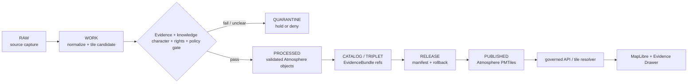

<!-- [KFM_META_BLOCK_V2]
doc_id: kfm://data/published/pmtiles/atmosphere/readme
name: Atmosphere PMTiles Published README
path: data/published/pmtiles/atmosphere/README.md
type: data-lane-readme
version: v0.1.0
status: draft
owners:
  - <atmosphere-domain-steward>
  - <map-layer-steward>
  - <publication-steward>
  - <release-steward>
created: 2026-06-27
updated: 2026-06-27
policy_label: public-review
truth_posture: cite-or-abstain
lifecycle_phase: published
responsibility_root: data/
domain: atmosphere
artifact_family: released-public-safe-atmosphere-pmtiles
format: PMTiles
sensitivity_posture: public-safe-derivatives-only; release-required; knowledge-character-preservation-required
related:
  - ../../README.md
  - ../README.md
  - ../../atmosphere/README.md
  - ../../layers/atmosphere/aqi/README.md
  - ../../layers/atmosphere/air_stations/README.md
  - ../../layers/atmosphere/weather_stations/README.md
  - ../../api_payloads/atmosphere/README.md
  - ../../../README.md
  - ../../../../docs/domains/atmosphere/ARCHITECTURE.md
  - ../../../../docs/domains/atmosphere/DATA_LIFECYCLE.md
  - ../../../../docs/domains/atmosphere/API_CONTRACTS.md
  - ../../../../docs/domains/atmosphere/MAP_UI_CONTRACTS.md
  - ../../../../contracts/data/layer_manifest.md
  - ../../../../contracts/data/layer_descriptor.md
  - ../../../../contracts/data/layer_catalog_item.md
  - ../../../../release/manifests/README.md
tags:
  - kfm
  - data
  - published
  - pmtiles
  - atmosphere
  - air-quality
  - weather
  - climate-context
  - smoke-context
  - aqi
  - aod
  - maplibre
  - release
  - evidence-first
notes:
  - "This README documents the PMTiles-format published lane for Atmosphere delivery artifacts."
  - "PMTiles are downstream delivery carriers; they do not replace source records, processed data, catalog records, EvidenceBundles, release manifests, receipts, policy decisions, layer manifests, or AI receipts."
  - "Atmosphere PMTiles must preserve knowledge-character labels and must not collapse AQI into concentration, AOD into PM2.5, or model fields into observations."
  - "Actual PMTiles payload presence, validator wiring, release-manifest approval, and CI enforcement remain UNKNOWN unless verified per release."
[/KFM_META_BLOCK_V2] -->

<a id="top"></a>

# Atmosphere PMTiles Published Artifacts

Released public-safe Atmosphere PMTiles artifacts for governed map delivery.

<p>
  
  
  
  
  
  
</p>

**Quick links:** [Scope](#scope) · [Repo fit](#repo-fit) · [Inputs](#inputs) · [Exclusions](#exclusions) · [Directory map](#directory-map) · [Publication boundary](#publication-boundary) · [Required checks](#required-checks-before-use) · [Status notes](#status-notes)

> [!IMPORTANT]
> PMTiles are a **delivery format**, not atmospheric truth. A file here may deliver released Atmosphere tiles to MapLibre or governed APIs, but it is not source authority, catalog truth, proof authority, release authority, policy authority, or AI truth.

---

## Scope

This directory may hold released public-safe Atmosphere PMTiles artifacts. These artifacts may package tiles for air-quality context, AQI context, air-station context, weather-station context, smoke context, AOD context, wind/precipitation/temperature context, climate-normal context, climate-anomaly context, or forecast context after KFM release gates have passed.

Atmosphere PMTiles are downstream carriers. They help public clients view released tiles through governed delivery surfaces, while claim truth remains in source records, processed objects, catalog/EvidenceBundle records, proof and receipt objects, policy decisions, review records, and release manifests.

---

## Repo fit

| Field | Value |
|---|---|
| Path | `data/published/pmtiles/atmosphere/` |
| Responsibility root | `data/` |
| Lifecycle phase | `published/` |
| Domain lane | `atmosphere` |
| Format lane | `pmtiles` |
| Artifact role | Released public-safe PMTiles bytes and tile sidecars |
| Layer semantics | Governed by Atmosphere layer/layer-manifest contracts, not by this directory alone |
| Domain published counterpart | `data/published/atmosphere/` |
| Layer counterpart | `data/published/layers/atmosphere/` |
| API payload counterpart | `data/published/api_payloads/atmosphere/` |
| Release authority | `release/`, not this directory |
| Proof authority | `data/proofs/` and `data/receipts/`, not this directory |
| Default failure posture | `DENY`, `HOLD`, `RESTRICT`, or `ABSTAIN` when evidence, source role, knowledge character, rights, freshness, sensitivity, release, digest, or rollback support is insufficient |

---

## Inputs

Accepted content is limited to release-approved, public-safe PMTiles artifacts and immediate sidecars such as:

- `.pmtiles` files generated from release-approved Atmosphere layer material;
- PMTiles metadata, TileJSON-compatible sidecars, field allowlists, and layer manifests;
- public-safe style references that do not hide restricted detail through styling alone;
- digest files such as `.sha256` that bind tile bytes to release state;
- caveat summaries for AQI, AOD, model fields, low-cost sensors, forecasts, and freshness/stale state;
- release-local README files that explain tile contents without replacing proof, policy, catalog, layer-manifest, or release authority;
- `latest.json` pointers only when generated from release state.

---

## Exclusions

| Do not place here | Correct authority home |
|---|---|
| RAW sensor exports, source-system dumps, model files, rasters, API responses, or source mirrors | `data/raw/atmosphere/` or source-specific intake |
| WORK files, generated candidates, tile-build scratch, or failed validations | `data/work/atmosphere/` |
| Quarantined, rights-unclear, sensitivity-unclear, or policy-held material | `data/quarantine/atmosphere/` |
| Canonical processed Atmosphere objects | `data/processed/atmosphere/` |
| Catalog records, triplets, graph truth, or EvidenceBundle state | `data/catalog/`, triplet lanes, or proof lanes |
| EvidenceBundle / ProofPack / validation proof | `data/proofs/` |
| Build, validation, transform, tile, representation, AI, or release receipts | `data/receipts/` |
| Release manifests, promotion decisions, correction notices, rollback cards, or signatures | `release/` |
| Semantic contracts, schemas, or policy rules | `contracts/`, `schemas/`, `policy/` |
| Non-PMTiles layer formats such as GeoParquet, GeoJSON, COG, or API payload snapshots | Appropriate published layer, domain, or API-payload lane |
| Direct model-generated claims or uncited summaries | Governed answer/provenance paths only |

---

## Directory map

```text
data/published/pmtiles/atmosphere/
├── README.md
├── <release_id>/
│   ├── atmosphere.<layer_slug>.pmtiles
│   ├── atmosphere.<layer_slug>.pmtiles.sha256
│   ├── layer.manifest.json
│   ├── tilejson.json
│   ├── fields.allowlist.json
│   ├── knowledge_character.summary.json
│   ├── caveats.summary.json
│   ├── review.summary.json
│   └── README.md
└── latest.json
```

`latest.json` must be generated from release state. Remove or withhold it when release, review, digest, registry, correction, caveat, or rollback support is incomplete.

---

## Publication boundary



The forbidden shortcut is:

```text
RAW / WORK / QUARANTINE / processed candidate / direct source record / direct model output / unreleased tile / uncaveated AQI-AOD-model product
→ direct public Atmosphere PMTiles
```

---

## Required checks before use

- [ ] Confirm the PMTiles artifact belongs in the Atmosphere domain and this format lane.
- [ ] Confirm the release manifest and promotion decision.
- [ ] Confirm proof, receipt, and catalog/EvidenceBundle closure.
- [ ] Confirm source descriptors, source roles, rights posture, and current terms.
- [ ] Confirm knowledge-character labels are preserved: AQI is not concentration, AOD is not PM2.5, model fields are not observations, and low-cost sensors carry correction/caveat context.
- [ ] Confirm time scope, freshness/stale state, source vintage, retrieval time, release time, and correction time where material.
- [ ] Confirm field allowlist, layer manifest, TileJSON sidecar, and released-byte digest.
- [ ] Confirm rollback target and correction path.
- [ ] Confirm public clients consume tiles through governed APIs, release-resolved URLs, or approved static hosting paths.
- [ ] Confirm no sensitive detail is exposed by relying on style-only hiding, zoom thresholds, or client-side filtering.
- [ ] Confirm no PMTiles artifact is treated as source, proof, release, catalog, policy, or AI authority.

---

## Status notes

| Claim | Status |
|---|---|
| This README defines the requested PMTiles path boundary. | **CONFIRMED authored** |
| The target path exists in the live repository. | **CONFIRMED by GitHub contents API during this edit** |
| Atmosphere doctrine requires AQI/AOD/model/low-cost-sensor distinctions. | **CONFIRMED by GitHub contents API during this edit** |
| The broader `data/published/atmosphere/README.md` exists and documents released Atmosphere carriers. | **CONFIRMED by GitHub contents API during this edit** |
| Actual Atmosphere PMTiles payloads exist in this subtree. | **UNKNOWN** |
| Release manifests approve Atmosphere PMTiles artifacts in this subtree. | **UNKNOWN** |
| Validators and CI checks enforce this exact PMTiles lane. | **NEEDS VERIFICATION** |
| This README is release authority. | **DENY** |

---

## Related files

- [`../../README.md`](../../README.md)
- [`../README.md`](../README.md)
- [`../../atmosphere/README.md`](../../atmosphere/README.md)
- [`../../layers/atmosphere/aqi/README.md`](../../layers/atmosphere/aqi/README.md)
- [`../../layers/atmosphere/air_stations/README.md`](../../layers/atmosphere/air_stations/README.md)
- [`../../layers/atmosphere/weather_stations/README.md`](../../layers/atmosphere/weather_stations/README.md)
- [`../../api_payloads/atmosphere/README.md`](../../api_payloads/atmosphere/README.md)
- [`../../../README.md`](../../../README.md)
- [`../../../../docs/domains/atmosphere/ARCHITECTURE.md`](../../../../docs/domains/atmosphere/ARCHITECTURE.md)
- [`../../../../docs/domains/atmosphere/DATA_LIFECYCLE.md`](../../../../docs/domains/atmosphere/DATA_LIFECYCLE.md)
- [`../../../../docs/domains/atmosphere/API_CONTRACTS.md`](../../../../docs/domains/atmosphere/API_CONTRACTS.md)
- [`../../../../docs/domains/atmosphere/MAP_UI_CONTRACTS.md`](../../../../docs/domains/atmosphere/MAP_UI_CONTRACTS.md)
- [`../../../../contracts/data/layer_manifest.md`](../../../../contracts/data/layer_manifest.md)
- [`../../../../contracts/data/layer_descriptor.md`](../../../../contracts/data/layer_descriptor.md)
- [`../../../../contracts/data/layer_catalog_item.md`](../../../../contracts/data/layer_catalog_item.md)
- [`../../../../release/manifests/README.md`](../../../../release/manifests/README.md)

---

KFM rule: this directory is a released public-safe Atmosphere PMTiles delivery lane only. It is not source authority, proof authority, receipt authority, release authority, catalog authority, registry authority, policy authority, or AI truth.

[Back to top](#top)
