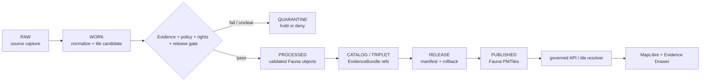

<!-- [KFM_META_BLOCK_V2]
doc_id: kfm://data/published/pmtiles/fauna/readme
name: Fauna PMTiles Published README
path: data/published/pmtiles/fauna/README.md
type: data-lane-readme
version: v0.1.0
status: draft
owners:
  - <fauna-lane-steward>
  - <map-layer-steward>
  - <release-steward>
created: 2026-06-27
updated: 2026-06-27
policy_label: restricted-review
truth_posture: cite-or-abstain
lifecycle_phase: published
responsibility_root: data/
domain: fauna
artifact_family: released-public-safe-fauna-pmtiles
format: PMTiles
sensitivity_posture: public-safe-derivatives-only; release-required
tags:
  - kfm
  - data
  - published
  - pmtiles
  - fauna
  - public-safe
  - release
  - evidence-first
related:
  - ../../README.md
  - ../README.md
  - ../../layers/fauna/README.md
  - ../../layers/fauna/occurrence_tiles/README.md
  - ../../layers/fauna/range/README.md
  - ../../layers/fauna/range_generalized/README.md
  - ../../../README.md
  - ../../../../docs/domains/fauna/ARCHITECTURE.md
  - ../../../../docs/domains/fauna/SENSITIVITY_POSTURE.md
  - ../../../../docs/domains/fauna/POLICY.md
  - ../../../../docs/domains/fauna/API_CONTRACTS.md
  - ../../../../contracts/data/layer_manifest.md
  - ../../../../release/manifests/README.md
notes:
  - "This README documents the PMTiles-format published lane for Fauna delivery artifacts."
  - "PMTiles are downstream delivery carriers; they do not replace source records, processed fauna objects, catalog records, EvidenceBundles, release manifests, receipts, policy decisions, layer manifests, or AI receipts."
  - "Actual payload presence, validator wiring, release-manifest approval, and CI enforcement remain UNKNOWN unless verified per release."
[/KFM_META_BLOCK_V2] -->

<a id="top"></a>

# Fauna PMTiles Published Artifacts

Released public-safe Fauna PMTiles artifacts for governed map delivery.

<p>
  
  
  
  
  
  
</p>

**Quick links:** [Scope](#scope) · [Repo fit](#repo-fit) · [Inputs](#inputs) · [Exclusions](#exclusions) · [Directory map](#directory-map) · [Publication boundary](#publication-boundary) · [Required checks](#required-checks-before-use) · [Status notes](#status-notes)

> [!IMPORTANT]
> Fauna PMTiles are delivery artifacts only. They are not source, proof, catalog, release, policy, or AI authority.

---

## Scope

This directory may hold released public-safe Fauna PMTiles artifacts for governed map delivery after KFM release gates have passed.

Fauna PMTiles are downstream carriers. Claim truth remains in source records, processed objects, catalog and EvidenceBundle records, proof and receipt objects, policy decisions, review records, and release manifests.

---

## Repo fit

| Field | Value |
|---|---|
| Path | `data/published/pmtiles/fauna/` |
| Responsibility root | `data/` |
| Lifecycle phase | `published/` |
| Domain lane | `fauna` |
| Format lane | `pmtiles` |
| Artifact role | Released public-safe PMTiles bytes and tile sidecars |
| Layer counterpart | `data/published/layers/fauna/` |
| Release authority | `release/`, not this directory |
| Proof authority | `data/proofs/` and `data/receipts/`, not this directory |
| Default failure posture | `DENY`, `HOLD`, `RESTRICT`, or `ABSTAIN` when evidence, source role, policy, release, digest, or rollback support is insufficient |

---

## Inputs

Accepted content is limited to release-approved, public-safe PMTiles artifacts and immediate sidecars such as:

- `.pmtiles` files generated from release-approved Fauna layer material;
- PMTiles metadata, TileJSON-compatible sidecars, field allowlists, and layer manifests;
- digest files such as `.sha256` that bind tile bytes to release state;
- public-safe style fragments that do not act as policy or release authority;
- release-local README files that explain tile contents without replacing proof, policy, catalog, layer-manifest, or release authority;
- `latest.json` pointers only when generated from release state.

---

## Exclusions

| Do not place here | Correct authority home |
|---|---|
| RAW source material or source mirrors | `data/raw/fauna/` or source-specific intake |
| WORK files, generated candidates, tile-build scratch, unresolved joins, or failed validations | `data/work/fauna/` |
| Quarantined, rights-unclear, or policy-held material | `data/quarantine/fauna/` |
| Canonical processed Fauna objects | `data/processed/fauna/` |
| Catalog records, triplets, graph truth, or EvidenceBundle state | `data/catalog/`, triplet lanes, or proof lanes |
| EvidenceBundle / ProofPack / validation proof | `data/proofs/` |
| Validation, transform, tile-build, AI, or release receipts | `data/receipts/` |
| Release manifests, promotion decisions, correction notices, rollback cards, or signatures | `release/` |
| Semantic contracts, schemas, or policy rules | `contracts/`, `schemas/`, `policy/` |
| Non-PMTiles layer formats | Appropriate published layer, domain, or API-payload lane |
| Direct model-generated claims or uncited summaries | Governed answer/provenance paths only |

---

## Directory map

```text
data/published/pmtiles/fauna/
├── README.md
├── <release_id>/
│   ├── fauna.<layer_slug>.pmtiles
│   ├── fauna.<layer_slug>.pmtiles.sha256
│   ├── layer.manifest.json
│   ├── tilejson.json
│   ├── fields.allowlist.json
│   ├── caveats.summary.json
│   ├── review.summary.json
│   └── README.md
└── latest.json
```

`latest.json` must be generated from release state. Remove or withhold it when release, review, digest, registry, correction, or rollback support is incomplete.

---

## Publication boundary



The forbidden shortcut is:

```text
RAW / WORK / QUARANTINE / processed candidate / direct source record / direct model output / unreleased tile
→ direct public Fauna PMTiles
```

---

## Required checks before use

- [ ] Confirm the PMTiles artifact belongs in the Fauna domain and this format lane.
- [ ] Confirm the release manifest and promotion decision.
- [ ] Confirm proof, receipt, and catalog/EvidenceBundle closure.
- [ ] Confirm source descriptors, source roles, rights posture, and current terms.
- [ ] Confirm public release class and field allowlist.
- [ ] Confirm layer manifest, TileJSON sidecar, and released-byte digest.
- [ ] Confirm rollback target and correction path.
- [ ] Confirm public clients consume tiles through governed APIs, release-resolved URLs, or approved static hosting paths.
- [ ] Confirm no PMTiles artifact is treated as source, proof, release, catalog, policy, occurrence truth, range truth, or AI authority.

---

## Status notes

| Claim | Status |
|---|---|
| This README defines the requested PMTiles path boundary. | **CONFIRMED authored** |
| The target path exists in the live repository. | **CONFIRMED by GitHub contents API during this edit** |
| Fauna doctrine uses a restricted-review posture for sensitive records. | **CONFIRMED by GitHub contents API during this edit** |
| The broader `data/published/layers/fauna/README.md` exists and documents public-safe Fauna layer lanes. | **CONFIRMED by GitHub contents API during this edit** |
| Actual Fauna PMTiles payloads exist in this subtree. | **UNKNOWN** |
| Release manifests approve Fauna PMTiles artifacts in this subtree. | **UNKNOWN** |
| Validators and CI checks enforce this exact PMTiles lane. | **NEEDS VERIFICATION** |
| This README is release authority or occurrence/range truth. | **DENY** |

---

## Related files

- [`../../README.md`](../../README.md)
- [`../README.md`](../README.md)
- [`../../layers/fauna/README.md`](../../layers/fauna/README.md)
- [`../../layers/fauna/occurrence_tiles/README.md`](../../layers/fauna/occurrence_tiles/README.md)
- [`../../layers/fauna/range/README.md`](../../layers/fauna/range/README.md)
- [`../../layers/fauna/range_generalized/README.md`](../../layers/fauna/range_generalized/README.md)
- [`../../../README.md`](../../../README.md)
- [`../../../../docs/domains/fauna/ARCHITECTURE.md`](../../../../docs/domains/fauna/ARCHITECTURE.md)
- [`../../../../docs/domains/fauna/SENSITIVITY_POSTURE.md`](../../../../docs/domains/fauna/SENSITIVITY_POSTURE.md)
- [`../../../../docs/domains/fauna/POLICY.md`](../../../../docs/domains/fauna/POLICY.md)
- [`../../../../docs/domains/fauna/API_CONTRACTS.md`](../../../../docs/domains/fauna/API_CONTRACTS.md)
- [`../../../../contracts/data/layer_manifest.md`](../../../../contracts/data/layer_manifest.md)
- [`../../../../release/manifests/README.md`](../../../../release/manifests/README.md)

---

KFM rule: this directory is a released public-safe Fauna PMTiles delivery lane only. It is not source authority, proof authority, receipt authority, release authority, catalog authority, registry authority, policy authority, occurrence truth, range truth, or AI truth.

[Back to top](#top)
