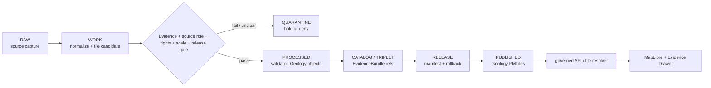

<!-- [KFM_META_BLOCK_V2]
doc_id: kfm://data/published/pmtiles/geology/readme
name: Geology PMTiles Published README
path: data/published/pmtiles/geology/README.md
type: data-lane-readme
version: v0.1.0
status: draft
owners:
  - <geology-domain-steward>
  - <map-layer-steward>
  - <release-steward>
created: 2026-06-27
updated: 2026-06-27
policy_label: public-review
truth_posture: cite-or-abstain
lifecycle_phase: published
responsibility_root: data/
domain: geology
artifact_family: released-public-safe-geology-pmtiles
format: PMTiles
sensitivity_posture: public-safe-derivatives-only; source-role-preservation-required; scale-lineage-required; release-required
tags:
  - kfm
  - data
  - published
  - pmtiles
  - geology
  - surficial
  - geology-map
  - scale-lineage
  - maplibre
  - release
  - evidence-first
related:
  - ../../README.md
  - ../README.md
  - ../../layers/geology/README.md
  - ../../layers/geology/surficial/README.md
  - ../../../README.md
  - ../../../../docs/domains/geology/ARCHITECTURE.md
  - ../../../../docs/domains/geology/DATA_LIFECYCLE.md
  - ../../../../docs/domains/geology/RELEASE_INDEX.md
  - ../../../../contracts/data/layer_manifest.md
  - ../../../../release/manifests/README.md
notes:
  - "This README documents the PMTiles-format published lane for Geology delivery artifacts."
  - "PMTiles are downstream delivery carriers; they do not replace source records, processed geology objects, catalog records, EvidenceBundles, release manifests, receipts, policy decisions, layer manifests, or AI receipts."
  - "Geology PMTiles must preserve source role, scale, lineage, map edition, and interpretation caveats where material."
  - "Actual payload presence, validator wiring, release-manifest approval, and CI enforcement remain UNKNOWN unless verified per release."
[/KFM_META_BLOCK_V2] -->

<a id="top"></a>

# Geology PMTiles Published Artifacts

Released public-safe Geology PMTiles artifacts for governed map delivery.

<p>
  
  
  
  
  
  
</p>

**Quick links:** [Scope](#scope) · [Repo fit](#repo-fit) · [Inputs](#inputs) · [Exclusions](#exclusions) · [Directory map](#directory-map) · [Publication boundary](#publication-boundary) · [Required checks](#required-checks-before-use) · [Status notes](#status-notes)

> [!IMPORTANT]
> Geology PMTiles are delivery artifacts only. They are not source records, processed geology truth, catalog truth, proof authority, release authority, policy authority, geologic interpretation authority, or AI truth.

---

## Scope

This directory may hold released public-safe Geology PMTiles artifacts for governed map delivery after KFM release gates have passed. Candidate tile families include surficial geology, bedrock/context layers, geologic unit views, structure/context views, resource-context views, and other approved public Geology map products.

Geology PMTiles are downstream carriers. Claim truth remains in source records, processed objects, catalog and EvidenceBundle records, proof and receipt objects, policy decisions, review records, and release manifests.

---

## Repo fit

| Field | Value |
|---|---|
| Path | `data/published/pmtiles/geology/` |
| Responsibility root | `data/` |
| Lifecycle phase | `published/` |
| Domain lane | `geology` |
| Format lane | `pmtiles` |
| Artifact role | Released public-safe PMTiles bytes and tile sidecars |
| Layer counterpart | `data/published/layers/geology/` |
| Confirmed child layer | `data/published/layers/geology/surficial/` |
| Release authority | `release/`, not this directory |
| Proof authority | `data/proofs/` and `data/receipts/`, not this directory |
| Default failure posture | `DENY`, `HOLD`, `RESTRICT`, or `ABSTAIN` when evidence, source role, scale, lineage, rights, policy, release, digest, or rollback support is insufficient |

---

## Inputs

Accepted content is limited to release-approved, public-safe PMTiles artifacts and immediate sidecars such as:

- `.pmtiles` files generated from release-approved Geology layer material;
- PMTiles metadata, TileJSON-compatible sidecars, field allowlists, and layer manifests;
- scale, lineage, map-edition, source-role, caveat, and review summaries;
- digest files such as `.sha256` that bind tile bytes to release state;
- public-safe style fragments that do not act as policy, proof, or release authority;
- release-local README files that explain tile contents without replacing proof, policy, catalog, layer-manifest, or release authority;
- `latest.json` pointers only when generated from release state.

---

## Exclusions

| Do not place here | Correct authority home |
|---|---|
| RAW source downloads or source mirrors | `data/raw/geology/` or source-specific intake |
| WORK files, generated candidates, tile-build scratch, unresolved joins, or failed validations | `data/work/geology/` |
| Quarantined, rights-unclear, or policy-held material | `data/quarantine/geology/` |
| Canonical processed Geology objects | `data/processed/geology/` |
| Catalog records, triplets, graph truth, or EvidenceBundle state | `data/catalog/`, triplet lanes, or proof lanes |
| EvidenceBundle / ProofPack / validation proof | `data/proofs/` |
| Validation, transform, tile-build, AI, or release receipts | `data/receipts/` |
| Release manifests, promotion decisions, correction notices, rollback cards, or signatures | `release/` |
| Semantic contracts, schemas, source registries, or policy rules | `contracts/`, `schemas/`, `data/registry/`, `policy/` |
| Non-PMTiles layer formats | Appropriate published layer, domain, or API-payload lane |
| Direct model-generated geology claims or uncited summaries | Governed answer/provenance paths only |

---

## Directory map

```text
data/published/pmtiles/geology/
├── README.md
├── <release_id>/
│   ├── geology.<layer_slug>.pmtiles
│   ├── geology.<layer_slug>.pmtiles.sha256
│   ├── layer.manifest.json
│   ├── tilejson.json
│   ├── fields.allowlist.json
│   ├── scale_lineage.summary.json
│   ├── caveats.summary.json
│   ├── review.summary.json
│   └── README.md
└── latest.json
```

`latest.json` must be generated from release state. Remove or withhold it when release, review, digest, registry, scale/lineage, correction, or rollback support is incomplete.

---

## Publication boundary



The forbidden shortcut is:

```text
RAW / WORK / QUARANTINE / processed candidate / direct source record / direct model output / unreleased tile
→ direct public Geology PMTiles
```

---

## Required checks before use

- [ ] Confirm the PMTiles artifact belongs in the Geology domain and this format lane.
- [ ] Confirm the release manifest and promotion decision.
- [ ] Confirm proof, receipt, and catalog/EvidenceBundle closure.
- [ ] Confirm source descriptors, source roles, rights posture, and current terms.
- [ ] Confirm source role, map scale, compilation lineage, map edition, and interpretation caveats where material.
- [ ] Confirm field allowlist, layer manifest, TileJSON sidecar, and released-byte digest.
- [ ] Confirm rollback target and correction path.
- [ ] Confirm public clients consume tiles through governed APIs, release-resolved URLs, or approved static hosting paths.
- [ ] Confirm no PMTiles artifact is treated as source, proof, release, catalog, policy, geologic interpretation truth, resource estimate truth, or AI authority.

---

## Status notes

| Claim | Status |
|---|---|
| This README defines the requested PMTiles path boundary. | **CONFIRMED authored** |
| The target path exists in the live repository. | **CONFIRMED by GitHub contents API during this edit** |
| The broader `data/published/layers/geology/README.md` exists and documents public-safe Geology layer lanes. | **CONFIRMED by GitHub contents API during this edit** |
| `surficial/` is the only confirmed Geology layer child lane from the fetched layer README. | **CONFIRMED by GitHub contents API during this edit** |
| Actual Geology PMTiles payloads exist in this subtree. | **UNKNOWN** |
| Release manifests approve Geology PMTiles artifacts in this subtree. | **UNKNOWN** |
| Validators and CI checks enforce this exact PMTiles lane. | **NEEDS VERIFICATION** |
| This README is release authority or geologic interpretation truth. | **DENY** |

---

## Related files

- [`../../README.md`](../../README.md)
- [`../README.md`](../README.md)
- [`../../layers/geology/README.md`](../../layers/geology/README.md)
- [`../../layers/geology/surficial/README.md`](../../layers/geology/surficial/README.md)
- [`../../../README.md`](../../../README.md)
- [`../../../../docs/domains/geology/ARCHITECTURE.md`](../../../../docs/domains/geology/ARCHITECTURE.md)
- [`../../../../docs/domains/geology/DATA_LIFECYCLE.md`](../../../../docs/domains/geology/DATA_LIFECYCLE.md)
- [`../../../../docs/domains/geology/RELEASE_INDEX.md`](../../../../docs/domains/geology/RELEASE_INDEX.md)
- [`../../../../contracts/data/layer_manifest.md`](../../../../contracts/data/layer_manifest.md)
- [`../../../../release/manifests/README.md`](../../../../release/manifests/README.md)

---

KFM rule: this directory is a released public-safe Geology PMTiles delivery lane only. It is not source authority, proof authority, receipt authority, release authority, catalog authority, registry authority, policy authority, geologic interpretation authority, resource-estimate authority, or AI truth.

[Back to top](#top)
