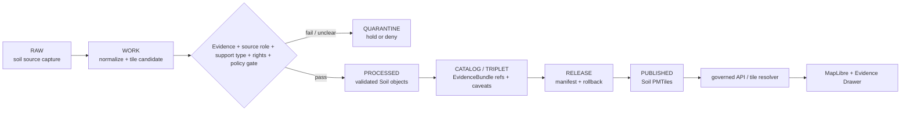

<!-- [KFM_META_BLOCK_V2]
doc_id: kfm://data/published/pmtiles/soil/readme
name: Soil PMTiles Published README
path: data/published/pmtiles/soil/README.md
type: data-lane-readme
version: v0.1.0
status: draft
owners:
  - <soil-domain-steward>
  - <map-layer-steward>
  - <release-steward>
created: 2026-06-27
updated: 2026-06-27
policy_label: public-with-review
truth_posture: cite-or-abstain
lifecycle_phase: published
responsibility_root: data/
domain: soil
artifact_family: released-public-safe-soil-pmtiles
format: PMTiles
sensitivity_posture: public-safe-at-appropriate-scale; support-type-separation-required; release-required
tags:
  - kfm
  - data
  - published
  - pmtiles
  - soil
  - static-survey
  - gridded-derivative
  - satellite-grid
  - suitability
  - support-type
  - release
  - evidence-first
related:
  - ../../README.md
  - ../README.md
  - ../../layers/soil/README.md
  - ../../layers/soil/static_survey/README.md
  - ../../layers/soil/gridded_derivative/README.md
  - ../../layers/soil/satellite_grid/README.md
  - ../../layers/soil/suitability/README.md
  - ../../../README.md
  - ../../../../docs/domains/soil/ARCHITECTURE.md
  - ../../../../docs/domains/soil/DATA_LIFECYCLE.md
  - ../../../../docs/domains/soil/API_CONTRACTS.md
  - ../../../../contracts/data/layer_manifest.md
  - ../../../../release/manifests/README.md
notes:
  - "This README documents the PMTiles-format published lane for Soil delivery artifacts."
  - "PMTiles are downstream delivery carriers; they do not replace source records, processed soil objects, catalog records, EvidenceBundles, release manifests, receipts, policy decisions, layer manifests, or AI receipts."
  - "Soil PMTiles must preserve support-type separation; static survey, gridded derivative, station, satellite, pedon, and interpretation surfaces must not masquerade as one another."
  - "Actual payload presence, validator wiring, release-manifest approval, and CI enforcement remain UNKNOWN unless verified per release."
[/KFM_META_BLOCK_V2] -->

<a id="top"></a>

# Soil PMTiles Published Artifacts

Released public-safe Soil PMTiles artifacts for governed map delivery.

<p>
  
  
  
  
  
  
</p>

**Quick links:** [Scope](#scope) · [Repo fit](#repo-fit) · [Support-type lane map](#support-type-lane-map) · [Inputs](#inputs) · [Exclusions](#exclusions) · [Directory map](#directory-map) · [Publication boundary](#publication-boundary) · [Required checks](#required-checks-before-use) · [Status notes](#status-notes)

> [!IMPORTANT]
> Soil PMTiles are delivery artifacts only. They are not source records, processed soil truth, catalog truth, proof authority, release authority, support-type authority, survey truth, observation truth, interpretation truth, legal/title/regulatory truth, or AI truth.

---

## Scope

This directory may hold released public-safe Soil PMTiles artifacts for governed map delivery after KFM release gates have passed. Candidate tile families include static survey products, gridded derivative products, satellite grid products, suitability or other interpretive products, and future soil tile families once their support type, caveats, release state, digest, and rollback support are inspectable.

Soil PMTiles are downstream carriers. Claim truth remains in source records, processed objects, catalog and EvidenceBundle records, proof and receipt objects, policy decisions, review records, and release manifests.

---

## Repo fit

| Field | Value |
|---|---|
| Path | `data/published/pmtiles/soil/` |
| Responsibility root | `data/` |
| Lifecycle phase | `published/` |
| Domain lane | `soil` |
| Format lane | `pmtiles` |
| Artifact role | Released public-safe PMTiles bytes and tile sidecars |
| Layer counterpart | `data/published/layers/soil/` |
| Release authority | `release/`, not this directory |
| Proof authority | `data/proofs/soil/` and `data/receipts/`, not this directory |
| Default failure posture | `DENY`, `HOLD`, `RESTRICT`, or `ABSTAIN` when evidence, source role, support type, rights, time caveat, policy, release, digest, or rollback support is insufficient |

---

## Support-type lane map

The soil layer README confirms the child lanes below as README lanes. This table does not prove PMTiles payloads exist for any lane.

| Layer lane | Support type / role | PMTiles boundary |
|---|---|---|
| [`static_survey/`](../../layers/soil/static_survey/README.md) | `authoritative_static_soil` | Survey products remain survey products; not legal/title/field-level regulatory truth. |
| [`gridded_derivative/`](../../layers/soil/gridded_derivative/README.md) | `gridded_derivative_soil` | Gridded derivatives stay distinct from static survey and observations. |
| [`satellite_grid/`](../../layers/soil/satellite_grid/README.md) | `satellite_soil_moisture` | Satellite grids require product, QC, uncertainty, and time caveats. |
| [`suitability/`](../../layers/soil/suitability/README.md) | interpretation / suitability | Interpretive fitness-for-use product; not recommendation or decision authority. |

---

## Inputs

Accepted content is limited to release-approved, public-safe PMTiles artifacts and immediate sidecars such as:

- `.pmtiles` files generated from release-approved Soil layer material;
- PMTiles metadata, TileJSON-compatible sidecars, field allowlists, and layer manifests;
- support-type, survey-lineage, grid/QC, product-caveat, method, and time-caveat summaries;
- digest files such as `.sha256` that bind tile bytes to release state;
- public-safe style fragments that do not act as policy, proof, support-type, or release authority;
- release-local README files that explain tile contents without replacing proof, policy, catalog, layer-manifest, or release authority;
- `latest.json` pointers only when generated from release state.

---

## Exclusions

| Do not place here | Correct authority home |
|---|---|
| RAW source captures or source mirrors | `data/raw/soil/` or source-specific intake |
| WORK files, generated candidates, tile-build scratch, unresolved joins, or failed validations | `data/work/soil/` |
| Quarantined, rights-unclear, or policy-held material | `data/quarantine/soil/` |
| Canonical processed Soil objects | `data/processed/soil/` |
| Catalog records, triplets, graph truth, or EvidenceBundle state | `data/catalog/`, triplet lanes, or proof lanes |
| EvidenceBundle / ProofPack / validation proof | `data/proofs/soil/` |
| Validation, transform, survey-build, grid-build, tile-build, QC, AI, or release receipts | `data/receipts/` |
| Release manifests, promotion decisions, correction notices, rollback cards, or signatures | `release/` |
| Semantic contracts, schemas, source registries, or policy rules | `contracts/`, `schemas/`, `data/registry/`, `policy/` |
| Mixed-support payloads without explicit reviewed derivation | Quarantine or correct support-specific lane |
| Farm-specific, owner-specific, proprietary, legal/title, field-level regulatory, or operational detail | Restricted governed lanes only; not public PMTiles |
| Non-PMTiles layer formats | Appropriate published layer, domain, or API-payload lane |
| Direct model-generated soil claims or uncited summaries | Governed answer/provenance paths only |

---

## Directory map

```text
data/published/pmtiles/soil/
├── README.md
├── <release_id>/
│   ├── soil.<layer_slug>.pmtiles
│   ├── soil.<layer_slug>.pmtiles.sha256
│   ├── layer.manifest.json
│   ├── tilejson.json
│   ├── fields.allowlist.json
│   ├── support_type.summary.json
│   ├── time_caveat.summary.json
│   ├── caveats.summary.json
│   ├── review.summary.json
│   └── README.md
└── latest.json
```

`latest.json` must be generated from release state. Remove or withhold it when release, review, digest, registry, support type, correction, or rollback support is incomplete.

---

## Publication boundary



The forbidden shortcut is:

```text
RAW / WORK / QUARANTINE / processed candidate / direct source record / direct model output / unlabeled support type / unreleased tile
→ direct public Soil PMTiles
```

---

## Required checks before use

- [ ] Confirm the PMTiles artifact belongs in the Soil domain and this format lane.
- [ ] Confirm the release manifest and promotion decision.
- [ ] Confirm proof, receipt, and catalog/EvidenceBundle closure.
- [ ] Confirm source descriptors, source roles, rights posture, and current terms.
- [ ] Confirm support type is present and preserved through catalog, release, and published artifacts.
- [ ] Confirm support-type separation from static survey, gridded derivative, station, satellite, pedon, and interpretation surfaces.
- [ ] Confirm source vintage, observed time where relevant, retrieval time, release time, correction time, and per-product time caveats.
- [ ] Confirm field allowlist, layer manifest, TileJSON sidecar, and released-byte digest.
- [ ] Confirm rollback target and correction path.
- [ ] Confirm public clients consume tiles through governed APIs, release-resolved URLs, or approved static hosting paths.
- [ ] Confirm no PMTiles artifact is treated as source, proof, release, catalog, policy, support-type authority, survey truth, observation truth, interpretation truth, legal/title/regulatory truth, or AI authority.

---

## Status notes

| Claim | Status |
|---|---|
| This README defines the requested PMTiles path boundary. | **CONFIRMED authored** |
| The target path exists in the live repository. | **CONFIRMED by GitHub contents API during this edit** |
| The broader `data/published/layers/soil/README.md` exists and documents public-safe Soil layer lanes. | **CONFIRMED by GitHub contents API during this edit** |
| Soil doctrine requires support-type separation across static survey, gridded derivative, station, satellite, pedon, and interpretation surfaces. | **CONFIRMED by GitHub contents API during this edit** |
| Actual Soil PMTiles payloads exist in this subtree. | **UNKNOWN** |
| Release manifests approve Soil PMTiles artifacts in this subtree. | **UNKNOWN** |
| Validators and CI checks enforce this exact PMTiles lane. | **NEEDS VERIFICATION** |
| This README is release authority or soil truth. | **DENY** |

---

## Related files

- [`../../README.md`](../../README.md)
- [`../README.md`](../README.md)
- [`../../layers/soil/README.md`](../../layers/soil/README.md)
- [`../../layers/soil/static_survey/README.md`](../../layers/soil/static_survey/README.md)
- [`../../layers/soil/gridded_derivative/README.md`](../../layers/soil/gridded_derivative/README.md)
- [`../../layers/soil/satellite_grid/README.md`](../../layers/soil/satellite_grid/README.md)
- [`../../layers/soil/suitability/README.md`](../../layers/soil/suitability/README.md)
- [`../../../README.md`](../../../README.md)
- [`../../../../docs/domains/soil/ARCHITECTURE.md`](../../../../docs/domains/soil/ARCHITECTURE.md)
- [`../../../../docs/domains/soil/DATA_LIFECYCLE.md`](../../../../docs/domains/soil/DATA_LIFECYCLE.md)
- [`../../../../docs/domains/soil/API_CONTRACTS.md`](../../../../docs/domains/soil/API_CONTRACTS.md)
- [`../../../../contracts/data/layer_manifest.md`](../../../../contracts/data/layer_manifest.md)
- [`../../../../release/manifests/README.md`](../../../../release/manifests/README.md)

---

KFM rule: this directory is a released public-safe Soil PMTiles delivery lane only. It is not source authority, proof authority, receipt authority, release authority, catalog authority, registry authority, policy authority, support-type authority, survey truth, observation truth, interpretation truth, legal/title/regulatory truth, or AI truth.

[Back to top](#top)
