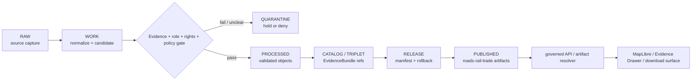

<!-- [KFM_META_BLOCK_V2]
doc_id: kfm://data/published/roads-rail-trade/readme
name: Roads Rail Trade Published README
path: data/published/roads-rail-trade/README.md
type: data-lane-readme
version: v0.1.0
status: draft
owners:
  - <roads-rail-trade-domain-steward>
  - <data-publication-steward>
  - <release-steward>
created: 2026-06-27
updated: 2026-06-27
policy_label: restricted-review
truth_posture: cite-or-abstain
lifecycle_phase: published
responsibility_root: data/
domain: roads-rail-trade
artifact_family: released-public-safe-roads-rail-trade-artifacts
sensitivity_posture: public-safe-derivatives-only; source-role-preserving; review-and-release-required
related:
  - ../README.md
  - ../layers/roads-rail-trade/README.md
  - ../layers/roads-rail-trade/cultural-corridors-generalized/README.md
  - ../layers/roads-rail-trade/facilities/README.md
  - ../layers/roads-rail-trade/graph/README.md
  - ../../README.md
  - ../../../docs/domains/roads-rail-trade/ARCHITECTURE.md
  - ../../../docs/domains/roads-rail-trade/PIPELINE.md
  - ../../../docs/domains/roads-rail-trade/GRAPH_PROJECTIONS.md
  - ../../../docs/domains/roads-rail-trade/HISTORIC_ROUTES.md
  - ../../../release/manifests/README.md
tags:
  - kfm
  - data
  - published
  - roads-rail-trade
  - transport
  - roads
  - rail
  - routes
  - corridors
  - release
  - evidence-first
notes:
  - "This README replaces the greenfield stub and documents the non-layer published lane for Roads/Rail/Trade artifacts."
  - "Published artifacts here are downstream carriers; release, proof, receipt, policy, source, processed, catalog, layer, and graph authority stay in their owning roots."
  - "Map-layer artifacts belong under data/published/layers/roads-rail-trade/."
  - "Actual artifact payload presence, release-manifest approval, validator wiring, and CI enforcement remain UNKNOWN unless verified per release."
[/KFM_META_BLOCK_V2] -->

<a id="top"></a>

# Roads/Rail/Trade Published Artifacts

Released public-safe Roads/Rail/Trade artifacts for governed KFM delivery surfaces.

<p>
  
  
  
  
  
</p>

**Quick links:** [Scope](#scope) · [Repo fit](#repo-fit) · [Artifact families](#artifact-families) · [Inputs](#inputs) · [Exclusions](#exclusions) · [Directory map](#directory-map) · [Publication boundary](#publication-boundary) · [Required checks](#required-checks-before-use) · [Status notes](#status-notes)

> [!IMPORTANT]
> `data/published/roads-rail-trade/` is a published artifact lane, not the map-layer lane. Map layers belong under [`../layers/roads-rail-trade/`](../layers/roads-rail-trade/README.md). This directory is not source authority, proof authority, receipt authority, release authority, catalog authority, graph authority, route truth, facility truth, corridor truth, registry authority, or AI truth.

---

## Scope

This directory may hold released public-safe Roads/Rail/Trade artifacts that are not specifically map-layer bytes. Examples include public-safe export bundles, release-local indexes, generalized route or corridor summaries, derived connectivity summaries, report companion payloads, metadata packages, digests, and generated release pointers after evidence, source role, rights, policy, review, release, correction, and rollback requirements are met.

Artifacts here are downstream carriers. They help public clients and reviewers locate released Roads/Rail/Trade outputs, but claim truth remains in source records, processed domain objects, catalog and EvidenceBundle records, proofs, receipts, policy decisions, review records, graph-projection provenance, and release manifests.

---

## Repo fit

| Field | Value |
|---|---|
| Path | `data/published/roads-rail-trade/` |
| Responsibility root | `data/` |
| Lifecycle phase | `published/` |
| Domain lane | `roads-rail-trade` |
| Artifact role | Released public-safe non-layer artifacts, sidecars, indexes, and delivery packages |
| Layer counterpart | `data/published/layers/roads-rail-trade/` |
| Upstream lifecycle | `RAW -> WORK / QUARANTINE -> PROCESSED -> CATALOG / TRIPLET -> RELEASE -> PUBLISHED` |
| Release authority | `release/`, not this directory |
| Proof authority | `data/proofs/` and `data/receipts/`, not this directory |
| Catalog authority | `data/catalog/`, not this directory |
| Default failure posture | `DENY`, `HOLD`, `RESTRICT`, or `ABSTAIN` when evidence, source role, rights, policy, review, release, digest, or rollback support is insufficient |

---

## Artifact families

The families below are allowed only when release-approved and public-safe. This table does not prove payloads currently exist.

| Family | Examples | Boundary |
|---|---|---|
| Export bundles | Public route/corridor/facility summaries, CSV/JSON packages | Must cite release state and evidence anchors. |
| Companion metadata | Caveat, lineage, field allowlist, and source-role summaries | Explains released artifacts; does not replace proof or release authority. |
| Derived connectivity summaries | Public graph or network summary payloads | Derived read model only; not canonical graph or route truth. |
| Report companions | Public-safe report support packages | Must cite released report/layer/API payloads. |
| Release-local indexes | `latest.json`, `public_index.json`, release README files | Navigation only; generated from release state. |

---

## Inputs

Accepted content is limited to release-approved artifacts and immediate sidecars such as:

- public-safe JSON, CSV, GeoJSON, Parquet, archive, or report-support payloads;
- release-local README files and public indexes;
- source-role, lineage, caveat, review, field-allowlist, and digest sidecars;
- graph/network summary sidecars when they are clearly marked as derived read models;
- `latest.json` pointers only when generated from release state.

---

## Exclusions

| Do not place here | Correct authority home |
|---|---|
| RAW source captures or source mirrors | `data/raw/roads-rail-trade/` or source-specific intake |
| WORK files, generated candidates, unresolved joins, or review drafts | `data/work/roads-rail-trade/` |
| Quarantined or unclear material | `data/quarantine/roads-rail-trade/` |
| Canonical processed road, rail, route, facility, corridor, or graph objects | `data/processed/roads-rail-trade/` or the proper canonical lane |
| Catalog records, triplets, or graph truth | `data/catalog/` and triplet/projection lanes |
| EvidenceBundle / ProofPack | `data/proofs/` |
| Validation, transform, build, graph-build, AI, or release receipts | `data/receipts/` |
| Release manifests, promotion decisions, correction records, rollback records, or signatures | `release/` |
| Map-layer bytes and layer sidecars | `data/published/layers/roads-rail-trade/` |
| Semantic contracts, schemas, source registries, or policy rules | `contracts/`, `schemas/`, `data/registry/`, `policy/` |
| Direct model-generated claims or uncited summaries | Governed answer/provenance paths only |

---

## Directory map

```text
data/published/roads-rail-trade/
├── README.md
├── <release_id>/
│   ├── public_index.json
│   ├── artifact.<slug>.json
│   ├── artifact.<slug>.csv
│   ├── source_role.summary.json
│   ├── caveats.summary.json
│   ├── fields.allowlist.json
│   ├── artifact.<slug>.sha256
│   └── README.md
└── latest.json
```

`latest.json` must be generated from release state. Remove or withhold it when release, review, digest, correction, or rollback support is incomplete.

---

## Publication boundary



The forbidden shortcut is:

```text
RAW / WORK / QUARANTINE / processed candidate / direct source record / graph projection / direct model output / unreleased artifact
→ direct public Roads/Rail/Trade artifact
```

---

## Required checks before use

- [ ] Confirm the artifact belongs in this non-layer published lane rather than the layer lane.
- [ ] Confirm the release manifest and promotion decision.
- [ ] Confirm proof, receipt, and catalog/EvidenceBundle closure.
- [ ] Confirm source descriptors, source roles, rights posture, and current terms.
- [ ] Confirm policy review and any required public-safe transforms.
- [ ] Confirm field allowlist, artifact manifest or index, and released-byte digest.
- [ ] Confirm rollback target and correction path.
- [ ] Confirm `latest.json`, if present, is generated from release state.
- [ ] Confirm public clients consume artifacts through governed APIs, release-resolved URLs, or approved static hosting paths.
- [ ] Confirm no artifact is treated as source, proof, release, catalog, registry, graph, route, facility, corridor, or AI authority.

---

## Status notes

| Claim | Status |
|---|---|
| This README replaces the greenfield stub at `data/published/roads-rail-trade/README.md`. | **CONFIRMED authored** |
| The target path existed in the live repository as a greenfield stub before this edit. | **CONFIRMED by GitHub contents API during this edit** |
| The layer counterpart `data/published/layers/roads-rail-trade/README.md` exists and documents public-safe layer lanes. | **CONFIRMED by GitHub contents API during this edit** |
| Actual non-layer Roads/Rail/Trade payloads exist under this subtree. | **UNKNOWN** |
| Release manifests approve artifacts under this subtree. | **UNKNOWN** |
| Validators and CI checks enforce this exact lane. | **NEEDS VERIFICATION** |
| This README is release authority, graph truth, route truth, facility truth, corridor truth, or AI authority. | **DENY** |

---

## Related files

- [`../README.md`](../README.md)
- [`../layers/roads-rail-trade/README.md`](../layers/roads-rail-trade/README.md)
- [`../layers/roads-rail-trade/cultural-corridors-generalized/README.md`](../layers/roads-rail-trade/cultural-corridors-generalized/README.md)
- [`../layers/roads-rail-trade/facilities/README.md`](../layers/roads-rail-trade/facilities/README.md)
- [`../layers/roads-rail-trade/graph/README.md`](../layers/roads-rail-trade/graph/README.md)
- [`../../README.md`](../../README.md)
- [`../../../docs/domains/roads-rail-trade/ARCHITECTURE.md`](../../../docs/domains/roads-rail-trade/ARCHITECTURE.md)
- [`../../../docs/domains/roads-rail-trade/PIPELINE.md`](../../../docs/domains/roads-rail-trade/PIPELINE.md)
- [`../../../docs/domains/roads-rail-trade/GRAPH_PROJECTIONS.md`](../../../docs/domains/roads-rail-trade/GRAPH_PROJECTIONS.md)
- [`../../../docs/domains/roads-rail-trade/HISTORIC_ROUTES.md`](../../../docs/domains/roads-rail-trade/HISTORIC_ROUTES.md)
- [`../../../release/manifests/README.md`](../../../release/manifests/README.md)

---

KFM rule: this directory is a released public-safe Roads/Rail/Trade artifact lane only. It is not source authority, proof authority, receipt authority, release authority, catalog authority, registry authority, graph authority, route truth, facility truth, corridor truth, or AI truth.

[Back to top](#top)
