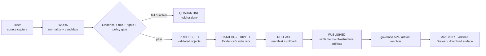

<!-- [KFM_META_BLOCK_V2]
doc_id: kfm://data/published/settlements-infrastructure/readme
name: Settlements Infrastructure Published README
path: data/published/settlements-infrastructure/README.md
type: data-lane-readme
version: v0.1.0
status: draft
owners:
  - <settlements-infrastructure-domain-steward>
  - <data-publication-steward>
  - <release-steward>
created: 2026-06-27
updated: 2026-06-27
policy_label: restricted-review
truth_posture: cite-or-abstain
lifecycle_phase: published
responsibility_root: data/
domain: settlements-infrastructure
placement_status: WORKING_CANONICAL_NEEDS_VERIFICATION
artifact_family: released-public-safe-settlements-infrastructure-artifacts
sensitivity_posture: public-safe-derivatives-only; critical-asset-detail-review-required; sovereignty-and-cultural-adjacency-review-required; release-required
related:
  - ../README.md
  - ../layers/settlements-infrastructure/README.md
  - ../layers/settlement/README.md
  - ../layers/settlements/README.md
  - ../../README.md
  - ../../../docs/domains/settlements-infrastructure/CANONICAL_PATHS.md
  - ../../../docs/domains/settlements-infrastructure/DATA_LIFECYCLE.md
  - ../../../docs/domains/settlements-infrastructure/sublanes/settlements.md
  - ../../../docs/domains/settlements-infrastructure/RELEASE_INDEX.md
  - ../../../release/manifests/README.md
tags:
  - kfm
  - data
  - published
  - settlements-infrastructure
  - settlement
  - settlements
  - infrastructure
  - places
  - facilities
  - service-areas
  - release
  - evidence-first
notes:
  - "This README replaces the greenfield stub and documents the non-layer published lane for Settlements/Infrastructure artifacts."
  - "This lane uses the working settlements-infrastructure slug; singular/plural settlement variants remain compatibility or open-verification surfaces until resolved by ADR, migration note, or directory-rule decision."
  - "Published artifacts here are downstream carriers; release, proof, receipt, policy, source, processed, catalog, layer, and registry authority stay in their owning roots."
  - "Map-layer artifacts belong under data/published/layers/settlements-infrastructure/."
  - "Actual artifact payload presence, release-manifest approval, validator wiring, and CI enforcement remain UNKNOWN unless verified per release."
[/KFM_META_BLOCK_V2] -->

<a id="top"></a>

# Settlements/Infrastructure Published Artifacts

Released public-safe Settlements/Infrastructure artifacts for governed KFM delivery surfaces.

<p>
  
  
  
  
  
  
</p>

**Quick links:** [Scope](#scope) · [Repo fit](#repo-fit) · [Artifact families](#artifact-families) · [Inputs](#inputs) · [Exclusions](#exclusions) · [Directory map](#directory-map) · [Publication boundary](#publication-boundary) · [Required checks](#required-checks-before-use) · [Status notes](#status-notes)

> [!IMPORTANT]
> This lane uses the working `settlements-infrastructure` domain segment. It is still marked **NEEDS VERIFICATION** for live artifact maturity, and the separate `settlement/` / `settlements/` layer lanes remain slug-variance or compatibility surfaces until an ADR, migration note, or directory-rule decision resolves the naming split.

---

## Scope

This directory may hold released public-safe Settlements/Infrastructure artifacts that are not specifically map-layer bytes. Examples include public-safe export bundles, release-local indexes, place or facility summary payloads, service-area context packages, dependency-summary packages, report companion payloads, metadata packages, digests, and generated release pointers after evidence, source role, rights, policy, review, release, correction, and rollback requirements are met.

Artifacts here are downstream carriers. They help public clients and reviewers locate released Settlements/Infrastructure outputs, but claim truth remains in source records, processed domain objects, catalog and EvidenceBundle records, proofs, receipts, policy decisions, review records, registry entries, and release manifests.

---

## Repo fit

| Field | Value |
|---|---|
| Path | `data/published/settlements-infrastructure/` |
| Responsibility root | `data/` |
| Lifecycle phase | `published/` |
| Working domain segment | `settlements-infrastructure` |
| Variant / compatibility layer paths | `data/published/layers/settlement/`, `data/published/layers/settlements/` |
| Placement status | **WORKING CANONICAL / NEEDS VERIFICATION** |
| Artifact role | Released public-safe non-layer artifacts, sidecars, indexes, and delivery packages |
| Layer counterpart | `data/published/layers/settlements-infrastructure/` |
| Upstream lifecycle | `RAW -> WORK / QUARANTINE -> PROCESSED -> CATALOG / TRIPLET -> RELEASE -> PUBLISHED` |
| Release authority | `release/`, not this directory |
| Proof authority | `data/proofs/` and `data/receipts/`, not this directory |
| Catalog authority | `data/catalog/`, not this directory |
| Default failure posture | `DENY`, `HOLD`, `RESTRICT`, or `ABSTAIN` when evidence, source role, rights, sensitivity review, policy, release, digest, or rollback support is insufficient |

---

## Artifact families

The families below are allowed only when release-approved and public-safe. This table does not prove payloads currently exist.

| Family | Examples | Boundary |
|---|---|---|
| Export bundles | Public place, settlement, infrastructure, service-area, or facility summaries | Must cite release state and evidence anchors. |
| Companion metadata | Caveat, lineage, field allowlist, and source-role summaries | Explains released artifacts; does not replace proof or release authority. |
| Dependency summaries | Public-safe dependency or service-context payloads | Derived view only; not infrastructure truth or service guarantee. |
| Report companions | Public-safe report support packages | Must cite released report/layer/API payloads. |
| Release-local indexes | `latest.json`, `public_index.json`, release README files | Navigation only; generated from release state. |

---

## Inputs

Accepted content is limited to release-approved artifacts and immediate sidecars such as:

- public-safe JSON, CSV, GeoJSON, Parquet, archive, or report-support payloads;
- release-local README files and public indexes;
- source-role, lineage, caveat, review, field-allowlist, and digest sidecars;
- service-area or dependency-summary sidecars when clearly marked as derived views;
- `latest.json` pointers only when generated from release state.

---

## Exclusions

| Do not place here | Correct authority home |
|---|---|
| RAW source captures or source mirrors | `data/raw/settlements-infrastructure/` or source-specific intake |
| WORK files, generated candidates, unresolved joins, or review drafts | `data/work/settlements-infrastructure/` |
| Quarantined or unclear material | `data/quarantine/settlements-infrastructure/` |
| Canonical processed settlement or infrastructure objects | `data/processed/settlements-infrastructure/` or the ADR-confirmed lane |
| Catalog records, triplets, graph truth, or EvidenceBundle state | `data/catalog/` and triplet/projection lanes |
| EvidenceBundle / ProofPack | `data/proofs/` |
| Validation, transform, redaction, build, AI, or release receipts | `data/receipts/` |
| Release manifests, promotion decisions, correction records, rollback records, or signatures | `release/` |
| Map-layer bytes and layer sidecars | `data/published/layers/settlements-infrastructure/` |
| Semantic contracts, schemas, source registries, or policy rules | `contracts/`, `schemas/`, `data/registry/`, `policy/` |
| Restricted cultural, living-person, parcel, or infrastructure detail | Restricted governed lanes only; not public published artifacts |
| Direct model-generated claims or uncited summaries | Governed answer/provenance paths only |

---

## Directory map

```text
data/published/settlements-infrastructure/
├── README.md
├── <release_id>/
│   ├── public_index.json
│   ├── artifact.<slug>.json
│   ├── artifact.<slug>.csv
│   ├── source_role.summary.json
│   ├── caveats.summary.json
│   ├── fields.allowlist.json
│   ├── artifact.<slug>.sha256
│   └── README.md
└── latest.json
```

`latest.json` must be generated from release state. Remove or withhold it when release, review, digest, correction, or rollback support is incomplete.

---

## Publication boundary



The forbidden shortcut is:

```text
RAW / WORK / QUARANTINE / processed candidate / direct source record / direct model output / unreleased artifact
→ direct public Settlements/Infrastructure artifact
```

---

## Required checks before use

- [ ] Confirm the artifact belongs in this non-layer published lane rather than the layer lane.
- [ ] Confirm the `settlements-infrastructure/` versus `settlement/` / `settlements/` segment decision for the artifact family.
- [ ] Confirm the release manifest and promotion decision.
- [ ] Confirm proof, receipt, and catalog/EvidenceBundle closure.
- [ ] Confirm source descriptors, source roles, rights posture, and current terms.
- [ ] Confirm sensitivity, critical-asset, sovereignty/cultural-adjacency, and privacy review outcomes where applicable.
- [ ] Confirm field allowlist, artifact manifest or index, and released-byte digest.
- [ ] Confirm rollback target and correction path.
- [ ] Confirm `latest.json`, if present, is generated from release state.
- [ ] Confirm public clients consume artifacts through governed APIs, release-resolved URLs, or approved static hosting paths.
- [ ] Confirm no artifact is treated as source, proof, release, catalog, registry, settlement truth, infrastructure truth, cultural authority, or AI authority.

---

## Status notes

| Claim | Status |
|---|---|
| This README replaces the greenfield stub at `data/published/settlements-infrastructure/README.md`. | **CONFIRMED authored** |
| The target path existed in the live repository as a greenfield stub before this edit. | **CONFIRMED by GitHub contents API during this edit** |
| Current domain docs identify `settlements-infrastructure` as the working canonical domain slug. | **CONFIRMED by GitHub contents API during this edit** |
| Current domain docs also record slug/path variance involving `settlement`. | **CONFIRMED by GitHub contents API during this edit** |
| The layer counterpart `data/published/layers/settlements-infrastructure/README.md` exists and documents public-safe layer lanes. | **CONFIRMED by GitHub contents API during this edit** |
| Actual non-layer Settlements/Infrastructure payloads exist under this subtree. | **UNKNOWN** |
| Release manifests approve artifacts under this subtree. | **UNKNOWN** |
| Validators and CI checks enforce this exact lane. | **NEEDS VERIFICATION** |
| This README is release authority, settlement truth, infrastructure truth, cultural authority, registry authority, or AI authority. | **DENY** |

---

## Related files

- [`../README.md`](../README.md)
- [`../layers/settlements-infrastructure/README.md`](../layers/settlements-infrastructure/README.md)
- [`../layers/settlement/README.md`](../layers/settlement/README.md)
- [`../layers/settlements/README.md`](../layers/settlements/README.md)
- [`../../README.md`](../../README.md)
- [`../../../docs/domains/settlements-infrastructure/CANONICAL_PATHS.md`](../../../docs/domains/settlements-infrastructure/CANONICAL_PATHS.md)
- [`../../../docs/domains/settlements-infrastructure/DATA_LIFECYCLE.md`](../../../docs/domains/settlements-infrastructure/DATA_LIFECYCLE.md)
- [`../../../docs/domains/settlements-infrastructure/sublanes/settlements.md`](../../../docs/domains/settlements-infrastructure/sublanes/settlements.md)
- [`../../../docs/domains/settlements-infrastructure/RELEASE_INDEX.md`](../../../docs/domains/settlements-infrastructure/RELEASE_INDEX.md)
- [`../../../release/manifests/README.md`](../../../release/manifests/README.md)

---

KFM rule: this directory is a released public-safe Settlements/Infrastructure artifact lane only. It is not source authority, proof authority, receipt authority, release authority, catalog authority, registry authority, settlement truth, infrastructure truth, cultural authority, or AI truth.

[Back to top](#top)
