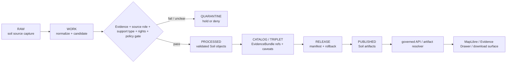

<!-- [KFM_META_BLOCK_V2]
doc_id: kfm://data/published/soil/readme
name: Soil Published README
path: data/published/soil/README.md
type: data-lane-readme
version: v0.1.0
status: draft
owners:
  - <soil-domain-steward>
  - <data-publication-steward>
  - <release-steward>
created: 2026-06-27
updated: 2026-06-27
policy_label: public-with-review
truth_posture: cite-or-abstain
lifecycle_phase: published
responsibility_root: data/
domain: soil
artifact_family: released-public-safe-soil-artifacts
sensitivity_posture: public-safe-at-appropriate-scale; support-type-separation-required; farm-owner-operational-detail-review-required; release-required
related:
  - ../README.md
  - ../layers/soil/README.md
  - ../pmtiles/soil/README.md
  - ../../README.md
  - ../../../docs/domains/soil/ARCHITECTURE.md
  - ../../../docs/domains/soil/DATA_LIFECYCLE.md
  - ../../../docs/domains/soil/CANONICAL_PATHS.md
  - ../../../docs/domains/soil/API_CONTRACTS.md
  - ../../../contracts/domains/soil/domain_layer_descriptor.md
  - ../../../contracts/domains/soil/hydrologic_soil_group.md
  - ../../proofs/soil/README.md
  - ../../../release/manifests/README.md
tags:
  - kfm
  - data
  - published
  - soil
  - static-survey
  - gridded-derivative
  - satellite-grid
  - suitability
  - support-type
  - release
  - evidence-first
notes:
  - "This README replaces the greenfield stub and documents the non-layer published lane for Soil artifacts."
  - "Published artifacts here are downstream carriers; release, proof, receipt, policy, source, processed, catalog, layer, PMTiles, and registry authority stay in their owning roots."
  - "Map-layer artifacts belong under data/published/layers/soil/; PMTiles belong under data/published/pmtiles/soil/."
  - "Support-type separation is mandatory across static survey, gridded derivative, station, satellite, pedon, and interpretation surfaces."
  - "Actual artifact payload presence, release-manifest approval, validator wiring, and CI enforcement remain UNKNOWN unless verified per release."
[/KFM_META_BLOCK_V2] -->

<a id="top"></a>

# Soil Published Artifacts

Released public-safe Soil artifacts for governed KFM delivery surfaces.

<p>
  
  
  
  
  
  
</p>

**Quick links:** [Scope](#scope) · [Repo fit](#repo-fit) · [Artifact families](#artifact-families) · [Inputs](#inputs) · [Exclusions](#exclusions) · [Directory map](#directory-map) · [Publication boundary](#publication-boundary) · [Required checks](#required-checks-before-use) · [Status notes](#status-notes)

> [!IMPORTANT]
> `data/published/soil/` is a published artifact lane, not the map-layer lane and not the PMTiles format lane. Map layers belong under [`../layers/soil/`](../layers/soil/README.md). PMTiles belong under [`../pmtiles/soil/`](../pmtiles/soil/README.md). This directory is not source authority, proof authority, receipt authority, release authority, catalog authority, registry authority, support-type authority, survey truth, observation truth, interpretation truth, legal/title/regulatory truth, or AI truth.

---

## Scope

This directory may hold released public-safe Soil artifacts that are not specifically map-layer bytes or PMTiles files. Examples include public-safe export bundles, release-local indexes, support-type summaries, survey-lineage summaries, gridded-derivative summaries, product caveat packages, report companion payloads, metadata packages, digests, and generated release pointers after evidence, source role, support type, rights, policy, review, release, correction, and rollback requirements are met.

Artifacts here are downstream carriers. They help public clients and reviewers locate released Soil outputs, but claim truth remains in source records, processed domain objects, catalog and EvidenceBundle records, proofs, receipts, policy decisions, review records, source registry entries, and release manifests.

---

## Repo fit

| Field | Value |
|---|---|
| Path | `data/published/soil/` |
| Responsibility root | `data/` |
| Lifecycle phase | `published/` |
| Domain lane | `soil` |
| Artifact role | Released public-safe non-layer artifacts, sidecars, indexes, and delivery packages |
| Layer counterpart | `data/published/layers/soil/` |
| PMTiles counterpart | `data/published/pmtiles/soil/` |
| Upstream lifecycle | `RAW -> WORK / QUARANTINE -> PROCESSED -> CATALOG / TRIPLET -> RELEASE -> PUBLISHED` |
| Release authority | `release/`, not this directory |
| Proof authority | `data/proofs/soil/` and `data/receipts/`, not this directory |
| Catalog authority | `data/catalog/`, not this directory |
| Default failure posture | `DENY`, `HOLD`, `RESTRICT`, or `ABSTAIN` when evidence, source role, support type, rights, time caveat, policy, release, digest, or rollback support is insufficient |

---

## Artifact families

The families below are allowed only when release-approved and public-safe. This table does not prove payloads currently exist.

| Family | Examples | Boundary |
|---|---|---|
| Export bundles | Public soil property, component, hydrologic group, or interpretation summaries | Must cite release state and evidence anchors. |
| Support-type summaries | Static survey, gridded derivative, satellite, station, pedon, or interpretation summaries | Must preserve support-type separation. |
| Companion metadata | Caveat, lineage, field allowlist, source-role, QC, and time summaries | Explains released artifacts; does not replace proof or release authority. |
| Report companions | Public-safe report support packages | Must cite released report/layer/API payloads. |
| Release-local indexes | `latest.json`, `public_index.json`, release README files | Navigation only; generated from release state. |

---

## Inputs

Accepted content is limited to release-approved artifacts and immediate sidecars such as:

- public-safe JSON, CSV, GeoJSON, Parquet, archive, or report-support payloads;
- release-local README files and public indexes;
- source-role, support-type, survey-lineage, product-caveat, time-caveat, field-allowlist, and digest sidecars;
- QC or method summaries when they are clearly marked as summaries, not proof authority;
- `latest.json` pointers only when generated from release state.

---

## Exclusions

| Do not place here | Correct authority home |
|---|---|
| RAW source captures or source mirrors | `data/raw/soil/` or source-specific intake |
| WORK files, generated candidates, unresolved joins, or review drafts | `data/work/soil/` |
| Quarantined or unclear material | `data/quarantine/soil/` |
| Canonical processed Soil objects | `data/processed/soil/` |
| Catalog records, triplets, graph truth, or EvidenceBundle state | `data/catalog/`, triplet lanes, or proof lanes |
| EvidenceBundle / ProofPack | `data/proofs/soil/` |
| Validation, transform, survey-build, grid-build, tile-build, QC, AI, or release receipts | `data/receipts/` |
| Release manifests, promotion decisions, correction records, rollback records, or signatures | `release/` |
| Map-layer bytes and layer sidecars | `data/published/layers/soil/` |
| PMTiles format artifacts | `data/published/pmtiles/soil/` |
| Semantic contracts, schemas, source registries, or policy rules | `contracts/`, `schemas/`, `data/registry/`, `policy/` |
| Mixed-support payloads without explicit reviewed derivation | Quarantine or correct support-specific lane |
| Farm-specific, owner-specific, proprietary, legal/title, field-level regulatory, or operational detail | Restricted governed lanes only; not public published artifacts |
| Direct model-generated soil claims or uncited summaries | Governed answer/provenance paths only |

---

## Directory map

```text
data/published/soil/
├── README.md
├── <release_id>/
│   ├── public_index.json
│   ├── artifact.<slug>.json
│   ├── artifact.<slug>.csv
│   ├── support_type.summary.json
│   ├── source_role.summary.json
│   ├── time_caveat.summary.json
│   ├── caveats.summary.json
│   ├── fields.allowlist.json
│   ├── artifact.<slug>.sha256
│   └── README.md
└── latest.json
```

`latest.json` must be generated from release state. Remove or withhold it when release, review, digest, support type, correction, or rollback support is incomplete.

---

## Publication boundary



The forbidden shortcut is:

```text
RAW / WORK / QUARANTINE / processed candidate / direct source record / direct model output / unlabeled support type / unreleased artifact
→ direct public Soil artifact
```

---

## Required checks before use

- [ ] Confirm the artifact belongs in this non-layer published lane rather than the layer or PMTiles lane.
- [ ] Confirm the release manifest and promotion decision.
- [ ] Confirm proof, receipt, and catalog/EvidenceBundle closure.
- [ ] Confirm source descriptors, source roles, rights posture, and current terms.
- [ ] Confirm support type is present and preserved through catalog, release, and published artifacts.
- [ ] Confirm support-type separation from static survey, gridded derivative, station, satellite, pedon, and interpretation surfaces.
- [ ] Confirm source vintage, observed time where relevant, retrieval time, release time, correction time, and per-product time caveats.
- [ ] Confirm field allowlist, artifact manifest or index, and released-byte digest.
- [ ] Confirm rollback target and correction path.
- [ ] Confirm `latest.json`, if present, is generated from release state.
- [ ] Confirm public clients consume artifacts through governed APIs, release-resolved URLs, or approved static hosting paths.
- [ ] Confirm no artifact is treated as source, proof, release, catalog, registry, support-type authority, survey truth, observation truth, interpretation truth, legal/title/regulatory truth, or AI authority.

---

## Status notes

| Claim | Status |
|---|---|
| This README replaces the greenfield stub at `data/published/soil/README.md`. | **CONFIRMED authored** |
| The target path existed in the live repository as a greenfield stub before this edit. | **CONFIRMED by GitHub contents API during this edit** |
| The layer counterpart `data/published/layers/soil/README.md` exists and documents public-safe layer lanes. | **CONFIRMED by GitHub contents API during this edit** |
| The PMTiles counterpart `data/published/pmtiles/soil/README.md` exists and documents the PMTiles format lane. | **CONFIRMED by GitHub contents API during this edit** |
| Soil doctrine requires support-type separation across static survey, gridded derivative, station, satellite, pedon, and interpretation surfaces. | **CONFIRMED by GitHub contents API during this edit** |
| Actual non-layer Soil payloads exist under this subtree. | **UNKNOWN** |
| Release manifests approve artifacts under this subtree. | **UNKNOWN** |
| Validators and CI checks enforce this exact lane. | **NEEDS VERIFICATION** |
| This README is release authority, soil truth, support-type authority, legal/title/regulatory truth, or AI authority. | **DENY** |

---

## Related files

- [`../README.md`](../README.md)
- [`../layers/soil/README.md`](../layers/soil/README.md)
- [`../pmtiles/soil/README.md`](../pmtiles/soil/README.md)
- [`../../README.md`](../../README.md)
- [`../../../docs/domains/soil/ARCHITECTURE.md`](../../../docs/domains/soil/ARCHITECTURE.md)
- [`../../../docs/domains/soil/DATA_LIFECYCLE.md`](../../../docs/domains/soil/DATA_LIFECYCLE.md)
- [`../../../docs/domains/soil/CANONICAL_PATHS.md`](../../../docs/domains/soil/CANONICAL_PATHS.md)
- [`../../../docs/domains/soil/API_CONTRACTS.md`](../../../docs/domains/soil/API_CONTRACTS.md)
- [`../../../contracts/domains/soil/domain_layer_descriptor.md`](../../../contracts/domains/soil/domain_layer_descriptor.md)
- [`../../../contracts/domains/soil/hydrologic_soil_group.md`](../../../contracts/domains/soil/hydrologic_soil_group.md)
- [`../../proofs/soil/README.md`](../../proofs/soil/README.md)
- [`../../../release/manifests/README.md`](../../../release/manifests/README.md)

---

KFM rule: this directory is a released public-safe Soil artifact lane only. It is not source authority, proof authority, receipt authority, release authority, catalog authority, registry authority, support-type authority, survey truth, observation truth, interpretation truth, legal/title/regulatory truth, or AI truth.

[Back to top](#top)
