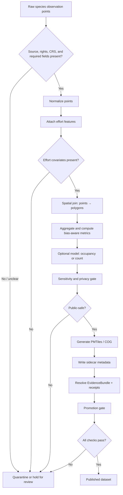

<!-- [KFM_META_BLOCK_V2]
doc_id: data.published.species_aggregation.playbook
title: Species Point → Polygon Aggregation README
type: standard
version: v1
status: draft
owners: @bartytime4life
created: NEEDS_VERIFICATION
updated: 2026-04-24
policy_label: evidence-first
related: [../../raw/README.md, ../../work/README.md, ../README.md, ../../catalog/dcat/README.md, ../../catalog/stac/README.md, ../../catalog/prov/README.md, ../../../tools/validators/promotion_gate/README.md]
tags: [geospatial, aggregation, biodiversity, evidence, governance, kfm]
notes: [Converted from source playbook; target README path remains PROPOSED until repo checkout is verified.]
[/KFM_META_BLOCK_V2] -->

<a id="top"></a>

# Species Point → Polygon Aggregation README

Transform raw species observation points into defensible, privacy-safe, bias-aware polygon summaries for KFM publication and governed API serving.

<p>
  
  
  
  
</p>

> [!IMPORTANT]
> **Status:** experimental / PROPOSED  
> **Owners:** `@bartytime4life`  
> **Target path:** `data/published/species_aggregation/README.md` — **PROPOSED; NEEDS VERIFICATION** against the mounted repo.  
> **Use this README for:** point → polygon aggregation, sensitivity-aware publication artifacts, EvidenceBundle requirements, sidecar metadata, and promotion-gate readiness.

**Quick jump:** [Scope](#scope) · [Repo fit](#repo-fit) · [Accepted inputs](#accepted-inputs) · [Exclusions](#exclusions) · [Directory tree](#directory-tree) · [Quickstart](#quickstart) · [Pipeline overview](#pipeline-overview) · [Workflow](#workflow) · [Promotion gates](#promotion-gates) · [Validation checklist](#validation-checklist) · [Definition of done](#definition-of-done) · [Appendix](#appendix-a--metadata-sidecar)

---

## Scope

This README governs the KFM publication workflow that turns species observation **points** into defensible **polygon summaries** at county, ecoregion, or other approved polygon supports.

| Included | Required posture |
|---|---|
| Point → polygon aggregation | Preserve join method, polygon source, polygon version, CRS, and source URL. |
| Effort-standardized summaries | Fail closed when effort covariates are absent. |
| Optional occupancy or count modeling | Record model type, formula, offset, model hash, and diagnostics. |
| Sensitivity protection | Do not publish exact sensitive points; publish public-safe derived outputs only. |
| Publication artifacts | Generate PMTiles and/or COG outputs only after validation and policy checks. |
| EvidenceBundle + receipts | Every publishable output must trace to source data, processing metadata, sensitivity posture, and promotion receipt. |

This README is intentionally narrow: it does not define live source acquisition, UI rendering, public API routing, or source-specific species authority.

[Back to top](#top)

---

## Repo fit

**PROPOSED target file:** `data/published/species_aggregation/README.md`

This README should sit at the publication-facing edge of the species aggregation workflow. It connects upstream raw/work data handling to downstream catalog, proof, and governed API use without turning any derivative tile, raster, summary, or model into canonical truth.

| Boundary | Role | Link or path from proposed target | Status |
|---|---|---:|---|
| Raw observations | Source intake and acquisition boundary | [`../../raw/README.md`](../../raw/README.md) | NEEDS VERIFICATION |
| Work data | Normalized and joined point tables | [`../../work/README.md`](../../work/README.md) | NEEDS VERIFICATION |
| Processed data | Aggregated analytical outputs before publication | `../../processed/README.md` | NEEDS VERIFICATION |
| Published data | Public-safe artifact parent | [`../README.md`](../README.md) | NEEDS VERIFICATION |
| DCAT catalog | Dataset/distribution discovery record | [`../../catalog/dcat/README.md`](../../catalog/dcat/README.md) | NEEDS VERIFICATION |
| STAC catalog | Geospatial asset record for PMTiles/COG outputs | [`../../catalog/stac/README.md`](../../catalog/stac/README.md) | NEEDS VERIFICATION |
| PROV catalog | Provenance graph / activity record | [`../../catalog/prov/README.md`](../../catalog/prov/README.md) | NEEDS VERIFICATION |
| Receipts | Process memory and rebuild trace | `../../receipts/README.md` | NEEDS VERIFICATION |
| Proofs | Release-grade proof objects | `../../proofs/README.md` | NEEDS VERIFICATION |
| Promotion gate | Fail-closed validation before publication | [`../../../tools/validators/promotion_gate/README.md`](../../../tools/validators/promotion_gate/README.md) | NEEDS VERIFICATION |
| Governed API layer | External access path after publication | `NEEDS_VERIFICATION` | UNKNOWN |
| UI / MapLibre rendering | Downstream presentation only | `../../../apps/` | NEEDS VERIFICATION |

> [!NOTE]
> The paths above are repo-fit guidance, not evidence that those files exist in the current workspace. Keep them as reviewable placeholders until a real checkout confirms the layout.

[Back to top](#top)

---

## Accepted inputs

Accepted inputs are the smallest set of materials needed to produce a public-safe polygon summary with traceable provenance.

| Input family | Minimum accepted shape | Fails closed when |
|---|---|---|
| Species observation points | `species_id`, `timestamp`, `lat`, `lon`, CRS metadata, source reference | Required fields, source identity, or CRS metadata are missing. |
| Source and rights metadata | Source name, source URL/ref, license URL, attribution, source role | Rights, attribution, or public-release posture is unclear. |
| Effort covariates | `observer_hours`, `checklist_count`, or `sampling_events` as applicable | No effort covariate is available for bias-aware summaries. |
| Polygon boundaries | County/ecoregion geometry, polygon source, version, CRS, source URL | Polygon source/version/join method cannot be recorded. |
| Sensitivity inputs | Rare/protected taxon flags, sensitive habitat flags, public-release restrictions | Sensitivity is unknown for records where exact location exposure could matter. |
| Optional model specification | Model type, formula, effort offset, `model_spec_hash`, diagnostics | Diagnostics fail, model hash is absent, or uncertainty cannot be represented. |

[Back to top](#top)

---

## Exclusions

These concerns belong elsewhere and must not be silently folded into this README.

| Excluded concern | Goes instead | Reason |
|---|---|---|
| Raw data acquisition pipelines | `data/raw/` and source-specific intake docs | This README starts after source intake is available. |
| Live source connector activation | Source registry / connector docs | Rights, quotas, schemas, and source terms need separate validation. |
| UI rendering logic | `apps/` | Rendering consumes governed outputs; it is not the publication gate. |
| External API exposure | Governed API layer | Public clients must use governed interfaces, not raw/work/internal stores. |
| Exact sensitive occurrence publication | Restricted access path or quarantine | Public release must protect rare/protected taxa and sensitive habitats. |
| AI-generated claims | Governed AI / Focus Mode docs | AI is interpretive; EvidenceBundle and policy outrank generated text. |

[Back to top](#top)

---

## Directory tree

```text
data/
  raw/
  work/
  quarantine/                 # PROPOSED: fail-closed holding area when source, rights, or sensitivity are unresolved
  processed/
  published/
    species_aggregation/       # PROPOSED target leaf for this README
      README.md
    tiles/
    rasters/
    sidecars/
  catalog/
    dcat/
    stac/
    prov/
  receipts/
  proofs/
```

`quarantine/` is included as a KFM lifecycle guardrail. If the mounted repo uses a different quarantine home, update this README and record the mapping rather than publishing ambiguous records.

[Back to top](#top)

---

## Quickstart

No executable aggregation command is CONFIRMED in the current evidence. Use this review sequence until the repo provides a validator, pipeline script, or task runner.

1. Confirm the source dataset, license, attribution, and source role.
2. Normalize point records into a consistent CRS and required field set.
3. Record effort covariates before aggregation.
4. Join points to approved polygons and write join metadata.
5. Apply sensitivity rules before any public artifact is generated.
6. Generate PMTiles and/or COG derivatives only after validation.
7. Attach EvidenceBundle, sidecar metadata, receipts, and catalog records.
8. Submit to the promotion gate and publish only if all checks pass without override.

> [!WARNING]
> Do not publish a species aggregation simply because a map renders. Rendering is not promotion, and derivative artifacts are not canonical truth.

[Back to top](#top)

---

## Pipeline overview



[Back to top](#top)

---

## Workflow

### Step 1 — Normalize & Ingest

**Input:** `data/raw/`

Required actions:

- Normalize CRS, with `EPSG:4326` preferred unless the repo standard says otherwise.
- Standardize the minimum point fields:
  - `species_id`
  - `timestamp`
  - `lat`
  - `lon`
- Deduplicate observations before spatial join.

**Output:** `data/work/normalized_points.parquet`

---

### Step 2 — Spatial Join (Points → Polygons)

Approved polygon sources must be source-versioned before use.

| Polygon support | Source family | Status |
|---|---|---|
| County | Census TIGER/Line County | Source version and URL required. |
| Ecoregion | EPA Ecoregions | Source version and URL required. |

Allowed join methods:

- `within`
- `intersects`
- `centroid-in-polygon`

Required join metadata:

```json
{
  "join_method": "within",
  "polygon_source": "TIGER/Line County",
  "polygon_version": "YYYY",
  "polygon_source_url": "...",
  "crs": "EPSG:4326"
}
```

**Output:** `data/work/joined_points.parquet`

---

### Step 3 — Effort & Bias Controls

Required effort features:

- `observer_hours`
- `checklist_count`
- `sampling_events`

Derived metrics:

- `detections_per_effort`
- `effort_density`

**Rule:** fail closed if effort covariates are absent. A detection count without effort context is not a publication-ready species summary.

---

### Step 4 — Modeling (Optional but Recommended)

Supported model families:

- Occupancy models with `ψ` and `p` terms.
- Poisson or Negative Binomial count models.

Required model metadata:

```json
{
  "model_type": "occupancy",
  "formula": "...",
  "effort_offset": "observer_hours",
  "model_spec_hash": "sha256:...",
  "diagnostics": {
    "converged": true
  }
}
```

Modeled outputs must carry uncertainty fields. Do not publish modeled occupancy, confidence intervals, or count estimates without recording the model specification and diagnostics.

---

### Step 5 — Sensitivity & Privacy Gating

Trigger conditions:

- Rare species.
- Protected taxa.
- Sensitive habitat.

Allowed public-protection strategies:

- Polygon-only publication with no point release.
- Coordinate fuzzing where policy permits and the transform is recorded.
- Aggregation thresholding where sparse detections could expose sensitive locations.

Required sensitivity flag:

```json
{
  "sensitivity": "restricted",
  "protection_method": "polygon_aggregation"
}
```

---

### Step 6 — Artifact Generation (PMTiles / COG)

Vector output:

- **Format:** PMTiles.
- **Geometry:** polygon.
- **Attributes:**
  - `detection_rate`
  - `effort`
  - `uncertainty` when modeled.

Raster output:

- **Format:** COG.
- **Layers:**
  - predicted occupancy.
  - confidence intervals.

Output paths:

```text
data/published/tiles/
data/published/rasters/
```

---

### Step 7 — EvidenceBundle & Receipts

EvidenceBundle must include:

- Source datasets with licenses.
- Join metadata.
- Effort variables.
- Model spec hash when modeling is used.
- Sensitivity flags.

Promotion receipt example:

```json
{
  "spec_hash": "sha256:...",
  "generated_at": "ISO8601",
  "signer": "promotion_gate@v1"
}
```

Receipts record process memory. They are not a substitute for EvidenceBundle closure, catalog records, or promotion approval.

---

### Step 8 — Promotion Gate Integration

Required fail-closed checks:

- Join metadata present.
- Effort covariates present.
- Sensitivity gating applied.
- Sidecar metadata valid.
- EvidenceBundle complete.

A candidate dataset that fails any required check remains unpublished or moves to quarantine/review. Do not override these failures in the public path.

[Back to top](#top)

---

## Publication artifacts

| Artifact | Proposed location | Required evidence |
|---|---|---|
| Normalized points | `data/work/normalized_points.parquet` | Source identity, CRS, required point fields, deduplication record. |
| Joined points | `data/work/joined_points.parquet` | Polygon source/version, CRS, join method, source URL. |
| PMTiles | `data/published/tiles/` | Public-safe polygon attributes, artifact checksum, EvidenceBundle ref. |
| COG | `data/published/rasters/` | Modeled raster layer metadata, confidence interval metadata, artifact checksum. |
| Sidecar metadata | `data/published/sidecars/` | Source, processing, sensitivity, artifact paths, `spec_hash`. |
| DCAT/STAC/PROV | `data/catalog/` | Catalog closure across dataset, assets, provenance, and checksums. |
| Receipts | `data/receipts/` | Run identity, inputs, outputs, validator summary, promotion candidate state. |
| Proofs | `data/proofs/` | Release-grade proof bundle when the repo’s proof/signing pattern is verified. |

[Back to top](#top)

---

## Promotion gates

| Gate | Required condition | Outcome if missing or invalid |
|---|---|---|
| Source and rights | Source datasets include license and attribution. | Quarantine / hold. |
| CRS and fields | Required observation fields and CRS metadata exist. | Fail closed. |
| Spatial join metadata | Join method, polygon source, version, URL, and CRS are recorded. | Fail closed. |
| Effort and bias | Effort covariates exist and bias-aware metrics are computed. | Fail closed. |
| Sensitivity | Rare/protected/sensitive records have public-safe treatment. | Deny public release. |
| Artifact integrity | PMTiles/COG paths and checksums are present. | Fail closed. |
| EvidenceBundle | EvidenceBundle resolves all consequential outputs. | Abstain from publication. |
| Sidecar schema | Metadata sidecar validates. | Fail closed. |
| Promotion receipt | Receipt records `spec_hash`, generation time, and signer. | Hold for review. |

[Back to top](#top)

---

## Validation checklist

- [ ] CRS normalized.
- [ ] Required point fields standardized: `species_id`, `timestamp`, `lat`, `lon`.
- [ ] Duplicate observations removed or explicitly retained with rationale.
- [ ] Join metadata recorded.
- [ ] Effort variables present.
- [ ] Bias-adjusted metrics computed.
- [ ] Optional model metadata recorded when modeling is used.
- [ ] Sensitivity gating applied.
- [ ] PMTiles generated when vector publication is in scope.
- [ ] COG generated when raster/model publication is in scope.
- [ ] Sidecar metadata written and validated.
- [ ] EvidenceBundle attached and resolvable.
- [ ] Promotion receipt generated.
- [ ] Validators pass without override.
- [ ] Negative or null results remain visible when evidence supports them.

[Back to top](#top)

---

## Definition of done

A species aggregation dataset is publishable only when:

- It can be deterministically rebuilt via `spec_hash`.
- Every output has traceable provenance.
- Sensitive data is appropriately protected.
- Join method, polygon support, effort controls, and model assumptions are inspectable.
- All validators pass without override.
- Null, negative, or low-confidence results are represented honestly rather than omitted for polish.

[Back to top](#top)

---

## Open verification backlog

| Item | Status | Why it remains open |
|---|---|---|
| Target README path | NEEDS VERIFICATION | No mounted repo tree was available to confirm `data/published/species_aggregation/README.md`. |
| Created date | NEEDS VERIFICATION | Source playbook marked `created` as `NEEDS VERIFICATION`. |
| Schema home | UNKNOWN | The mounted repo was not available to confirm whether sidecar schemas live under `schemas/`, `contracts/`, or another registry. |
| Validator command | UNKNOWN | No repo task runner, validator implementation, or CI workflow was available. |
| Promotion-gate interface | NEEDS VERIFICATION | The source references `tools/validators/promotion_gate/README.md`, but implementation details are not confirmed. |
| Polygon source versions | NEEDS VERIFICATION | TIGER/Line and EPA ecoregion versions must be recorded per dataset run. |
| Sensitive species authority | NEEDS VERIFICATION | Taxon sensitivity sources, steward rules, and release restrictions must be source-specific. |
| Rights and redistribution | NEEDS VERIFICATION | Licenses and attribution requirements must be confirmed before public artifact generation. |

[Back to top](#top)

---

## Appendix A — Metadata Sidecar

<details>
<summary>Required sidecar skeleton</summary>

```json
{
  "dataset_id": "...",
  "spec_hash": "...",
  "sources": [
    {
      "name": "...",
      "license_url": "...",
      "attribution": "..."
    }
  ],
  "processing": {
    "join": {},
    "effort": {},
    "model": {}
  },
  "sensitivity": {},
  "artifacts": {
    "pmtiles": "...",
    "cog": "..."
  }
}
```

</details>

<details>
<summary>Minimum sidecar review questions</summary>

- Does `dataset_id` identify the published aggregation rather than a raw source table?
- Does `spec_hash` cover the aggregation specification, source versions, join method, model spec, and sensitivity transform?
- Do all sources include license and attribution metadata?
- Does `processing.join` record method, polygon source, polygon version, URL, and CRS?
- Does `processing.effort` record which effort covariates were used or why a candidate failed closed?
- Does `processing.model` record model type, formula, offset, hash, diagnostics, and uncertainty output fields?
- Does `sensitivity` state the restriction level and public protection method?
- Do artifact paths match the generated PMTiles/COG outputs and catalog records?

</details>

[Back to top](#top)

---

## Notes

- This README enforces the KFM posture: **cite or abstain**.
- All uncertainty must remain visible.
- Public outputs should be polygon summaries, rasters, catalogs, receipts, and proofs—not raw sensitive points.
- Negative or null results must still be publishable when supported by evidence and represented with honest scope and uncertainty.
