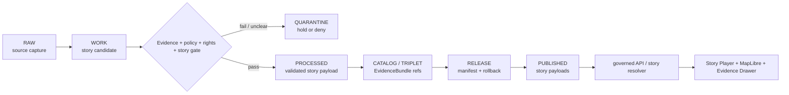

<!-- [KFM_META_BLOCK_V2]
doc_id: kfm://data/published/stories/readme
name: Published Stories README
path: data/published/stories/README.md
type: data-lane-readme
version: v0.1.0
status: draft
owners:
  - <story-subsystem-owner>
  - <data-publication-steward>
  - <release-steward>
created: 2026-06-27
updated: 2026-06-27
policy_label: restricted-review
truth_posture: cite-or-abstain
lifecycle_phase: published
responsibility_root: data/
artifact_family: released-public-safe-story-payloads
sensitivity_posture: public-safe-derivatives-only; evidence-bound; governed-story-runtime-required; release-required
related:
  - ../README.md
  - ../layers/scene/README.md
  - ../reports/README.md
  - ../../README.md
  - ../../../docs/architecture/story/README.md
  - ../../../docs/architecture/maplibre-3d.md
  - ../../../docs/architecture/ui/README.md
  - ../../../docs/architecture/governed-ai/README.md
  - ../../../docs/doctrine/derived-stays-derived.md
  - ../../../docs/doctrine/map-first.md
  - ../../../release/manifests/README.md
tags:
  - kfm
  - data
  - published
  - stories
  - story-manifest
  - story-node
  - maplibre
  - evidence-drawer
  - derived-carrier
  - release
  - evidence-first
notes:
  - "This README replaces the greenfield stub and documents the published story payload lane under data/published/."
  - "Stories are downstream narrative/playback carriers; they do not replace source records, processed data, catalog records, EvidenceBundles, proofs, receipts, policy decisions, release manifests, scene manifests, or AI receipts."
  - "Every consequential story claim must resolve to drawer evidence or abstain."
  - "Scene artifacts belong under data/published/layers/scene/; story payloads belong here only after release gates close."
  - "Actual story payload presence, schema validation, release-manifest approval, validator wiring, and CI enforcement remain UNKNOWN unless verified per release."
[/KFM_META_BLOCK_V2] -->

<a id="top"></a>

# Published Stories

Released public-safe story payloads for governed KFM map and narrative playback surfaces.

<p>
  
  
  
  
  
  
</p>

**Quick links:** [Scope](#scope) · [Repo fit](#repo-fit) · [Story artifact families](#story-artifact-families) · [Inputs](#inputs) · [Exclusions](#exclusions) · [Directory map](#directory-map) · [Publication boundary](#publication-boundary) · [Required checks](#required-checks-before-use) · [Status notes](#status-notes)

> [!IMPORTANT]
> `data/published/stories/` is a released story payload lane. It is not a story authoring workspace, source authority, proof authority, receipt authority, release authority, catalog authority, scene authority, map-runtime authority, model authority, or AI truth. Story playback must resolve consequential claims to evidence through governed interfaces or abstain.

---

## Scope

This directory may hold released public-safe story payloads for KFM narrative playback. Examples include story manifests, story-node indexes, story playback bundles, node evidence-reference summaries, story caveats, reality-boundary summaries, story snapshot metadata, digests, and generated release pointers after evidence, source role, rights, policy, review, release, correction, and rollback requirements are met.

Stories are downstream carriers. They coordinate camera, time, layer state, panels, scene pointers, and narrative text, but claim truth remains in source records, processed domain objects, catalog and EvidenceBundle records, proofs, receipts, policy decisions, review records, scene/layer release state, and release manifests.

---

## Repo fit

| Field | Value |
|---|---|
| Path | `data/published/stories/` |
| Responsibility root | `data/` |
| Lifecycle phase | `published/` |
| Artifact role | Released public-safe story payloads, manifests, indexes, sidecars, and delivery packages |
| Scene counterpart | `data/published/layers/scene/` |
| Architecture counterpart | `docs/architecture/story/` |
| Runtime posture | Governed map/story API and Evidence Drawer only |
| Upstream lifecycle | `RAW -> WORK / QUARANTINE -> PROCESSED -> CATALOG / TRIPLET -> RELEASE -> PUBLISHED` |
| Release authority | `release/`, not this directory |
| Proof authority | `data/proofs/` and `data/receipts/`, not this directory |
| Catalog authority | `data/catalog/`, not this directory |
| Default failure posture | `DENY`, `HOLD`, `RESTRICT`, or `ABSTAIN` when evidence, policy, rights, sensitivity, story validation, scene/layer release state, digest, or rollback support is insufficient |

---

## Story artifact families

The families below are allowed only when release-approved and public-safe. This table does not prove payloads currently exist.

| Family | Examples | Boundary |
|---|---|---|
| Story manifests | `story.manifest.json`, story index files | Must validate against the governed story contract and cite release state. |
| Story-node payloads | Node sequence, time state, camera path, panel state | Consequential claims must resolve to EvidenceBundle references or abstain. |
| Scene/story companions | Scene pointers, layer requirements, view-state pointers | Scenes and layers remain separate released carriers. |
| Evidence summaries | Node evidence refs, citation index, drawer payload pointers | Navigation only; not proof authority. |
| Runtime caveats | Reality-boundary, policy, admission, and fallback summaries | Explain playback boundaries; do not replace policy/release authority. |
| Release-local indexes | `latest.json`, `public_index.json`, release README files | Navigation only; generated from release state. |

---

## Inputs

Accepted content is limited to release-approved story payloads and immediate sidecars such as:

- story manifests and story indexes generated from release state;
- story-node payloads, node sequences, camera-path references, time-window references, and panel-state sidecars;
- evidence-reference summaries, citation indexes, layer allowlists, scene pointers, and caveat summaries;
- reality-boundary summaries for interpretive or synthetic presentation content;
- story snapshot metadata and representation summaries;
- digest files such as `.sha256` that bind story payload bytes to release state;
- release-local README files and `latest.json` pointers only when generated from release state.

---

## Exclusions

| Do not place here | Correct authority home |
|---|---|
| RAW source captures, uploaded media, or source mirrors | Source-specific `data/raw/` or intake lanes |
| WORK story drafts, authoring scratch, prompts, unresolved story nodes, or candidate narration | `data/work/` or the appropriate story authoring workspace |
| Quarantined, rights-unclear, or policy-held story content | `data/quarantine/` |
| Canonical processed domain objects | Their `data/processed/<domain>/` lanes |
| Catalog records, triplets, graph truth, or EvidenceBundle state | `data/catalog/`, triplet lanes, or proof lanes |
| EvidenceBundle / ProofPack | `data/proofs/` |
| Validation, transform, representation, story-build, AI, or release receipts | `data/receipts/` |
| Release manifests, promotion decisions, correction records, rollback records, or signatures | `release/` |
| Scene artifacts and scene sidecars | `data/published/layers/scene/` |
| UI source code, story player components, runtime adapters, or plugins | `apps/`, `packages/`, or the verified implementation root |
| Model-generated story claims without governed evidence anchors | Governed answer/provenance paths only |
| Restricted detail hidden only by styling, camera position, zoom threshold, or client filtering | Restricted governed lanes only; not public story payloads |

---

## Directory map

```text
data/published/stories/
├── README.md
├── <release_id>/
│   ├── story.manifest.json
│   ├── story.index.json
│   ├── story_nodes.json
│   ├── node_evidence_refs.json
│   ├── citation_index.json
│   ├── layer_requirements.json
│   ├── scene_refs.json
│   ├── caveats.summary.json
│   ├── reality_boundary.summary.json
│   ├── story.sha256
│   └── README.md
└── latest.json
```

`latest.json` must be generated from release state. Remove or withhold it when release, review, digest, citation closure, scene/layer dependency state, correction, or rollback support is incomplete.

---

## Publication boundary



The forbidden shortcut is:

```text
RAW / WORK / QUARANTINE / direct source record / direct model output / unreleased story draft / uncited claim / unreleased scene
→ direct public story payload
```

---

## Required checks before use

- [ ] Confirm the story payload belongs in this published lane rather than a work, docs, scene, layer, or runtime lane.
- [ ] Confirm the release manifest and promotion decision.
- [ ] Confirm proof, receipt, catalog/EvidenceBundle, and citation closure for every consequential claim.
- [ ] Confirm story manifest validation, node validation, and finite outcome handling.
- [ ] Confirm source descriptors, source roles, rights posture, and current terms.
- [ ] Confirm policy, sensitivity, redaction/generalization, scene/layer dependency, and reality-boundary requirements.
- [ ] Confirm layer allowlist, scene refs, story manifest, citation index, evidence refs, and released-byte digest.
- [ ] Confirm rollback target, correction path, and withdrawal path.
- [ ] Confirm `latest.json`, if present, is generated from release state.
- [ ] Confirm public clients consume stories through governed story APIs, release-resolved URLs, or approved static hosting paths.
- [ ] Confirm no story payload is treated as source, proof, release, catalog, registry, scene, map-runtime, model, or AI authority.

---

## Status notes

| Claim | Status |
|---|---|
| This README replaces the greenfield stub at `data/published/stories/README.md`. | **CONFIRMED authored** |
| The target path existed in the live repository as a greenfield stub before this edit. | **CONFIRMED by GitHub contents API during this edit** |
| Story architecture requires consequential claims to resolve to drawer evidence or abstain. | **CONFIRMED by GitHub contents API during this edit** |
| Story architecture treats story manifests as lifecycle-promoted artifacts with release-time receipts. | **CONFIRMED by GitHub contents API during this edit** |
| The scene counterpart `data/published/layers/scene/README.md` exists and documents released scene carriers. | **CONFIRMED by GitHub contents API during this edit** |
| Actual story payloads exist under this subtree. | **UNKNOWN** |
| Release manifests approve story payloads under this subtree. | **UNKNOWN** |
| Story validators and CI checks enforce this exact lane. | **NEEDS VERIFICATION** |
| This README is release authority, story truth, scene truth, map-runtime authority, model authority, or AI truth. | **DENY** |

---

## Related files

- [`../README.md`](../README.md)
- [`../layers/scene/README.md`](../layers/scene/README.md)
- [`../reports/README.md`](../reports/README.md)
- [`../../README.md`](../../README.md)
- [`../../../docs/architecture/story/README.md`](../../../docs/architecture/story/README.md)
- [`../../../docs/architecture/maplibre-3d.md`](../../../docs/architecture/maplibre-3d.md)
- [`../../../docs/architecture/ui/README.md`](../../../docs/architecture/ui/README.md)
- [`../../../docs/architecture/governed-ai/README.md`](../../../docs/architecture/governed-ai/README.md)
- [`../../../docs/doctrine/derived-stays-derived.md`](../../../docs/doctrine/derived-stays-derived.md)
- [`../../../docs/doctrine/map-first.md`](../../../docs/doctrine/map-first.md)
- [`../../../release/manifests/README.md`](../../../release/manifests/README.md)

---

KFM rule: this directory is a released public-safe story payload lane only. It is not source authority, proof authority, receipt authority, release authority, catalog authority, registry authority, scene authority, map-runtime authority, story-authoring authority, model authority, or AI truth.

[Back to top](#top)
