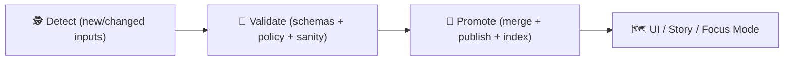
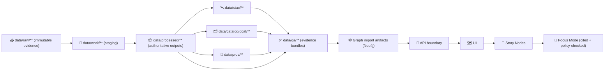

<div align="center">

# ✅ `data/qa/` — Quality Assurance & Promotion Proof (KFM) 🧪🧾


-111827)


_This folder holds **QA evidence bundles** (reports, manifests, diffs, fixtures, baselines) that prove KFM data + metadata is **safe to promote** into Graph → API → UI → Story Nodes → Focus Mode._ 🗺️📚🤖

</div>

> [!IMPORTANT]
> **QA is part of the system contract.** “It looks fine” is not a gate.  
> KFM is **contract-first + provenance-first**: anything that appears in UI / exports / Focus Mode must be **traceable** (STAC/DCAT/PROV) and must pass **policy gates** (OPA/Conftest) before it’s promoted. ✅

> [!CAUTION]
> **Do not put secrets, credentials, private keys, PII, or restricted/sensitive coordinates** in QA artifacts.  
> QA outputs are *still data* — and derived outputs can leak even if the raw source was protected. 🔐⚠️

---

<details>
<summary><b>📌 Table of contents</b> (click to expand)</summary>

- [⚡ Quick links](#-quick-links)
- [🧭 Canonical promotion flow](#-canonical-promotion-flow)
- [🚧 Non-negotiables enforced by policy](#-non-negotiables-enforced-by-policy)
- [🧰 What `data/qa/` is for (and what it is not)](#-what-dataqa-is-for-and-what-it-is-not)
- [🗺️ Where QA fits in the architecture](#️-where-qa-fits-in-the-architecture)
- [🧱 Directory layout](#-directory-layout)
- [📦 The QA bundle contract](#-the-qa-bundle-contract)
- [✅ Quality gates (what must pass)](#-quality-gates-what-must-pass)
- [🧾 Recommended checks by artifact type](#-recommended-checks-by-artifact-type)
- [🧪 Run QA locally (examples)](#-run-qa-locally-examples)
- [🔐 QA + governance safety](#-qa--governance-safety)
- [🧠 Visual + UX QA](#-visual--ux-qa)
- [📊 Telemetry & sustainability QA](#-telemetry--sustainability-qa)
- [✅ Adding QA for a new dataset (checklist)](#-adding-qa-for-a-new-dataset-checklist)
- [🕰️ Version history](#️-version-history)
- [📚 Project reference shelf](#-project-reference-shelf-files-that-informed-this-qa-design)
- [🧷 Footer refs (do not remove)](#-footer-refs-do-not-remove)

</details>

---

## ⚡ Quick links

> Tip: these are **repo-relative** from `data/qa/README.md`.

- 🧭 Back to data root → `../README.md` *(if present)*
- 📥 Raw intake boundary → `../raw/` *(trust boundary #1)*
- 🧰 Work / staging → `../work/`
- 📦 Final data products → `../processed/`
- 🛰️ STAC catalogs → `../stac/`
- 🗂️ DCAT catalogs → `../catalog/dcat/`
- 🧬 PROV bundles → `../prov/`
- 🕸️ Graph import artifacts → `../graph/`
- 🛡️ Policy Pack docs → `../../api/scripts/policy/` *(if present)*
- 🧰 Validation tooling → `../../tools/validation/` *(if present)*
- 🧪 CI workflows → `../../.github/workflows/`

---

## 🧭 Canonical promotion flow

KFM follows a managed promotion pattern:

**Detect → Validate → Promote** ✅

And at the system level:

**RAW → WORK → PROCESSED → STAC/DCAT/PROV → QA → Graph → API → UI → Story Nodes → Focus Mode**

QA exists **after** the metadata boundary (STAC/DCAT/PROV exist) and **before** anything downstream can safely consume it. That’s how we guarantee “the map behind the map” stays traceable. 🧭🗺️



---

## 🚧 Non-negotiables enforced by policy

KFM’s “Policy Pack” (OPA/Rego, executed via Conftest in CI) is the automated referee. 🛡️⚖️  
These are the kinds of rules QA must **prove** were satisfied:

- **Provenance-first publishing**: no data reaches Graph/UI unless provenance exists (STAC/DCAT/PROV). 🧬
- **Contract-first metadata**: required metadata fields must exist (source, license, extents, classification, etc.). 🏷️
- **No mystery layers**: nothing appears in UI without traceable catalog identifiers + provenance. 🕵️‍♀️❌
- **Citations required** (Story Nodes + Focus Mode): if it can’t be sourced, it must be flagged as uncertain/refused. 📌
- **Fail-closed posture**: if a check can’t run, it fails and blocks promotion. 🔒
- **Sensitivity preserved**: classification/CARE rules cannot be “laundered” in derived outputs. 🟣

> [!NOTE]
> QA bundles should include **policy execution evidence** (sanitized) — not just “tests passed”.

---

## 🧰 What `data/qa/` is for (and what it is not)

### ✅ This folder **IS**
- 🧾 **Machine-readable QA outputs**: JSON reports, manifests, diff summaries, benchmark summaries.
- 🧪 **Human-readable summaries**: short Markdown reports, small tables, safe screenshots.
- 🧱 **Fixtures + baselines**: tiny, safe datasets + expected outputs for regression testing.
- 🛡️ **Policy gate evidence**: sanitized Conftest/OPA outputs, rule versions, decision summaries.
- 🧬 **Provenance pointers**: identifiers linking back to STAC/DCAT/PROV and (optionally) governance ledger IDs.

### ❌ This folder is **NOT**
- A dumping ground for raw logs from failed jobs (upload as CI artifacts instead).
- A place for large rasters/vectors (keep those in `data/processed/**` or external object storage).
- A replacement for STAC/DCAT/PROV (QA references them; it does not supplant them).
- A place for secrets, connection strings, or restricted coordinates.

> [!TIP]
> **Code lives in `tools/validation/` and/or `api/scripts/policy/` — evidence lives in `data/qa/`.**  
> Keep QA deterministic, reviewable, and governance-auditable ✅

---

## 🗺️ Where QA fits in the architecture

KFM’s architecture is modular: processed outputs are indexed (STAC-like), discoverable (DCAT), provenance-linked (PROV), policy-gated, then consumed by Graph/API/UI/Focus. 🧩



---

## 🧱 Directory layout

> Recommended structure. Keep aligned with what exists in-repo. 📁

```text
📁 data/
└── 📁 qa/
    ├── 📄 README.md                      👈 you are here
    ├── 📁 fixtures/                      # tiny, safe, reviewable datasets for tests
    ├── 📁 baselines/                     # expected outputs/metrics for regression checks
    └── 📁 <domain>/
        └── 📁 <dataset_slug>/
            └── 📁 <version_or_run_id>/   # e.g., 2026-01-19T12-30-00Z__abcd1234
                ├── 📄 QA_MANIFEST.json
                ├── 📄 checksums.sha256
                ├── 📁 catalog/           # STAC/DCAT/PROV validation + link checks
                ├── 📁 geospatial/        # CRS/geometry/raster/COG/tiling checks
                ├── 📁 statistical/       # sanity stats + drift + regression diagnostics
                ├── 📁 policy/            # OPA/Conftest outputs (sanitized) + rule versions
                ├── 📁 governance/        # classification/CARE checks + (optional) ledger refs
                ├── 📁 ai/                # Focus Mode / story citation harness results (if applicable)
                ├── 📁 performance/       # tile/API/query benchmarks (small summaries)
                ├── 📁 telemetry/         # trace/energy coverage summaries (optional, small)
                └── 📄 report.md          # human-friendly summary (recommended)
```

> [!IMPORTANT]
> **If it’s too big to review in a PR, it’s too big to commit to `data/qa/`.**  
> Store only summaries + checksums + pointers; put full artifacts in CI storage.

---

## 📦 The QA bundle contract

Every QA bundle should answer:

1) **What did we check?** (rules + versions + policy pack hash)  
2) **What did we check it against?** (dataset IDs + checksums + STAC/DCAT/PROV pointers)  
3) **What happened?** (pass/fail + metrics + diffs + thresholds)  
4) **Can we reproduce it?** (commit SHA, tool versions, config, run context)

### `QA_MANIFEST.json` minimum fields (recommended baseline)

```json
{
  "qa_run_id": "2026-01-19T12-30-00Z__abcd1234",
  "dataset_id": "kfm.<domain>.<dataset_slug>",
  "dataset_version": "<version_or_run_id>",

  "pipeline_contract_version": "v13",
  "profiles": {
    "stac_profile": "kfm-stac@<version>",
    "dcat_profile": "kfm-dcat@<version>",
    "prov_profile": "kfm-prov@<version>",
    "policy_pack": "kfm-policy@<version-or-commit>"
  },

  "commit_sha": "<git sha>",
  "ci": {
    "workflow": "<github workflow name>",
    "run_id": "<github run id>",
    "pr_number": "<optional>",
    "actor": "<user-or-bot>"
  },

  "inputs": {
    "raw_receipts": ["data/raw/<...>/source.json", "data/raw/<...>/checksums.sha256"],
    "processed_paths": ["data/processed/<domain>/<dataset_slug>/<version_or_run_id>/..."],
    "stac_ids": ["<collection-id>", "<item-id>"],
    "dcat_ids": ["<dataset-iri-or-id>"],
    "prov_ids": ["<prov-bundle-id-or-path>"]
  },

  "governance": {
    "classification": "<public|restricted|mixed|...>",
    "care_labels": ["<label-1>", "<label-2>"],
    "sensitivity_notes": "<optional>"
  },

  "tools": [
    {"name": "conftest", "version": "x.y.z"},
    {"name": "opa", "version": "x.y.z"},
    {"name": "jsonschema", "version": "x.y.z"}
  ],

  "results": {
    "status": "pass",
    "failures": [],
    "summary": {
      "broken_links": 0,
      "invalid_geometries": 0,
      "missing_required_fields": 0,
      "policy_violations": 0
    },
    "thresholds": {
      "max_broken_links": 0,
      "max_invalid_geometries": 0
    }
  },

  "outputs": [
    "data/qa/<domain>/<dataset_slug>/<version_or_run_id>/catalog/stac_report.json",
    "data/qa/<domain>/<dataset_slug>/<version_or_run_id>/policy/conftest_summary.json",
    "data/qa/<domain>/<dataset_slug>/<version_or_run_id>/report.md"
  ]
}
```

> [!TIP]
> **Checksums matter.** Store `checksums.sha256` for every QA output you commit.  
> QA is evidence; evidence should be integrity-verifiable 🧾🔒

### `report.md` (suggested human template)

Use this to make PR review fast:

- ✅ **Decision**: pass/fail + why  
- 🧬 **Catalog triplet**: STAC/DCAT/PROV IDs  
- 🛡️ **Policy**: policy pack version + high-level outcomes  
- 🗺️ **Geo sanity**: CRS, bounds, geometry validity  
- 📊 **Stats**: counts, missingness, drift summary  
- 🚀 **Performance**: any budgets exceeded?  
- 🧑‍⚖️ **Governance**: classification, CARE, redactions, required approvals

---

## ✅ Quality gates (what must pass)

KFM’s gates are intentionally “boring” — predictable, repeatable, least-privilege — so the *data* can be interesting. 😄

### 1) Structural validity (schemas + parsing)
- JSON/YAML parse sanity
- STAC/DCAT/PROV schema validation + KFM profile checks
- Required fields present (license, identifiers, classification, extents)

### 2) Referential integrity (pointers resolve)
- STAC ↔ DCAT alignment (IDs + distributions)
- PROV bundles reference correct inputs/outputs
- Graph import artifacts reference valid catalog identifiers (no dangling edges)

### 3) Policy Pack compliance (OPA / Conftest)
- Policy gate outputs stored (sanitized) under `policy/`
- All required policy rules evaluated
- **Fail-closed**: missing policy evidence == failure

### 4) Geospatial sanity 🗺️
- CRS present and expected (EPSG)
- Bounding boxes and coordinate ranges sane
- Geometry validity (no self-intersections, empties)
- Raster metadata sanity (nodata, dtype, pixel size); COG compliance (if applicable)

### 5) Statistical sanity + drift 📊
- Missingness/duplicates/outliers checks
- Distribution drift checks (when time series or refresh pipelines exist)
- Regression diagnostics / residual checks for modeled outputs (when present)

### 6) Simulation / model V&V (when relevant) 🧠
- Verification: did we build it right?
- Validation: did we build the right thing?
- UQ + sensitivity checks (what moves outputs?)
- Reproducible run IDs (deterministic config-driven sim runners)

### 7) Focus Mode / Story QA (when relevant) 🎯📖
- Citation coverage checks (every claim backed by a dataset/doc/entity)
- “Refuse/uncertain” behavior verified when evidence is missing
- Governance checks for sensitive info in generated narratives

### 8) Governance safety 🔐
- Classification and CARE labels preserved (no “sensitivity laundering”)
- Redaction checks for restricted coordinates
- Output privacy risk review (processed outputs can still leak)

### 9) Performance budgets (when it affects delivery) 🚀
- Lightweight benchmarks for tile generation, query latency, payload size
- Budget thresholds (fail PRs that regress beyond tolerance)

---

## 🧾 Recommended checks by artifact type

| Artifact type | Examples | QA checks (minimum) |
|---|---|---|
| 🛰️ STAC | collections/items | schema validate; required fields; link-check; asset href sanity |
| 🗂️ DCAT | dataset JSON-LD | profile/shape validate; license present; distribution links resolve |
| 🧬 PROV | lineage bundles | parse; entities/activities; pointers to inputs/outputs; agent roles |
| 🗺️ Vector | GeoJSON/GeoPackage | CRS; geometry validity; bounds; topology sanity |
| 🧱 Raster | GeoTIFF/COG | nodata/dtype; CRS; overviews; COG compliance; checksum |
| 🧾 Tabular | CSV/Parquet/DB export | schema; null rates; duplicates; value ranges; referential integrity |
| 🕸️ Graph imports | CSV/Cypher | ontology/type checks; node/edge integrity; traceable to catalogs |
| 🛡️ Policy | conftest outputs | policy pack version; evaluated rules; deny list = 0 |
| 🧠 AI outputs | test Q&A sets | citation coverage; refusals; safety & governance compliance |
| 🧷 Visual derivatives | PNG/JPEG quicklooks | size/resolution; compression rules; metadata stripping if needed |

---

## 🧪 Run QA locally (examples)

> These are examples. Prefer running the exact commands CI runs.

```bash
# 1) Quick parse sanity
python -m json.tool data/qa/<domain>/<dataset_slug>/<run>/QA_MANIFEST.json > /dev/null

# 2) Policy Pack (if present)
# conftest test <inputs> -p api/scripts/policy/ --output json > data/qa/.../policy/conftest.json

# 3) Catalog QA (if present)
# python tools/validation/catalog_qa/run_catalog_qa.py --fail-on-broken-links

# 4) Geo QA (if present)
# python tools/validation/geo_qa/run_geo_qa.py --input data/processed/<domain>/<dataset_slug>/<run>/
```

> [!CAUTION]
> If you generate large reports locally, do not commit them by default.  
> Commit **small manifests + summaries**; upload full logs as CI artifacts.

---

## 🔐 QA + governance safety

### Two rules that prevent most mistakes ✅

1) **No precise sensitive locations** in QA outputs unless explicitly authorized.  
   - Prefer coarse bboxes, generalized geometries, hashed identifiers, or zoom-limited summaries.
2) **No derived leaks.** Analytics/ML outputs can disclose sensitive info; QA must treat *outputs* as sensitive too.

### Privacy-preserving QA patterns (recommended)
- Report **aggregates**, not raw rows (counts, rates, quantiles).
- Store **hashes/checksums**, not sensitive exemplars.
- Use **redacted fixtures** in `data/qa/fixtures/` rather than real data.
- If screenshots are needed: **crop + blur + downsample** (keep evidence, remove risk).

### Human oversight (when applicable) 🧑‍⚖️
For high-stakes or sensitive datasets, QA bundles should include evidence of required reviews/sign-offs (even if it’s just a pointer to the relevant governance process or decision artifact). 👥✅

---

## 🧠 Visual + UX QA

KFM’s outputs land in map UIs; quality includes legibility and mobile behavior:

- 🧭 Layer provenance surfaced (source attributions; “map behind the map”)
- 🎯 Focus Mode answers show citations and differentiate AI output from source facts
- 📱 Responsive constraints: bandwidth, mobile interaction, offline packs (where used)
- 🧠 WebGL layer sanity: malformed tiles, memory pressure, crash checks
- ♿ Accessibility: contrast, font sizes, keyboard navigation for UI elements

> [!NOTE]
> Visual QA artifacts should be **safe** (no restricted coordinates) and **small** (thumbnails, not full-res exports).

---

## 📊 Telemetry & sustainability QA

If telemetry/energy monitoring is enabled in CI or pipelines:

- keep telemetry artifacts **small and aggregated** (`telemetry_summary.json`)
- record **trace coverage** and **energy report presence** as pass/fail signals
- store only what is needed to establish compliance (no sensitive payloads)

Examples (optional):
- trace coverage % (required spans present)
- energy/carbon report generated (yes/no)
- budget regressions (runtime, memory)

---

## ✅ Adding QA for a new dataset (checklist)

- [ ] Data staged (`raw/` → `work/` → `processed/`)
- [ ] Catalog triplet exists (STAC/DCAT/PROV) and validates ✅
- [ ] `data/qa/<domain>/<dataset>/<run>/QA_MANIFEST.json` created
- [ ] `checksums.sha256` added for committed QA outputs
- [ ] Policy Pack checks pass (OPA/Conftest) 🛡️
- [ ] Geo checks pass (CRS, bounds, validity)
- [ ] Statistical checks pass (ranges, drift when applicable)
- [ ] Governance checks pass (classification/CARE preserved; no leak)
- [ ] (If model/sim) V&V + UQ recorded (or explicitly “not applicable”)
- [ ] CI uploads full logs; repo stores only small, reviewable evidence

---

## 🕰️ Version history

| Version | Date | Change | Author |
|---|---|---|---|
| v1.1.0 | 2026-01-19 | Added Policy Pack evidence, governance/AI/telemetry QA lanes, updated bundle contract | TBD |
| v1.0.0 | 2026-01-08 | Initial `data/qa/README.md` runbook + QA bundle contract | TBD |

---

## 📚 Project reference shelf (files that informed this QA design)

> Convention (recommended): store reference PDFs under `docs/library/` and specs under `docs/specs/`.

### Core KFM contracts + architecture 🏗️
- `docs/specs/MARKDOWN_GUIDE_v13.md` (pipeline contract + story/citation rules)
- KFM — Comprehensive Technical Documentation (contract-first + no mystery layers)
- KFM — Data Intake Technical & Design Guide (catalog triplet, policy pack, W-P-E, fail-closed)
- KFM — AI System Overview (Focus Mode citations + governance checks)
- KFM — Comprehensive UI System Overview (provenance surfaced in UI, citations, export credits)
- KFM — Comprehensive Architecture, Features, and Design (metadata profiles, validation tooling)

### Optional: expansion ideas 💡
- Innovative Concepts to Evolve KFM (community verification, sensitivity-aware handling, governance patterns)
- Latest Ideas & Future Proposals (policy pack + telemetry/energy monitoring concepts)

---

## 🧷 Footer refs (do not remove)

- `docs/specs/MARKDOWN_GUIDE_v13.md`
- `data/stac/` + `data/catalog/dcat/` + `data/prov/`
- `data/raw/` + `data/work/` + `data/processed/`
- `data/graph/`
- `api/scripts/policy/` *(if present)*
- `tools/validation/` *(if present)*
- `.github/workflows/`