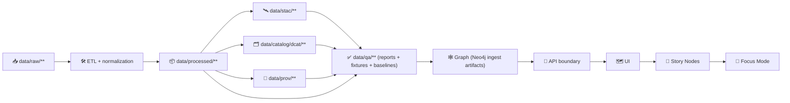

<div align="center">

# ✅ `data/qa/` — Quality Assurance (KFM)


_This folder holds **QA evidence** (reports, manifests, diffs, fixtures) that proves KFM data + metadata is safe to promote._ 🧪🧾

</div>

> [!IMPORTANT]
> **QA is part of the system contract.** “It looks fine” is not a gate.  
> Every promoted dataset must be **valid**, **traceable**, and **governance-safe** before it can flow to Graph → API → UI → Story Nodes → Focus Mode.  [oai_citation:0‡MARKDOWN_GUIDE_v13.md.gdoc](file-service://file-UYVruFXfueR8veHMUKeugU)

> [!CAUTION]
> **Do not put secrets, credentials, private keys, PII, or restricted/sensitive coordinates** in QA artifacts.  
> QA outputs are *still data* — and can leak sensitive information even if the source was protected.  [oai_citation:1‡Data Mining Concepts & applictions.pdf](file-service://file-2uwEbQAFVKpXaTtWgUirAH)

---

## ⚡ Quick links

- 🧭 Back to data root → `data/README.md` *(if present)*
- 📦 Final data products → `data/processed/` *(if present)*
- 🛰️ STAC catalogs → `data/stac/`
- 🗂️ DCAT catalogs → `data/catalog/dcat/`
- 🧬 PROV bundles → `data/prov/`
- 🕸️ Graph import artifacts → `data/graph/`
- 🧰 Validation tooling → `tools/validation/` *(if present)*
- 🧪 CI workflows → `.github/workflows/`

---

## 🧭 Canonical pipeline order (non‑negotiable)

**ETL → STAC/DCAT/PROV → QA → Graph → API → UI → Story Nodes → Focus Mode**

QA sits **between** “metadata boundary artifacts exist” and “graph/API/UI can safely consume outputs” because:
- QA verifies *contracts* (schemas, identifiers, link integrity),
- QA verifies *correctness* (geo + statistical sanity),
- QA verifies *governance safety* (classification/CARE consistency, redaction, leak checks).  [oai_citation:2‡MARKDOWN_GUIDE_v13.md.gdoc](file-service://file-UYVruFXfueR8veHMUKeugU)

---

## 🧰 What `data/qa/` is for (and what it is not)

### ✅ This folder **IS**
- 🧾 A home for **machine-readable** validation outputs (JSON reports, manifests, diff summaries).
- 🧪 A home for **human-readable** QA summaries (Markdown reports, small tables, screenshots if safe).
- 🧱 A home for **fixtures + baselines** (tiny datasets and expected outputs for regression tests).
- 🧬 A place to store **QA evidence pointers** that link back to STAC/DCAT/PROV identifiers.

### ❌ This folder is **NOT**
- A dumping ground for raw logs from failed jobs (upload those as CI artifacts instead).
- A place to store large rasters/vectors (those belong under `data/processed/**` and/or external storage).
- A substitute for STAC/DCAT/PROV (QA references them; it does not replace them).
- A place for operational secrets, connection strings, or credentials.

> [!TIP]
> **Code lives in `tools/validation/` (or `src/**`) — evidence lives in `data/qa/`.**  
> That separation keeps QA deterministic, reviewable, and governance-auditable.

---

## 🗺️ Where QA fits in the architecture

KFM’s system design emphasizes a modular pipeline where processed outputs are indexed (STAC-like), discoverable (DCAT), and provenance-linked (PROV), then consumed by higher layers.  [oai_citation:3‡Kansas-Frontier-Matrix_ Open-Source Geospatial Historical Mapping Hub Design.pdf](file-service://file-ShqHKgjxCS9UT9vbcxDNzA)



---

## 🧱 Directory layout

> This is the **recommended** layout. Keep it aligned with what exists in-repo.

```text
📁 data/
└── 📁 qa/
    ├── 📄 README.md                      👈 you are here
    ├── 📁 fixtures/                      # tiny, safe, reviewable datasets for tests
    ├── 📁 baselines/                     # expected outputs/metrics for regression checks
    └── 📁 <domain>/
        └── 📁 <dataset_slug>/
            └── 📁 <version_or_run_id>/
                ├── 📄 QA_MANIFEST.json
                ├── 📄 checksums.sha256
                ├── 📁 catalog/           # STAC/DCAT/PROV validation + link checks
                ├── 📁 geospatial/        # CRS/geometry/raster/COG/tiling checks
                ├── 📁 statistical/       # sanity stats + drift + regression diagnostics
                ├── 📁 simulation/        # V&V + UQ (if models/simulations are involved)
                ├── 📁 security/          # PII/secret/redaction checks (outputs only, no secrets)
                ├── 📁 performance/       # tile/API/query benchmarks (small summaries)
                └── 📄 report.md          # human-friendly summary (optional but recommended)
```

---

## 📦 The QA bundle contract

Every QA bundle should answer four questions:

1) **What did we check?** (rules + versions)  
2) **What did we check it against?** (dataset IDs + checksums + STAC/DCAT/PROV pointers)  
3) **What happened?** (pass/fail + metrics + diffs)  
4) **Can we reproduce it?** (commit SHA, tool versions, config)

### `QA_MANIFEST.json` (minimum fields)

```json
{
  "qa_run_id": "2026-01-08T12-30-00Z__<shortid>",
  "dataset_id": "kfm.<domain>.<dataset_slug>",
  "dataset_version": "<version_or_run_id>",
  "pipeline_contract_version": "v13",
  "commit_sha": "<git sha>",
  "inputs": {
    "processed_paths": ["data/processed/<domain>/<dataset_slug>/<version_or_run_id>/..."],
    "stac_ids": ["<collection-id>", "<item-id>"],
    "dcat_ids": ["<dataset-iri-or-id>"],
    "prov_ids": ["<prov-bundle-id-or-path>"]
  },
  "governance": {
    "classification": "<public|restricted|mixed|...>",
    "care_label": "<label or TBD>",
    "sensitivity_notes": "<optional>"
  },
  "tools": [
    {"name": "stac-validator", "version": "x.y.z"},
    {"name": "jsonschema", "version": "x.y.z"}
  ],
  "results": {
    "status": "pass",
    "failures": [],
    "summary": {
      "broken_links": 0,
      "invalid_geometries": 0,
      "missing_required_fields": 0
    }
  },
  "outputs": [
    "data/qa/<domain>/<dataset_slug>/<version_or_run_id>/catalog/stac_report.json",
    "data/qa/<domain>/<dataset_slug>/<version_or_run_id>/geospatial/geometry_report.json",
    "data/qa/<domain>/<dataset_slug>/<version_or_run_id>/report.md"
  ]
}
```

> [!TIP]
> **Checksums matter.** Store `checksums.sha256` for all QA outputs you commit.  
> QA is evidence; evidence should be integrity-verifiable.

---

## ✅ Quality gates (what must pass)

These are KFM’s “boring” gates — predictable, repeatable, least-privilege — so the *data* can be interesting.  [oai_citation:4‡MARKDOWN_GUIDE_v13.md.gdoc](file-service://file-UYVruFXfueR8veHMUKeugU)

### 1) Structural validity (schemas + parsing)
- JSON/YAML parse sanity
- STAC/DCAT/PROV schema validation
- Required fields present (license, providers, identifiers, etc.)

### 2) Referential integrity (pointers resolve)
- STAC ↔ DCAT alignment (IDs and distributions)
- PROV bundles exist and reference the correct inputs/outputs
- Graph import artifacts (if any) reference valid STAC/DCAT/PROV identifiers

### 3) Geospatial sanity
- CRS present and expected (EPSG)
- Bounding boxes and coordinate ranges sane
- Geometry validity (no self-intersections, empties)
- Raster metadata sanity (nodata, dtype, pixel size); COG compliance (if applicable)  [oai_citation:5‡PostgreSQL Notes for Professionals - PostgreSQLNotesForProfessionals.pdf](file-service://file-742sw3gADJniEdmC19JeAC)  [oai_citation:6‡python-geospatial-analysis-cookbook.pdf](file-service://file-HT14njz1MhrTZCE7Pwm5Cu)

### 4) Statistical sanity + drift
- Missingness/duplicates/outliers checks
- Distribution drift checks (when time series or refresh pipelines exist)
- Regression diagnostics / residual checks for modeled outputs  [oai_citation:7‡Understanding Statistics & Experimental Design.pdf](file-service://file-SdX6LMgi1uDRk5kd4H4Bg3)  [oai_citation:8‡Cloud-Based Remote Sensing with Google Earth Engine-Fundamentals and Applications.pdf](file-service://file-JVv3nbvtonX1HcpeERi9kV)  [oai_citation:9‡Regression analysis using Python - slides-linear-regression.pdf](file-service://file-Ekbky5FwpaPHfZC2ttv6xR)

### 5) Simulation / model V&V (when relevant)
- Verification (did we build it right?)
- Validation (did we build the right thing?)
- Uncertainty quantification + sensitivity checks (what moves outputs?)  [oai_citation:10‡regression-analysis-with-python.pdf](file-service://file-NCS6ThhvajwNUm4crVVcGM)

### 6) Governance safety
- Classification and CARE labels preserved (no “sensitivity laundering”)
- Redaction checks for restricted coordinates
- Output privacy risk review (processed outputs can still leak)  [oai_citation:11‡Data Mining Concepts & applictions.pdf](file-service://file-2uwEbQAFVKpXaTtWgUirAH)  [oai_citation:12‡Principles of Biological Autonomy - book_9780262381833.pdf](file-service://file-PwPXcX5554FpuRsF3iXTCf)  [oai_citation:13‡Introduction to Digital Humanism.pdf](file-service://file-HC311tLjkcn1yRbyTBLJQQ)

### 7) Performance (when it affects delivery)
- Lightweight benchmarks for tile generation, query latency, API response size
- Budget-based thresholds (fail fast before UI suffers)  [oai_citation:14‡Scalable Data Management for Future Hardware.pdf](file-service://file-GZ8gMsQ8hxu7GWEVd3csNE)

---

## 🧾 Recommended checks by artifact type

| Artifact type | Examples | QA checks (minimum) |
|---|---|---|
| 🛰️ STAC | collections/items | schema validate; required fields; link-check; asset href sanity |
| 🗂️ DCAT | dataset JSON-LD | schema/shape validate; license present; distribution links resolve |
| 🧬 PROV | lineage bundles | parse; required entities/activities; pointers to inputs/outputs |
| 🗺️ Vector | GeoJSON/GeoPackage | CRS; geometry validity; bounds; topology sanity |
| 🧱 Raster | GeoTIFF/COG | nodata/dtype; CRS; overviews; COG compliance; checksum |
| 🧾 Tabular | CSV/Parquet/DB export | schema; null rates; duplicates; value ranges; referential integrity |
| 🕸️ Graph imports | CSV/Cypher | node/edge referential integrity; ontology label/type checks |
| 🧠 Model outputs | predictions/scores | drift; calibration sanity (if applicable); explainability hooks |
| 🧷 Visual derivatives | PNG/JPEG quicklooks | size/resolution; compression rules; metadata stripping if needed  [oai_citation:15‡compressed-image-file-formats-jpeg-png-gif-xbm-bmp.pdf](file-service://file-Y6V94sFtV6sy3w63LDy9fi) |

---

## 🧪 Run QA locally (examples)

> These are examples. Prefer running the exact commands CI runs.

```bash
# 1) Quick parse sanity
python -m json.tool data/qa/<domain>/<dataset>/<run>/QA_MANIFEST.json > /dev/null

# 2) Catalog QA (if a validator exists in tools/validation/)
python tools/validation/catalog_qa/run_catalog_qa.py --fail-on-broken-links

# 3) Basic geometry sanity (example pattern; replace with repo scripts)
python tools/validation/geo_qa/run_geo_qa.py --input data/processed/<domain>/<dataset>/<run>/
```

> [!CAUTION]
> If you generate large reports locally, do not commit them by default.  
> Prefer committing **small manifests + summaries** and uploading full logs as CI artifacts.

---

## 🔐 QA and sensitive information

### Two rules that prevent most mistakes

1) **No precise sensitive locations** in QA outputs unless the dataset is explicitly authorized.  
   - Use coarse bboxes, generalized geometries, or hashed identifiers.
2) **No “derived leaks.”** Outputs from analytics/ML can disclose sensitive info; QA must treat outputs as potentially sensitive.  [oai_citation:16‡Data Mining Concepts & applictions.pdf](file-service://file-2uwEbQAFVKpXaTtWgUirAH)

### Privacy-preserving QA patterns (recommended)
- Report *aggregates*, not raw rows (counts, rates, quantiles).
- Store *hashes/checksums*, not sensitive exemplars.
- Use “redacted fixtures” in `data/qa/fixtures/` rather than real data.

---

## 🧠 Visual + UX QA (when data becomes map layers)

KFM’s outputs land in mapping UIs; quality includes legibility and mobile behavior:
- cartographic hierarchy, legends, label density, contrast/accessibility  [oai_citation:17‡python-geospatial-analysis-cookbook.pdf](file-service://file-HT14njz1MhrTZCE7Pwm5Cu)
- mobile interaction constraints, bandwidth, map usability  [oai_citation:18‡Mobile Mapping_ Space, Cartography and the Digital - 9789048535217.pdf](file-service://file-AkVmsLhdFzwie5Gco3zgYj)
- WebGL layer sanity (crashes, memory pressure, malformed tiles)  [oai_citation:19‡webgl-programming-guide-interactive-3d-graphics-programming-with-webgl.pdf](file-service://file-7Nd7iS68ES97NmWhPiRWTP)
- responsive layout breakpoints, accessibility checks  [oai_citation:20‡responsive-web-design-with-html5-and-css3.pdf](file-service://file-Heg28TVM2nReDYTQ7nPhAK)

> [!NOTE]
> Visual QA artifacts should be **safe** (no restricted coordinates) and **small** (thumbnails, not full-res exports).

---

## 🧩 Relationship to scaling & performance

When QA includes benchmarks:
- keep results small and trendable (e.g., `benchmarks.json`, not raw logs)
- capture query/tile latencies and payload sizes
- store “budget” thresholds (fail PRs that regress beyond tolerance)

This aligns with the broader theme that query performance and system throughput are first-class engineering concerns.  [oai_citation:21‡Scalable Data Management for Future Hardware.pdf](file-service://file-GZ8gMsQ8hxu7GWEVd3csNE)

---

## ✅ Adding QA for a new dataset (checklist)

- [ ] Dataset is staged (`raw/` → `work/` → `processed/`)
- [ ] STAC/DCAT/PROV artifacts exist and validate
- [ ] `data/qa/<domain>/<dataset>/<run>/QA_MANIFEST.json` created
- [ ] `checksums.sha256` added for committed QA outputs
- [ ] Geo checks pass (CRS, bounds, validity)
- [ ] Statistical checks pass (sanity ranges, drift when applicable)
- [ ] Governance checks pass (classification/CARE preserved; no sensitive leak)
- [ ] (If model/sim) V&V + UQ recorded (even if “not applicable” is explicit)  [oai_citation:22‡regression-analysis-with-python.pdf](file-service://file-NCS6ThhvajwNUm4crVVcGM)
- [ ] CI uploads full logs/artifacts; repo stores only small, reviewable evidence

---

## 🕰️ Version history

| Version | Date | Change | Author |
|---|---|---|---|
| v1.0.0 | 2026-01-08 | Initial `data/qa/README.md` runbook + QA bundle contract | TBD |

---

## 📚 Project reference shelf (files that informed this QA design)

> Convention (recommended): store reference PDFs under `docs/library/` and specs under `docs/specs/`.

### Core KFM contracts + architecture
- **MARKDOWN_GUIDE v13** (pipeline order, contract-first metadata gates)  [oai_citation:23‡MARKDOWN_GUIDE_v13.md.gdoc](file-service://file-UYVruFXfueR8veHMUKeugU)
- **KFM — Comprehensive Technical Documentation** (system layers, ETL→catalog→UI flow)  [oai_citation:24‡KFM- python-geospatial-analysis-cookbook-over-60-recipes-to-work-with-topology-overlays-indoor-routing-and-web-application-analysis-with-python.pdf](file-service://file-2gpiGDZS8iw6EdxGswEdHp)
- **KFM — Open-Source Geospatial Historical Mapping Hub Design** (STAC-like indexing, COGs, OCR/georeferencing pipeline)  [oai_citation:25‡Kansas-Frontier-Matrix_ Open-Source Geospatial Historical Mapping Hub Design.pdf](file-service://file-ShqHKgjxCS9UT9vbcxDNzA)

### Geospatial processing + validation
- **Python Geospatial Analysis Cookbook** (GIS workflows, PostGIS→GeoJSON patterns)  [oai_citation:26‡python-geospatial-analysis-cookbook.pdf](file-service://file-HT14njz1MhrTZCE7Pwm5Cu)
- **Graphical Data Analysis with R** (EDA mindset for QA)  [oai_citation:27‡PostgreSQL Notes for Professionals - PostgreSQLNotesForProfessionals.pdf](file-service://file-742sw3gADJniEdmC19JeAC)
- **PostgreSQL Notes for Professionals** (DB sanity + performance context)  [oai_citation:28‡webgl-programming-guide-interactive-3d-graphics-programming-with-webgl.pdf](file-service://file-7Nd7iS68ES97NmWhPiRWTP)
- **Cloud-Based Remote Sensing with Google Earth Engine** (export metadata habits, pyramiding/scale considerations)  [oai_citation:29‡regression-analysis-with-python.pdf](file-service://file-NCS6ThhvajwNUm4crVVcGM)
- **Making Maps — Visual Guide to Map Design for GIS** (cartographic QA)  [oai_citation:30‡python-geospatial-analysis-cookbook.pdf](file-service://file-HT14njz1MhrTZCE7Pwm5Cu)
- **Mobile Mapping — Space, Cartography and the Digital** (mobile UX constraints)  [oai_citation:31‡Mobile Mapping_ Space, Cartography and the Digital - 9789048535217.pdf](file-service://file-AkVmsLhdFzwie5Gco3zgYj)
- **Compressed Image File Formats (JPEG/PNG/GIF/…)** (quicklook/derivative checks)  [oai_citation:32‡compressed-image-file-formats-jpeg-png-gif-xbm-bmp.pdf](file-service://file-Y6V94sFtV6sy3w63LDy9fi)

### Statistics, regression, Bayesian QA
- **Understanding Statistics & Experimental Design** (valid inference, bias, power/replication framing)  [oai_citation:33‡Understanding Statistics & Experimental Design.pdf](file-service://file-SdX6LMgi1uDRk5kd4H4Bg3)
- **Regression Analysis with Python** (diagnostics, residual sanity, model QA patterns)  [oai_citation:34‡Cloud-Based Remote Sensing with Google Earth Engine-Fundamentals and Applications.pdf](file-service://file-JVv3nbvtonX1HcpeERi9kV)
- **Regression analysis using Python (slides)** (quick reference)  [oai_citation:35‡Regression analysis using Python - slides-linear-regression.pdf](file-service://file-Ekbky5FwpaPHfZC2ttv6xR)
- **Think Bayes** (posterior predictive checks, prior sensitivity thinking)  [oai_citation:36‡regression-analysis-with-python.pdf](file-service://file-NCS6ThhvajwNUm4crVVcGM)

### Simulation / verification & validation
- **Scientific Modeling and Simulation — NASA-grade guide** (V&V, UQ, sensitivity analysis patterns)  [oai_citation:37‡regression-analysis-with-python.pdf](file-service://file-NCS6ThhvajwNUm4crVVcGM)
- **Generalized Topology Optimization for Structural Design** (optimization outputs demand strict verification)  [oai_citation:38‡Generalized Topology Optimization for Structural Design.pdf](file-service://file-PzydVyvSPdXWqYrXeFCNzj)

### Graph systems + integrity
- **Spectral Geometry of Graphs** (graph sanity metrics inspiration)  [oai_citation:39‡Mobile Mapping_ Space, Cartography and the Digital - 9789048535217.pdf](file-service://file-AkVmsLhdFzwie5Gco3zgYj)
- **Scalable Data Management for Future Hardware** (benchmarking, query logs, performance evidence)  [oai_citation:40‡Scalable Data Management for Future Hardware.pdf](file-service://file-GZ8gMsQ8hxu7GWEVd3csNE)

### Security, privacy, and governance posture (defensive)
- **Data Mining — Concepts & Applications** (outputs can leak; auditing/inference control concepts)  [oai_citation:41‡Data Mining Concepts & applictions.pdf](file-service://file-2uwEbQAFVKpXaTtWgUirAH)
- **Introduction to Digital Humanism** (human-centered governance framing)  [oai_citation:42‡Principles of Biological Autonomy - book_9780262381833.pdf](file-service://file-PwPXcX5554FpuRsF3iXTCf)
- **On the path to AI Law’s prophecies…** (policy/legal sensitivity awareness for ML systems)  [oai_citation:43‡Introduction to Digital Humanism.pdf](file-service://file-HC311tLjkcn1yRbyTBLJQQ)
- **Principles of Biological Autonomy** (systems thinking; boundaries & stability)  [oai_citation:44‡Principles of Biological Autonomy - book_9780262381833.pdf](file-service://file-PwPXcX5554FpuRsF3iXTCf)
- **Ethical Hacking & Countermeasures — Secure Network Infrastructures** (defensive security mindset)  [oai_citation:45‡ethical-hacking-and-countermeasures-secure-network-infrastructures.pdf](file-service://file-Q7EeqPb17SD9sV8Fb12LQX)
- **Gray Hat Python** (defensive security awareness; do not use offensively)  [oai_citation:46‡Gray Hat Python - Python Programming for Hackers and Reverse Engineers (2009).pdf](file-service://file-Mu6zixTqF9Lubf5QMjepRg)

### UI implementation references (optional)
- **WebGL Programming Guide** (rendering constraints & troubleshooting)  [oai_citation:47‡webgl-programming-guide-interactive-3d-graphics-programming-with-webgl.pdf](file-service://file-7Nd7iS68ES97NmWhPiRWTP)
- **Responsive Web Design with HTML5 & CSS3** (responsive + accessibility QA lens)  [oai_citation:48‡responsive-web-design-with-html5-and-css3.pdf](file-service://file-Heg28TVM2nReDYTQ7nPhAK)

### Engineering reference compendiums (optional)
- **Concurrent real-time & distributed programming in Java** (threading + scheduling background for pipelines)  [oai_citation:49‡concurrent-real-time-and-distributed-programming-in-java-threads-rtsj-and-rmi.pdf](file-service://file-Y45SvXbmLoZL1MNmrcyqz6)
- **Programming books compendiums (B–C / D–E / F–H / I–L / S–T)** (implementation reference library)  [oai_citation:50‡D-E programming Books.pdf](file-service://file-2BV3fPbrEfRn2KmoE6nnbP)  [oai_citation:51‡D-E programming Books.pdf](file-service://file-2BV3fPbrEfRn2KmoE6nnbP)  [oai_citation:52‡F-H programming Books.pdf](file-service://file-6M57f592rSBag5JxTUMXGm)  [oai_citation:53‡I-L programming Books.pdf](file-service://file-EXJqY2YqS6DgUWn8zoKCp5)  [oai_citation:54‡S-T programming Books.pdf](file-service://file-FJGViMuoXECeHPiFup8mUK)
- **Data Spaces** (interoperability + metadata consistency framing)  [oai_citation:55‡Mobile Mapping_ Space, Cartography and the Digital - 9789048535217.pdf](file-service://file-AkVmsLhdFzwie5Gco3zgYj)

---

### Footer refs (do not remove)

- `docs/specs/MARKDOWN_GUIDE_v13.md`  [oai_citation:56‡MARKDOWN_GUIDE_v13.md.gdoc](file-service://file-UYVruFXfueR8veHMUKeugU)
- `data/stac/` + `data/catalog/dcat/` + `data/prov/`
- `data/processed/`
- `data/graph/`
- `tools/validation/` *(if present)*
- `.github/workflows/`
